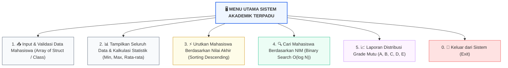

# 🎓 Minggu 16: Evaluasi Akhir Semester & Capstone Mini-Project (OBE)

## 🎯 Sasaran Evaluasi Komprehensif
Evaluasi Akhir Semester (UAS) menguji penguasaan komprehensif mahasiswa terhadap seluruh capaian pembelajaran lulusan:
* **CPMK0101:** Penguasaan konsep dasar pemrograman: variabel, tipe data, alokasi memori RAM, hierarki operator, struktur percabangan, perulangan, array 1D/2D, string, dan modularitas fungsi.
* **CPMK0106:** Keterampilan merancang logika algoritma, analisis alur *trace table*, teknik rekursi, serta optimasi efisiensi algoritma pencarian (*searching*) dan pengurutan (*sorting*).

---

## 📋 Struktur Pelaksanaan UAS (Bobot: 30% dari Nilai Akhir)

| Sesi Evaluasi | Fokus Asesmen | Bobot Sesi | Durasi | Metode Pelaksanaan |
| :---: | :--- | :---: | :---: | :--- |
| **Sesi 1** | **Live Coding Test Mandiri di Lab** | **60%** | 90 Menit | Pembuatan algoritma pemrosesan array, searching, sorting, dan fungsi modular di komputer lab. |
| **Sesi 2** | **Demonstrasi Mini-Project & Code Audit** | **40%** | 10 Menit / Mhs | Demonstrasi eksekusi aplikasi konsol, pertanggungjawaban kode, dan validasi *test cases*. |

---

## 🏆 Rubrik Penilaian Standar UAS Berbasis 4 Pilar OBE

::: tip 🏆 RUBRIK PENILAIAN CAPSTONE & UAS BERBASIS OBE (TOTAL 100 POIN)
:::

| No | Pilar Kriteria Penilaian | Bobot | Indikator Kompetensi Teknis (Evidence of Learning) |
| :---: | :--- | :---: | :--- |
| **1** | 🧠 **Logika & Kebenaran Algoritma** | **30 Poin** | • Program bebas dari bug logika dan runtime error (*Zero Division, Segmentation Fault*) • Menangani validasi input dengan pola *Guard Clauses* secara tangguh • Menghasilkan output luaran yang presisi sesuai spesifikasi |
| **2** | 🧩 **Modularitas & Arsitektur Kode** | **25 Poin** | • Penerapan prinsip *Single Responsibility* dan *DRY (Don't Repeat Yourself)* • Ketepatan pemilihan mekanisme *Pass by Value* vs *Pass by Reference* • Alokasi memori bersih dan bebas dari kebocoran memori |
| **3** | ⚡ **Efisiensi Struktur Data & Algoritma** | **25 Poin** | • Ketepatan implementasi algoritma pencarian (**Binary Search `O(log n)`**) • Ketepatan implementasi algoritma pengurutan (**Sorting `O(n²)` / `O(n log n)`**) • Pemahaman analisis kompleksitas Big-O pada alur komputasi |
| **4** | 💻 **Kualitas Clean Code & Etika Akademik** | **20 Poin** | • Penamaan variabel intuitif (*camelCase* di C++ / *snake_case* di Python) • Indentasi rapi (4 spasi), dokumentasi komentar/docstring yang jelas • **Menjunjung tinggi orisinalitas karya (Bebas Plagiarisme - CPL08)** |

---

## 🎯 Spesifikasi Proyek Mini: Sistem Informasi Nilai & Prestasi Akademik Terpadu

Rancang dan bangunlah sebuah aplikasi konsol interaktif berbasis menu yang mengintegrasikan seluruh materi perkuliahan:

### Rincian Fitur Wajib yang Harus Diprogram:
1. **Struktur Data Mahasiswa:** Memuat atribut `NIM` (string/integer), `Nama`, `NilaiTugas` (0-100), `NilaiUTS` (0-100), `NilaiUAS` (0-100), `NilaiAkhir`, dan `GradeMutu`.
2. **Kalkulasi Modular (Pass by Reference):**
   ::: info 📐 Formula Penilaian Akademik
   > **`Nilai Akhir = (30% × Tugas) + (35% × UTS) + (35% × UAS)`**
   >
   > *Standar Huruf Mutu:* A (≥ 85), B (70 - 84), C (55 - 69), D (40 - 54), E (< 40).
   :::
3. **Pengurutan Terpadu (*Sorting Module*):** Menu untuk mengurutkan daftar mahasiswa berdasarkan `Nilai Akhir` dari nilai tertinggi ke terendah (*Descending*) menggunakan **Insertion Sort** atau **Bubble Sort**.
4. **Pencarian Cepat (*Searching Module*):** Menu pencarian data mahasiswa berdasarkan `NIM` menggunakan **Binary Search `O(log n)`** (Lakukan sorting NIM terlebih dahulu).
5. **Pencegahan Error (*Defensive Input*):** Program tidak boleh mengalami crash saat menerima masukan nilai di luar rentang 0 - 100 atau masukan karakter alfabet pada menu angka.
