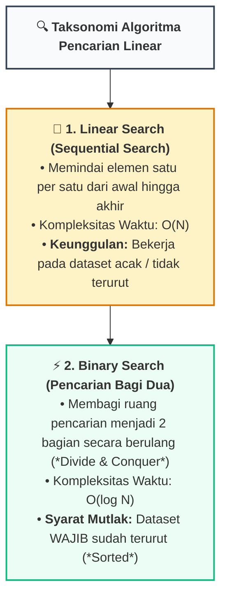
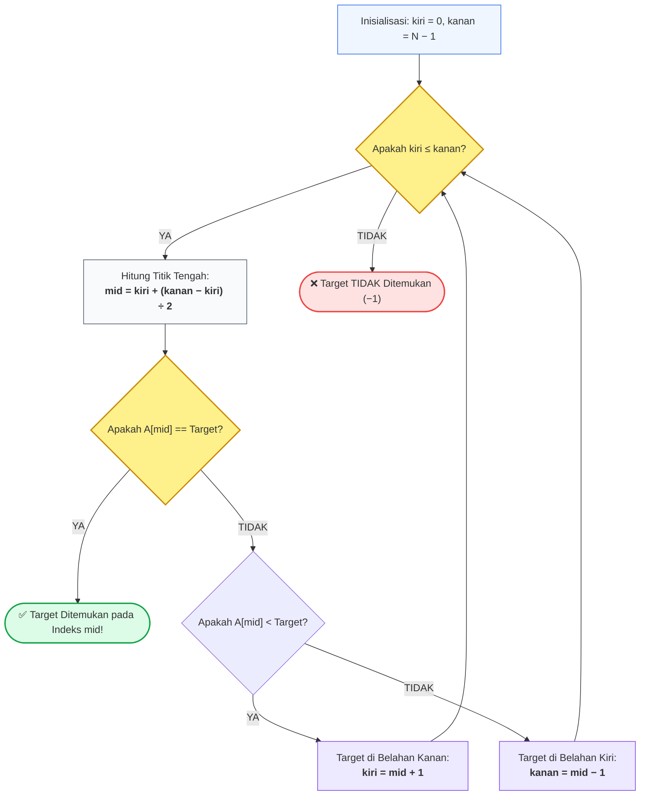

# 📘 Minggu 12: Algoritma Pencarian (Searching) & Analisis Kompleksitas

## 🎯 Capaian Pembelajaran (Sub-CPMK 6)
Setelah mempelajari modul ini, mahasiswa diharapkan mampu:
1. Memahami taksonomi algoritma pencarian pada struktur data linear.
2. Menganalisis mekanisme kerja dan kompleksitas **Linear Search (`O(n)`)** vs **Binary Search (`O(log n)`)**.
3. Menjelaskan penurunan matematis efisiensi logaritmik `log₂(N)` pada paradigma *Divide and Conquer*.
4. Mengidentifikasi dan mencegah bug klasik komputasi: **Integer Overflow pada Perhitungan Midpoint**.
5. Mengimplementasikan Binary Search dalam versi **Iteratif** dan **Rekursif** menggunakan C++ dan Python 3.

---

## 1. Hakikat dan Taksonomi Algoritma Pencarian

Pencarian (*Searching*) adalah proses komputasi untuk menemukan keberadaan, nilai, dan lokasi indeks suatu elemen data tertentu (*target key*) di dalam sekumpulan data:



---

## 2. Linear Search vs Binary Search

| Dimensi Komparasi | Linear Search (Sekuensial) | Binary Search (Bagi Dua) |
| :--- | :--- | :--- |
| **Prasyarat Keterurutan** | Bebas (Data boleh acak / *unsorted*). | **Wajib Terurut (*Sorted*)**. |
| **Prinsip Strategi** | *Brute Force Scanning*. | *Divide and Conquer*. |
| **Best-Case Complexity** | **`O(1)`** (Target berada di indeks pertama `[0]`). | **`O(1)`** (Target tepat berada di titik tengah `mid`). |
| **Worst-Case Complexity** | **`O(N)`** (Target di indeks akhir atau tidak ada). | **`O(log₂ N)`** (Pencarian tereduksi hingga 1 elemen). |
| **Average Case** | **`O(N/2) ➔ O(N)`** | **`O(log₂ N)`** |
| **Efisiensi 1.000.000 Data** | Hingga **1.000.000 perbandingan** (~1 Detik). | Maksimal **hanya 20 perbandingan!** (~1 Mikrodetik). |

---

## 3. Penurunan Matematis Kompleksitas Binary Search

Mengapa Binary Search mampu memeriksa 1 juta data hanya dalam 20 langkah?

::: info 📐 Formula: Penurunan Asimtotik Binary Search
> Pada setiap langkah, ukuran dataset N dibagi 2:
>
> **`Langkah 0:`** N
>
> **`Langkah 1:`** N ÷ 2
>
> **`Langkah 2:`** N ÷ 4 = N ÷ 2²
>
> **`Langkah k:`** N ÷ 2ᵏ
>
> Pencarian berhenti pada kondisi terburuk ketika ruang sisa bernilai 1 elemen:
>
> **`N ÷ 2ᵏ = 1  ⟹  2ᵏ = N  ⟹  k = log₂(N)`**
>
> *Untuk 1 Juta Data:* k = ⌈log₂(1.000.000)⌉ ≈ 20 kali perbandingan.
:::

---

## 4. Alur Algoritma & Pencegahan Integer Overflow



::: danger ⚠️ Bug Legendaris: Integer Overflow pada Perhitungan Mid
Rumus naif `mid = (kiri + kanan) / 2` mengandung bug berbahaya. Jika `kiri + kanan > 2.147.483.647` (pada array sangat besar), penjumlahan akan mengalami **Integer Overflow** menjadi angka negatif dan memicu *Segmentation Fault*.
* **Rumus Aman Standar Industri:**
  ```cpp
  int mid = kiri + (kanan - kiri) / 2;
  ```
:::

---

## 5. Implementasi Kode Hands-on Dual-Stack (C++ & Python 3)

Berikut implementasi lengkap Linear Search, Binary Search Iteratif, dan Binary Search Rekursif:

::: code-group
```cpp [C++]
#include <iostream>
#include <vector>

using namespace std;

// 1. Linear Search O(N)
int linearSearch(const int arr[], int n, int target) {
    for (int i = 0; i < n; i++) {
        if (arr[i] == target) return i; // Ditemukan
    }
    return -1; // Tidak ditemukan
}

// 2. Binary Search Iteratif O(log N) - Aman Overflow
int binarySearchIteratif(const int arr[], int n, int target) {
    int kiri = 0;
    int kanan = n - 1;

    while (kiri <= kanan) {
        int mid = kiri + (kanan - kiri) / 2; // Formula aman overflow

        if (arr[mid] == target) return mid;
        if (arr[mid] < target) {
            kiri = mid + 1; // Cari di belahan kanan
        } else {
            kanan = mid - 1; // Cari di belahan kiri
        }
    }
    return -1;
}

// 3. Binary Search Rekursif O(log N)
int binarySearchRekursif(const int arr[], int kiri, int kanan, int target) {
    if (kiri > kanan) return -1; // Base Case: Tidak ditemukan

    int mid = kiri + (kanan - kiri) / 2;
    if (arr[mid] == target) return mid; // Base Case: Ditemukan

    if (arr[mid] < target) {
        return binarySearchRekursif(arr, mid + 1, kanan, target);
    } else {
        return binarySearchRekursif(arr, kiri, mid - 1, target);
    }
}

int main() {
    cout << "==================================================" << endl;
    cout << "  ALGORITMA PENCARIAN SEARCHING (C++ STANDAR)     " << endl;
    cout << "==================================================" << endl;

    int dataTerurut[] = {11, 23, 34, 45, 56, 67, 78, 89, 90, 99};
    int n = sizeof(dataTerurut) / sizeof(dataTerurut[0]);
    int target = 78;

    cout << "Dataset: [ 11, 23, 34, 45, 56, 67, 78, 89, 90, 99 ]" << endl;
    cout << "Mencari Target: " << target << endl;
    cout << "--------------------------------------------------" << endl;

    int posLinear = linearSearch(dataTerurut, n, target);
    cout << "1. Linear Search Result   : Indeks " << posLinear << endl;

    int posBinIter = binarySearchIteratif(dataTerurut, n, target);
    cout << "2. Binary Search (Iteratif): Indeks " << posBinIter << endl;

    int posBinRek = binarySearchRekursif(dataTerurut, 0, n - 1, target);
    cout << "3. Binary Search (Rekursif): Indeks " << posBinRek << endl;

    cout << "==================================================" << endl;
    return 0;
}
```

```python [Python 3]
def linear_search(arr: list, target: int) -> int:
    """Pencarian Linear O(N) untuk data acak."""
    for i, val in enumerate(arr):
        if val == target:
            return i
    return -1


def binary_search_iteratif(arr: list, target: int) -> int:
    """Pencarian Bagi Dua Iteratif O(log N) - Prasyarat: arr terurut."""
    kiri, kanan = 0, len(arr) - 1
    while kiri <= kanan:
        mid = kiri + (kanan - kiri) // 2
        if arr[mid] == target:
            return mid
        elif arr[mid] < target:
            kiri = mid + 1
        else:
            kanan = mid - 1
    return -1


def binary_search_rekursif(arr: list, kiri: int, kanan: int, target: int) -> int:
    """Pencarian Bagi Dua Rekursif O(log N)."""
    if kiri > kanan:
        return -1

    mid = kiri + (kanan - kiri) // 2
    if arr[mid] == target:
        return mid
    elif arr[mid] < target:
        return binary_search_rekursif(arr, mid + 1, kanan, target)
    else:
        return binary_search_rekursif(arr, kiri, mid - 1, target)


def main():
    print("=" * 50)
    print("  ALGORITMA PENCARIAN SEARCHING (PYTHON 3)        ")
    print("=" * 50)

    data_terurut = [11, 23, 34, 45, 56, 67, 78, 89, 90, 99]
    target = 78

    print(f"Dataset : {data_terurut}")
    print(f"Mencari : {target}")
    print("-" * 50)

    print(f"1. Linear Search Result    : Indeks {linear_search(data_terurut, target)}")
    print(f"2. Binary Search (Iteratif) : Indeks {binary_search_iteratif(data_terurut, target)}")
    print(f"3. Binary Search (Rekursif) : Indeks {binary_search_rekursif(data_terurut, 0, len(data_terurut) - 1, target)}")
    print("=" * 50)


if __name__ == "__main__":
    main()
```
:::

---

## 6. Rangkuman & Latihan Mandiri

::: tip 💡 Rangkuman Konsep Kunci
1. **Pilihan Algoritma:** Gunakan Linear Search jika data tidak terurut atau berukuran kecil (< 50 elemen). Gunakan Binary Search jika data sudah terurut.
2. **Kekuatan Logaritma:** Binary Search memangkas ruang pencarian secara eksponensial; 1 miliar data dapat diselesaikan hanya dalam ~30 kali perbandingan!
3. **Midpoint Overflow:** Selalu gunakan formula `mid = kiri + (kanan - kiri) / 2` untuk integritas memori.
:::

### 📝 Tugas Praktikum 12 (Mandiri)
1. **Trace Table Binary Search:** Susunlah Trace Table pencarian target K = 45 pada array terurut: `[12, 24, 35, 45, 58, 69, 73, 85, 96]`. Catat nilai `kiri`, `kanan`, `mid`, dan `arr[mid]` pada setiap iterasi!
2. **Pencarian Kemunculan Pertama (*First Occurrence*):** Diberikan array yang memuat duplikasi angka terurut (misal: `[2, 4, 4, 4, 8, 10]`), modifikasi Binary Search agar mengembalikan indeks **kemunculan pertama** dari angka 4 (yaitu indeks 1, bukan indeks 2 atau 3).
