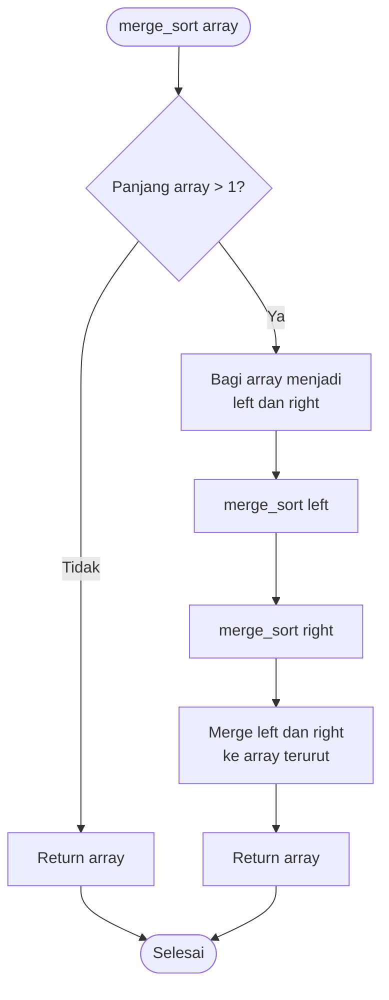
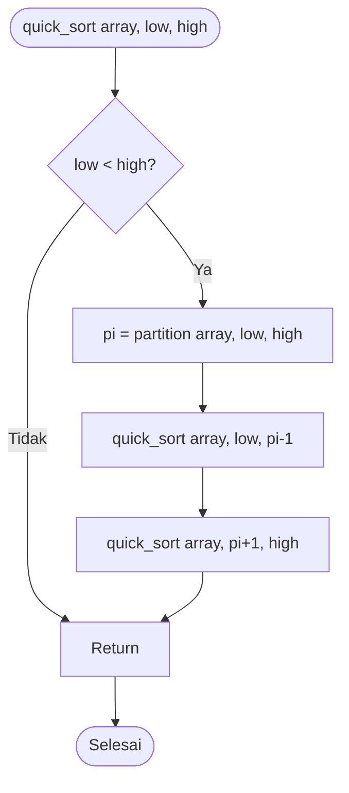

# Algoritma Pengurutan (Sorting)

## Pengenalan

**Algoritma pengurutan** adalah algoritma untuk menyusun elemen-elemen dalam urutan tertentu (ascending/descending). Pengurutan adalah operasi fundamental yang sangat penting dalam pemrograman.

### Jenis-Jenis Sorting

1. **Bubble Sort**
2. **Selection Sort**
3. **Insertion Sort**
4. **Merge Sort**
5. **Quick Sort**

## 1. Bubble Sort

### Konsep

Membandingkan elemen berdekatan dan menukarnya jika urutannya salah. Proses diulang hingga tidak ada lagi pertukaran.

### Flowchart Bubble Sort

```mermaid
flowchart TD
    Start([Mulai]) --> Input[/Input: array/]
    Input --> InitI[i = 0]
    InitI --> CekI{i < n-1?}
    CekI -->|Ya| InitJ[j = 0]
    InitJ --> CekJ{j < n-i-1?}
    CekJ -->|Ya| Compare{array[j] ><br/>array[j+1]?}
    Compare -->|Ya| Swap[Tukar array[j]<br/>dengan array[j+1]]
    Compare -->|Tidak| IncJ[j = j + 1]
    Swap --> IncJ
    IncJ --> CekJ
    CekJ -->|Tidak| IncI[i = i + 1]
    IncI --> CekI
    CekI -->|Tidak| Output[/Output: array terurut/]
    Output --> Stop([Selesai])
```

### Visualisasi Bubble Sort

Array: [64, 34, 25, 12, 22]

```
Pass 1:
[64, 34, 25, 12, 22] → [34, 64, 25, 12, 22] (tukar 64 & 34)
[34, 64, 25, 12, 22] → [34, 25, 64, 12, 22] (tukar 64 & 25)
[34, 25, 64, 12, 22] → [34, 25, 12, 64, 22] (tukar 64 & 12)
[34, 25, 12, 64, 22] → [34, 25, 12, 22, 64] (tukar 64 & 22)

Pass 2:
[34, 25, 12, 22, 64] → [25, 34, 12, 22, 64]
[25, 34, 12, 22, 64] → [25, 12, 34, 22, 64]
[25, 12, 34, 22, 64] → [25, 12, 22, 34, 64]

Pass 3:
[25, 12, 22, 34, 64] → [12, 25, 22, 34, 64]
[12, 25, 22, 34, 64] → [12, 22, 25, 34, 64]

Pass 4:
[12, 22, 25, 34, 64] → [12, 22, 25, 34, 64] (sudah terurut)
```

### Implementasi

```python
# Python
def bubble_sort(arr):
    """
    Bubble Sort
    Time Complexity: O(n²)
    Space Complexity: O(1)
    """
    n = len(arr)

    for i in range(n - 1):
        # Flag untuk optimasi
        swapped = False

        for j in range(n - i - 1):
            if arr[j] > arr[j + 1]:
                # Tukar elemen
                arr[j], arr[j + 1] = arr[j + 1], arr[j]
                swapped = True

        # Jika tidak ada pertukaran, array sudah terurut
        if not swapped:
            break

    return arr

# Contoh
data = [64, 34, 25, 12, 22, 11, 90]
print("Array awal:", data)
bubble_sort(data)
print("Array terurut:", data)
```

```cpp
// C++
#include <iostream>
using namespace std;

void bubbleSort(int arr[], int n) {
    for (int i = 0; i < n - 1; i++) {
        bool swapped = false;

        for (int j = 0; j < n - i - 1; j++) {
            if (arr[j] > arr[j + 1]) {
                // Tukar elemen
                int temp = arr[j];
                arr[j] = arr[j + 1];
                arr[j + 1] = temp;
                swapped = true;
            }
        }

        if (!swapped) break;
    }
}

int main() {
    int data[] = {64, 34, 25, 12, 22, 11, 90};
    int n = sizeof(data) / sizeof(data[0]);

    cout << "Array awal: ";
    for (int i = 0; i < n; i++) cout << data[i] << " ";

    bubbleSort(data, n);

    cout << "\nArray terurut: ";
    for (int i = 0; i < n; i++) cout << data[i] << " ";
    cout << endl;

    return 0;
}
```

### Karakteristik Bubble Sort

- ✅ Sederhana dan mudah dipahami
- ✅ Stable sort
- ❌ Lambat untuk dataset besar: O(n²)
- ❌ Banyak pertukaran elemen

## 2. Selection Sort

### Konsep

Mencari elemen terkecil dan menempatkannya di posisi pertama, lalu mencari elemen terkecil berikutnya dan seterusnya.

### Flowchart Selection Sort

```mermaid
flowchart TD
    Start([Mulai]) --> Input[/Input: array/]
    Input --> InitI[i = 0]
    InitI --> CekI{i < n-1?}
    CekI -->|Ya| SetMin[min_idx = i]
    SetMin --> InitJ[j = i + 1]
    InitJ --> CekJ{j < n?}
    CekJ -->|Ya| Compare{array[j] < array[min_idx]?}
    Compare -->|Ya| UpdateMin[min_idx = j]
    Compare -->|Tidak| IncJ[j = j + 1]
    UpdateMin --> IncJ
    IncJ --> CekJ
    CekJ -->|Tidak| Swap[Tukar array[i]<br/>dengan array[min_idx]]
    Swap --> IncI[i = i + 1]
    IncI --> CekI
    CekI -->|Tidak| Output[/Output: array terurut/]
    Output --> Stop([Selesai])
```

### Visualisasi Selection Sort

Array: [64, 25, 12, 22, 11]

```
Pass 1: [64, 25, 12, 22, 11]
        Minimum: 11 (index 4)
        [11, 25, 12, 22, 64]

Pass 2: [11, 25, 12, 22, 64]
        Minimum: 12 (index 2)
        [11, 12, 25, 22, 64]

Pass 3: [11, 12, 25, 22, 64]
        Minimum: 22 (index 3)
        [11, 12, 22, 25, 64]

Pass 4: [11, 12, 22, 25, 64]
        Minimum: 25 (index 3)
        [11, 12, 22, 25, 64] (sudah terurut)
```

### Implementasi

```python
# Python
def selection_sort(arr):
    """
    Selection Sort
    Time Complexity: O(n²)
    Space Complexity: O(1)
    """
    n = len(arr)

    for i in range(n - 1):
        # Cari index elemen minimum
        min_idx = i
        for j in range(i + 1, n):
            if arr[j] < arr[min_idx]:
                min_idx = j

        # Tukar elemen minimum dengan elemen pertama
        arr[i], arr[min_idx] = arr[min_idx], arr[i]

    return arr

# Contoh
data = [64, 25, 12, 22, 11]
print("Array awal:", data)
selection_sort(data)
print("Array terurut:", data)
```

### Karakteristik Selection Sort

- ✅ Sederhana
- ✅ Jumlah swap minimal: O(n)
- ❌ Tidak stable
- ❌ Lambat: O(n²)

## 3. Insertion Sort

### Konsep

Membangun array terurut satu elemen pada satu waktu dengan memasukkan elemen ke posisi yang tepat.

### Flowchart Insertion Sort

```mermaid
flowchart TD
    Start([Mulai]) --> Input[/Input: array/]
    Input --> InitI[i = 1]
    InitI --> CekI{i < n?}
    CekI -->|Ya| SetKey[key = array[i]<br/>j = i - 1]
    SetKey --> CekJ{j >= 0 DAN<br/>array[j] > key?}
    CekJ -->|Ya| Shift[array[j+1] = array[j]<br/>j = j - 1]
    Shift --> CekJ
    CekJ -->|Tidak| Insert[array[j+1] = key]
    Insert --> IncI[i = i + 1]
    IncI --> CekI
    CekI -->|Tidak| Output[/Output: array terurut/]
    Output --> Stop([Selesai])
```

### Visualisasi Insertion Sort

Array: [12, 11, 13, 5, 6]

```
Pass 1: [12, 11, 13, 5, 6]
        key = 11
        [11, 12, 13, 5, 6]

Pass 2: [11, 12, 13, 5, 6]
        key = 13
        [11, 12, 13, 5, 6] (tidak berubah)

Pass 3: [11, 12, 13, 5, 6]
        key = 5
        [5, 11, 12, 13, 6]

Pass 4: [5, 11, 12, 13, 6]
        key = 6
        [5, 6, 11, 12, 13]
```

### Implementasi

```python
# Python
def insertion_sort(arr):
    """
    Insertion Sort
    Time Complexity: O(n²)
    Space Complexity: O(1)
    """
    for i in range(1, len(arr)):
        key = arr[i]
        j = i - 1

        # Geser elemen yang lebih besar dari key
        while j >= 0 and arr[j] > key:
            arr[j + 1] = arr[j]
            j -= 1

        # Tempatkan key di posisi yang tepat
        arr[j + 1] = key

    return arr

# Contoh
data = [12, 11, 13, 5, 6]
print("Array awal:", data)
insertion_sort(data)
print("Array terurut:", data)
```

```cpp
// C++
void insertionSort(int arr[], int n) {
    for (int i = 1; i < n; i++) {
        int key = arr[i];
        int j = i - 1;

        while (j >= 0 && arr[j] > key) {
            arr[j + 1] = arr[j];
            j--;
        }

        arr[j + 1] = key;
    }
}
```

### Karakteristik Insertion Sort

- ✅ Efisien untuk dataset kecil
- ✅ Stable sort
- ✅ Baik untuk data yang hampir terurut: O(n)
- ❌ Lambat untuk dataset besar: O(n²)

## 4. Merge Sort

### Konsep

Algoritma divide-and-conquer yang membagi array menjadi dua bagian, mengurutkan masing-masing, lalu menggabungkannya.

### Flowchart Merge Sort



### Visualisasi Merge Sort

```
[38, 27, 43, 3, 9, 82, 10]
          |
    Divide (bagi dua)
    /              \
[38, 27, 43]     [3, 9, 82, 10]
   /    \           /        \
[38]  [27, 43]   [3, 9]    [82, 10]
        /  \      /  \       /  \
      [27] [43] [3] [9]   [82] [10]
        \  /      \  /       \  /
      [27, 43]  [3, 9]    [10, 82]
         \      /            /
       [27, 38, 43]    [3, 9, 10, 82]
              \              /
         [3, 9, 10, 27, 38, 43, 82]
```

### Implementasi

```python
# Python
def merge_sort(arr):
    """
    Merge Sort
    Time Complexity: O(n log n)
    Space Complexity: O(n)
    """
    if len(arr) <= 1:
        return arr

    # Divide
    mid = len(arr) // 2
    left = merge_sort(arr[:mid])
    right = merge_sort(arr[mid:])

    # Conquer (Merge)
    return merge(left, right)

def merge(left, right):
    """Menggabungkan dua array terurut"""
    result = []
    i = j = 0

    # Bandingkan elemen dari kedua array
    while i < len(left) and j < len(right):
        if left[i] <= right[j]:
            result.append(left[i])
            i += 1
        else:
            result.append(right[j])
            j += 1

    # Tambahkan sisa elemen
    result.extend(left[i:])
    result.extend(right[j:])

    return result

# Contoh
data = [38, 27, 43, 3, 9, 82, 10]
print("Array awal:", data)
sorted_data = merge_sort(data)
print("Array terurut:", sorted_data)
```

```cpp
// C++
#include <iostream>
using namespace std;

void merge(int arr[], int left, int mid, int right) {
    int n1 = mid - left + 1;
    int n2 = right - mid;

    // Temporary arrays
    int L[n1], R[n2];

    for (int i = 0; i < n1; i++)
        L[i] = arr[left + i];
    for (int j = 0; j < n2; j++)
        R[j] = arr[mid + 1 + j];

    // Merge
    int i = 0, j = 0, k = left;

    while (i < n1 && j < n2) {
        if (L[i] <= R[j]) {
            arr[k++] = L[i++];
        } else {
            arr[k++] = R[j++];
        }
    }

    while (i < n1) arr[k++] = L[i++];
    while (j < n2) arr[k++] = R[j++];
}

void mergeSort(int arr[], int left, int right) {
    if (left < right) {
        int mid = left + (right - left) / 2;

        mergeSort(arr, left, mid);
        mergeSort(arr, mid + 1, right);
        merge(arr, left, mid, right);
    }
}
```

### Karakteristik Merge Sort

- ✅ Konsisten cepat: O(n log n)
- ✅ Stable sort
- ✅ Baik untuk dataset besar
- ❌ Memerlukan memori tambahan: O(n)

## 5. Quick Sort

### Konsep

Memilih pivot, mempartisi array sehingga elemen lebih kecil di kiri dan lebih besar di kanan, lalu rekursif.

### Flowchart Quick Sort



### Implementasi

```python
# Python
def quick_sort(arr, low=0, high=None):
    """
    Quick Sort
    Time Complexity: O(n log n) average, O(n²) worst
    Space Complexity: O(log n)
    """
    if high is None:
        high = len(arr) - 1

    if low < high:
        # Partition index
        pi = partition(arr, low, high)

        # Rekursif untuk bagian kiri dan kanan
        quick_sort(arr, low, pi - 1)
        quick_sort(arr, pi + 1, high)

    return arr

def partition(arr, low, high):
    """Mempartisi array dengan pivot"""
    pivot = arr[high]
    i = low - 1

    for j in range(low, high):
        if arr[j] <= pivot:
            i += 1
            arr[i], arr[j] = arr[j], arr[i]

    arr[i + 1], arr[high] = arr[high], arr[i + 1]
    return i + 1

# Contoh
data = [10, 7, 8, 9, 1, 5]
print("Array awal:", data)
quick_sort(data)
print("Array terurut:", data)
```

### Karakteristik Quick Sort

- ✅ Sangat cepat rata-rata: O(n log n)
- ✅ In-place (tidak butuh memori ekstra)
- ❌ Tidak stable
- ❌ Worst case: O(n²)

## Perbandingan Algoritma Sorting

| Algoritma          | Best       | Average    | Worst      | Space    | Stable |
| ------------------ | ---------- | ---------- | ---------- | -------- | ------ |
| **Bubble Sort**    | O(n)       | O(n²)      | O(n²)      | O(1)     | ✓      |
| **Selection Sort** | O(n²)      | O(n²)      | O(n²)      | O(1)     | ✗      |
| **Insertion Sort** | O(n)       | O(n²)      | O(n²)      | O(1)     | ✓      |
| **Merge Sort**     | O(n log n) | O(n log n) | O(n log n) | O(n)     | ✓      |
| **Quick Sort**     | O(n log n) | O(n log n) | O(n²)      | O(log n) | ✗      |

## Program Perbandingan Performa

```python
# Python
import time
import random

def test_sorting_algorithms():
    sizes = [100, 1000, 5000]

    for size in sizes:
        # Generate random data
        data = [random.randint(1, 10000) for _ in range(size)]

        print(f"\n=== Dataset size: {size} ===")

        # Test Bubble Sort
        arr = data.copy()
        start = time.time()
        bubble_sort(arr)
        print(f"Bubble Sort: {time.time() - start:.4f} detik")

        # Test Selection Sort
        arr = data.copy()
        start = time.time()
        selection_sort(arr)
        print(f"Selection Sort: {time.time() - start:.4f} detik")

        # Test Insertion Sort
        arr = data.copy()
        start = time.time()
        insertion_sort(arr)
        print(f"Insertion Sort: {time.time() - start:.4f} detik")

        # Test Merge Sort
        arr = data.copy()
        start = time.time()
        merge_sort(arr)
        print(f"Merge Sort: {time.time() - start:.4f} detik")

        # Test Quick Sort
        arr = data.copy()
        start = time.time()
        quick_sort(arr)
        print(f"Quick Sort: {time.time() - start:.4f} detik")

        # Test Python built-in
        arr = data.copy()
        start = time.time()
        arr.sort()
        print(f"Python sort(): {time.time() - start:.6f} detik")

test_sorting_algorithms()
```

## Latihan

1. **Sort dengan Kondisi**

   - Urutkan array, elemen genap di depan, ganjil di belakang
   - Masing-masing kelompok terurut ascending

2. **Kth Largest Element**

   - Cari elemen terbesar ke-k tanpa mengurutkan seluruh array
   - Gunakan Quick Select

3. **Merge K Sorted Arrays**

   - Gabungkan k array terurut menjadi satu array terurut

4. **Sort by Frequency**

   - Urutkan berdasarkan frekuensi kemunculan
   - Contoh: [4,5,6,5,4,3] → [4,4,5,5,3,6]

5. **Counting Sort**

   - Implementasi Counting Sort untuk angka 0-100

6. **Custom Comparator**
   - Urutkan array of objects berdasarkan multiple criteria

## Rangkuman

- **Bubble, Selection, Insertion**: Sederhana, O(n²), cocok untuk dataset kecil
- **Merge Sort**: Konsisten O(n log n), stable, butuh memori ekstra
- **Quick Sort**: Sangat cepat rata-rata, in-place, tapi tidak stable
- Pilih algoritma sesuai kebutuhan: ukuran data, memory, stability
- Untuk production, gunakan built-in sort (optimized)

---

**Sebelumnya**: [Algoritma Pencarian](./algoritma-pencarian.md)
