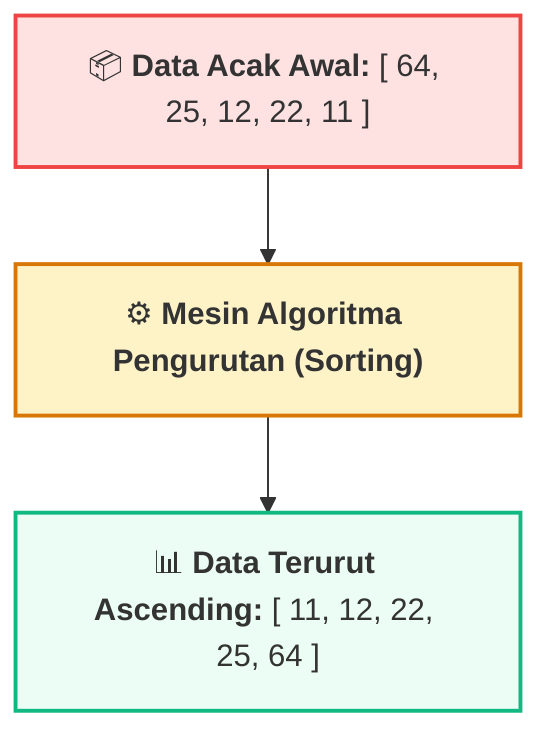
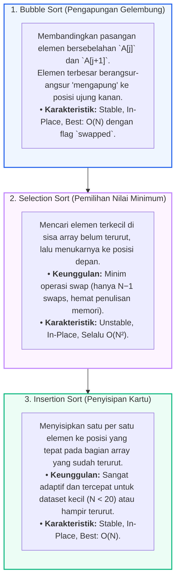

# 📘 Minggu 13-14: Algoritma Pengurutan (Sorting) & Analisis Big-O

## 🎯 Capaian Pembelajaran (Sub-CPMK 6)
Setelah mempelajari modul ini, mahasiswa diharapkan mampu:
1. Memahami hakikat pengurutan data, konsep **Kestabilan (*Stability*)**, memori **In-Place**, dan **Adaptabilitas (*Adaptivity*)**.
2. Menguasai 3 algoritma pengurutan fundamental: **Bubble Sort (dengan optimasi Early Exit)**, **Selection Sort**, dan **Insertion Sort**.
3. Membuktikan penurunan matematis deret aritmatika kompleksitas kuadratik `N(N−1) ÷ 2 ⟹ O(N²)`.
4. Menyusun **Trace Table (Tabel Penelusuran Pergeseran Data)** langkah-demi-langkah pada setiap fase iterasi (*pass*).
5. Memahami perbandingan efisiensi algoritma elementer `O(N²)` dengan algoritma lanjut berorde **`O(N log N)` (Merge Sort & Quick Sort)**.
6. Mengimplementasikan algoritma pengurutan menggunakan C++ dan Python 3.

---

## 1. Hakikat dan Taksonomi Algoritma Pengurutan (*Sorting*)

**Pengurutan (*Sorting*)** adalah proses menyusun kembali sekumpulan elemen data acak ke dalam urutan tertentu, baik **Menaik (*Ascending*)** maupun **Menurun (*Descending*)**:


```mermaid
flowchart TD
    Acak["📦 <b>Data Acak Awal:</b> [ 64, 25, 12, 22, 11 ]"]
    --> SortEngine["⚙️ <b>Mesin Algoritma Pengurutan (Sorting)</b>"]
    --> Urut["📊 <b>Data Terurut Ascending:</b> [ 11, 12, 22, 25, 64 ]"]

    style Acak fill:#fee2e2,stroke:#ef4444,stroke-width:2px
    style SortEngine fill:#fef3c7,stroke:#d97706,stroke-width:2px
    style Urut fill:#ecfdf5,stroke:#10b981,stroke-width:2px
```

### Empat Parameter Kritis Evaluasi Algoritma Sorting:
1. **Time Complexity:** Jumlah perbandingan dan pertukaran elemen pada kasus terbaik (*Best*), rata-rata (*Average*), dan terburuk (*Worst*).
2. **Space Complexity (In-Place Memory):** Algoritma berstatus *In-Place* jika hanya membutuhkan memori tambahan konstan **`O(1)`** tanpa menduplikasi array.
3. **Stability (Kestabilan):** Algoritma berstatus *Stable* jika **mempertahankan urutan relatif asli** dari elemen-elemen yang memiliki nilai kunci sama (sangat penting pada pengurutan multi-kolom).
4. **Adaptivity (Adaptabilitas):** Algoritma mampu berjalan jauh lebih cepat (`O(N)`) jika data input sudah dalam kondisi hampir terurut.

---

## 2. Komparasi 3 Algoritma Pengurutan Fundamental


```mermaid
flowchart TD
    subgraph Bubble["1. Bubble Sort (Pengapungan Gelembung)"]
        direction TB
        B1["Membandingkan pasangan elemen bersebelahan `A[j]` dan `A[j+1]`.<br>Elemen terbesar berangsur-angsur 'mengapung' ke posisi ujung kanan.<br>• <b>Karakteristik:</b> Stable, In-Place, Best: O(N) dengan flag `swapped`."]
    end

    subgraph Selection["2. Selection Sort (Pemilihan Nilai Minimum)"]
        direction TB
        S1["Mencari elemen terkecil di sisa array belum terurut, lalu menukarnya ke posisi depan.<br>• <b>Keunggulan:</b> Minim operasi swap (hanya N−1 swaps, hemat penulisan memori).<br>• <b>Karakteristik:</b> Unstable, In-Place, Selalu O(N²)."]
    end

    subgraph Insertion["3. Insertion Sort (Penyisipan Kartu)"]
        direction TB
        I1["Menyisipkan satu per satu elemen ke posisi yang tepat pada bagian array yang sudah terurut.<br>• <b>Keunggulan:</b> Sangat adaptif dan tercepat untuk dataset kecil (N < 20) atau hampir terurut.<br>• <b>Karakteristik:</b> Stable, In-Place, Best: O(N)."]
    end

    Bubble --> Selection --> Insertion

    style Bubble fill:#eff6ff,stroke:#2563eb,stroke-width:2px
    style Selection fill:#fdf4ff,stroke:#c084fc,stroke-width:2px
    style Insertion fill:#ecfdf5,stroke:#10b981,stroke-width:2px
```

### Tabel Perbandingan Metrik Performa Big-O:

| Algoritma Sorting | Best Case | Average Case | Worst Case | Space Complexity | Kestabilan (*Stability*) | Jumlah Swaps Maksimal |
| :--- | :---: | :---: | :---: | :---: | :---: | :---: |
| **Bubble Sort (Optimized)** | **`O(N)`** | `O(N²)` | `O(N²)` | **`O(1)`** | **Stable** | `O(N²)` |
| **Selection Sort** | `O(N²)` | `O(N²)` | `O(N²)` | **`O(1)`** | **Unstable** | **N − 1 Swaps** |
| **Insertion Sort** | **`O(N)`** | `O(N²)` | `O(N²)` | **`O(1)`** | **Stable** | `O(N²)` |
| *Merge Sort (Lanjut)* | `O(N log N)` | `O(N log N)` | `O(N log N)` | `O(N)` | **Stable** | `O(N log N)` |
| *Quick Sort (Lanjut)* | `O(N log N)` | `O(N log N)` | `O(N²)` | `O(log N)` | **Unstable** | `O(N log N)` |

::: info 📐 Formula: Penurunan Matematis Deret Aritmatika O(N²)
> Total perbandingan pada Bubble / Selection Sort:
>
> **`Total Komparasi = (N − 1) + (N − 2) + ... + 2 + 1`**
>
> **`Total = [ (N − 1) × N ] ÷ 2 = (N² − N) ÷ 2  ⟹  O(N²)`**
:::

---

## 3. Trace Table Dry Run: Pergeseran Data pada Bubble Sort

Data Awal: `[ 64, 25, 12, 22, 11 ]` (N = 5)

| Pass ke- | Pasangan Dibandingkan | Operasi Swap Dilakukan? | Status Susunan Array Setelah Langkah | Elemen Terkunci di Posisi Akhir |
| :---: | :---: | :---: | :---: | :---: |
| **Pass 1** | (64, 25) → (64, 12) → (64, 22) → (64, 11) | Swap 4x | `[ 25, 12, 22, 11, `**`64`**` ]` | **64** terkunci di indeks 4 |
| **Pass 2** | (25, 12) → (25, 22) → (25, 11) | Swap 3x | `[ 12, 22, 11, `**`25`**`, `**`64`**` ]` | **25** terkunci di indeks 3 |
| **Pass 3** | (12, 22) → (22, 11) | Swap 1x | `[ 12, 11, `**`22`**`, `**`25`**`, `**`64`**` ]` | **22** terkunci di indeks 2 |
| **Pass 4** | (12, 11) | Swap 1x | `[`**`11`**`, `**`12`**`, `**`22`**`, `**`25`**`, `**`64`**` ]` | **Semua Elemen Terurut!** |

---

## 4. Implementasi Kode Hands-on Dual-Stack (C++ & Python 3)

Berikut implementasi lengkap 3 algoritma pengurutan fundamental:

::: code-group
```cpp [C++]
#include <iostream>
#include <vector>

using namespace std;

void cetakArray(const int arr[], int n, const string& label) {
    cout << label << ": [ ";
    for (int i = 0; i < n; i++) cout << arr[i] << (i < n - 1 ? ", " : " ");
    cout << "]" << endl;
}

// 1. Bubble Sort dengan Optimasi Early-Termination Flag O(N) Best-Case
void bubbleSort(int arr[], int n) {
    for (int i = 0; i < n - 1; i++) {
        bool adaPertukaran = false;
        for (int j = 0; j < n - i - 1; j++) {
            if (arr[j] > arr[j + 1]) {
                swap(arr[j], arr[j + 1]);
                adaPertukaran = true;
            }
        }
        // Jika tidak ada pertukaran sama sekali, array sudah terurut -> Berhenti lebih awal!
        if (!adaPertukaran) break;
    }
}

// 2. Selection Sort: Minimalisasi Operasi Swap
void selectionSort(int arr[], int n) {
    for (int i = 0; i < n - 1; i++) {
        int minIdx = i;
        for (int j = i + 1; j < n; j++) {
            if (arr[j] < arr[minIdx]) {
                minIdx = j;
            }
        }
        if (minIdx != i) {
            swap(arr[i], arr[minIdx]);
        }
    }
}

// 3. Insertion Sort: Sangat Adaptif untuk Data Hampir Terurut
void insertionSort(int arr[], int n) {
    for (int i = 1; i < n; i++) {
        int kunci = arr[i];
        int j = i - 1;

        // Geser elemen yang lebih besar dari kunci ke kanan
        while (j >= 0 && arr[j] > kunci) {
            arr[j + 1] = arr[j];
            j--;
        }
        arr[j + 1] = kunci;
    }
}

int main() {
    cout << "==================================================" << endl;
    cout << "  ALGORITMA PENGURUTAN SORTING (C++ STANDAR)      " << endl;
    cout << "==================================================" << endl;

    int raw1[] = {64, 25, 12, 22, 11};
    int raw2[] = {64, 25, 12, 22, 11};
    int raw3[] = {64, 25, 12, 22, 11};
    int n = 5;

    cetakArray(raw1, n, "Data Acak Awal");
    cout << "--------------------------------------------------" << endl;

    bubbleSort(raw1, n);
    cetakArray(raw1, n, "1. Hasil Bubble Sort   ");

    selectionSort(raw2, n);
    cetakArray(raw2, n, "2. Hasil Selection Sort");

    insertionSort(raw3, n);
    cetakArray(raw3, n, "3. Hasil Insertion Sort");

    cout << "==================================================" << endl;
    return 0;
}
```

```python [Python 3]
def bubble_sort(arr: list) -> list:
    """Bubble Sort dengan Optimasi Early Exit Flag."""
    data = arr.copy()
    n = len(data)
    for i in range(n - 1):
        swapped = False
        for j in range(n - i - 1):
            if data[j] > data[j + 1]:
                data[j], data[j + 1] = data[j + 1], data[j]
                swapped = True
        if not swapped:
            break
    return data


def selection_sort(arr: list) -> list:
    """Selection Sort: Memilih nilai terkecil ke depan."""
    data = arr.copy()
    n = len(data)
    for i in range(n - 1):
        min_idx = i
        for j in range(i + 1, n):
            if data[j] < data[min_idx]:
                min_idx = j
        if min_idx != i:
            data[i], data[min_idx] = data[min_idx], data[i]
    return data


def insertion_sort(arr: list) -> list:
    """Insertion Sort: Menyisipkan elemen seperti kartu remi."""
    data = arr.copy()
    for i in range(1, len(data)):
        kunci = data[i]
        j = i - 1
        while j >= 0 and data[j] > kunci:
            data[j + 1] = data[j]
            j -= 1
        data[j + 1] = kunci
    return data


def main():
    print("=" * 50)
    print("  ALGORITMA PENGURUTAN SORTING (PYTHON 3)         ")
    print("=" * 50)

    data_acak = [64, 25, 12, 22, 11]
    print(f"Data Acak Awal : {data_acak}")
    print("-" * 50)

    print(f"1. Bubble Sort    : {bubble_sort(data_acak)}")
    print(f"2. Selection Sort : {selection_sort(data_acak)}")
    print(f"3. Insertion Sort : {insertion_sort(data_acak)}")
    print("=" * 50)


if __name__ == "__main__":
    main()
```
:::

---

## 5. Rangkuman & Latihan Mandiri

::: tip 💡 Rangkuman Konsep Kunci
1. **Optimasi Bubble Sort:** Selalu pasang bendera boolean `swapped` agar Bubble Sort dapat berhenti seketika dalam `O(n)` jika data sudah terurut.
2. **Selection Sort:** Terbaik jika biaya penulisan memori (*write-operation*) sangat mahal karena hanya melakukan maksimal N − 1 pertukaran (*swaps*).
3. **Insertion Sort:** Pilihan terbaik di antara algoritma `O(n²)` untuk data streaming atau data yang hampir terurut (*nearly sorted*).
4. **Kestabilan (*Stability*):** Bubble Sort dan Insertion Sort bersifat stabil (*stable*), sedangkan Selection Sort tidak stabil (*unstable*).
:::

### 📝 Tugas Praktikum 13 (Mandiri)
1. **Pengurutan Terbalik (*Descending Order*):** Modifikasi kode algoritma Insertion Sort di atas agar mengurutkan elemen secara menurun (*descending*) dari nilai terbesar ke terkecil.
2. **Pengurutan Objek Mahasiswa Berbasis Kestabilan:** Buatlah array yang berisi 5 data mahasiswa dengan atribut `Nama` dan `IPK`. Urutkan data tersebut berdasarkan `IPK` secara menurun. Buktikan bahwa mahasiswa dengan IPK yang sama tetap mempertahankan urutan pendaftaran aslinya jika menggunakan algoritma *Stable*.
