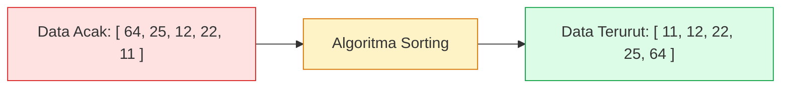

# Minggu 13-14: Algoritma Pengurutan (Sorting Algorithm)

::: tip CAPAIAN PEMBELAJARAN (SUB-CPMK 6)
- **CPMK Terkait:** CPMK0106 (Konsep Matematika Informatika & Logika Algoritma)
- **CPL Terkait:** CPL01 (Pengetahuan Dasar), CPL03 (Problem Solving)
- **Indikator:** Mahasiswa mampu mengimplementasikan algoritma pengurutan dasar (*Bubble Sort, Selection Sort, Insertion Sort*), menyusun trace table pergeseran data, serta menganalisis komparasi efisiensi waktu komputasi Big-O (`O(n²)` vs $O(n log n)$).
:::

---

## 1. Hakikat Algoritma Pengurutan (*Sorting*)

**Pengurutan (*Sorting*)** adalah proses menyusun kembali sekumpulan elemen data acak ke dalam urutan tertentu, baik secara **menaik (*ascending* / dari kecil ke besar)** maupun **menurun (*descending* / dari besar ke kecil)**.


```mermaid
graph LR
    Acak["Data Acak: [ 64, 25, 12, 22, 11 ]"] --> Sorting[Algoritma Sorting]
    Sorting --> Urut["Data Terurut: [ 11, 12, 22, 25, 64 ]"]
    style Acak fill:#fee2e2,stroke:#dc2626
    style Sorting fill:#fef3c7,stroke:#d97706
    style Urut fill:#dcfce7,stroke:#16a34a
```

---

## 2. Komparasi 3 Algoritma Pengurutan Fundamental

| Algoritma | Prinsip Kerja Utama | Best Case | Average Case | Worst Case | Stabilitas |
| :--- | :--- | :---: | :---: | :---: | :---: |
| **Bubble Sort** | Membandingkan pasangan elemen bersebelahan dan menukarnya (*swap*) jika tidak berurutan. Elemen terbesar mengapung ke ujung. | `O(n)` | `O(n²)` | `O(n²)` | Stable |
| **Selection Sort** | Mencari elemen terkecil di sisa array yang belum terurut, lalu menukarnya ke posisi paling depan. | `O(n²)` | `O(n²)` | `O(n²)` | Unstable |
| **Insertion Sort** | Menyisipkan satu per satu elemen ke posisi yang tepat pada bagian array yang sudah terurut (seperti menyusun kartu). | `O(n)` | `O(n²)` | `O(n²)` | Stable |

---

## 3. Implementasi 3 Algoritma Sorting

::: code-group
```cpp [C++]
#include <iostream>
using namespace std;

// 1. Bubble Sort
void bubbleSort(int arr[], int n) {
    for (int i = 0; i < n - 1; i++) {
        bool swapped = false;
        for (int j = 0; j < n - i - 1; j++) {
            if (arr[j] > arr[j + 1]) {
                swap(arr[j], arr[j + 1]);
                swapped = true;
            }
        }
        if (!swapped) break; // Optimasi jika array sudah terurut
    }
}

// 2. Selection Sort
void selectionSort(int arr[], int n) {
    for (int i = 0; i < n - 1; i++) {
        int minIdx = i;
        for (int j = i + 1; j < n; j++) {
            if (arr[j] < arr[minIdx]) {
                minIdx = j;
            }
        }
        swap(arr[i], arr[minIdx]);
    }
}

// 3. Insertion Sort
void insertionSort(int arr[], int n) {
    for (int i = 1; i < n; i++) {
        int key = arr[i];
        int j = i - 1;
        while (j >= 0 && arr[j] > key) {
            arr[j + 1] = arr[j];
            j--;
        }
        arr[j + 1] = key;
    }
}

void printArray(int arr[], int n) {
    for (int i = 0; i < n; i++) cout << arr[i] << " ";
    cout << endl;
}

int main() {
    int data[] = {64, 25, 12, 22, 11};
    int n = sizeof(data) / sizeof(data[0]);

    cout << "Data Sebelum Disorting: ";
    printArray(data, n);

    insertionSort(data, n);

    cout << "Data Setelah Insertion Sort: ";
    printArray(data, n);

    return 0;
}
```

```python [Python 3]
def bubble_sort(arr: list) -> list:
    n = len(arr)
    for i in range(n - 1):
        swapped = False
        for j in range(n - i - 1):
            if arr[j] > arr[j + 1]:
                arr[j], arr[j + 1] = arr[j + 1], arr[j]
                swapped = True
        if not swapped:
            break
    return arr

def insertion_sort(arr: list) -> list:
    for i in range(1, len(arr)):
        key = arr[i]
        j = i - 1
        while j >= 0 and arr[j] > key:
            arr[j + 1] = arr[j]
            j -= 1
        arr[j + 1] = key
    return arr

angka = [64, 25, 12, 22, 11]
print("Sebelum Sorting:", angka)
print("Setelah Insertion Sort:", insertion_sort(angka.copy()))
```
:::

---

## 📝 Evaluasi & Latihan Mandiri (Sub-CPMK 6)

1. Diberikan array: `[45, 12, 89, 34, 25]`. Tuliskan langkah demi langkah isi array pada setiap akhir iterasi outer loop (*pass*) untuk algoritma **Selection Sort**!
2. Mengapa algoritma **Insertion Sort** sangat efisien jika diterapkan pada dataset yang *hampir terurut* (*nearly sorted*) dibandingkan Selection Sort?
