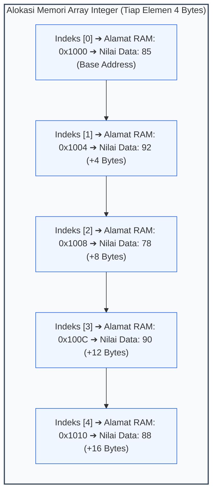
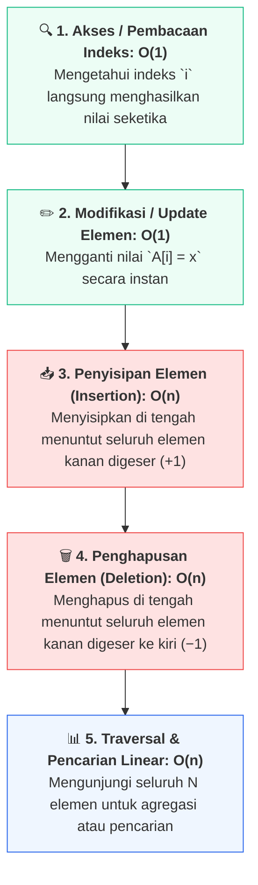
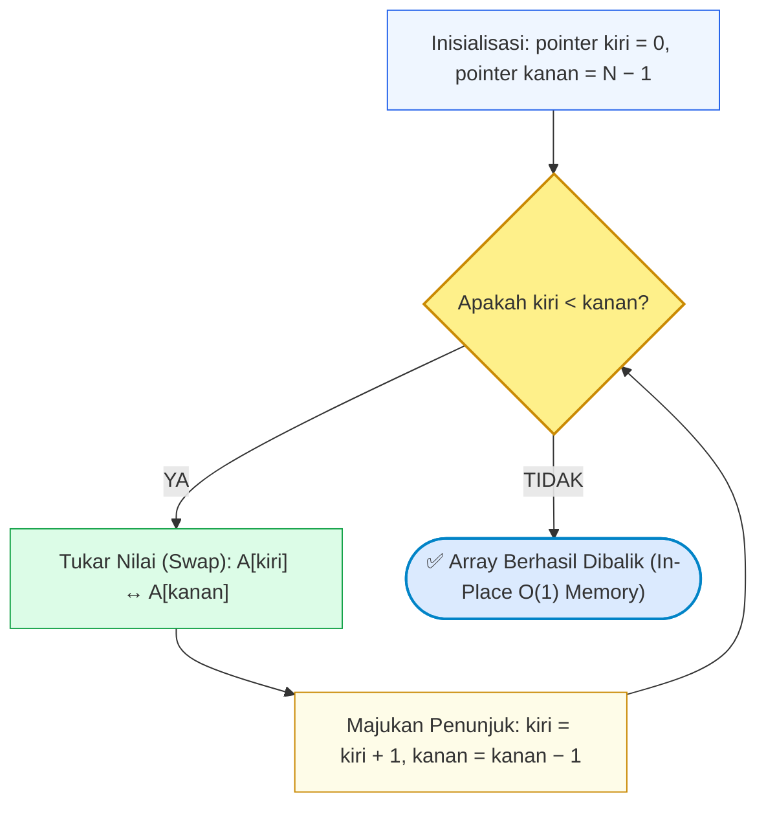

# 📘 Minggu 07: Struktur Data Larik (Array 1 Dimensi) & Akses Memori Kontigu

## 🎯 Capaian Pembelajaran (Sub-CPMK 4)
Setelah mempelajari modul ini, mahasiswa diharapkan mampu:
1. Memahami karakteristik alokasi memori fisik **Array Kontigu** dan membuktikan akses acak instan (**Direct Access `O(1)`**) melalui rumus pengalamatan memori.
2. Menganalisis efisiensi operasi dasar pada array: **Traversal**, **Insertion `O(n)`**, **Deletion `O(n)`**, dan **Pencarian Nilai Ekstrem**.
3. Menguasai teknik algoritma **Two-Pointer** untuk pembalikan larik secara mandiri (**In-Place Reversal `O(1)` Space**).
4. Mengidentifikasi dan mengamankan program dari kerentanan memori: **Buffer Overflow**, **Segmentation Fault**, dan **Off-by-One Error**.
5. Mengimplementasikan manipulasi larik, kalkulasi statistik, dan penyisipan data menggunakan C++ dan Python 3.

---

## 1. Karakteristik Alokasi Memori Kontigu & Rumus Pengalamatan

**Array (Larik)** adalah struktur data linear dasar yang menyimpan sekumpulan elemen bertipe data seragam (*homogeneous*) di dalam blok memori fisik RAM yang **berurutan dan bersebelahan secara fisik (*contiguous memory block*)**.



::: info 📐 Formula: Rumus Pengalamatan Elemen Array 1D (Direct Access O(1))
> **`Alamat(A[i]) = Base_Address + (i × Ukuran_Tipe_Data)`**
>
> * **`Base_Address`:** Alamat memori elemen pertama `A[0]`.
> * **`i`:** Nomor indeks elemen yang dicari (0 ≤ i < N).
> * **`Ukuran_Tipe_Data`:** Ukuran byte tipe data (`sizeof(int)` = 4 Bytes).
>
> *Implikasi:* CPU dapat langsung melompat ke elemen mana pun dalam waktu konstan **`O(1)`** murni dengan 1 operasi perkalian dan 1 penjumlahan tanpa perlu menelusuri elemen sebelumnya!
:::

---

## 2. Operasi Fundamental & Kompleksitas Asimtotik



### Detail Operasi Penyisipan (*Insertion*) & Pergeseran Memori

```text
Kondisi Awal:  [ 10, 20, 30, 40, 50, _ ]  (Panjang: 5, Kapasitas: 6)
Sisipkan 99 pada Indeks 2:
1. Geser indeks 4 ke 5: [ 10, 20, 30, 40, 50, 50 ]
2. Geser indeks 3 ke 4: [ 10, 20, 30, 40, 40, 50 ]
3. Geser indeks 2 ke 3: [ 10, 20, 30, 30, 40, 50 ]
4. Masukkan nilai 99  : [ 10, 20, 99, 30, 40, 50 ]  (Selesai, 3 kali geser)
```

---

## 3. Teknik Two-Pointer: Pembalikan Larik (*In-Place Reversal*)

Algoritma pembalikan array tanpa alokasi memori tambahan (*In-Place*) menggunakan 2 penunjuk: `kiri` bergerak maju dari indeks 0, dan `kanan` bergerak mundur dari indeks N − 1:



---

## 4. Bahaya Memori: Buffer Overflow & Off-by-One Error

::: danger 🚫 PERINGATAN KEAMANAN: OUT-OF-BOUNDS ARRAY ACCESS
- **Off-by-One Error:** Array dengan ukuran N = 5 memiliki indeks sah **`0, 1, 2, 3, 4`**. Mencoba mengakses `A[5]` adalah kesalahan fatal!
- **C++ (Unchecked Bounds):** C++ secara default tidak memeriksa batas indeks demi kecepatan eksekusi. Mengakses `A[100]` akan membaca memori liar (*Garbage Memory*) atau merusak segmen memori lain (*Segmentation Fault / Buffer Overflow Attack*).
- **Python (Checked Bounds):** Python secara otomatis melempar pengecualian `IndexError: list index out of range`.
:::

---

## 5. Implementasi Kode Hands-on Dual-Stack (C++ & Python 3)

Berikut implementasi lengkap operasi array: kalkulasi statistik dalam 1 pass, penyisipan elemen dinamis, dan teknik Two-Pointer In-Place Reversal:

::: code-group
```cpp [C++]
#include <iostream>
#include <iomanip>

using namespace std;

// Fungsi Cetak Array
void cetakArray(const int arr[], int n, const string& label) {
    cout << label << ": [ ";
    for (int i = 0; i < n; i++) {
        cout << arr[i] << (i < n - 1 ? ", " : " ");
    }
    cout << "]" << endl;
}

// 1. Pembalikan Array In-Place (Two-Pointer Technique)
void balikArrayInPlace(int arr[], int n) {
    int kiri = 0;
    int kanan = n - 1;
    while (kiri < kanan) {
        // Swap elemen
        int temp = arr[kiri];
        arr[kiri] = arr[kanan];
        arr[kanan] = temp;

        kiri++;
        kanan--;
    }
}

// 2. Penyisipan Elemen pada Posisi Spesifik (Insertion)
bool sisipElemen(int arr[], int& n, int kapasitas, int indeksTarget, int nilaiBaru) {
    if (n >= kapasitas || indeksTarget < 0 || indeksTarget > n) {
        return false; // Gagal: Kapasitas penuh atau indeks di luar batas
    }

    // Geser elemen ke kanan
    for (int i = n; i > indeksTarget; i--) {
        arr[i] = arr[i - 1];
    }
    arr[indeksTarget] = nilaiBaru;
    n++; // Tambah counter ukuran aktif
    return true;
}

int main() {
    cout << "==================================================" << endl;
    cout << "  OPERASI STRUKTUR DATA ARRAY 1D (C++ STANDAR)    " << endl;
    cout << "==================================================" << endl;

    const int KAPASITAS_MAKS = 10;
    int dataNilai[KAPASITAS_MAKS] = {85, 92, 78, 90, 88};
    int nAktif = 5;

    cetakArray(dataNilai, nAktif, "1. Data Awal");

    // A. Analisis Statistik 1-Pass (Min, Max, Rata-rata)
    int nilaiMin = dataNilai[0];
    int nilaiMax = dataNilai[0];
    double total = 0.0;

    for (int i = 0; i < nAktif; i++) {
        if (dataNilai[i] < nilaiMin) nilaiMin = dataNilai[i];
        if (dataNilai[i] > nilaiMax) nilaiMax = dataNilai[i];
        total += dataNilai[i];
    }
    double rataRata = total / nAktif;

    cout << "\n--- Ringkasan Statistik 1-Pass O(N) ---" << endl;
    cout << "• Nilai Minimum   : " << nilaiMin << endl;
    cout << "• Nilai Maksimum   : " << nilaiMax << endl;
    cout << "• Rata-rata Kelas : " << fixed << setprecision(2) << rataRata << endl;

    // B. Penyisipan Data Baru (Nilai 99 di Indeks 2)
    cout << "\n2. Menyisipkan Nilai 99 pada Indeks 2..." << endl;
    sisipElemen(dataNilai, nAktif, KAPASITAS_MAKS, 2, 99);
    cetakArray(dataNilai, nAktif, "-> Setelah Insertion");

    // C. Pembalikan Larik In-Place (Two-Pointer)
    cout << "\n3. Membalik Urutan Array (Two-Pointer In-Place)..." << endl;
    balikArrayInPlace(dataNilai, nAktif);
    cetakArray(dataNilai, nAktif, "-> Setelah Reversal");

    cout << "==================================================" << endl;
    return 0;
}
```

```python [Python 3]
def balik_array_in_place(arr: list) -> None:
    """Membalik urutan list secara in-place dengan Two-Pointer O(1) Space."""
    kiri = 0
    kanan = len(arr) - 1
    while kiri < kanan:
        # Tuple unpacking swap khas Python
        arr[kiri], arr[kanan] = arr[kanan], arr[kiri]
        kiri += 1
        kanan -= 1


def main():
    print("=" * 50)
    print("  OPERASI STRUKTUR DATA ARRAY 1D (PYTHON 3)       ")
    print("=" * 50)

    data_nilai = [85, 92, 78, 90, 88]
    print(f"1. Data Awal: {data_nilai}")

    # A. Analisis Statistik 1-Pass
    nilai_min = data_nilai[0]
    nilai_max = data_nilai[0]
    total = 0

    for x in data_nilai:
        if x < nilai_min:
            nilai_min = x
        if x > nilai_max:
            nilai_max = x
        total += x

    rata_rata = total / len(data_nilai)

    print("\n--- Ringkasan Statistik 1-Pass O(N) ---")
    print(f"• Nilai Minimum   : {nilai_min}")
    print(f"• Nilai Maksimum   : {nilai_max}")
    print(f"• Rata-rata Kelas : {rata_rata:.2f}")

    # B. Penyisipan Elemen (Insertion pada Indeks 2)
    print("\n2. Menyisipkan Nilai 99 pada Indeks 2...")
    data_nilai.insert(2, 99)
    print(f"-> Setelah Insertion: {data_nilai}")

    # C. Pembalikan List In-Place (Two-Pointer)
    print("\n3. Membalik Urutan List (Two-Pointer In-Place)...")
    balik_array_in_place(data_nilai)
    print(f"-> Setelah Reversal : {data_nilai}")
    print("=" * 50)


if __name__ == "__main__":
    main()
```
:::

---

## 6. Rangkuman & Latihan Mandiri

::: tip 💡 Rangkuman Konsep Kunci
1. **Memori Kontigu:** Array menyimpan data secara bersebelahan di RAM, memungkinkan pembacaan acak instan `O(1)` berdasarkan rumus pengalamatan offset.
2. **Biaya Pergeseran:** Operasi penyisipan dan penghapusan di tengah array membutuhkan waktu `O(n)` karena harus menggeser elemen tetangga.
3. **Pola Two-Pointer:** Manfaatkan teknik dua penunjuk untuk membalik data tanpa mengalokasikan array kedua (*In-place `O(1)` space*).
4. **Proteksi Indeks:** Selalu pastikan indeks berada pada rentang 0 ≤ i < N untuk mencegah bencana *buffer overflow*.
:::

### 📝 Tugas Praktikum 7 (Mandiri)
1. **Penghapusan Elemen Array:** Rancang fungsi C++ / Python untuk menghapus elemen pada indeks k dari sebuah array berukuran N. Pastikan elemen-elemen di sebelah kanan digeser ke kiri dan ukuran aktif berkurang 1.
2. **Pengecekan Larik Terurut (*Is Sorted*):** Buatlah fungsi yang mengembalikan `true` jika sebuah array sudah terurut secara menaik (*ascending*), atau `false` jika belum, dalam kompleksitas `O(n)` waktu dan `O(1)` memori.
3. **Algoritma Two-Sum Dasar:** Diberikan sebuah array bilangan bulat `arr` dan sebuah nilai target `target`, cari dua buah indeks elemen dalam array tersebut yang jika dijumlahkan menghasilkan nilai `target` (Gunakan pendekatan nested loop `O(n²)` atau sorting two-pointer).
