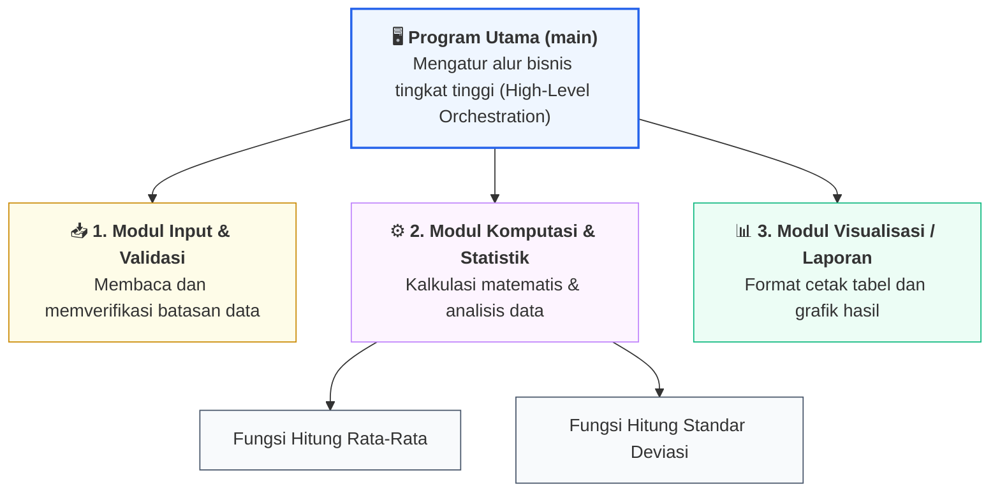
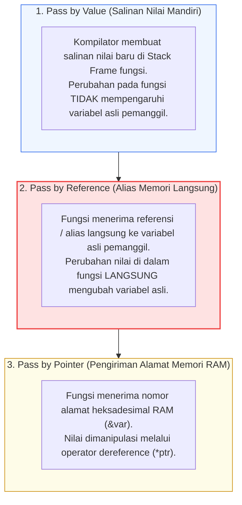
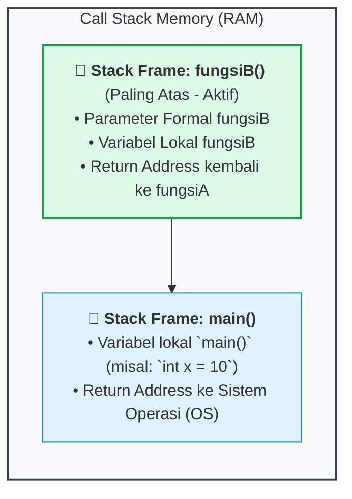

# 📘 Minggu 10: Pemrograman Modular: Fungsi, Prosedur & Call Stack Memory

## 🎯 Capaian Pembelajaran (Sub-CPMK 5)
Setelah mempelajari modul ini, mahasiswa diharapkan mampu:
1. Memahami filosofi **Pemrograman Modular**, prinsip **Single Responsibility**, dan **DRY (*Don't Repeat Yourself*)**.
2. Membedakan secara analitis antara **Fungsi (Return Value)** dan **Prosedur (`void`)**.
3. Menganalisis mekanisme pengiriman argumen: **Pass by Value**, **Pass by Reference**, dan **Pass by Pointer**.
4. Mendekonstruksi arsitektur **Call Stack & Stack Frame (Activation Record)** selama siklus pemanggilan dan terminasi fungsi.
5. Memahami ruang lingkup (*Scope*) dan masa hidup (*Lifetime*) variabel: **Lokal**, **Global**, dan **Statis**.
6. Mengimplementasikan pustaka fungsi modular menggunakan C++ dan Python 3.

---

## 1. Filosofi Pemrograman Modular & Dekomposisi

Pemrograman Modular (*Modular Programming*) adalah paradigma rekayasa perangkat lunak yang memecah suatu program besar dan kompleks menjadi sub-sub program yang lebih kecil, independen, dan terkelola (*Divide and Conquer*):


```mermaid
flowchart TD
    Main["🖥️ <b>Program Utama (main)</b><br>Mengatur alur bisnis tingkat tinggi (High-Level Orchestration)"]
    --> ModInput["📥 <b>1. Modul Input & Validasi</b><br>Membaca dan memverifikasi batasan data"]
    
    Main --> ModCompute["⚙️ <b>2. Modul Komputasi & Statistik</b><br>Kalkulasi matematis & analisis data"]
    --> SubAvg["Fungsi Hitung Rata-Rata"]
    ModCompute --> SubDev["Fungsi Hitung Standar Deviasi"]

    Main --> ModReport["📊 <b>3. Modul Visualisasi / Laporan</b><br>Format cetak tabel dan grafik hasil"]

    style Main fill:#eff6ff,stroke:#2563eb,stroke-width:2px
    style ModInput fill:#fefce8,stroke:#ca8a04,stroke-width:1px
    style ModCompute fill:#fdf4ff,stroke:#c084fc,stroke-width:1px
    style ModReport fill:#ecfdf5,stroke:#10b981,stroke-width:1px
    style SubAvg fill:#f8fafc,stroke:#475569,stroke-width:1px
    style SubDev fill:#f8fafc,stroke:#475569,stroke-width:1px
```

### Keuntungan Utama Modularitas:
1. **Reusability:** Fungsi yang ditulis sekali dapat dipanggil berkali-kali dari berbagai bagian program.
2. **Maintainability:** Isolasi bug; jika terjadi galat kalkulasi, perbaikan hanya perlu dilakukan pada satu fungsi terkait.
3. **Readability:** Menghilangkan kode duplikat dan membuat alur `main()` sangat mudah dipahami layaknya membaca daftar isi.

---

## 2. Perbedaan Fungsi vs Prosedur

| Dimensi Pembeda | Fungsi (*Function*) | Prosedur (*Procedure / void*) |
| :--- | :--- | :--- |
| **Nilai Kembalian (*Return*)** | Menghasilkan dan mengembalikan **tepat satu nilai** ke pemanggil melalui kata kunci `return`. | **Tidak mengembalikan nilai** (`void`); berfokus pada aksi, cetak layar, atau manipulasi file. |
| **Penempatan dalam Kode** | Dapat diletakkan langsung di dalam ekspresi aritmatika (misal: `z = hitungLuas(p, l) + 10;`). | Dipanggil sebagai satu pernyataan instruksi mandiri (misal: `tampilkanMenu();`). |
| **Efek Samping (*Side Effects*)** | Idealnya berstatus *Pure Function* (bebas efek samping, luaran murni ditentukan masukan). | Sering kali memicu efek samping (mengubah variabel global atau memodifikasi I/O). |

---

## 3. Parameter Passing: By Value vs By Reference vs By Pointer


```mermaid
flowchart TD
    subgraph PassValue["1. Pass by Value (Salinan Nilai Mandiri)"]
        direction TB
        V1["Kompilator membuat salinan nilai baru di Stack Frame fungsi.<br>Perubahan pada fungsi TIDAK mempengaruhi variabel asli pemanggil."]
    end

    subgraph PassRef["2. Pass by Reference (Alias Memori Langsung)"]
        direction TB
        R1["Fungsi menerima referensi / alias langsung ke variabel asli pemanggil.<br>Perubahan nilai di dalam fungsi LANGSUNG mengubah variabel asli."]
    end

    subgraph PassPtr["3. Pass by Pointer (Pengiriman Alamat Memori RAM)"]
        direction TB
        P1["Fungsi menerima nomor alamat heksadesimal RAM (&var).<br>Nilai dimanipulasi melalui operator dereference (*ptr)."]
    end

    PassValue --> PassRef --> PassPtr

    style PassValue fill:#eff6ff,stroke:#2563eb,stroke-width:1px
    style PassRef fill:#fee2e2,stroke:#ef4444,stroke-width:2px
    style PassPtr fill:#fefce8,stroke:#ca8a04,stroke-width:1px
```

---

## 4. Dekonstruksi Arsitektur Call Stack & Stack Frame

Ketika sebuah fungsi dipanggil oleh CPU, sistem mengalokasikan sebuah **Stack Frame (Activation Record)** di memori Stack:


```mermaid
flowchart TD
    subgraph CallStackRAM["Call Stack Memory (RAM)"]
        direction TB
        FrameFungsi["🥞 <b>Stack Frame: fungsiB()</b> (Paling Atas - Aktif)<br>• Parameter Formal fungsiB<br>• Variabel Lokal fungsiB<br>• Return Address kembali ke fungsiA"]
        --> FrameMain["🥞 <b>Stack Frame: main()</b><br>• Variabel lokal `main()` (misal: `int x = 10`)<br>• Return Address ke Sistem Operasi (OS)"]
    end

    style CallStackRAM fill:#f8fafc,stroke:#334155,stroke-width:2px
    style FrameFungsi fill:#dcfce7,stroke:#16a34a,stroke-width:2px
    style FrameMain fill:#e0f2fe,stroke:#0284c7,stroke-width:1px
```

### Tahapan Siklus Hidup Eksekusi Fungsi:
1. **Push Frame:** Parameter dan alamat kembali (*Return Address*) dimasukkan ke puncak Stack.
2. **Execution:** CPU mengeksekusi instruksi di dalam badan fungsi.
3. **Pop Frame & Unwinding:** Setelah pernyataan `return` dicapai, seluruh Stack Frame dihapus seketika dari RAM, memori lokal dilepaskan, dan CPU kembali ke alamat instruksi pemanggil.

---

## 5. Ruang Lingkup (Scope) & Masa Hidup (Lifetime) Variabel

1. **Variabel Lokal:** Dideklarasikan di dalam blok fungsi `{}`. Memori dialokasikan di Stack dan **langsung hancur (*destroyed*)** saat fungsi selesai.
2. **Variabel Global:** Dideklarasikan di luar seluruh fungsi. Dialokasikan di Data Segment dan hidup selama program berjalan. *(Hindari penggunaan berlebih demi mencegah efek samping tersembunyi)*.
3. **Variabel Statis (`static`):** Variabel lokal yang nilainya **dipertahankan antar pemanggilan fungsi** (disimpan di Data Segment, bukan di Stack).

---

## 6. Implementasi Kode Hands-on Dual-Stack (C++ & Python 3)

Berikut adalah implementasi komparasi nyata antara *Pass by Value*, *Pass by Reference*, dan penggunaan variabel `static` penghitung frekuensi panggilan:

::: code-group
```cpp [C++]
#include <iostream>
#include <iomanip>

using namespace std;

// 1. Pass by Value: x TIDAK berubah di fungsi pemanggil
void tukarByValue(int a, int b) {
    int temp = a;
    a = b;
    b = temp;
}

// 2. Pass by Reference: a dan b ASLI ikut tertukar
void tukarByReference(int& a, int& b) {
    int temp = a;
    a = b;
    b = temp;
}

// 3. Fungsi dengan Variabel Statis (Mempertahankan Status)
int generateIDTransaksi() {
    static int counter = 1000; // Hanya diinisialisasi 1 kali sepanjang program!
    counter++;
    return counter;
}

int main() {
    cout << "==================================================" << endl;
    cout << "  MODULARITAS, PARAMETER & CALL STACK (C++)       " << endl;
    cout << "==================================================" << endl;

    int x = 10, y = 20;
    cout << "Nilai Awal        : x = " << x << ", y = " << y << endl;

    // Uji Pass by Value
    tukarByValue(x, y);
    cout << "Setelah By Value  : x = " << x << ", y = " << y << " (TIDAK BERUBAH!)" << endl;

    // Uji Pass by Reference
    tukarByReference(x, y);
    cout << "Setelah By Ref    : x = " << x << ", y = " << y << " (BERHASIL TERTUKAR!)" << endl;

    // Uji Variabel Statis
    cout << "\n--- Uji Variabel Statis (ID Generator) ---" << endl;
    cout << "Transaksi 1 ID: TRX-" << generateIDTransaksi() << endl;
    cout << "Transaksi 2 ID: TRX-" << generateIDTransaksi() << endl;
    cout << "Transaksi 3 ID: TRX-" << generateIDTransaksi() << endl;

    cout << "==================================================" << endl;
    return 0;
}
```

```python [Python 3]
def tukar_nilai(a: int, b: int) -> tuple[int, int]:
    """
    Python menggunakan paradigma 'Pass by Object Reference'.
    Tipe integer bersifat immutable, sehingga nilai baru dikembalikan via tuple.
    """
    return b, a


def generate_id_transaksi():
    """Simulasi variabel statis menggunakan closure atau atribut fungsi."""
    if not hasattr(generate_id_transaksi, "counter"):
        generate_id_transaksi.counter = 1000
    generate_id_transaksi.counter += 1
    return generate_id_transaksi.counter


def main():
    print("=" * 50)
    print("  MODULARITAS & PARAMETER PASSING (PYTHON 3)      ")
    print("=" * 50)

    x, y = 10, 20
    print(f"Nilai Awal : x = {x}, y = {y}")

    # Pertukaran nilai ala Pythonic
    x, y = tukar_nilai(x, y)
    print(f"Setelah Swap: x = {x}, y = {y} (BERHASIL TERTUKAR!)")

    print("\n--- Uji Generator ID Statis ---")
    print(f"Transaksi 1 ID: TRX-{generate_id_transaksi()}")
    print(f"Transaksi 2 ID: TRX-{generate_id_transaksi()}")
    print(f"Transaksi 3 ID: TRX-{generate_id_transaksi()}")
    print("=" * 50)


if __name__ == "__main__":
    main()
```
:::

---

## 7. Rangkuman & Latihan Mandiri

::: tip 💡 Rangkuman Konsep Kunci
1. **Dekomposisi:** Pecah masalah menjadi fungsi-fungsi kecil yang fokus melakukan 1 tugas spesifik (*Single Responsibility*).
2. **Pass by Reference:** Gunakan `&` di C++ saat fungsi perlu mengubah nilai variabel asli atau saat melewatkan objek besar (seperti array/struct) demi menghemat memori dan waktu komputasi.
3. **Call Stack:** Setiap pemanggilan fungsi memakan ruang di memori Stack. Kehancuran variabel lokal terjadi secara otomatis saat Stack Frame di-pop.
4. **Variabel Statis:** Gunakan `static` untuk menyimpan status akumulatif antar pemanggilan tanpa mengotori ruang lingkup global.
:::

### 📝 Tugas Praktikum 10 (Mandiri)
1. **Fungsi Statistik Multi-Luaran:** Buat fungsi C++ `void hitungStatistik(const double arr[], int n, double& minVal, double& maxVal, double& avgVal)` yang menghitung nilai minimum, maksimum, dan rata-rata secara simultan dalam 1 kali pemanggilan menggunakan *Pass by Reference*.
2. **Kalkulator Perpajakan Modular:** Rancang sistem modular untuk menghitung Pajak Penghasilan (PPh 21) berjenjang dengan memecah program ke dalam modul: `inputGaji()`, `hitungPTKP()`, `hitungTarifPajak()`, dan `cetakFakturPajak()`.
