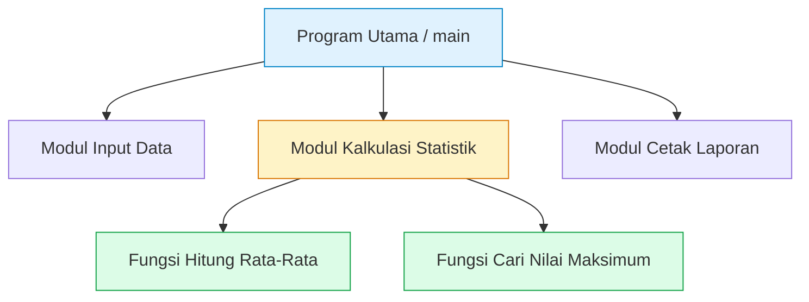
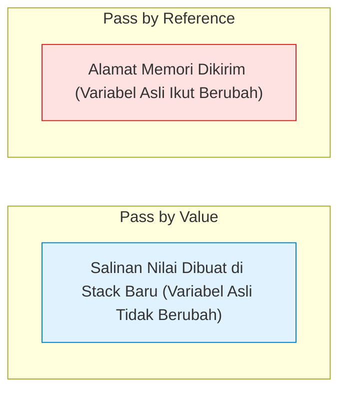

# Minggu 10: Pemrograman Modular: Fungsi & Prosedur

::: tip CAPAIAN PEMBELAJARAN (SUB-CPMK 5)
- **CPMK Terkait:** CPMK0101 (Konsep Dasar Pemrograman)
- **CPL Terkait:** CPL01 (Pengetahuan Dasar), CPL03 (Problem Solving), CPL04 (Solusi Rekayasa)
- **Indikator:** Mahasiswa mampu merancang kode modular berprinsip *Don't Repeat Yourself (DRY)* dan *Single Responsibility*, memahami perbedaan fungsi (memiliki return value) vs prosedur (`void`), membedakan parameter formal vs aktual, serta menganalisis mekanisme *Pass by Value* vs *Pass by Reference*.
:::

---

## 1. Filosofi Pemrograman Modular & Dekomposisi

Pemrograman modular (*modular programming*) adalah teknik rekayasa perangkat lunak dengan cara memecah masalah besar dan kompleks menjadi sub-sub masalah kecil yang mandiri (*divide and conquer*).


```mermaid
graph TD
    Main[Program Utama / main] --> Mod1[Modul Input Data]
    Main --> Mod2[Modul Kalkulasi Statistik]
    Main --> Mod3[Modul Cetak Laporan]
    Mod2 --> Sub1[Fungsi Hitung Rata-Rata]
    Mod2 --> Sub2[Fungsi Cari Nilai Maksimum]
    style Main fill:#e0f2fe,stroke:#0284c7
    style Mod2 fill:#fef3c7,stroke:#d97706
    style Sub1 fill:#dcfce7,stroke:#16a34a
    style Sub2 fill:#dcfce7,stroke:#16a34a
```

---

## 2. Perbedaan Fungsi dan Prosedur

| Aspek | Fungsi (*Function*) | Prosedur (*Procedure / void*) |
| :--- | :--- | :--- |
| **Nilai Balik (*Return Value*)** | Mengembalikan **satu nilai luaran spesifik** ke pemanggil melalui kata kunci `return`. | **Tidak mengembalikan nilai** (`void`); fokus pada aksi / efek samping (*side-effects*). |
| **Penggunaan dalam Ekspresi** | Dapat diletakkan langsung di dalam ekspresi matematika (misal: `y = f(x) + 10;`). | Dipanggil sebagai satu pernyataan instruksi mandiri (misal: `cetakHeader();`). |
| **Tipe Data Header** | Dideklarasikan dengan tipe data kembalian (`int`, `double`, `string`). | Dideklarasikan dengan tipe `void` (atau fungsi tanpa return di Python). |

---

## 3. Parameter Passing: By Value vs By Reference


```mermaid
graph LR
    subgraph Pass by Value
        A["Salinan Nilai Dibuat di Stack Baru (Variabel Asli Tidak Berubah)"]
    end
    subgraph Pass by Reference
        B["Alamat Memori Dikirim (Variabel Asli Ikut Berubah)"]
    end
    style A fill:#e0f2fe,stroke:#0284c7
    style B fill:#fee2e2,stroke:#dc2626
```

::: code-group
```cpp [C++]
#include <iostream>
using namespace std;

// 1. Pass by Value (Salinan data)
void kaliDuaValue(int x) {
    x = x * 2;
}

// 2. Pass by Reference (Menggunakan tanda &)
void kaliDuaRef(int &x) {
    x = x * 2;
}

int main() {
    int angka = 10;

    kaliDuaValue(angka);
    cout << "Setelah Pass by Value : " << angka << " (Tetap 10)" << endl;

    kaliDuaRef(angka);
    cout << "Setelah Pass by Ref   : " << angka << " (Berubah menjadi 20)" << endl;

    return 0;
}
```

```python [Python 3]
# Di Python, tipe primitif (int, float, str) bersifat immutable (Pass by Object Reference mirip by value)
def kali_dua(x: int) -> int:
    return x * 2

def ubah_list(data: list):
    # List bersifat mutable (perubahan berpengaruh ke objek asli)
    data.append(999)

angka = 10
angka = kali_dua(angka)
print("Nilai angka setelah return:", angka)

angka_list = [1, 2, 3]
ubah_list(angka_list)
print("List setelah diubah dalam fungsi:", angka_list)
```
:::

---

## 📝 Evaluasi & Latihan Mandiri (Sub-CPMK 5)

1. Buatlah fungsi `isPrima(int n)` yang mengembalikan nilai `true` jika bilangan bulat $n$ adalah prima, dan `false` jika bukan.
2. Buatlah prosedur `tukarNilai(int &a, int &b)` untuk menukar nilai dua variabel menggunakan pointer / reference.
