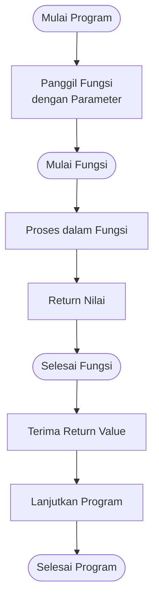

# Fungsi dan Prosedur

## Apa itu Fungsi?

**Fungsi** adalah blok kode yang dirancang untuk melakukan tugas tertentu dan dapat digunakan berulang kali. Fungsi membantu membuat kode lebih modular, mudah dibaca, dan mudah dipelihara.

### Keuntungan Menggunakan Fungsi

- **Reusability**: Kode dapat digunakan berulang kali
- **Modularity**: Program dibagi menjadi bagian-bagian kecil
- **Maintainability**: Mudah dipelihara dan debug
- **Readability**: Kode lebih mudah dibaca dan dipahami

## Perbedaan Fungsi dan Prosedur

| Aspek        | Fungsi                    | Prosedur                  |
| ------------ | ------------------------- | ------------------------- |
| Return Value | Mengembalikan nilai       | Tidak mengembalikan nilai |
| Keyword      | `return`                  | Tidak ada return / `void` |
| Penggunaan   | Dalam ekspresi/assignment | Statement tersendiri      |

## Deklarasi Fungsi

### Python

```python
# Fungsi dengan return
def nama_fungsi(parameter1, parameter2):
    # kode fungsi
    return nilai

# Prosedur (tidak return)
def nama_prosedur(parameter):
    # kode prosedur
    print("Hasil")
```

### C++

```cpp
// Fungsi dengan return
tipe_return nama_fungsi(tipe param1, tipe param2) {
    // kode fungsi
    return nilai;
}

// Prosedur (void)
void nama_prosedur(tipe parameter) {
    // kode prosedur
    cout << "Hasil" << endl;
}
```

## Flowchart: Struktur Fungsi

### Flowchart Fungsi Umum



### Flowchart Fungsi Hitung Luas Lingkaran


## Contoh Fungsi Sederhana

### Python

```python
# Fungsi tanpa parameter
def sapa():
    print("Halo, Selamat datang!")

# Fungsi dengan parameter
def sapa_nama(nama):
    print(f"Halo, {nama}!")

# Fungsi dengan return
def tambah(a, b):
    return a + b

# Fungsi dengan multiple return
def bagi(a, b):
    if b == 0:
        return None, "Error: Pembagi nol"
    return a / b, "Sukses"

# Penggunaan
sapa()                    # Output: Halo, Selamat datang!
sapa_nama("Budi")         # Output: Halo, Budi!
hasil = tambah(5, 3)      # hasil = 8
nilai, status = bagi(10, 2)  # nilai = 5.0, status = "Sukses"
```

### C++

```cpp
#include <iostream>
using namespace std;

// Fungsi tanpa parameter
void sapa() {
    cout << "Halo, Selamat datang!" << endl;
}

// Fungsi dengan parameter
void sapa_nama(string nama) {
    cout << "Halo, " << nama << "!" << endl;
}

// Fungsi dengan return
int tambah(int a, int b) {
    return a + b;
}

// Fungsi dengan kondisi
float bagi(float a, float b) {
    if (b == 0) {
        cout << "Error: Pembagi nol" << endl;
        return 0;
    }
    return a / b;
}

int main() {
    sapa();                    // Output: Halo, Selamat datang!
    sapa_nama("Budi");         // Output: Halo, Budi!
    int hasil = tambah(5, 3);  // hasil = 8
    float nilai = bagi(10, 2); // nilai = 5.0

    return 0;
}
```

## Parameter dan Argumen

### Parameter Default (Python)

```python
def sapa(nama, salam="Halo"):
    print(f"{salam}, {nama}!")

sapa("Budi")              # Halo, Budi!
sapa("Budi", "Selamat Pagi")  # Selamat Pagi, Budi!
```

### Parameter dengan Nilai Default (C++)

```cpp
void sapa(string nama, string salam = "Halo") {
    cout << salam << ", " << nama << "!" << endl;
}

// Penggunaan
sapa("Budi");              // Halo, Budi!
sapa("Budi", "Selamat Pagi");  // Selamat Pagi, Budi!
```

### Pass by Value vs Pass by Reference

```cpp
// C++ - Pass by Value
void ubahNilai(int x) {
    x = 100;  // Tidak mempengaruhi variabel asli
}

// C++ - Pass by Reference
void ubahNilaiRef(int &x) {
    x = 100;  // Mempengaruhi variabel asli
}

int main() {
    int angka = 50;

    ubahNilai(angka);
    cout << angka << endl;  // 50 (tidak berubah)

    ubahNilaiRef(angka);
    cout << angka << endl;  // 100 (berubah)

    return 0;
}
```

```python
# Python - Pass by Reference (untuk mutable objects)
def ubah_list(lst):
    lst.append(100)  # Mempengaruhi list asli

angka = [1, 2, 3]
ubah_list(angka)
print(angka)  # [1, 2, 3, 100]
```

## Scope Variabel

### Variabel Lokal vs Global

```python
# Python
x = 10  # Variabel global

def fungsi():
    x = 20  # Variabel lokal
    print(f"Dalam fungsi: {x}")

fungsi()           # Output: Dalam fungsi: 20
print(f"Di luar: {x}")  # Output: Di luar: 10

# Mengakses variabel global
def fungsi2():
    global x
    x = 30
    print(f"Dalam fungsi2: {x}")

fungsi2()          # Output: Dalam fungsi2: 30
print(f"Di luar: {x}")  # Output: Di luar: 30
```

```cpp
// C++
int x = 10;  // Variabel global

void fungsi() {
    int x = 20;  // Variabel lokal
    cout << "Dalam fungsi: " << x << endl;
}

int main() {
    fungsi();           // Output: Dalam fungsi: 20
    cout << "Di luar: " << x << endl;  // Output: Di luar: 10

    return 0;
}
```

## Contoh Program Lengkap

### Program 1: Kalkulator dengan Fungsi

```python
# Python
def tambah(a, b):
    return a + b

def kurang(a, b):
    return a - b

def kali(a, b):
    return a * b

def bagi(a, b):
    if b == 0:
        return "Error: Pembagi nol"
    return a / b

def kalkulator():
    print("=== KALKULATOR ===")
    print("1. Tambah")
    print("2. Kurang")
    print("3. Kali")
    print("4. Bagi")

    pilihan = int(input("Pilih operasi (1-4): "))

    a = float(input("Angka pertama: "))
    b = float(input("Angka kedua: "))

    if pilihan == 1:
        hasil = tambah(a, b)
        print(f"{a} + {b} = {hasil}")
    elif pilihan == 2:
        hasil = kurang(a, b)
        print(f"{a} - {b} = {hasil}")
    elif pilihan == 3:
        hasil = kali(a, b)
        print(f"{a} × {b} = {hasil}")
    elif pilihan == 4:
        hasil = bagi(a, b)
        print(f"{a} ÷ {b} = {hasil}")
    else:
        print("Pilihan tidak valid!")

# Jalankan
kalkulator()
```

### Program 2: Konversi Suhu

```cpp
// C++
#include <iostream>
using namespace std;

float celsiusToFahrenheit(float c) {
    return (c * 9.0 / 5.0) + 32;
}

float fahrenheitToCelsius(float f) {
    return (f - 32) * 5.0 / 9.0;
}

float celsiusToKelvin(float c) {
    return c + 273.15;
}

float kelvinToCelsius(float k) {
    return k - 273.15;
}

void tampilkanMenu() {
    cout << "\n=== KONVERSI SUHU ===" << endl;
    cout << "1. Celsius ke Fahrenheit" << endl;
    cout << "2. Fahrenheit ke Celsius" << endl;
    cout << "3. Celsius ke Kelvin" << endl;
    cout << "4. Kelvin ke Celsius" << endl;
    cout << "5. Keluar" << endl;
}

int main() {
    int pilihan;
    float suhu, hasil;

    do {
        tampilkanMenu();
        cout << "Pilih (1-5): ";
        cin >> pilihan;

        if (pilihan >= 1 && pilihan <= 4) {
            cout << "Masukkan suhu: ";
            cin >> suhu;

            switch(pilihan) {
                case 1:
                    hasil = celsiusToFahrenheit(suhu);
                    cout << suhu << "°C = " << hasil << "°F" << endl;
                    break;
                case 2:
                    hasil = fahrenheitToCelsius(suhu);
                    cout << suhu << "°F = " << hasil << "°C" << endl;
                    break;
                case 3:
                    hasil = celsiusToKelvin(suhu);
                    cout << suhu << "°C = " << hasil << "K" << endl;
                    break;
                case 4:
                    hasil = kelvinToCelsius(suhu);
                    cout << suhu << "K = " << hasil << "°C" << endl;
                    break;
            }
        }
    } while (pilihan != 5);

    cout << "Terima kasih!" << endl;

    return 0;
}
```

### Program 3: Validasi Data dengan Fungsi

```python
# Python
def validasi_email(email):
    """Validasi format email sederhana"""
    if '@' not in email or '.' not in email:
        return False

    parts = email.split('@')
    if len(parts) != 2:
        return False

    username, domain = parts
    if len(username) == 0 or len(domain) == 0:
        return False

    return True

def validasi_nim(nim):
    """Validasi NIM (harus 10 digit angka)"""
    if len(nim) != 10:
        return False
    return nim.isdigit()

def validasi_umur(umur):
    """Validasi umur (17-100 tahun)"""
    try:
        umur_int = int(umur)
        return 17 <= umur_int <= 100
    except ValueError:
        return False

def input_mahasiswa():
    print("=== INPUT DATA MAHASISWA ===")

    # Input NIM
    while True:
        nim = input("NIM (10 digit): ")
        if validasi_nim(nim):
            break
        print("❌ NIM tidak valid!")

    # Input Nama
    nama = input("Nama: ")

    # Input Email
    while True:
        email = input("Email: ")
        if validasi_email(email):
            break
        print("❌ Email tidak valid!")

    # Input Umur
    while True:
        umur = input("Umur (17-100): ")
        if validasi_umur(umur):
            break
        print("❌ Umur tidak valid!")

    print("\n✓ Data berhasil disimpan!")
    print(f"NIM: {nim}")
    print(f"Nama: {nama}")
    print(f"Email: {email}")
    print(f"Umur: {umur}")

# Jalankan
input_mahasiswa()
```

### Program 4: Operasi Array dengan Fungsi

```python
# Python
def input_array():
    """Input array dari user"""
    n = int(input("Jumlah elemen: "))
    array = []
    for i in range(n):
        nilai = int(input(f"Elemen ke-{i+1}: "))
        array.append(nilai)
    return array

def tampilkan_array(array):
    """Tampilkan isi array"""
    print("Isi array:", array)

def cari_nilai(array, nilai):
    """Cari nilai dalam array"""
    for i in range(len(array)):
        if array[i] == nilai:
            return i
    return -1

def statistik_array(array):
    """Hitung statistik array"""
    return {
        'min': min(array),
        'max': max(array),
        'sum': sum(array),
        'avg': sum(array) / len(array)
    }

def urutkan_array(array):
    """Urutkan array (ascending)"""
    return sorted(array)

# Main program
def main():
    print("=== PROGRAM OPERASI ARRAY ===")

    # Input
    data = input_array()
    tampilkan_array(data)

    # Statistik
    stat = statistik_array(data)
    print(f"\nStatistik:")
    print(f"Minimum: {stat['min']}")
    print(f"Maksimum: {stat['max']}")
    print(f"Total: {stat['sum']}")
    print(f"Rata-rata: {stat['avg']:.2f}")

    # Pencarian
    cari = int(input("\nCari nilai: "))
    index = cari_nilai(data, cari)
    if index != -1:
        print(f"Nilai {cari} ditemukan di index {index}")
    else:
        print(f"Nilai {cari} tidak ditemukan")

    # Sorting
    data_urut = urutkan_array(data)
    print(f"\nArray terurut: {data_urut}")

# Jalankan
main()
```

## Lambda Function (Python)

```python
# Lambda function - fungsi anonim singkat
tambah = lambda a, b: a + b
print(tambah(5, 3))  # 8

kuadrat = lambda x: x ** 2
print(kuadrat(5))  # 25

# Dengan map
angka = [1, 2, 3, 4, 5]
hasil = list(map(lambda x: x * 2, angka))
print(hasil)  # [2, 4, 6, 8, 10]

# Dengan filter
genap = list(filter(lambda x: x % 2 == 0, angka))
print(genap)  # [2, 4]
```

## Function Overloading (C++)

```cpp
// C++ - function overloading
#include <iostream>
using namespace std;

// Overload berdasarkan jumlah parameter
int tambah(int a, int b) {
    return a + b;
}

int tambah(int a, int b, int c) {
    return a + b + c;
}

// Overload berdasarkan tipe parameter
double tambah(double a, double b) {
    return a + b;
}

int main() {
    cout << tambah(5, 3) << endl;        // 8
    cout << tambah(5, 3, 2) << endl;     // 10
    cout << tambah(5.5, 3.2) << endl;    // 8.7

    return 0;
}
```

## Latihan

1. **Fungsi Faktorial**

   - Buat fungsi untuk menghitung faktorial
   - Contoh: faktorial(5) = 120

2. **Fungsi Bilangan Prima**

   - Buat fungsi cek apakah bilangan prima
   - Buat fungsi tampilkan n bilangan prima pertama

3. **Fungsi Palindrome**

   - Buat fungsi cek apakah kata palindrome
   - Contoh: "katak" → True

4. **Fungsi Fibonacci**

   - Buat fungsi untuk deret Fibonacci
   - Return array n bilangan pertama

5. **Fungsi Matrix**

   - Buat fungsi penjumlahan matriks
   - Buat fungsi perkalian matriks
   - Buat fungsi transpose matriks

6. **Fungsi Statistik**
   - Buat fungsi hitung mean, median, modus
   - Buat fungsi hitung standar deviasi

## Rangkuman

- **Fungsi** adalah blok kode yang dapat digunakan berulang kali
- **Fungsi** mengembalikan nilai, **Prosedur** tidak
- **Parameter** adalah variabel dalam definisi fungsi
- **Argumen** adalah nilai yang dikirim ke fungsi
- **Scope** menentukan di mana variabel dapat diakses
- **Pass by Value** vs **Pass by Reference**
- Fungsi membuat kode lebih modular dan mudah dipelihara

---

**Sebelumnya**: [String](./string.md) | **Selanjutnya**: [Rekursi](./rekursi.md)
