# 📘 Algoritma dan Pemrograman (IFR206)

Selamat datang di portal pembelajaran resmi mata kuliah **Algoritma dan Pemrograman** (Kode MK: **IFR206**, Bobot: **3 SKS**)!

Bahan ajar ini dirancang secara komprehensif berbasis kurikulum **Outcome-Based Education (OBE)** Program Studi Informatika, Fakultas Sains dan Teknologi, Universitas Ubudiyah Indonesia (UUI). Modul ini memadukan kedalaman **teori sains komputasi formal**, **dekonstruksi arsitektur memori RAM/CPU**, **analisis kompleksitas matematis asimtotik**, serta **implementasi pemrograman dual-stack (C++ & Python 3)** berstandar industri.

---

## 🎓 Metadata Kurikulum & Capaian Pembelajaran (OBE)

::: info 📋 METADATA MATA KULIAH
- **Kode Mata Kuliah:** IFR206
- **Nama Mata Kuliah:** Algoritma dan Pemrograman
- **Bahan Kajian (BK):** BK30 (Algoritma dan Pemrograman - ACM/IEEE CS Curricula)
- **Bobot SKS:** 3 SKS (2 SKS Teori Kuliah, 1 SKS Praktikum Komputasi di Laboratorium)
- **Semester Penyelenggaraan:** 1 (Ganjil)
- **CPL yang Dibebankan:**
  - **CPL01 (Knowledge):** Menguasai konsep teoretis sains komputasi, logika matematika, arsitektur memori, dan prinsip rekayasa algoritma.
  - **CPL03 (Problem Solving):** Mampu menganalisis masalah kompleks, merancang diagram alir formal, dan menyusun pseudocode terstruktur.
  - **CPL04 (Engineering Skills):** Terampil mengimplementasikan struktur data, kontrol alur, fungsi modular, searching, dan sorting ke dalam kode program yang efisien dan tangguh.
  - **CPL08 (Ethics & Professionalism):** Menjunjung tinggi integritas akademik, etika *clean code*, dokumentasi perangkat lunak, dan bebas plagiarisme.
- **CPMK Utama:**
  - **CPMK0101:** Mampu menjelaskan dan menerapkan konsep dasar sintaksis, variabel, tipe data, operator, percabangan, perulangan, array, dan fungsi modular.
  - **CPMK0106:** Mampu merancang logika algoritma, analisis alokasi memori, teknik rekursi, serta optimasi efisiensi algoritma pencarian (*searching*) dan pengurutan (*sorting*).
:::

---

## 🗺️ Peta Jalan Pembelajaran (Learning Roadmap)

```mermaid
flowchart TD
    M1["🌱 <b>FASE 1: Fondasi Logika & Arsitektur Komputasi</b><br>• Minggu 1: Hakikat Algoritma, Kriteria Knuth & Flowchart ISO<br>• Minggu 2: Sistem Memori RAM, Tipe Data Primitif & Type Casting<br>• Minggu 3: Aljabar Boolean, Hierarki Operator & Bitmasking"]
    --> M2["⚙️ <b>FASE 2: Struktur Kontrol Alur Eksekusi Program</b><br>• Minggu 4: Percabangan Kondisional, Switch-Case & Defensive Code<br>• Minggu 5-6: Perulangan Counted/Uncounted, Invariant Loop & Trace Tables"]
    --> M3["📦 <b>FASE 3: Struktur Data Statis & Pemrosesan Teks</b><br>• Minggu 7: Larik 1D, Alokasi Kontigu RAM & Two-Pointer Method<br>• Minggu 9: Array 2D Matriks (Row-Major) & String Manipulation"]
    --> M4["🧩 <b>FASE 4: Dekomposisi Modular & Pemecahan Masalah Rekursif</b><br>• Minggu 10: Pemrograman Modular, Pass by Value/Ref & Stack Frame<br>• Minggu 11: Prinsip Rekursi, Call Stack Trace & Tower of Hanoi"]
    --> M5["⚡ <b>FASE 5: Algoritma Pencarian, Pengurutan & Kompleksitas Asimtotik</b><br>• Minggu 12: Searching (Linear O(n) vs Binary Search O(log n))<br>• Minggu 13-14: Sorting (Bubble, Selection, Insertion Sort & Komparasi Big-O)"]
    --> M6["🏆 <b>FASE 6: Evaluasi Terpadu & Capstone Mini-Project</b><br>• Minggu 16: Evaluasi UAS Berbasis 4 Pilar OBE & Sistem Terintegrasi"]

    style M1 fill:#eff6ff,stroke:#2563eb,stroke-width:2px
    style M2 fill:#fefce8,stroke:#ca8a04,stroke-width:2px
    style M3 fill:#fdf4ff,stroke:#c084fc,stroke-width:2px
    style M4 fill:#f0fdf4,stroke:#16a34a,stroke-width:2px
    style M5 fill:#fee2e2,stroke:#ef4444,stroke-width:2px
    style M6 fill:#ecfdf5,stroke:#10b981,stroke-width:2px
```

---

## 📚 Silabus & Modul Perkuliahan Mingguan

### 🔹 Bagian 1: Fondasi Logika, Notasi & Arsitektur Memori
* **[Rencana Pembelajaran Semester (RPS)](./RPS.md)** — Dokumen Lengkap Rencana Pembelajaran Semester Berbasis Kurikulum OBE
* **[Minggu 01: Pengenalan Algoritma & Notasi Standar](./pengenalan.md)** — Hakikat Algoritma, Kriteria Donald Knuth, Hubungan Wirth, Flowchart ISO 5807 & Pseudocode Terstruktur *(Sub-CPMK 1)*
* **[Minggu 02: Variabel, Tipe Data & Alokasi Memori](./variabel-tipe-data.md)** — Dekonstruksi Layout Memori RAM (Stack vs Heap), Tipe Data Primitif, IEEE 754, Two's Complement, Overflow & Type Casting *(Sub-CPMK 2)*
* **[Minggu 03: Operator & Ekspresi Logika](./operator.md)** — Aljabar Boolean, Hukum De Morgan, Presedensi Operator, Short-Circuit Evaluation & Bitwise Bitmasking *(Sub-CPMK 2)*

### 🔹 Bagian 2: Struktur Kontrol Alur Eksekusi
* **[Minggu 04: Struktur Kontrol Percabangan (Branching)](./percabangan.md)** — Teorema Bohm-Jacopini, `if-else-if`, Nested-If, Dangling Else, Optimasi `switch-case` Jump Table & Defensive Programming *(Sub-CPMK 3)*
* **[Minggu 05-06: Struktur Kontrol Perulangan (Looping & Iterasi)](./perulangan.md)** — Counted (`for`) vs Uncounted Loop (`while`, `do-while`), Loop Invariant, Terminasi, Trace Tables & Nested Loops *(Sub-CPMK 3)*

### 🔹 Bagian 3: Struktur Data Dasar & Pemrosesan Teks
* **[Minggu 07: Struktur Data Larik (Array 1 Dimensi)](./array.md)** — Alokasi Memori Kontigu, Rumus Pengalamatan Elemen, Traversal, Two-Pointer Technique, In-Place Reversal & Buffer Overflow *(Sub-CPMK 4)*
* **[Minggu 09: Array Multidimensi & Manipulasi String](./string.md)** — Matriks 2D (Row-Major vs Column-Major), Aljabar Matriks, Representasi ASCII/UTF-8, Null-terminated Strings vs Dynamic String *(Sub-CPMK 4)*

### 🔹 Bagian 4: Modularitas & Pemecahan Masalah Rekursif
* **[Minggu 10: Pemrograman Modular: Fungsi & Prosedur](./fungsi-prosedur.md)** — Prinsip Single Responsibility & DRY, Fungsi vs Prosedur, Pass by Value/Reference/Pointer, Scope & Call Stack Activation Record *(Sub-CPMK 5)*
* **[Minggu 11: Teknik Rekursi & Call Stack Memory](./rekursi.md)** — Induksi Matematika, Base Case, Recursive Step, Call Stack Trace, Menara Hanoi (Tower of Hanoi) & Konversi Rekursif ke Iteratif *(Sub-CPMK 5)*

### 🔹 Bagian 5: Algoritma Pencarian, Pengurutan & Analisis Big-O
* **[Minggu 12: Algoritma Pencarian (Searching Algorithm)](./algoritma-pencarian.md)** — Linear Search O(n) vs Binary Search O(log n), Penurunan Matematis log₂(n), Divide & Conquer, serta Pencegahan Integer Overflow *(Sub-CPMK 6)*
* **[Minggu 13-14: Algoritma Pengurutan (Sorting Algorithm)](./algoritma-pengurutan.md)** — Bubble Sort (Early Exit), Selection Sort, Insertion Sort, Penurunan Deret Aritmatika n(n-1)/2, Kestabilan Sorting & Pengantar O(n log n) *(Sub-CPMK 6)*

### 🔹 Bagian 6: Evaluasi Terpadu & Mini-Project
* **[Minggu 16: Evaluasi Akhir Semester & Capstone Mini-Project](./SOAL_UAS.md)** — Rubrik Penilaian Capstone OBE, Spesifikasi Sistem Informasi Konsol Terpadu, Skenario Test Cases & Live Coding *(Sub-CPMK 7)*

---

## 🛠️ Lingkungan Pemrograman & Pustaka Komputasi

Perkuliahan ini menggunakan pendekatan **Dual-Stack Programming** untuk membekali mahasiswa dengan pemahaman mendalam dari level memori hingga level produktivitas tinggi:

1. **C++ (C++17/C++20):** Bahasa kompilasi berkinerja tinggi untuk memahami alokasi memori fisik, pointer, manajemen tipe data statis, dan struktur data fundamental.
   - Compiler yang didukung: `g++` (GCC), `clang++` (LLVM), atau MSVC.
2. **Python 3 (Python 3.10+):** Bahasa interpretasi modern tingkat tinggi untuk prototipe cepat, keterbacaan sintaksis ekspresif, dan implementasi algoritma dinamis.

::: tip 💡 Petunjuk Pembelajaran di Laboratorium
- Selalu lakukan **Dry Run (Trace Table)** menggunakan kertas dan pensil sebelum mengimplementasikan algoritma ke dalam teks kode program.
- Tulis kode dengan mematuhi kaidah **Clean Code**: penamaan variabel deskriptif (`camelCase` di C++, `snake_case` di Python), indentasi konsisten 4 spasi, dan penyusunan fungsi modular independen.
:::
