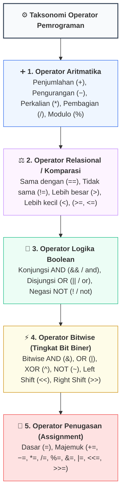
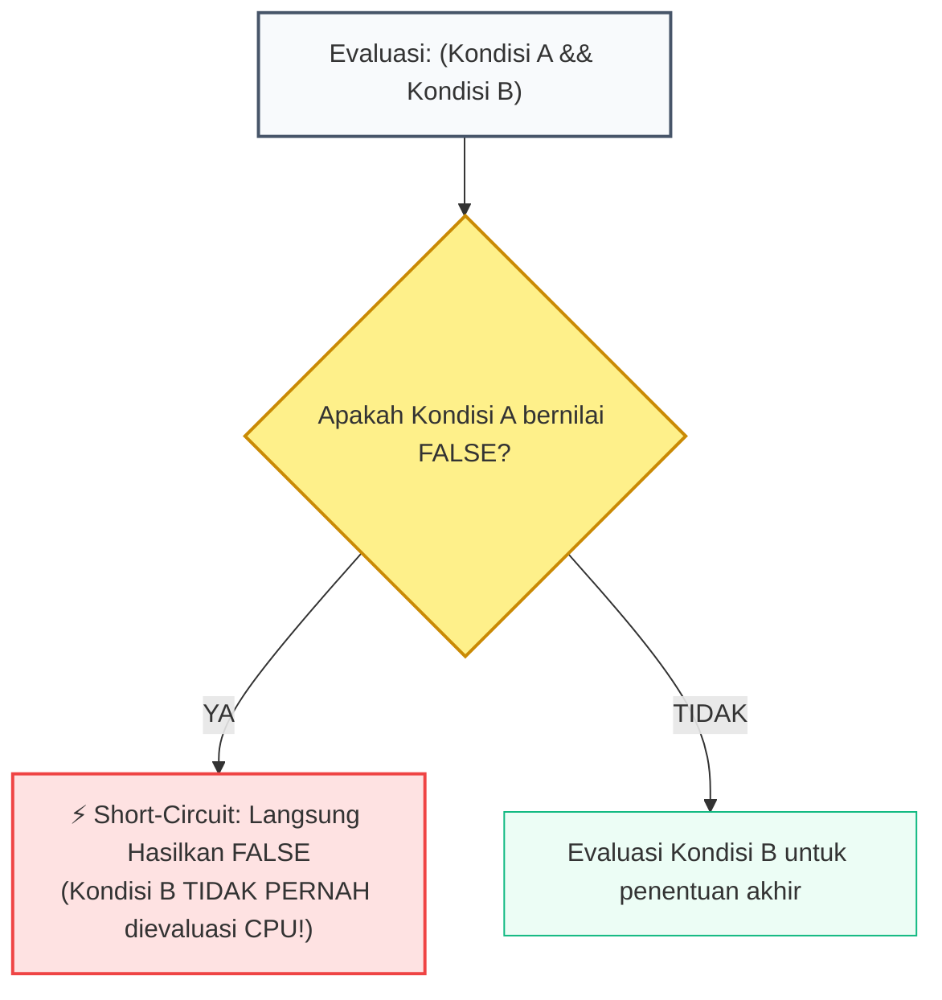

# 📘 Minggu 03: Operator, Aljabar Boolean & Manipulasi Bitwise

## 🎯 Capaian Pembelajaran (Sub-CPMK 2)
Setelah mempelajari modul ini, mahasiswa diharapkan mampu:
1. Memahami klasifikasi operator komputasi dan aturan **Hierarki Presedensi serta Asosiatif Operator**.
2. Menerapkan prinsip **Aljabar Boolean** dan **Hukum De Morgan** untuk merumuskan ekspresi logika yang efisien.
3. Menganalisis mekanisme **Evaluasi Sirkuit Pendek (*Short-Circuit Evaluation*)** untuk mencegah kesalahan fatal saat waktu eksekusi (*Runtime Crash*).
4. Mengoperasikan manipulasi tingkat rendah dengan **Operator Bitwise** dan teknik **Bitmasking**.
5. Mengimplementasikan kalkulasi ekspresi logika majemuk dan operasi bitwise menggunakan C++ dan Python 3.

---

## 1. Klasifikasi Operator Komputasi

Operator adalah simbol primitif yang menginstruksikan Unit Logika Aritmatika (*Arithmetic Logic Unit / ALU*) CPU untuk melakukan manipulasi matematis, relasional, atau bit biner terhadap satu atau lebih operan (*operand*):



---

## 2. Aljabar Boolean & Hukum De Morgan

Logika proposisi dalam pemrograman dibangun di atas fondasi Aljabar Boolean yang dirumuskan oleh George Boole (1854):

### Tabel Kebenaran Lengkap Operasi Logika

| Input A | Input B | A ∧ B (AND / `&&`) | A ∨ B (OR / `\|\|`) | A ⊕ B (XOR / `^`) | ¬A (NOT / `!`) |
| :---: | :---: | :---: | :---: | :---: | :---: |
| **`false` (0)** | **`false` (0)** | `false` (0) | `false` (0) | `false` (0) | `true` (1) |
| **`false` (0)** | **`true` (1)** | `false` (0) | `true` (1) | `true` (1) | `true` (1) |
| **`true` (1)** | **`false` (0)** | `false` (0) | `true` (1) | `true` (1) | `false` (0) |
| **`true` (1)** | **`true` (1)** | `true` (1) | `true` (1) | `false` (0) | `false` (0) |

::: info 📐 Formula: Hukum De Morgan (Penyederhanaan Logika Kompleks)
> **Hukum 1:** `!(A && B) == (!A || !B)`
>
> **Hukum 2:** `!(A || B) == (!A && !B)`
>
> *Penerapan Praktis:* Mempermudah negasi syarat filter data yang rumit agar lebih mudah dibaca dan dieksekusi CPU.
:::

---

## 3. Mekanisme Evaluasi Sirkuit Pendek (Short-Circuit Evaluation)

Dalam bahasa pemrograman modern (C++, Java, Python), evaluasi logika dikerjakan dari **kiri ke kanan** dan akan **berhenti seketika** jika hasil akhir sudah dapat dipastikan:



::: tip 💡 Pola Desain Kritis: Menghindari Runtime Crash dengan Short-Circuit
Gunakan *short-circuit* untuk memvalidasi keamanan pointer atau pembagian sebelum operasi berbahaya dieksekusi:
```cpp
// AMAN: Jika pembagi == 0, bagian kanan (total / pembagi > 50) TIDAK AKAN dieksekusi,
// sehingga terhindar dari Zero Division Crash!
if (pembagi != 0 && (total / pembagi) > 50) {
    cout << "Rata-rata memenuhi syarat." << endl;
}
```
:::

---

## 4. Hierarki Presedensi & Asosiatif Operator

Presedensi menentukan urutan operasi mana yang dihitung lebih dahulu ketika beberapa operator berada dalam satu baris ekspresi:

| Tingkat | Kategori Operator | Simbol Operator | Arah Asosiatif |
| :---: | :--- | :--- | :---: |
| **1 (Tertinggi)** | Tanda Kurung & Postfix | `()` `[]` `.` `->` `x++` `x--` | Kiri ke Kanan |
| **2** | Unary Prefix | `++x` `--x` `+` `-` `!` `~` `(type)` `sizeof` `&` (address) | Kanan ke Kiri |
| **3** | Multiplikasi | `*` `/` `%` | Kiri ke Kanan |
| **4** | Adisi & Subtraksi | `+` `-` | Kiri ke Kanan |
| **5** | Bitwise Shift | `<<` `>>` | Kiri ke Kanan |
| **6** | Relasional | `<` `<=` `>` `>=` | Kiri ke Kanan |
| **7** | Kesetaraan | `==` `!=` | Kiri ke Kanan |
| **8** | Bitwise AND | `&` | Kiri ke Kanan |
| **9** | Bitwise XOR | `^` | Kiri ke Kanan |
| **10** | Bitwise OR | `\|` | Kiri ke Kanan |
| **11** | Logika AND | `&&` | Kiri ke Kanan |
| **12** | Logika OR | `\|\|` | Kiri ke Kanan |
| **13** | Ternary Conditional | `? :` | Kanan ke Kiri |
| **14 (Terendah)** | Assignment | `=` `+=` `-=` `*=` `/=` `%=` `&=` `\|=` `<<=` `>>=` | Kanan ke Kiri |

::: warning ⚠️ Aturan Emas Keterbacaan Kode
Jangan bergantung pada hafalan hierarki presedensi yang rumit. **Gunakan selalu tanda kurung eksplisit `()`** untuk memperjelas maksud logika Anda dan mencegah ambiguitas bagi programmer lain.
:::

---

## 5. Manipulasi Bitwise & Teknik Bitmasking

Operator bitwise memanipulasi bit individual secara langsung pada tingkat register prosesor:

::: info 📐 Formula: Perkalian & Pembagian Kilat dengan Bit Shift
> **`x << k`** setara dengan mengalikan **`x × 2ᵏ`**
>
> **`x >> k`** setara dengan membagi bulat **`x ÷ 2ᵏ`**
>
> *Contoh:* `5 << 3` = 5 × 2³ = 5 × 8 = 40.
:::

### Empat Operasi Bitmasking Standar:
1. **Set Bit ke-k (Mengubah bit menjadi 1):** `angka = angka | (1 << k)`
2. **Clear Bit ke-k (Mengubah bit menjadi 0):** `angka = angka & ~(1 << k)`
3. **Toggle Bit ke-k (Membalik bit 0 ↔ 1):** `angka = angka ^ (1 << k)`
4. **Check Bit ke-k (Menguji status bit):** `bool status = (angka & (1 << k)) != 0`

---

## 6. Implementasi Kode Hands-on Dual-Stack (C++ & Python 3)

Berikut adalah kode praktikum yang mendemonstrasikan evaluasi sirkuit pendek, hierarki operator, dan teknik manipulasi bitmasking bendera status (*status flags*):

::: code-group
```cpp [C++]
#include <iostream>
#include <bitset>

using namespace std;

// Definisi Bitmasking Status Izin Akses Sistem (Flags)
const unsigned char PERM_READ    = 1 << 0; // 00000001 (1)
const unsigned char PERM_WRITE   = 1 << 1; // 00000010 (2)
const unsigned char PERM_EXECUTE = 1 << 2; // 00000100 (4)
const unsigned char PERM_DELETE  = 1 << 3; // 00001000 (8)

int main() {
    cout << "==================================================" << endl;
    cout << "   OPERATOR, BOOLEAN & BITMASKING (C++ STANDAR)   " << endl;
    cout << "==================================================" << endl;

    // 1. DEMONSTRASI SHORT-CIRCUIT EVALUATION
    int pembagi = 0;
    int total = 100;

    cout << "1. Uji Short-Circuit Evaluation:" << endl;
    if (pembagi != 0 && (total / pembagi) > 10) {
        cout << "Kondisi terpenuhi." << endl;
    } else {
        cout << "-> Evaluasi aman: Terhindar dari Zero Division Crash!" << endl;
    }

    // 2. DEMONSTRASI MANIPULASI BITMASKING
    cout << "\n2. Demonstrasi Bitmasking Izin Akses (Linux Style):" << endl;
    unsigned char userPerm = 0; // 00000000 (Belum ada izin)

    // Berikan Izin READ dan WRITE (Operasi OR |)
    userPerm = userPerm | PERM_READ | PERM_WRITE;
    cout << "Status Izin Awal (Read + Write) : " << bitset<8>(userPerm) << " (Nilai: " << (int)userPerm << ")" << endl;

    // Uji apakah user memiliki izin EXECUTE (Operasi AND &)
    bool canExecute = (userPerm & PERM_EXECUTE) != 0;
    cout << "Apakah memiliki izin EXECUTE?    : " << (canExecute ? "YA" : "TIDAK") << endl;

    // Tambahkan izin EXECUTE (Operasi OR |)
    userPerm |= PERM_EXECUTE;
    cout << "Setelah ditambah EXECUTE        : " << bitset<8>(userPerm) << endl;

    // Cabut izin WRITE (Operasi AND NOT &~)
    userPerm &= ~PERM_WRITE;
    cout << "Setelah izin WRITE dicabut      : " << bitset<8>(userPerm) << endl;

    // 3. OPERASI BIT SHIFT CEPAT
    cout << "\n3. Operasi Bit Shift Kilat:" << endl;
    int nilai = 7;
    cout << "7 << 2 (7 * 4) : " << (nilai << 2) << endl;
    cout << "32 >> 3 (32 / 8): " << (32 >> 3) << endl;
    cout << "==================================================" << endl;

    return 0;
}
```

```python [Python 3]
def main():
    print("=" * 50)
    print("   OPERATOR, BOOLEAN & BITMASKING (PYTHON 3)     ")
    print("=" * 50)

    # 1. DEMONSTRASI SHORT-CIRCUIT EVALUATION
    pembagi = 0
    total = 100

    print("1. Uji Short-Circuit Evaluation:")
    if pembagi != 0 and (total / pembagi) > 10:
        print("Kondisi terpenuhi.")
    else:
        print("-> Evaluasi aman: Terhindar dari ZeroDivisionError!")

    # 2. DEMONSTRASI BITMASKING
    PERM_READ    = 1 << 0  # 00000001 (1)
    PERM_WRITE   = 1 << 1  # 00000010 (2)
    PERM_EXECUTE = 1 << 2  # 00000100 (4)
    PERM_DELETE  = 1 << 3  # 00001000 (8)

    print("\n2. Demonstrasi Bitmasking Izin Akses:")
    user_perm = 0

    # Berikan Izin Read & Write
    user_perm = user_perm | PERM_READ | PERM_WRITE
    print(f"Status Izin Awal (Read + Write) : {user_perm:08b} (Nilai: {user_perm})")

    # Uji apakah memiliki izin Execute
    can_execute = (user_perm & PERM_EXECUTE) != 0
    print(f"Apakah memiliki izin EXECUTE?    : {'YA' if can_execute else 'TIDAK'}")

    # Tambahkan izin Execute
    user_perm |= PERM_EXECUTE
    print(f"Setelah ditambah EXECUTE        : {user_perm:08b}")

    # Cabut izin Write
    user_perm &= ~PERM_WRITE
    print(f"Setelah izin WRITE dicabut      : {user_perm:08b}")

    # 3. BIT SHIFT
    print("\n3. Operasi Bit Shift Kilat:")
    nilai = 7
    print(f"7 << 2 (7 * 4)  : {nilai << 2}")
    print(f"32 >> 3 (32 / 8): {32 >> 3}")
    print("=" * 50)

if __name__ == "__main__":
    main()
```
:::

---

## 7. Rangkuman & Latihan Mandiri

::: tip 💡 Rangkuman Konsep Kunci
1. **Aljabar Boolean:** Pahami hukum De Morgan untuk menyederhanakan ekspresi logika yang bertingkat.
2. **Short-Circuit:** Evaluasi berhenti saat hasil akhir sudah pasti. Manfaatkan ini untuk menyaring nilai error sebelum eksekusi berbahaya.
3. **Presedensi Operator:** Selalu sertakan tanda kurung `()` saat mencampur operasi aritmatika, relasional, dan logika dalam satu ekspresi.
4. **Bitmasking:** Manfaatkan operasi `|` untuk menyalakan bit, `& ~` untuk mematikan bit, dan `&` untuk memeriksa status bit secara efisien.
:::

### 📝 Tugas Praktikum 3 (Mandiri)
1. **Penerapan Hukum De Morgan:** Diberikan ekspresi logika: `!((nilai >= 75) && (kehadiran >= 80))`. Tuliskan bentuk ekuivalennya menggunakan Hukum De Morgan tanpa menggunakan tanda kurung luar.
2. **Kalkulasi Bitwise Manual:** Hitung secara manual hasil operasi bitwise berikut dalam biner 8-bit dan desimal:
   - `42 & 27`
   - `42 | 27`
   - `42 ^ 27`
   - `~42` (Two's complement 8-bit)
3. **Pengecekan Bilangan Pangkat Dua:** Rancang fungsi satu baris menggunakan operasi bitwise `(n & (n - 1)) == 0` untuk menentukan apakah suatu bilangan bulat positif n adalah bilangan berpangkat dua (2, 4, 8, 16, 32, ...). Jelaskan mengapa algoritma ini bekerja secara matematis!
