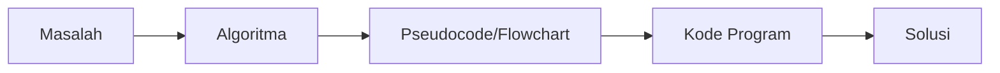

# Pengenalan Algoritma dan Pemrograman

## Apa itu Algoritma?

**Algoritma** adalah serangkaian langkah-langkah logis dan sistematis untuk menyelesaikan suatu masalah.

### Karakteristik Algoritma

1. **Input**: Memiliki nol atau lebih input
2. **Output**: Menghasilkan minimal satu output
3. **Definiteness**: Setiap langkah harus jelas dan tidak ambigu
4. **Finiteness**: Algoritma harus berakhir setelah sejumlah langkah
5. **Effectiveness**: Setiap langkah harus sederhana dan dapat dilakukan

## Contoh Algoritma Sederhana

### Algoritma Membuat Teh

```
1. Siapkan gelas
2. Masukkan teh celup ke dalam gelas
3. Panaskan air hingga mendidih
4. Tuangkan air panas ke dalam gelas
5. Tunggu 3-5 menit
6. Angkat teh celup
7. Tambahkan gula sesuai selera
8. Aduk hingga rata
9. Teh siap diminum
```

## Apa itu Pemrograman?

**Pemrograman** adalah proses menulis, menguji, dan memelihara kode program komputer menggunakan bahasa pemrograman tertentu.

### Bahasa Pemrograman

Bahasa pemrograman adalah bahasa formal yang digunakan untuk memberikan instruksi kepada komputer. Contoh:

- Python
- Java
- C++
- JavaScript
- C

## Hubungan Algoritma dan Pemrograman



1. **Masalah** → Identifikasi masalah yang akan diselesaikan
2. **Algoritma** → Rancang langkah-langkah penyelesaian
3. **Pseudocode/Flowchart** → Representasi algoritma
4. **Kode Program** → Implementasi dalam bahasa pemrograman
5. **Solusi** → Program yang menyelesaikan masalah

## Tahapan Pemrograman

### 1. Analisis Masalah

Memahami masalah yang akan diselesaikan:

- Apa input yang diperlukan?
- Apa output yang diharapkan?
- Apa proses yang diperlukan?

### 2. Perancangan Algoritma

Membuat langkah-langkah penyelesaian menggunakan:

- **Pseudocode**: Bahasa setengah formal
- **Flowchart**: Diagram alur

### 3. Implementasi

Menulis kode program dalam bahasa pemrograman

### 4. Testing

Menguji program dengan berbagai kasus

### 5. Dokumentasi

Membuat dokumentasi program

## Contoh: Menghitung Luas Persegi Panjang

### Algoritma

```
1. Mulai
2. Input panjang
3. Input lebar
4. Hitung luas = panjang × lebar
5. Tampilkan luas
6. Selesai
```

### Pseudocode

```
ALGORITHM LuasPersegiPanjang
    INPUT panjang
    INPUT lebar
    luas ← panjang * lebar
    OUTPUT luas
END ALGORITHM
```

### Implementasi (Python)

```python
# Program menghitung luas persegi panjang
panjang = float(input("Masukkan panjang: "))
lebar = float(input("Masukkan lebar: "))

luas = panjang * lebar

print(f"Luas persegi panjang: {luas}")
```

### Implementasi (C++)

```cpp
#include <iostream>
using namespace std;

int main() {
    float panjang, lebar, luas;

    cout << "Masukkan panjang: ";
    cin >> panjang;

    cout << "Masukkan lebar: ";
    cin >> lebar;

    luas = panjang * lebar;

    cout << "Luas persegi panjang: " << luas << endl;

    return 0;
}
```

## Latihan

1. Buatlah algoritma untuk menghitung luas lingkaran!
2. Buatlah algoritma untuk menentukan bilangan terbesar dari 3 bilangan!
3. Implementasikan algoritma nomor 1 dan 2 dalam bahasa pemrograman yang Anda kuasai!

## Rangkuman

- Algoritma adalah langkah-langkah logis untuk menyelesaikan masalah
- Pemrograman adalah implementasi algoritma dalam bahasa pemrograman
- Tahapan: Analisis → Perancangan → Implementasi → Testing → Dokumentasi
- Algoritma harus jelas, terbatas, dan efektif

---

**Selanjutnya**: [Variabel dan Tipe Data](./variabel-tipe-data.md)
