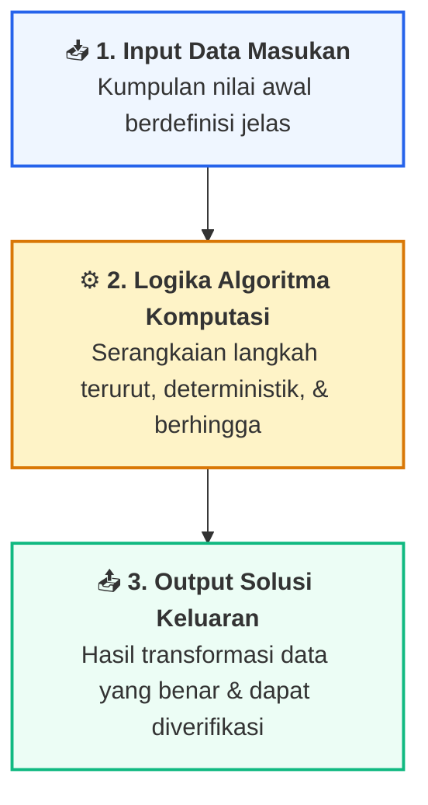
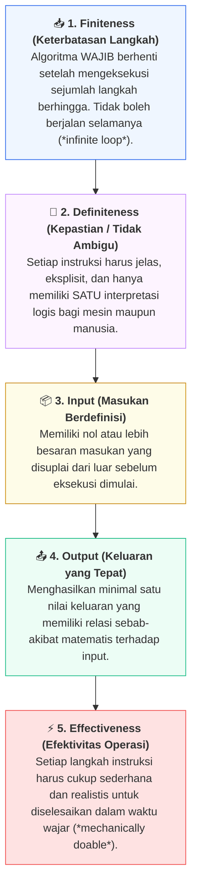
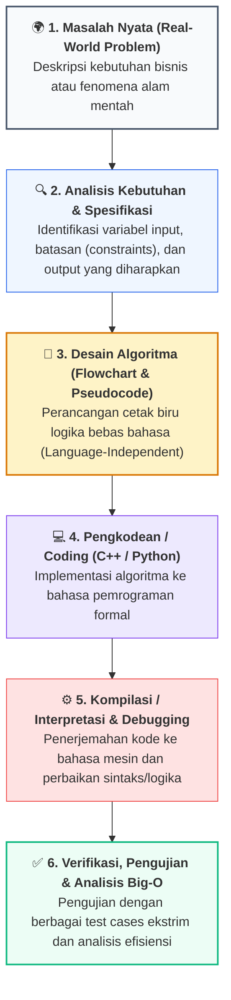
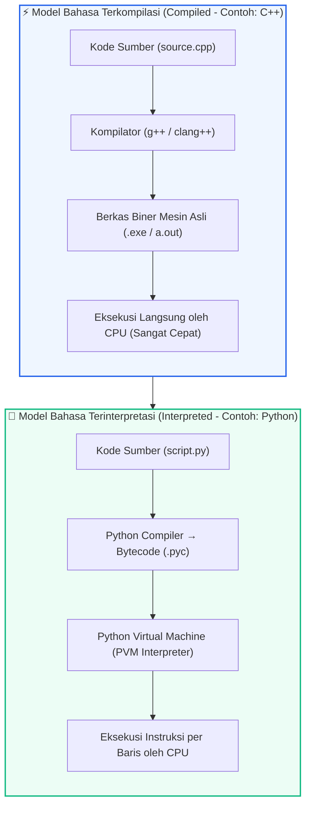

# 📘 Minggu 01: Pengenalan Algoritma, Logika Komputasi & Notasi Standar

## 🎯 Capaian Pembelajaran (Sub-CPMK 1)
Setelah mempelajari modul ini, mahasiswa diharapkan mampu:
1. Menjelaskan hakikat, definisi formal, dan landasan historis-epistemologis algoritma dalam sains komputasi.
2. Menganalisis dan menguji keterpenuhan **5 Karakteristik Fundamental Algoritma (Donald Knuth)** pada suatu rancangan solusi.
3. Membedakan secara analitis antara algoritma, struktur data, dan program komputer berdasarkan persamaan klasik Niklaus Wirth.
4. Merancang diagram alir formal (**Flowchart Standar ISO 5807**) dan **Pseudocode Terstruktur** untuk menyelesaikan masalah komputasi sekuensial.
5. Memahami perbedaan paradigma eksekusi bahasa pemrograman: Kompilasi (*Compiled Language - C++*) vs Interpretasi (*Interpreted Language - Python*).

---

## 1. Hakikat, Definisi & Landasan Epistemologi Algoritma

Kata **Algoritma** berakar dari nama ilmuwan Muslim terkemuka asal Khwarazm (Asia Tengah), **Abu Ja'far Muhammad bin Musa Al-Khwarizmi** (780–850 M), yang menulis kitab monumentalnya *Al-Kitāb al-mukhtaṣar fī ḥisāb al-jabr wal-muqābala*. Karya tersebut meletakkan dasar sistematis bagi aljabar dan algoritma aritmatika desimal di dunia.

Pada abad ke-19, **Ada Lovelace** (1815–1852) menulis algoritma pertama di dunia yang dirancang khusus untuk dijalankan pada mesin mekanik *Analytical Engine* karya Charles Babbage. Di era modern, **Alan Turing** (1912–1954) memformalkan konsep algoritma melalui model teoretis **Mesin Turing (*Turing Machine*)**, yang membuktikan batas komputasi universal.

::: info 📖 Definisi Formal Algoritma
Algoritma adalah sekumpulan instruksi terstruktur, logis, terurut, berhingga (*finite*), dan tidak bermakna ganda (*unambiguous*) yang menerima satu atau sekumpulan data masukan (*input*), memprosesnya melalui serangkaian tahapan komputasi, dan menghasilkan luaran (*output*) sebagai solusi atas suatu persoalan spesifik.
:::


```mermaid
flowchart TD
    A["📥 <b>1. Input Data Masukan</b><br>Kumpulan nilai awal berdefinisi jelas"]
    --> B["⚙️ <b>2. Logika Algoritma Komputasi</b><br>Serangkaian langkah terurut, deterministik, & berhingga"]
    --> C["📤 <b>3. Output Solusi Keluaran</b><br>Hasil transformasi data yang benar & dapat diverifikasi"]

    style A fill:#eff6ff,stroke:#2563eb,stroke-width:2px
    style B fill:#fef3c7,stroke:#d97706,stroke-width:2px
    style C fill:#ecfdf5,stroke:#10b981,stroke-width:2px
```

---

## 2. Lima Karakteristik Fundamental Algoritma (Donald Knuth)

Pakar ilmu komputer legendaris dari Stanford University, **Donald E. Knuth**, dalam mahakaryanya *The Art of Computer Programming*, menetapkan 5 kriteria mutlak yang wajib dipenuhi oleh sebuah prosedur agar dapat diklasifikasikan sebagai algoritma:


```mermaid
flowchart TD
    K1["📥 <b>1. Finiteness (Keterbatasan Langkah)</b><br>Algoritma WAJIB berhenti setelah mengeksekusi sejumlah langkah berhingga. Tidak boleh berjalan selamanya (*infinite loop*)."]
    --> K2["🎯 <b>2. Definiteness (Kepastian / Tidak Ambigu)</b><br>Setiap instruksi harus jelas, eksplisit, dan hanya memiliki SATU interpretasi logis bagi mesin maupun manusia."]
    --> K3["📦 <b>3. Input (Masukan Berdefinisi)</b><br>Memiliki nol atau lebih besaran masukan yang disuplai dari luar sebelum eksekusi dimulai."]
    --> K4["📤 <b>4. Output (Keluaran yang Tepat)</b><br>Menghasilkan minimal satu nilai keluaran yang memiliki relasi sebab-akibat matematis terhadap input."]
    --> K5["⚡ <b>5. Effectiveness (Efektivitas Operasi)</b><br>Setiap langkah instruksi harus cukup sederhana dan realistis untuk diselesaikan dalam waktu wajar (*mechanically doable*)."]

    style K1 fill:#eff6ff,stroke:#2563eb,stroke-width:1px
    style K2 fill:#fdf4ff,stroke:#c084fc,stroke-width:1px
    style K3 fill:#fefce8,stroke:#ca8a04,stroke-width:1px
    style K4 fill:#ecfdf5,stroke:#10b981,stroke-width:1px
    style K5 fill:#fee2e2,stroke:#ef4444,stroke-width:1px
```

| Karakteristik | Penjelasan Teknis & Aspek Verifikasi | Dampak Buruk Jika Dilanggar |
| :--- | :--- | :--- |
| **Finiteness** | Setiap cabang perulangan dan rekursi harus memiliki kondisi terminasi (*exit condition*). | Program mengalami *hang*, *freeze*, atau kehabisan memori (*Out of Memory*). |
| **Definiteness** | Menghindari instruksi ambigu seperti "tambahkan secukupnya" atau pembagian dengan nol. | Hasil tidak konsisten atau terjadi *runtime crash*. |
| **Input** | Domain dan tipe data masukan ditentukan secara presisi ($x \in \mathbb{R}, x \ge 0$). | Terjadi *unexpected behavior* saat menerima data anomali. |
| **Output** | Terdapat jaminan nilai kembalian (*return value*) atau perubahan status sistem. | Algoritma tidak memiliki nilai manfaat fungsional. |
| **Effectiveness** | Operasi aritmatika/logika dasar dapat dihitung secara eksak oleh ALU (*Arithmetic Logic Unit*). | Instruksi tidak dapat dieksekusi oleh mesin fisik. |

---

## 3. Hubungan Algoritma, Struktur Data, dan Program

Pada tahun 1976, ilmuwan komputer pencipta bahasa Pascal, **Niklaus Wirth**, mempublikasikan buku legendaris dengan judul yang merumuskan hakikat rekayasa perangkat lunak:

::: info 📐 Formula: Aksioma Niklaus Wirth
> **`Algorithms + Data Structures = Programs`**
>
> * **Struktur Data:** Cara pengorganisasian, penyimpanan, dan pengelolaan data di dalam memori komputer agar dapat diakses secara efisien.
> * **Algoritma:** Logika langkah-langkah komputasi yang memanipulasi struktur data tersebut untuk mencapai tujuan tertentu.
> * **Program:** Implementasi konkret dari algoritma dan struktur data yang ditulis dalam sintaks bahasa pemrograman spesifik agar dapat dieksekusi mesin.
:::

### Siklus Pemecahan Masalah Komputasi (*Problem Solving Lifecycle*)


```mermaid
flowchart TD
    P1["🌍 <b>1. Masalah Nyata (Real-World Problem)</b><br>Deskripsi kebutuhan bisnis atau fenomena alam mentah"]
    --> P2["🔍 <b>2. Analisis Kebutuhan & Spesifikasi</b><br>Identifikasi variabel input, batasan (constraints), dan output yang diharapkan"]
    --> P3["📐 <b>3. Desain Algoritma (Flowchart & Pseudocode)</b><br>Perancangan cetak biru logika bebas bahasa (Language-Independent)"]
    --> P4["💻 <b>4. Pengkodean / Coding (C++ / Python)</b><br>Implementasi algoritma ke bahasa pemrograman formal"]
    --> P5["⚙️ <b>5. Kompilasi / Interpretasi & Debugging</b><br>Penerjemahan kode ke bahasa mesin dan perbaikan sintaks/logika"]
    --> P6["✅ <b>6. Verifikasi, Pengujian & Analisis Big-O</b><br>Pengujian dengan berbagai test cases ekstrim dan analisis efisiensi"]

    style P1 fill:#f8fafc,stroke:#475569,stroke-width:2px
    style P2 fill:#eff6ff,stroke:#2563eb,stroke-width:1px
    style P3 fill:#fef3c7,stroke:#d97706,stroke-width:2px
    style P4 fill:#ede9fe,stroke:#7c3aed,stroke-width:1px
    style P5 fill:#fee2e2,stroke:#ef4444,stroke-width:1px
    style P6 fill:#ecfdf5,stroke:#10b981,stroke-width:2px
```

---

## 4. Notasi Representasi Algoritma Standar

Sebelum menulis baris kode, algoritma wajib didokumentasikan dalam notasi standar agar dapat direview, divalidasi, dan dikomunikasikan antar tim rekayasa:

### A. Diagram Alir (Flowchart Standar ISO 5807)

Flowchart menggunakan simbol-simbol geometris terstandarisasi secara internasional:

| Simbol Geometris | Nama Simbol ISO | Fungsi Standar dalam Alur Program |
| :---: | :--- | :--- |
| ⬭ | **Terminator (Oval)** | Titik awal (*Start/Begin*) dan titik akhir (*End/Stop*) dari algoritma. |
| ▱ | **Data / I-O (Jajaran Genjang)** | Operasi pembacaan data masukan (*Input*) atau pencetakan hasil (*Output*). |
| ▭ | **Process (Persegi Panjang)** | Operasi pemrosesan aritmatika, kalkulasi, manipulasi data, atau inisialisasi variabel. |
| ◇ | **Decision (Belah Ketupat)** | Titik evaluasi kondisi logika bercabang (*True/False* atau *Yes/No*). |
| ⬡ | **Preparation (Heksagon)** | Inisialisasi awal nilai variabel counter perulangan (*loop setup*). |
| ◯ | **Connector (Lingkaran)** | Penghubung alur diagram pada satu halaman yang sama. |
| 🠗 | **Flowline (Garis Berpanah)** | Menunjukkan arah pasti dari aliran instruksi eksekusi. |

#### Contoh Kasus: Flowchart Algoritma Penentuan Tarif Parkir

```mermaid
flowchart TD
    Start([🟢 Mulai / Start])
    --> InputJam[/Input: Jam_Masuk, Jam_Keluar/]
    --> HitungDurasi[Durasi = Jam_Keluar − Jam_Masuk]
    --> CekDurasi{Apakah Durasi ≤ 2 Jam?}
    
    CekDurasi -- Ya --> TarifDasar[Biaya = 5000]
    CekDurasi -- Tidak --> TarifLanjut[Biaya = 5000 + (Durasi − 2) × 3000]
    
    TarifDasar --> Tampil[/Tampilkan: Biaya Parkir/]
    TarifLanjut --> Tampil
    Tampil --> End([🔴 Selesai / End])

    style Start fill:#dcfce7,stroke:#16a34a,stroke-width:2px
    style End fill:#fee2e2,stroke:#ef4444,stroke-width:2px
    style InputJam fill:#e0f2fe,stroke:#0284c7,stroke-width:1px
    style HitungDurasi fill:#fef3c7,stroke:#d97706,stroke-width:1px
    style CekDurasi fill:#fef08a,stroke:#ca8a04,stroke-width:2px
    style TarifDasar fill:#f1f5f9,stroke:#64748b,stroke-width:1px
    style TarifLanjut fill:#f1f5f9,stroke:#64748b,stroke-width:1px
    style Tampil fill:#e0f2fe,stroke:#0284c7,stroke-width:1px
```

---

### B. Notasi Teks Formal (Pseudocode Standar)

Pseudocode adalah representasi teks informal berstruktur tinggi yang menyerupai bahasa pemrograman tanpa terikat aturan sintaksis yang kaku. Format standar terdiri dari 3 blok:

```text
PROGRAM HitungTarifParkir
{ Program untuk menghitung total biaya parkir kendaraan bermotor }

DEKLARASI:
    jamMasuk, jamKeluar, durasi : integer
    biayaTotal                  : integer

ALGORITMA:
    read(jamMasuk, jamKeluar)
    durasi <- jamKeluar - jamMasuk
    
    if durasi <= 2 then
        biayaTotal <- 5000
    else
        biayaTotal <- 5000 + (durasi - 2) * 3000
    endif
    
    write("Total Biaya Parkir: Rp ", biayaTotal)
```

---

## 5. Paradigma Bahasa Pemrograman: Kompilasi vs Interpretasi


```mermaid
flowchart TD
    subgraph Kompilasi["⚡ Model Bahasa Terkompilasi (Compiled - Contoh: C++)"]
        direction TB
        SrcC["Kode Sumber (source.cpp)"]
        --> Compiler["Kompilator (g++ / clang++)"]
        --> Bin["Berkas Biner Mesin Asli (.exe / a.out)"]
        --> CPU1["Eksekusi Langsung oleh CPU (Sangat Cepat)"]
    end

    subgraph Interpretasi["🐍 Model Bahasa Terinterpretasi (Interpreted - Contoh: Python)"]
        direction TB
        SrcPy["Kode Sumber (script.py)"]
        --> Bytecode["Python Compiler → Bytecode (.pyc)"]
        --> PVM["Python Virtual Machine (PVM Interpreter)"]
        --> CPU2["Eksekusi Instruksi per Baris oleh CPU"]
    end

    Kompilasi --> Interpretasi

    style Kompilasi fill:#eff6ff,stroke:#2563eb,stroke-width:2px
    style Interpretasi fill:#ecfdf5,stroke:#10b981,stroke-width:2px
```

| Dimensi Komparasi | C++ (Compiled Ahead-of-Time) | Python (Interpreted / Bytecode PVM) |
| :--- | :--- | :--- |
| **Kecepatan Eksekusi** | Sangat cepat (diterjemahkan langsung ke bahasa mesin). | Lebih lambat karena ada layer virtual machine. |
| **Manajemen Memori** | Manual / Eksplisit (Pointer, Stack, Heap). | Otomatis melalui *Garbage Collection (GC)*. |
| **Pengecekan Tipe Data** | Statis (*Static Typing*) saat waktu kompilasi. | Dinamis (*Dynamic Typing*) saat waktu eksekusi. |
| **Portabilitas Biner** | Biner mesin terikat arsitektur OS/CPU tertentu. | Kode sumber dapat dijalankan di OS mana pun yang memiliki PVM. |

---

## 6. Contoh Implementasi Dual-Stack (C++ & Python 3)

Berikut adalah implementasi program komputasi sekuensial konversi suhu dari **Celcius** ke **Fahrenheit**, **Reamur**, dan **Kelvin** lengkap dengan validasi titik nol mutlak ($0\text{ Kelvin} = -273.15^\circ\text{C}$):

::: code-group
```cpp [C++]
#include <iostream>
#include <iomanip>

using namespace std;

int main() {
    cout << "==================================================" << endl;
    cout << "  PROGRAM KONVERSI SUHU MULTI-SKALA (C++ STANDAR) " << endl;
    cout << "==================================================" << endl;

    double celcius;
    cout << "Masukkan suhu dalam derajat Celcius (°C): ";
    if (!(cin >> celcius)) {
        cerr << "[ERROR] Masukan harus berupa angka numerik valid!" << endl;
        return 1;
    }

    // Validasi Fisika: Batas Nol Mutlak (-273.15 °C)
    if (celcius < -273.15) {
        cerr << "[ERROR] Suhu tidak boleh lebih rendah dari Nol Mutlak (-273.15 °C)!" << endl;
        return 1;
    }

    // Perhitungan Rumus Fisika Termodinamika
    double fahrenheit = (9.0 / 5.0 * celcius) + 32.0;
    double reamur     = 4.0 / 5.0 * celcius;
    double kelvin     = celcius + 273.15;

    // Output Hasil dengan Format Presisi 2 Digit Desimal
    cout << fixed << setprecision(2);
    cout << "\n--- HASIL KONVERSI SUHU ---" << endl;
    cout << "Suhu Celcius    : " << celcius << " °C" << endl;
    cout << "Suhu Fahrenheit : " << fahrenheit << " °F" << endl;
    cout << "Suhu Reamur     : " << reamur << " °R" << endl;
    cout << "Suhu Kelvin     : " << kelvin << " K" << endl;
    cout << "==================================================" << endl;

    return 0;
}
```

```python [Python 3]
import sys

def main():
    print("=" * 50)
    print("  PROGRAM KONVERSI SUHU MULTI-SKALA (PYTHON 3)   ")
    print("=" * 50)

    try:
        raw_input_val = input("Masukkan suhu dalam derajat Celcius (°C): ")
        celcius = float(raw_input_val)
    except ValueError:
        print("[ERROR] Masukan harus berupa angka numerik valid!", file=sys.stderr)
        sys.exit(1)

    # Validasi Fisika: Batas Nol Mutlak (-273.15 °C)
    if celcius < -273.15:
        print("[ERROR] Suhu tidak boleh lebih rendah dari Nol Mutlak (-273.15 °C)!", file=sys.stderr)
        sys.exit(1)

    # Perhitungan Rumus Fisika Termodinamika
    fahrenheit = (9.0 / 5.0 * celcius) + 32.0
    reamur = 4.0 / 5.0 * celcius
    kelvin = celcius + 273.15

    # Output Hasil
    print("\n--- HASIL KONVERSI SUHU ---")
    print(f"Suhu Celcius    : {celcius:.2f} °C")
    print(f"Suhu Fahrenheit : {fahrenheit:.2f} °F")
    print(f"Suhu Reamur     : {reamur:.2f} °R")
    print(f"Suhu Kelvin     : {kelvin:.2f} K")
    print("=" * 50)

if __name__ == "__main__":
    main()
```
:::

---

## 7. Rangkuman & Latihan Mandiri

::: tip 💡 Rangkuman Konsep Kunci
1. **Definisi:** Algoritma adalah urutan langkah logis, terdefinisi, dan terbatas untuk mentransformasikan input menjadi output.
2. **Karakteristik Knuth:** Wajib memenuhi *Finiteness, Definiteness, Input, Output,* dan *Effectiveness*.
3. **Dokumentasi Formal:** Gunakan Flowchart ISO 5807 untuk representasi spasial grafis, dan Pseudocode untuk representasi tekstual.
4. **Kompilasi vs Interpretasi:** C++ mengoptimalkan efisiensi eksekusi biner langsung di CPU, sedangkan Python mengutamakan produktivitas dan portabilitas.
:::

### 📝 Tugas Praktikum 1 (Mandiri)
1. **Analisis Kriteria Donald Knuth:** Sebuah resep masakan menuliskan instruksi: *"Goreng bumbu hingga harum dan masukkan garam secukupnya."* Jelaskan mengapa instruksi tersebut melanggar kriteria *Definiteness* dan bagaimana cara mengubahnya menjadi instruksi algoritmik yang valid.
2. **Perancangan Flowchart & Pseudocode:** Buatlah Flowchart dan Pseudocode untuk menghitung nilai Indeks Massa Tubuh (BMI):
   > **`BMI = Berat Badan (kg) ÷ (Tinggi Badan (m))²`**
   
   Lengkap dengan penentuan kategori: Kurang (< 18.5), Normal (18.5–24.9), Berlebih (25.0–29.9), dan Obesitas (≥ 30.0).
3. **Hands-on Coding:** Implementasikan solusi BMI tersebut ke dalam bahasa C++ dan Python 3 dengan menyertakan penanganan masukan invalid (misal: tinggi badan ≤ 0).
