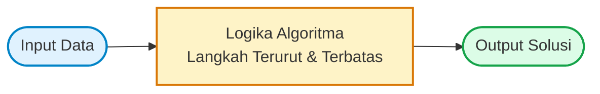
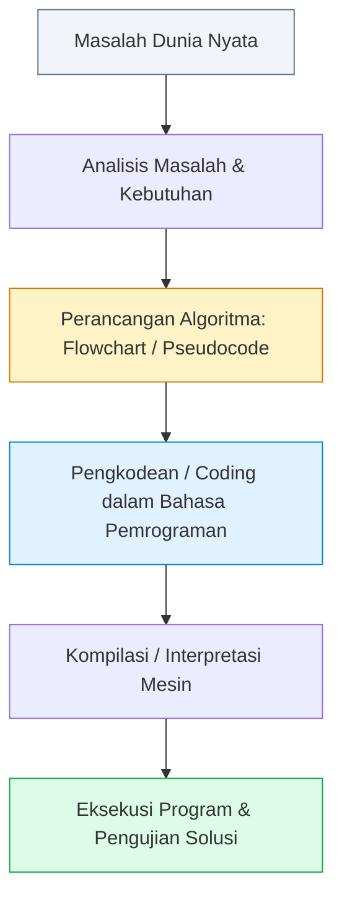
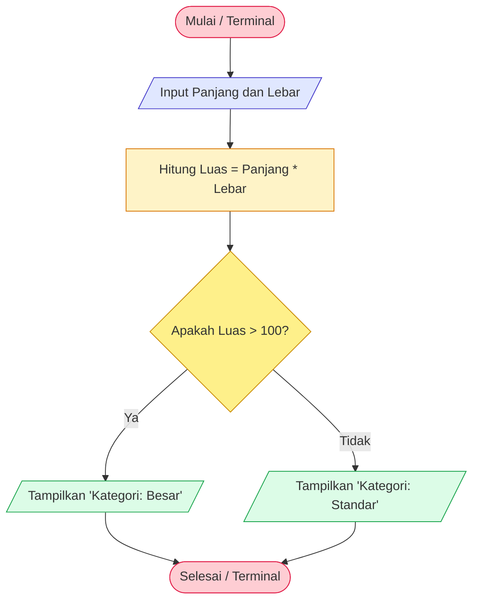

# Minggu 1: Pengenalan Algoritma dan Notasi Standar

::: tip CAPAIAN PEMBELAJARAN (SUB-CPMK 1)
- **CPMK Terkait:** CPMK0106 (Konsep Matematika Dasar Informatika & Logika Algoritma)
- **CPL Terkait:** CPL01 (Pengetahuan Dasar Informatika), CPL03 (Problem Solving Dinamis)
- **Indikator:** Mahasiswa mampu menguraikan definisi dan karakteristik algoritma standar, membedakan algoritma dengan program, serta merancang representasi flowchart ISO dan pseudocode terstruktur untuk menyelesaikan persoalan komputasi sekuensial.
:::

---

## 1. Hakikat dan Definisi Algoritma

Kata **Algoritma** berakar dari nama ilmuwan Muslim terkemuka asal Persia, **Abu Ja'far Muhammad bin Musa Al-Khwarizmi** (sekitar 780–850 M), yang menulis kitab legendaris *Al-Jabr wa-al-Muqabala*. Dalam konteks ilmu komputer modern, algoritma didefinisikan sebagai:

> **Definisi Formal:**  
> Algoritma adalah urutan langkah-langkah logis, terbatas (*finite*), dan tidak ambigu (*unambiguous*) yang disusun secara sistematis untuk memproses sekumpulan masukan (*input*) menjadi luaran (*output*) yang menyelesaikan permasalahan komputasi tertentu.


```mermaid
graph LR
    Input([Input Data]) --> Proses[Logika Algoritma<br>Langkah Terurut & Terbatas]
    Proses --> Output([Output Solusi])
    style Input fill:#e0f2fe,stroke:#0284c7,stroke-width:2px;
    style Proses fill:#fef3c7,stroke:#d97706,stroke-width:2px;
    style Output fill:#dcfce7,stroke:#16a34a,stroke-width:2px;
```

---

## 2. Lima Karakteristik Fundamental Algoritma (Donald Knuth)

Menurut pakar ilmu komputer **Donald E. Knuth** dalam mahakaryanya *The Art of Computer Programming*, sebuah algoritma wajib memenuhi 5 kriteria dasar berikut:

| Karakteristik | Penjelasan Teknis | Konsekuensi Jika Dilanggar |
| :--- | :--- | :--- |
| **1. Input (Masukan)** | Memiliki nol atau lebih nilai besaran yang diberikan dari luar sebelum algoritma dieksekusi. | Program tidak memiliki data untuk diproses. |
| **2. Output (Keluaran)** | Menghasilkan minimal satu besaran nilai yang memiliki relasi logis dengan masukan. | Algoritma tidak memiliki kegunaan nyata (*useless*). |
| **3. Definiteness (Kepastian)** | Setiap instruksi harus jelas, eksplisit, dan tidak memiliki makna ganda (*non-ambiguous*). | Terjadi kesalahan interpretasi logika saat dieksekusi. |
| **4. Finiteness (Keterbatasan)** | Algoritma **harus berhenti** setelah melakukan sejumlah langkah instruksi yang berhingga. | Program mengalami *infinite loop* (gagal berhenti). |
| **5. Effectiveness (Efektivitas)** | Setiap langkah harus sederhana, wajar, dan dapat dikerjakan oleh mesin dalam waktu terbatas. | Komputasi menjadi tidak realistis secara sumber daya. |

---

## 3. Perbedaan Algoritma dan Program

Sering kali terjadi kerancuan antara konsep algoritma dan program komputer. Hubungan keduanya dirumuskan dalam persamaan klasik oleh Niklaus Wirth:

$$\text{Algorithms} + \text{Data Structures} = \text{Programs}$$


```mermaid
graph TD
    A[Masalah Dunia Nyata] --> B[Analisis Masalah & Kebutuhan]
    B --> C[Perancangan Algoritma: Flowchart / Pseudocode]
    C --> D[Pengkodean / Coding dalam Bahasa Pemrograman]
    D --> E[Kompilasi / Interpretasi Mesin]
    E --> F[Eksekusi Program & Pengujian Solusi]
    style A fill:#f1f5f9,stroke:#64748b
    style C fill:#fef3c7,stroke:#d97706
    style D fill:#e0f2fe,stroke:#0284c7
    style F fill:#dcfce7,stroke:#16a34a
```

| Dimensi | Algoritma | Program Komputer |
| :--- | :--- | :--- |
| **Bentuk** | Desain konseptual / cetak biru logika. | Teks kode sumber konkret (*source code*). |
| **Keterikatan Bahasa** | Independen (bebas dari sintaks bahasa apa pun). | Dependen (terikat aturan sintaks Python, C++, Java, dll). |
| **Eksekusi** | Dianalisis secara manual oleh manusia / trace table. | Diterjemahkan oleh compiler/interpreter dan dieksekusi CPU. |
| **Fokus Utama** | Efisiensi dan kebenaran alur logika. | Implementasi sintaks, tipe data, dan manajemen memori. |

---

## 4. Notasi Representasi Algoritma

Terdapat dua notasi standar yang diakui secara internasional untuk mendokumentasikan algoritma sebelum tahap penulisan kode:

### A. Diagram Alir (Flowchart Standar ISO 5807)

Flowchart menggunakan simbol-simbol grafis terstandar untuk memvisualisasikan arah aliran instruksi:


```mermaid
flowchart TD
    Start([Mulai / Terminal]) --> Input[/Input Panjang dan Lebar/]
    Input --> Process[Hitung Luas = Panjang * Lebar]
    Process --> Decision{Apakah Luas > 100?}
    Decision -- Ya --> Out1[/Tampilkan 'Kategori: Besar'/]
    Decision -- Tidak --> Out2[/Tampilkan 'Kategori: Standar'/]
    Out1 --> End([Selesai / Terminal])
    Out2 --> End
    style Start fill:#fecdd3,stroke:#e11d48
    style End fill:#fecdd3,stroke:#e11d48
    style Input fill:#e0e7ff,stroke:#4338ca
    style Process fill:#fef3c7,stroke:#d97706
    style Decision fill:#fef08a,stroke:#ca8a04
    style Out1 fill:#dcfce7,stroke:#16a34a
    style Out2 fill:#dcfce7,stroke:#16a34a
```

### B. Notasi Teks Formal (Pseudocode)

Pseudocode adalah bahasa tiruan pemrograman yang menyerupai bahasa manusia terstruktur tanpa aturan kompilator yang ketat:

```pascal
ALGORITMA HitungLuasPersegiPanjang
{ Menghitung luas persegi panjang dan menentukan kategorinya }

DEKLARASI:
    panjang : real
    lebar   : real
    luas    : real

DESKRIPSI:
    read(panjang)
    read(lebar)
    
    luas <- panjang * lebar
    write("Luas Persegi Panjang = ", luas)
    
    IF luas > 100 THEN
        write("Kategori: Besar")
    ELSE
        write("Kategori: Standar")
    ENDIF
SELESAI
```

---

## 5. Implementasi Multi-Bahasa

Berikut perbandingan implementasi algoritma di atas dalam bahasa **Python** dan **C++**:

::: code-group
```python [Python 3]
# Program Hitung Luas Persegi Panjang
def main():
    panjang = float(input("Masukkan panjang: "))
    lebar = float(input("Masukkan lebar: "))
    
    luas = panjang * lebar
    print(f"Luas Persegi Panjang: {luas:.2f}")
    
    if luas > 100:
        print("Kategori: Besar")
    else:
        print("Kategori: Standar")

if __name__ == "__main__":
    main()
```

```cpp [C++]
#include <iostream>
#include <iomanip>
using namespace std;

int main() {
    double panjang, lebar, luas;
    
    cout << "Masukkan panjang: ";
    cin >> panjang;
    cout << "Masukkan lebar: ";
    cin >> lebar;
    
    luas = panjang * lebar;
    cout << fixed << setprecision(2);
    cout << "Luas Persegi Panjang: " << luas << endl;
    
    if (luas > 100) {
        cout << "Kategori: Besar" << endl;
    } else {
        cout << "Kategori: Standar" << endl;
    }
    
    return 0;
}
```
:::

---

## 📝 Evaluasi & Latihan Mandiri (Sub-CPMK 1)

1. **Analisis Masalah:** Buatlah flowchart dan pseudocode untuk mengonversi suhu dari Celcius ke Fahrenheit ($F = \frac{9}{5}C + 32$) dan Reamur ($R = \frac{4}{5}C$).
2. **Karakteristik Knuth:** Jelaskan apa yang terjadi jika sebuah algoritma tidak memenuhi syarat *finiteness* saat diimplementasikan ke dalam program perbankan!
3. **Studi Kasus Logika:** Rancang algoritma untuk menentukan apakah sebuah bilangan bulat positif yang dimasukkan pengguna merupakan bilangan genap atau bilangan ganjil.
