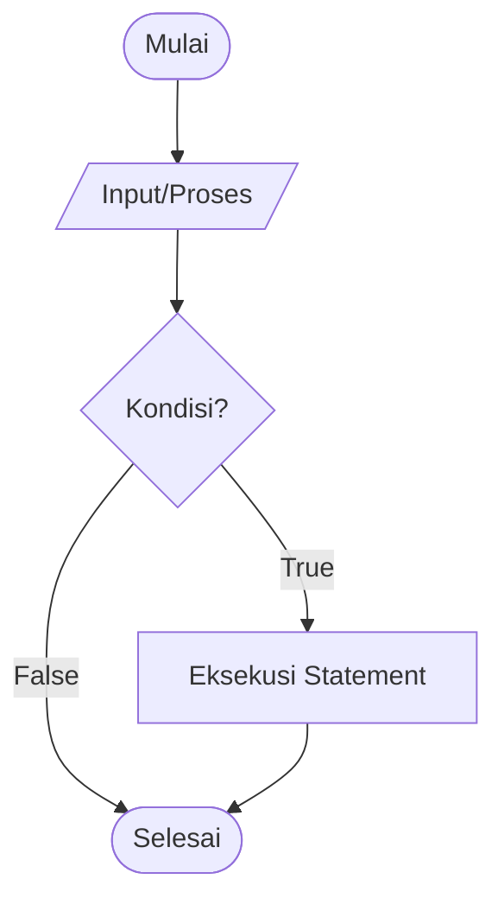
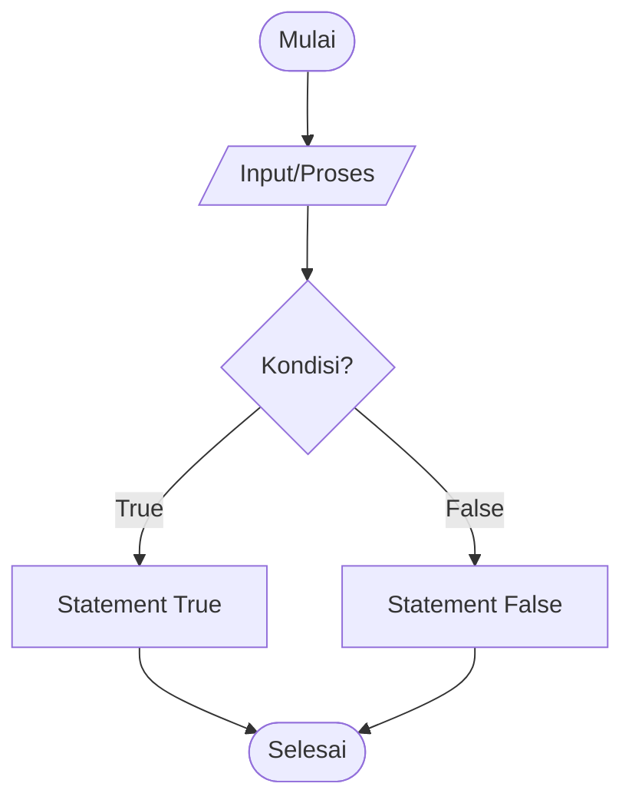
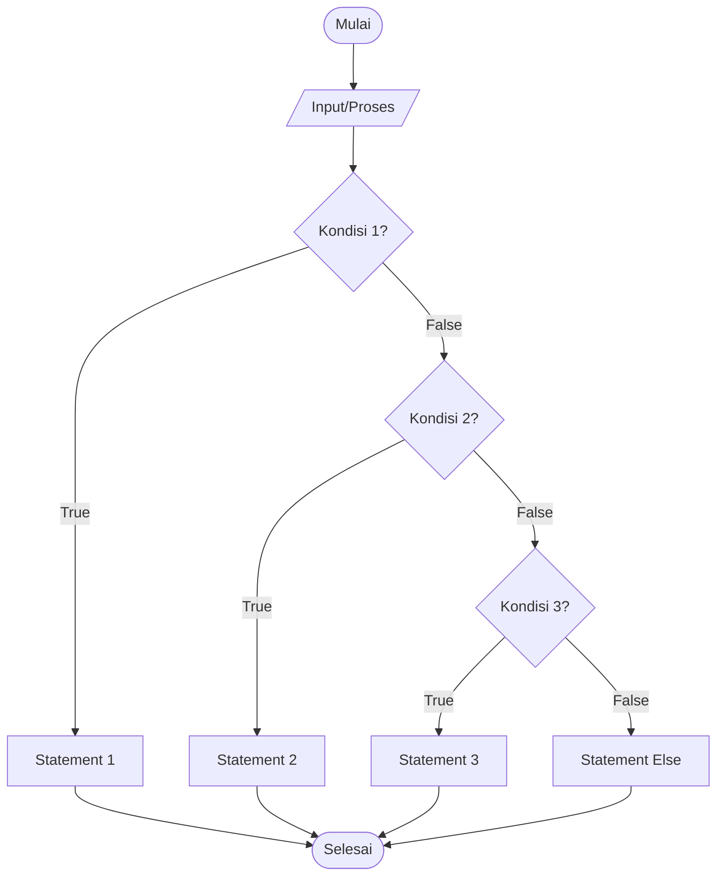
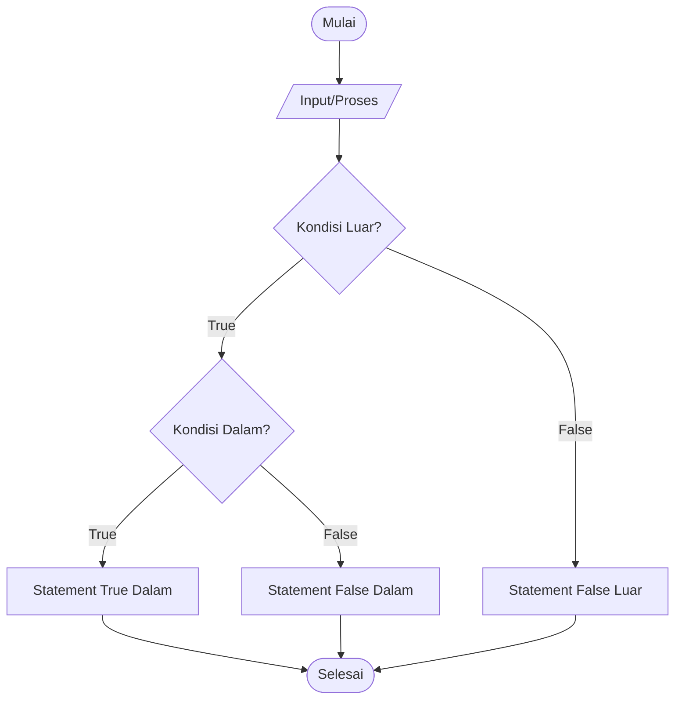
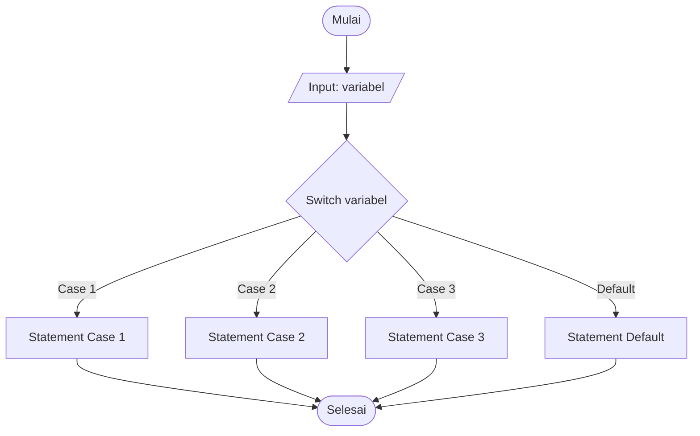

# Percabangan (Conditional Statement)

## Apa itu Percabangan?

**Percabangan** adalah struktur kontrol yang memungkinkan program untuk memilih jalur eksekusi yang berbeda berdasarkan kondisi tertentu.

## Flowchart Percabangan

### Flowchart If Statement



### Flowchart If-Else Statement



### Flowchart If-Elif-Else Statement



### Flowchart Nested If



## Jenis-Jenis Percabangan

### 1. If Statement

Menjalankan blok kode jika kondisi bernilai True.

#### Syntax Python

```python
if kondisi:
    # kode yang dijalankan jika kondisi True
    statement
```

#### Syntax C++

```cpp
if (kondisi) {
    // kode yang dijalankan jika kondisi True
    statement;
}
```

#### Contoh

```python
# Python
umur = 18

if umur >= 17:
    print("Anda sudah boleh memiliki SIM")
```

```cpp
// C++
int umur = 18;

if (umur >= 17) {
    cout << "Anda sudah boleh memiliki SIM" << endl;
}
```

### 2. If-Else Statement

Menjalankan blok kode berbeda berdasarkan kondisi True atau False.

#### Syntax Python

```python
if kondisi:
    # kode jika kondisi True
else:
    # kode jika kondisi False
```

#### Contoh

```python
# Python
nilai = 75

if nilai >= 60:
    print("LULUS")
else:
    print("TIDAK LULUS")
```

```cpp
// C++
int nilai = 75;

if (nilai >= 60) {
    cout << "LULUS" << endl;
} else {
    cout << "TIDAK LULUS" << endl;
}
```

### 3. If-Elif-Else Statement (Python) / If-Else If-Else (C++)

Menangani lebih dari dua kondisi.

#### Syntax Python

```python
if kondisi1:
    # kode jika kondisi1 True
elif kondisi2:
    # kode jika kondisi2 True
elif kondisi3:
    # kode jika kondisi3 True
else:
    # kode jika semua kondisi False
```

#### Syntax C++

```cpp
if (kondisi1) {
    // kode jika kondisi1 True
} else if (kondisi2) {
    // kode jika kondisi2 True
} else if (kondisi3) {
    // kode jika kondisi3 True
} else {
    // kode jika semua kondisi False
}
```

#### Contoh: Konversi Nilai ke Grade

```python
# Python
nilai = 85

if nilai >= 85:
    grade = 'A'
elif nilai >= 70:
    grade = 'B'
elif nilai >= 60:
    grade = 'C'
elif nilai >= 50:
    grade = 'D'
else:
    grade = 'E'

print(f"Nilai: {nilai}")
print(f"Grade: {grade}")
```

```cpp
// C++
int nilai = 85;
char grade;

if (nilai >= 85) {
    grade = 'A';
} else if (nilai >= 70) {
    grade = 'B';
} else if (nilai >= 60) {
    grade = 'C';
} else if (nilai >= 50) {
    grade = 'D';
} else {
    grade = 'E';
}

cout << "Nilai: " << nilai << endl;
cout << "Grade: " << grade << endl;
```

### 4. Nested If (If Bersarang)

If statement di dalam if statement lainnya.

```python
# Python
nilai = 85
kehadiran = 90

if nilai >= 60:
    if kehadiran >= 75:
        print("LULUS")
    else:
        print("TIDAK LULUS - Kehadiran kurang")
else:
    print("TIDAK LULUS - Nilai kurang")
```

```cpp
// C++
int nilai = 85;
int kehadiran = 90;

if (nilai >= 60) {
    if (kehadiran >= 75) {
        cout << "LULUS" << endl;
    } else {
        cout << "TIDAK LULUS - Kehadiran kurang" << endl;
    }
} else {
    cout << "TIDAK LULUS - Nilai kurang" << endl;
}
```

### 5. Switch-Case Statement

Alternatif untuk if-elif-else ketika membandingkan satu variabel dengan banyak nilai.

#### Flowchart Switch-Case



#### Syntax C++

```cpp
switch (variabel) {
    case nilai1:
        // kode untuk nilai1
        break;
    case nilai2:
        // kode untuk nilai2
        break;
    default:
        // kode jika tidak ada case yang cocok
}
```

#### Contoh: Menu Pilihan

```cpp
// C++
#include <iostream>
using namespace std;

int main() {
    int pilihan;

    cout << "=== MENU ===" << endl;
    cout << "1. Tambah Data" << endl;
    cout << "2. Edit Data" << endl;
    cout << "3. Hapus Data" << endl;
    cout << "4. Lihat Data" << endl;
    cout << "Pilih menu (1-4): ";
    cin >> pilihan;

    switch (pilihan) {
        case 1:
            cout << "Anda memilih: Tambah Data" << endl;
            break;
        case 2:
            cout << "Anda memilih: Edit Data" << endl;
            break;
        case 3:
            cout << "Anda memilih: Hapus Data" << endl;
            break;
        case 4:
            cout << "Anda memilih: Lihat Data" << endl;
            break;
        default:
            cout << "Pilihan tidak valid!" << endl;
    }

    return 0;
}
```

#### Python (Menggunakan Match-Case - Python 3.10+)

```python
# Python 3.10+
pilihan = 2

match pilihan:
    case 1:
        print("Anda memilih: Tambah Data")
    case 2:
        print("Anda memilih: Edit Data")
    case 3:
        print("Anda memilih: Hapus Data")
    case 4:
        print("Anda memilih: Lihat Data")
    case _:
        print("Pilihan tidak valid!")
```

### 6. Ternary Operator (Conditional Expression)

Bentuk singkat dari if-else untuk assignment sederhana.

#### Python

```python
# Syntax: nilai_jika_true if kondisi else nilai_jika_false

umur = 18
status = "Dewasa" if umur >= 17 else "Anak-anak"
print(status)  # Output: Dewasa

# Contoh lain
nilai = 85
keterangan = "LULUS" if nilai >= 60 else "TIDAK LULUS"
```

#### C++

```cpp
// Syntax: kondisi ? nilai_jika_true : nilai_jika_false

int umur = 18;
string status = (umur >= 17) ? "Dewasa" : "Anak-anak";
cout << status << endl;  // Output: Dewasa

// Contoh lain
int nilai = 85;
string keterangan = (nilai >= 60) ? "LULUS" : "TIDAK LULUS";
```

## Studi Kasus Lengkap

### Kasus 1: Sistem Login Sederhana

```python
# Python
def login():
    username_benar = "admin"
    password_benar = "12345"

    print("=== SISTEM LOGIN ===")
    username = input("Username: ")
    password = input("Password: ")

    if username == username_benar and password == password_benar:
        print("Login berhasil! Selamat datang, Admin!")
    elif username == username_benar:
        print("Login gagal! Password salah.")
    elif password == password_benar:
        print("Login gagal! Username salah.")
    else:
        print("Login gagal! Username dan password salah.")

login()
```

### Kasus 2: Kalkulator BMI (Body Mass Index)

```python
# Python
def hitung_bmi():
    print("=== KALKULATOR BMI ===")

    berat = float(input("Masukkan berat badan (kg): "))
    tinggi = float(input("Masukkan tinggi badan (m): "))

    # Hitung BMI
    bmi = berat / (tinggi ** 2)

    # Tentukan kategori
    if bmi < 18.5:
        kategori = "Kurus"
        saran = "Anda perlu menambah berat badan"
    elif bmi < 25:
        kategori = "Normal"
        saran = "Berat badan Anda ideal"
    elif bmi < 30:
        kategori = "Gemuk"
        saran = "Anda perlu mengurangi berat badan"
    else:
        kategori = "Obesitas"
        saran = "Segera konsultasi dengan dokter"

    print(f"\nHasil:")
    print(f"BMI: {bmi:.2f}")
    print(f"Kategori: {kategori}")
    print(f"Saran: {saran}")

hitung_bmi()
```

### Kasus 3: Sistem Penilaian dengan Kriteria Lengkap

```cpp
// C++
#include <iostream>
#include <string>
using namespace std;

int main() {
    string nama;
    float nilai_tugas, nilai_uts, nilai_uas, nilai_akhir;
    int kehadiran;
    char grade;
    string status;

    cout << "=== SISTEM PENILAIAN ===" << endl;
    cout << "Nama Mahasiswa: ";
    getline(cin, nama);

    cout << "Nilai Tugas (0-100): ";
    cin >> nilai_tugas;

    cout << "Nilai UTS (0-100): ";
    cin >> nilai_uts;

    cout << "Nilai UAS (0-100): ";
    cin >> nilai_uas;

    cout << "Persentase Kehadiran (0-100): ";
    cin >> kehadiran;

    // Hitung nilai akhir
    nilai_akhir = (nilai_tugas * 0.3) + (nilai_uts * 0.3) + (nilai_uas * 0.4);

    // Tentukan grade
    if (nilai_akhir >= 85) {
        grade = 'A';
    } else if (nilai_akhir >= 70) {
        grade = 'B';
    } else if (nilai_akhir >= 60) {
        grade = 'C';
    } else if (nilai_akhir >= 50) {
        grade = 'D';
    } else {
        grade = 'E';
    }

    // Tentukan status kelulusan
    if (nilai_akhir >= 60 && kehadiran >= 75) {
        status = "LULUS";
    } else if (nilai_akhir < 60 && kehadiran < 75) {
        status = "TIDAK LULUS (Nilai dan kehadiran kurang)";
    } else if (nilai_akhir < 60) {
        status = "TIDAK LULUS (Nilai kurang)";
    } else {
        status = "TIDAK LULUS (Kehadiran kurang)";
    }

    // Output hasil
    cout << "\n=== HASIL PENILAIAN ===" << endl;
    cout << "Nama: " << nama << endl;
    cout << "Nilai Akhir: " << nilai_akhir << endl;
    cout << "Grade: " << grade << endl;
    cout << "Kehadiran: " << kehadiran << "%" << endl;
    cout << "Status: " << status << endl;

    return 0;
}
```

### Kasus 4: Cek Kelayakan Kredit

```python
# Python
def cek_kelayakan_kredit():
    print("=== CEK KELAYAKAN KREDIT ===")

    gaji = float(input("Gaji per bulan (Rp): "))
    umur = int(input("Umur: "))
    riwayat_kredit = input("Riwayat kredit baik? (ya/tidak): ").lower()

    # Kriteria kelayakan
    gaji_minimum = 5000000
    umur_minimum = 21
    umur_maksimum = 60

    # Cek kelayakan
    if umur < umur_minimum:
        print("\nMAAF, umur Anda belum memenuhi syarat (minimal 21 tahun)")
    elif umur > umur_maksimum:
        print("\nMAAF, umur Anda melebihi batas maksimal (maksimal 60 tahun)")
    elif gaji < gaji_minimum:
        print(f"\nMAAF, gaji Anda kurang dari minimum (Rp {gaji_minimum:,.0f})")
    elif riwayat_kredit != "ya":
        print("\nMAAF, riwayat kredit Anda belum memenuhi syarat")
    else:
        # Tentukan limit kredit berdasarkan gaji
        if gaji >= 15000000:
            limit = gaji * 5
            kategori = "Platinum"
        elif gaji >= 10000000:
            limit = gaji * 4
            kategori = "Gold"
        else:
            limit = gaji * 3
            kategori = "Silver"

        print("\n✓ SELAMAT! Anda memenuhi syarat kredit")
        print(f"Kategori: {kategori}")
        print(f"Limit Kredit: Rp {limit:,.0f}")

cek_kelayakan_kredit()
```

## Tips dan Best Practice

### 1. Hindari Nested If yang Terlalu Dalam

```python
# ❌ BURUK - Sulit dibaca
if kondisi1:
    if kondisi2:
        if kondisi3:
            if kondisi4:
                # kode

# ✅ BAIK - Gunakan operator logika
if kondisi1 and kondisi2 and kondisi3 and kondisi4:
    # kode
```

### 2. Urutan Kondisi dari yang Paling Spesifik

```python
# ✅ BENAR
if nilai >= 85:
    grade = 'A'
elif nilai >= 70:
    grade = 'B'

# ❌ SALAH - Tidak akan pernah mencapai kondisi kedua
if nilai >= 70:
    grade = 'B'
elif nilai >= 85:
    grade = 'A'
```

### 3. Gunakan Switch untuk Banyak Nilai Diskrit

```cpp
// Lebih baik gunakan switch daripada banyak if-else
// untuk nilai diskrit yang banyak
switch (hari) {
    case 1: cout << "Senin"; break;
    case 2: cout << "Selasa"; break;
    // dst...
}
```

## Latihan

1. **Program Cek Bilangan**

   - Input: sebuah bilangan
   - Output: Bilangan tersebut genap/ganjil, positif/negatif/nol

2. **Program Diskon Toko**

   - Aturan:
     - Total < Rp 100.000: tidak ada diskon
     - Rp 100.000 - Rp 500.000: diskon 10%
     - > Rp 500.000: diskon 20%
   - Jika member: tambah diskon 5%

3. **Program Cek Hari**

   - Input: nomor hari (1-7)
   - Output: nama hari dan kategori (weekday/weekend)

4. **Program Parkir**

   - Tarif:
     - Motor: Rp 2.000/jam
     - Mobil: Rp 5.000/jam
   - Jika parkir lebih dari 5 jam, gratis

5. **Program Kalkulator Pajak**
   - Penghasilan < Rp 5 juta: 0%
   - Rp 5 juta - Rp 10 juta: 5%
   - Rp 10 juta - Rp 20 juta: 15%
   - > Rp 20 juta: 25%

## Rangkuman

- **If**: Eksekusi jika kondisi True
- **If-Else**: Pilihan antara dua kemungkinan
- **If-Elif-Else**: Pilihan lebih dari dua kemungkinan
- **Nested If**: If di dalam if
- **Switch-Case**: Alternatif untuk banyak kondisi diskrit
- **Ternary Operator**: Bentuk singkat if-else
- Perhatikan urutan kondisi dari yang paling spesifik
- Hindari nested if yang terlalu dalam

---

**Sebelumnya**: [Operator](./operator.md) | **Selanjutnya**: [Perulangan](./perulangan.md)
