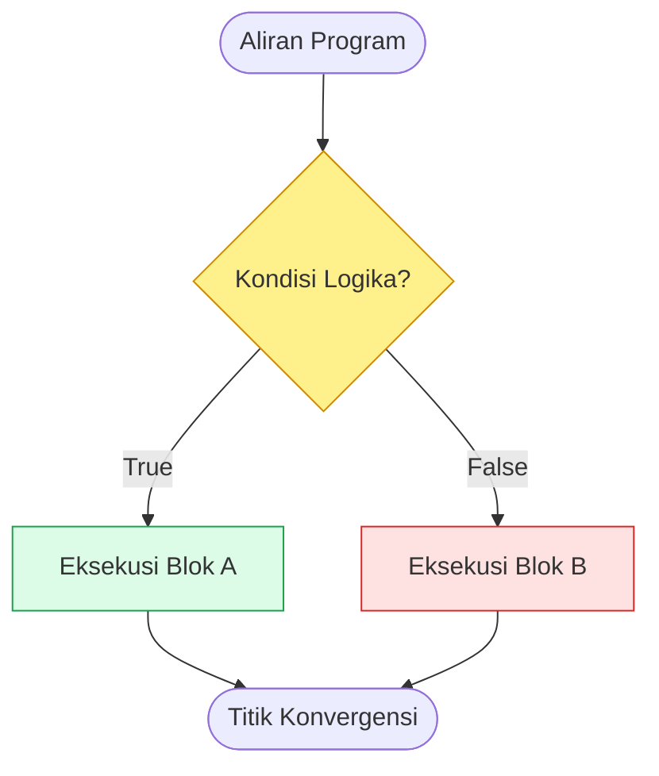

# Minggu 4: Struktur Kontrol Percabangan (Branching)

::: tip CAPAIAN PEMBELAJARAN (SUB-CPMK 3)
- **CPMK Terkait:** CPMK0101 (Konsep Dasar Pemrograman), CPMK0106 (Logika Algoritma)
- **CPL Terkait:** CPL01 (Pengetahuan Dasar), CPL03 (Problem Solving), CPL04 (Solusi Rekayasa)
- **Indikator:** Mahasiswa mampu menganalisis alur eksekusi kondisional, merancang diagram alur percabangan tunggal, ganda, majemuk (`if-else-if`), percabangan bersarang (*nested-if*), struktur pemilihan `switch-case`, serta operator ternary untuk menyelesaikan kasus logika komputasi.
:::

---

## 1. Hakikat Struktur Percabangan

Dalam pemrograman sekuensial, instruksi dieksekusi secara berurutan baris demi baris. Namun, persoalan nyata menuntut program untuk mengambil **keputusan logis** berdasarkan kondisi tertentu. **Struktur percabangan** (*decision-making / selection structure*) mengalihkan arah aliran eksekusi program ke blok kode tertentu apabila suatu kondisi bernilai `true`, atau ke blok lain apabila bernilai `false`.


```mermaid
flowchart TD
    Start([Aliran Program]) --> Cond{Kondisi Logika?}
    Cond -- True --> ActionA[Eksekusi Blok A]
    Cond -- False --> ActionB[Eksekusi Blok B]
    ActionA --> Join([Titik Konvergensi])
    ActionB --> Join
    style Cond fill:#fef08a,stroke:#ca8a04
    style ActionA fill:#dcfce7,stroke:#16a34a
    style ActionB fill:#fee2e2,stroke:#dc2626
```

---

## 2. Pola-Pola Struktur Percabangan

### A. Percabangan Tunggal (`if`)
Mengeksekusi blok kode hanya jika kondisi bernilai `true`. Jika `false`, instruksi dilewati.

### B. Percabangan Ganda (`if-else`)
Memilih salah satu dari dua alternatif tindakan berdasarkan hasil evaluasi kondisi.

### C. Percabangan Majemuk (`if-else-if-else`)
Mengevaluasi serangkaian kondisi secara berurutan (*cascade*). Kondisi pertama yang bernilai `true` akan dieksekusi, dan sisa kondisi lainnya diabaikan.

### D. Percabangan Bersarang (*Nested If*)
Struktur `if` yang berada di dalam blok `if` lainnya, digunakan saat sebuah keputusan bergantung pada prasyarat keputusan sebelumnya.

### E. Struktur Pemilihan Multi-Kondisi (`switch-case`)
Digunakan saat membandingkan satu variabel diskrit (integer, char, enum) dengan banyak konstanta nilai yang spesifik.

---

## 3. Studi Kasus Komprehensif: Sistem Konversi Nilai Mutu OBE

Berikut implementasi konversi nilai angka ke huruf mutu standar Universitas Ubudiyah Indonesia:

::: code-group
```cpp [C++]
#include <iostream>
#include <iomanip>
#include <string>
using namespace std;

int main() {
    double nilaiAkhir;
    cout << "=========================================" << endl;
    cout << "  SISTEM KONVERSI NILAI MUTU AKADEMIK    " << endl;
    cout << "=========================================" << endl;
    cout << "Masukkan Nilai Akhir Mahasiswa (0-100): ";
    cin >> nilaiAkhir;

    // Validasi Rentang Input
    if (nilaiAkhir < 0.0 || nilaiAkhir > 100.0) {
        cout << "[ERROR] Nilai harus berada dalam rentang 0.00 s.d. 100.00!" << endl;
        return 1;
    }

    string grade;
    double bobot;
    string keterangan;

    // Percabangan Majemuk
    if (nilaiAkhir >= 85.0) {
        grade = "A";   bobot = 4.00; keterangan = "Istimewa / Sangat Kompeten";
    } else if (nilaiAkhir >= 80.0) {
        grade = "A-";  bobot = 3.75; keterangan = "Sangat Baik";
    } else if (nilaiAkhir >= 75.0) {
        grade = "B+";  bobot = 3.50; keterangan = "Baik Sekali";
    } else if (nilaiAkhir >= 70.0) {
        grade = "B";   bobot = 3.00; keterangan = "Baik / Kompeten";
    } else if (nilaiAkhir >= 65.0) {
        grade = "B-";  bobot = 2.75; keterangan = "Cukup Baik";
    } else if (nilaiAkhir >= 60.0) {
        grade = "C+";  bobot = 2.50; keterangan = "Cukup";
    } else if (nilaiAkhir >= 55.0) {
        grade = "C";   bobot = 2.00; keterangan = "Lulus Minimum";
    } else if (nilaiAkhir >= 45.0) {
        grade = "D";   bobot = 1.00; keterangan = "Kurang (Wajib Mengulang)";
    } else {
        grade = "E";   bobot = 0.00; keterangan = "Gagal / Tidak Lulus";
    }

    cout << fixed << setprecision(2);
    cout << "\nHASIL EVALUASI:" << endl;
    cout << "Nilai Angka : " << nilaiAkhir << endl;
    cout << "Huruf Mutu  : " << grade << " (Bobot: " << bobot << ")" << endl;
    cout << "Kualifikasi : " << keterangan << endl;

    return 0;
}
```

```python [Python 3]
def konversi_nilai(nilai: float):
    if not (0.0 <= nilai <= 100.0):
        print("[ERROR] Nilai harus berada dalam rentang 0.00 s.d. 100.00!")
        return

    if nilai >= 85.0:
        grade, bobot, ket = "A", 4.00, "Istimewa / Sangat Kompeten"
    elif nilai >= 80.0:
        grade, bobot, ket = "A-", 3.75, "Sangat Baik"
    elif nilai >= 75.0:
        grade, bobot, ket = "B+", 3.50, "Baik Sekali"
    elif nilai >= 70.0:
        grade, bobot, ket = "B", 3.00, "Baik / Kompeten"
    elif nilai >= 65.0:
        grade, bobot, ket = "B-", 2.75, "Cukup Baik"
    elif nilai >= 60.0:
        grade, bobot, ket = "C+", 2.50, "Cukup"
    elif nilai >= 55.0:
        grade, bobot, ket = "C", 2.00, "Lulus Minimum"
    elif nilai >= 45.0:
        grade, bobot, ket = "D", 1.00, "Kurang (Wajib Mengulang)"
    else:
        grade, bobot, ket = "E", 0.00, "Gagal / Tidak Lulus"

    print(f"\nHASIL EVALUASI:")
    print(f"Nilai Angka : {nilai:.2f}")
    print(f"Huruf Mutu  : {grade} (Bobot: {bobot:.2f})")
    print(f"Kualifikasi : {ket}")

if __name__ == "__main__":
    skor = float(input("Masukkan Nilai Akhir Mahasiswa (0-100): "))
    konversi_nilai(skor)
```
:::

---

## 4. Struktur Pemilihan `switch-case`

`switch-case` ideal untuk menu berbasis angka atau karakter:

```cpp
switch (pilihanMenu) {
    case 1:
        hitungLuasSegitiga();
        break; // Mencegah fall-through ke case berikutnya
    case 2:
        hitungLuasLingkaran();
        break;
    case 3:
        hitungLuasPersegi();
        break;
    default:
        cout << "Pilihan menu tidak valid!" << endl;
        break;
}
```

---

## 📝 Evaluasi & Latihan Mandiri (Sub-CPMK 3)

1. Rancanglah flowchart dan program untuk menghitung tarif tagihan listrik PLN rumah tangga berdasarkan golongan daya dan pemakaian kWh bertingkat.
2. Buatlah program kalkulator sederhana menggunakan struktur `switch-case` yang mendukung operasi penjumlahan (`+`), pengurangan (`-`), perkalian (`*`), pembagian (`/`), dan modulo (`%`).
