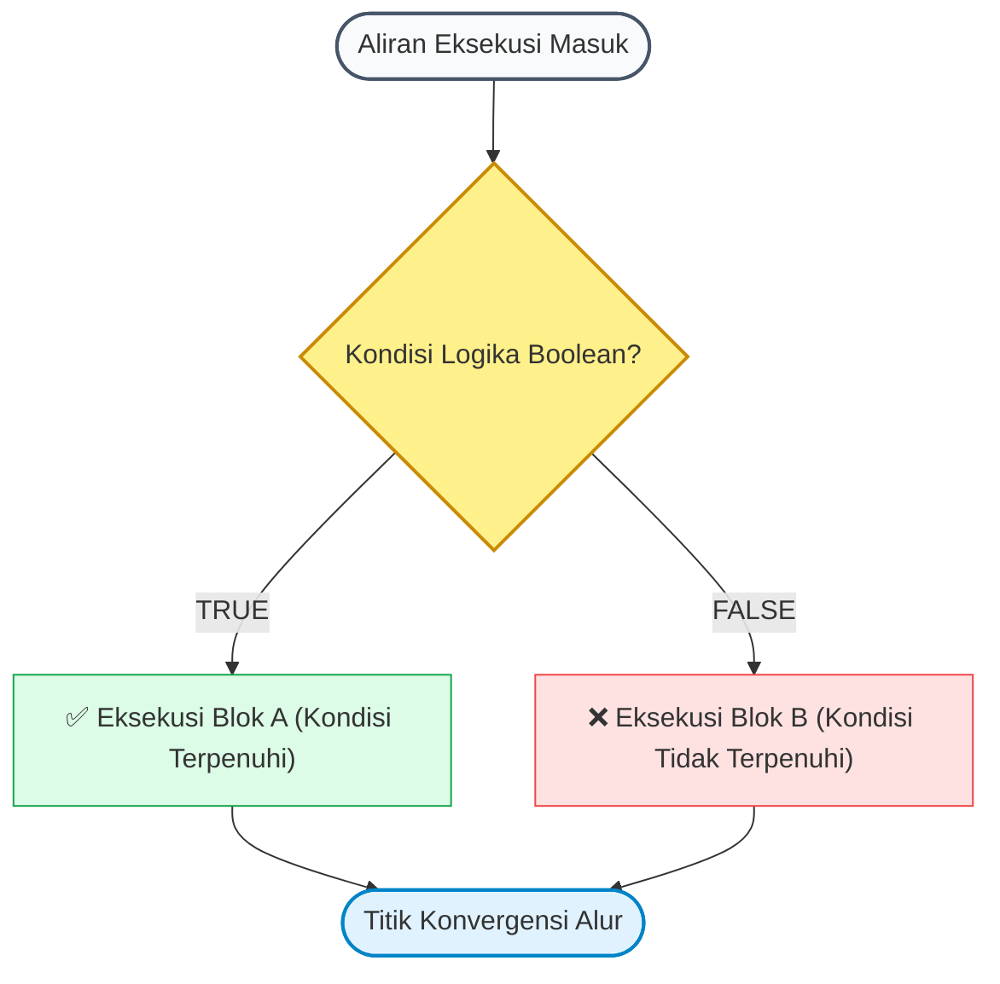
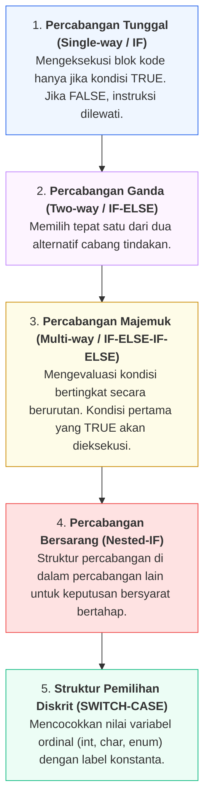
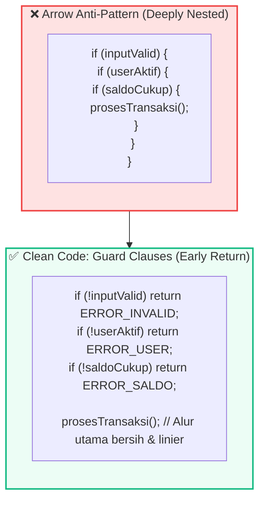

# 📘 Minggu 04: Struktur Kontrol Percabangan & Defensive Programming

## 🎯 Capaian Pembelajaran (Sub-CPMK 3)
Setelah mempelajari modul ini, mahasiswa diharapkan mampu:
1. Memahami landasan teoritis struktur kontrol seleksi berdasarkan **Teorema Böhm-Jacopini**.
2. Merancang dan mengimplementasikan seluruh pola percabangan: **Tunggal (`if`)**, **Ganda (`if-else`)**, **Majemuk (`if-else-if`)**, **Bersarang (*Nested-If*)**, dan **`switch-case`**.
3. Menyelesaikan ambiguitas logika klasik: **The Dangling Else Problem**.
4. Menganalisis optimasi tingkat kompilator: **Jump Table pada `switch-case`** vs **Linear Evaluation pada `if-else-if`**.
5. Menerapkan pola **Defensive Programming & Guard Clauses** untuk mengeliminasi piramida kode bersarang (*Arrow Anti-Pattern*).

---

## 1. Teorema Struktur Program Böhm-Jacopini

Pada tahun 1966, dua ilmuwan komputer **Corrado Böhm** dan **Giuseppe Jacopini** membuktikan sebuah teorema fundamental dalam ilmu komputer:

::: info 📐 Teorema Böhm-Jacopini
Setiap fungsi komputasi yang dapat dihitung (*computable function*) dapat diekspresikan hanya menggunakan **3 struktur kontrol dasar**:
1. **Sequence (Sekuensial):** Eksekusi instruksi berurutan satu per satu.
2. **Selection / Branching (Percabangan):** Pemilihan alur eksekusi berdasarkan kondisi boolean.
3. **Iteration / Looping (Perulangan):** Eksekusi blok instruksi berulang selama kondisi terpenuhi.
:::


```mermaid
flowchart TD
    Start([Aliran Eksekusi Masuk])
    --> Cond{Kondisi Logika Boolean?}
    Cond -- TRUE --> ActionA["✅ Eksekusi Blok A (Kondisi Terpenuhi)"]
    Cond -- FALSE --> ActionB["❌ Eksekusi Blok B (Kondisi Tidak Terpenuhi)"]
    ActionA --> Join([Titik Konvergensi Alur])
    ActionB --> Join

    style Start fill:#f8fafc,stroke:#475569,stroke-width:2px
    style Cond fill:#fef08a,stroke:#ca8a04,stroke-width:2px
    style ActionA fill:#dcfce7,stroke:#16a34a,stroke-width:1px
    style ActionB fill:#fee2e2,stroke:#ef4444,stroke-width:1px
    style Join fill:#e0f2fe,stroke:#0284c7,stroke-width:2px
```

---

## 2. Pola-Pola Struktur Percabangan


```mermaid
flowchart TD
    P1["1. <b>Percabangan Tunggal (Single-way / IF)</b><br>Mengeksekusi blok kode hanya jika kondisi TRUE. Jika FALSE, instruksi dilewati."]
    --> P2["2. <b>Percabangan Ganda (Two-way / IF-ELSE)</b><br>Memilih tepat satu dari dua alternatif cabang tindakan."]
    --> P3["3. <b>Percabangan Majemuk (Multi-way / IF-ELSE-IF-ELSE)</b><br>Mengevaluasi kondisi bertingkat secara berurutan. Kondisi pertama yang TRUE akan dieksekusi."]
    --> P4["4. <b>Percabangan Bersarang (Nested-IF)</b><br>Struktur percabangan di dalam percabangan lain untuk keputusan bersyarat bertahap."]
    --> P5["5. <b>Struktur Pemilihan Diskrit (SWITCH-CASE)</b><br>Mencocokkan nilai variabel ordinal (int, char, enum) dengan label konstanta."]

    style P1 fill:#eff6ff,stroke:#2563eb,stroke-width:1px
    style P2 fill:#fdf4ff,stroke:#c084fc,stroke-width:1px
    style P3 fill:#fefce8,stroke:#ca8a04,stroke-width:1px
    style P4 fill:#fee2e2,stroke:#ef4444,stroke-width:1px
    style P5 fill:#ecfdf5,stroke:#10b981,stroke-width:1px
```

### A. The Dangling Else Problem
Ambiguitas terjadi saat ada pernyataan `if` bersarang tanpa kurung kurawal `{}` yang jelas:
```cpp
// AMBIGU: Kepada IF manakah ELSE ini terikat?
if (x > 0)
    if (y > 0)
        cout << "X dan Y Positif";
else
    cout << "Apakah X <= 0 atau Y <= 0?";
```
* **Aturan Kompilator (C/C++/Java):** Klausa `else` selalu terikat pada `if` terdekat yang belum memiliki pasangan.
* **Solusi Wajib:** Selalu gunakan tanda kurung kurawal `{}` secara eksplisit!

---

## 3. Komparasi Kinerja: `switch-case` vs `if-else-if`

| Dimensi Komparasi | `if-else-if` Bertingkat | `switch-case` Pemilihan |
| :--- | :--- | :--- |
| **Karakteristik Kondisi** | Ekspresi boolean arbitrer (`x > 10 && y < 5`, nilai `float`, rentang). | Hanya nilai konstanta diskrit integral (`int`, `char`, `enum`). |
| **Mekanisme Eksekusi Mesin** | Linear Search: Memeriksa kondisi satu per satu dari atas ke bawah (`O(n)`). | **Jump Table / Binary Decision Tree (`O(1)`)**: CPU langsung melompat ke alamat memori instruksi terkait. |
| **Kecepatan pada Banyak Kasus (> 5)** | Melambat seiring bertambahnya jumlah cabang. | Sangat konsisten dan cepat berkat optimasi tabel lompatan (*Jump Table*). |
| **Pernyataan `break`** | Tidak dibutuhkan. | **Wajib disertakan** untuk mencegah *fallthrough* (eksekusi bocor ke case bawahnya). |

---

## 4. Pola Desain: Guard Clauses vs Piramida Kode

Pola bersarang yang terlalu dalam (*Deeply Nested Code*) menciptakan *Arrow Anti-Pattern* yang sulit dibaca dan rentan bug. Praktik *Clean Code* menganjurkan teknik **Guard Clauses (Early Return)**:


```mermaid
flowchart TD
    subgraph AntiPattern["❌ Arrow Anti-Pattern (Deeply Nested)"]
        direction TB
        A1["if (inputValid) {<br>&nbsp;&nbsp;if (userAktif) {<br>&nbsp;&nbsp;&nbsp;&nbsp;if (saldoCukup) {<br>&nbsp;&nbsp;&nbsp;&nbsp;&nbsp;&nbsp;prosesTransaksi();<br>&nbsp;&nbsp;&nbsp;&nbsp;}<br>&nbsp;&nbsp;}<br>}"]
    end

    subgraph GuardClause["✅ Clean Code: Guard Clauses (Early Return)"]
        direction TB
        G1["if (!inputValid) return ERROR_INVALID;<br>if (!userAktif) return ERROR_USER;<br>if (!saldoCukup) return ERROR_SALDO;<br><br>prosesTransaksi(); // Alur utama bersih & linier"]
    end

    AntiPattern --> GuardClause

    style AntiPattern fill:#fee2e2,stroke:#ef4444,stroke-width:2px
    style GuardClause fill:#ecfdf5,stroke:#10b981,stroke-width:2px
```

---

## 5. Implementasi Kode Hands-on Dual-Stack (C++ & Python 3)

Berikut implementasi sistem verifikasi kelayakan kredit perbankan multi-kriteria (Pendapatan Bulanan, Skor Kredit BI Checking, Rasio Utang *Debt-to-Income / DTI*, dan Usia) menggunakan pendekatan *Guard Clauses*:

::: code-group
```cpp [C++]
#include <iostream>
#include <iomanip>
#include <string>

using namespace std;

// Fungsi Verifikasi Kredit dengan Pola Guard Clauses
string evaluasiKelayakanKredit(int usia, double pendapatan, double totalCicilan, int creditScore) {
    // 1. Guard Clause: Validasi Usia Produktif
    if (usia < 21 || usia > 60) {
        return "[DITOLAK] Usia nasabah harus berada dalam rentang produktif (21 - 60 tahun).";
    }

    // 2. Guard Clause: Validasi Pendapatan Minimum (UMP)
    if (pendapatan < 4000000.0) {
        return "[DITOLAK] Pendapatan bulanan di bawah ambang batas minimum (Rp 4.000.000).";
    }

    // 3. Guard Clause: Validasi BI Checking / Skor Kredit (Min: 650)
    if (creditScore < 650) {
        return "[DITOLAK] Riwayat kredit buruk / Skor BI Checking terlalu rendah (< 650).";
    }

    // 4. Kalkulasi Rasio Utang terhadap Pendapatan (Debt-to-Income Ratio / DTI)
    double rasioDTI = (totalCicilan / pendapatan) * 100.0;
    if (rasioDTI > 40.0) {
        return "[DITOLAK] Rasio cicilan utang (DTI: " + to_string((int)rasioDTI) + "%) melampaui batas aman 40%.";
    }

    // 5. Alur Sukses: Pengkategorian Plafon Kredit Berdasarkan Skor
    if (creditScore >= 750 && rasioDTI <= 25.0) {
        return "[DISETUJUI - TIER PLATINUM] Pengajuan Disetujui dengan Plafon Maksimal & Bunga Prioritas!";
    } else {
        return "[DISETUJUI - TIER REGULER] Pengajuan Disetujui dengan Plafon Standar.";
    }
}

int main() {
    cout << "==================================================" << endl;
    cout << "  SISTEM EVALUASI KELAYAKAN KREDIT BANK (C++)    " << endl;
    cout << "==================================================" << endl;

    int usia = 28;
    double pendapatan = 12500000.0;
    double totalCicilan = 2500000.0;
    int creditScore = 780;

    cout << "Profil Pengajuan Nasabah:" << endl;
    cout << "• Usia           : " << usia << " Tahun" << endl;
    cout << "• Pendapatan     : Rp " << fixed << setprecision(2) << pendapatan << endl;
    cout << "• Total Cicilan  : Rp " << totalCicilan << endl;
    cout << "• Skor Kredit    : " << creditScore << endl;
    cout << "--------------------------------------------------" << endl;

    string hasilKeputusan = evaluasiKelayakanKredit(usia, pendapatan, totalCicilan, creditScore);
    cout << "Keputusan Sistem:\n" << hasilKeputusan << endl;
    cout << "==================================================" << endl;

    return 0;
}
```

```python [Python 3]
def evaluasi_kelayakan_kredit(usia: int, pendapatan: float, total_cicilan: float, credit_score: int) -> str:
    """
    Evaluasi kelayakan kredit perbankan menggunakan pola Guard Clauses.
    """
    # 1. Guard Clause: Validasi Usia
    if usia < 21 or usia > 60:
        return "[DITOLAK] Usia nasabah harus berada dalam rentang produktif (21 - 60 tahun)."

    # 2. Guard Clause: Validasi Pendapatan Minimum
    if pendapatan < 4_000_000.0:
        return "[DITOLAK] Pendapatan bulanan di bawah ambang batas minimum (Rp 4.000.000)."

    # 3. Guard Clause: Validasi Skor Kredit
    if credit_score < 650:
        return "[DITOLAK] Riwayat kredit buruk / Skor BI Checking terlalu rendah (< 650)."

    # 4. Kalkulasi Rasio DTI
    rasio_dti = (total_cicilan / pendapatan) * 100.0
    if rasio_dti > 40.0:
        return f"[DITOLAK] Rasio cicilan utang (DTI: {rasio_dti:.1f}%) melampaui batas aman 40%."

    # 5. Alur Sukses: Pengkategorian
    if credit_score >= 750 and rasio_dti <= 25.0:
        return "[DISETUJUI - TIER PLATINUM] Pengajuan Disetujui dengan Plafon Maksimal & Bunga Prioritas!"
    else:
        return "[DISETUJUI - TIER REGULER] Pengajuan Disetujui dengan Plafon Standar."


def main():
    print("=" * 50)
    print("  SISTEM EVALUASI KELAYAKAN KREDIT BANK (PYTHON 3)")
    print("=" * 50)

    usia = 28
    pendapatan = 12_500_000.0
    total_cicilan = 2_500_000.0
    credit_score = 780

    print("Profil Pengajuan Nasabah:")
    print(f"• Usia           : {usia} Tahun")
    print(f"• Pendapatan     : Rp {pendapatan:,.2f}")
    print(f"• Total Cicilan  : Rp {total_cicilan:,.2f}")
    print(f"• Skor Kredit    : {credit_score}")
    print("-" * 50)

    hasil_keputusan = evaluasi_kelayakan_kredit(usia, pendapatan, total_cicilan, credit_score)
    print("Keputusan Sistem:\n" + hasil_keputusan)
    print("=" * 50)


if __name__ == "__main__":
    main()
```
:::

---

## 6. Rangkuman & Latihan Mandiri

::: tip 💡 Rangkuman Konsep Kunci
1. **Teorema Böhm-Jacopini:** Percabangan (*Selection*) adalah salah satu dari 3 pilar utama pengendali logika komputasi universal.
2. **Jump Table `switch-case`:** Manfaatkan `switch-case` untuk pencocokan nilai diskrit berperingkat banyak karena dieksekusi dalam `O(1)`.
3. **Pemberian Tanda Kurung:** Gunakan selalu kurung kurawal `{}` untuk menghindari masalah *Dangling Else*.
4. **Guard Clauses:** Terapkan teknik *Early Return* di awal fungsi untuk menyaring kondisi salah/invalid, menjaga alur kode utama tetap linier dan bersih.
:::

### 📝 Tugas Praktikum 4 (Mandiri)
1. **Studi Kasus Tahun Kabisat (*Leap Year*):** Rancang algoritma dalam flowchart dan pseudocode untuk menentukan apakah suatu tahun kalender adalah tahun kabisat berdasarkan aturan astronomis:
   - Tahun habis dibagi 400 → **Kabisat**.
   - Tahun habis dibagi 100 tetapi tidak habis dibagi 400 → **Bukan Kabisat**.
   - Tahun habis dibagi 4 tetapi tidak habis dibagi 100 → **Kabisat**.
   - Sisanya → **Bukan Kabisat**.
2. **Refactoring Kode Bersarang:** Diberikan kode dengan 4 lapis `if` bersarang untuk validasi pembelian tiket bioskop (Cek Umur → Cek Saldo → Cek Ketersediaan Kursi → Cetak Tiket). Tulis ulang kode tersebut menggunakan teknik *Guard Clauses* di C++ atau Python.
