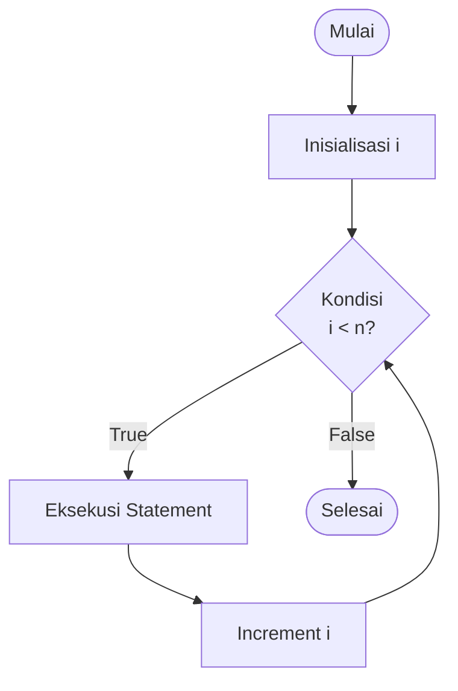
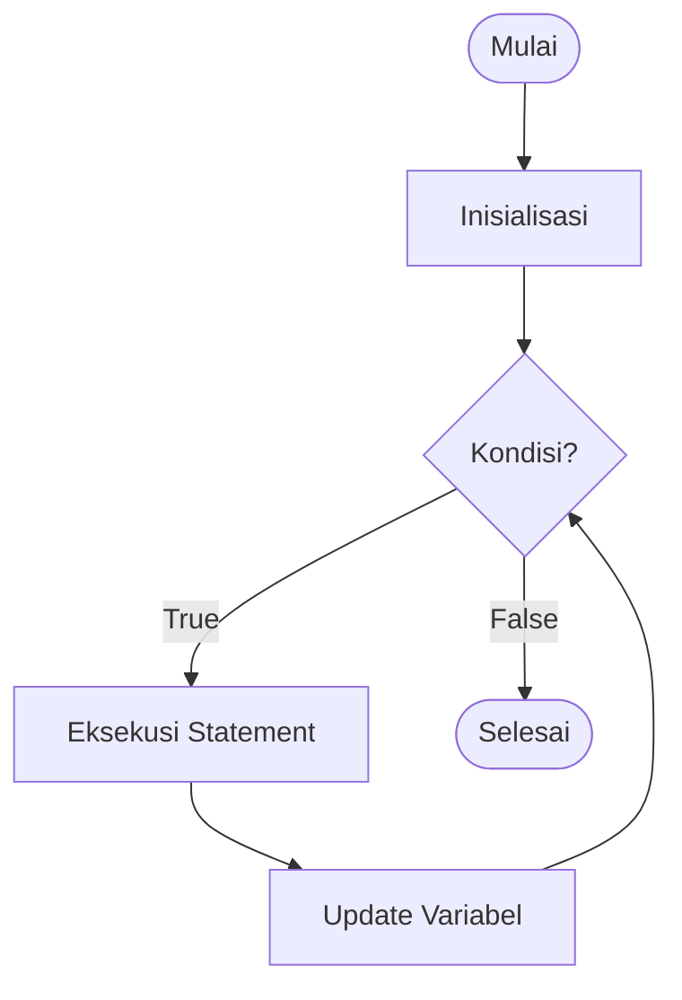
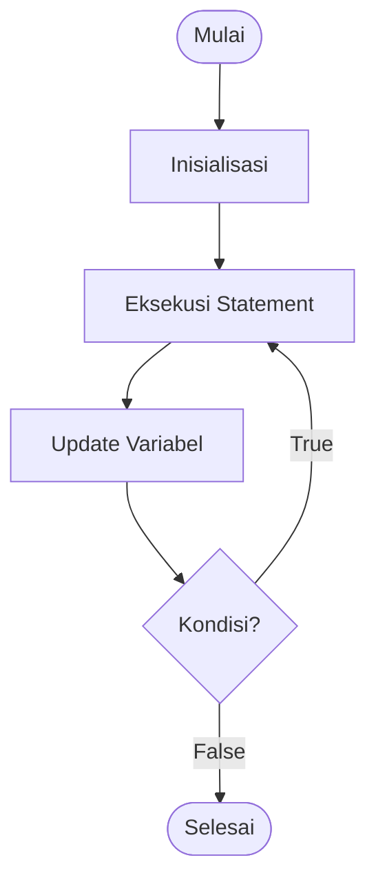
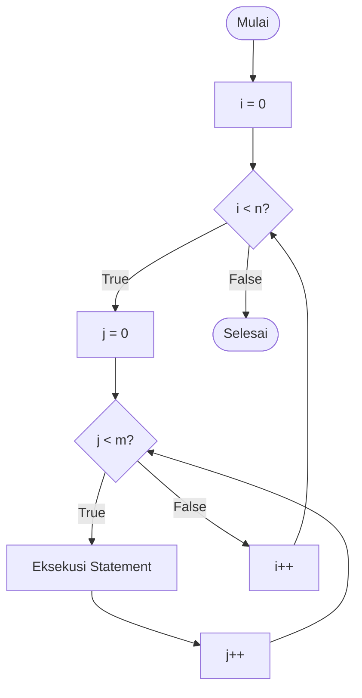
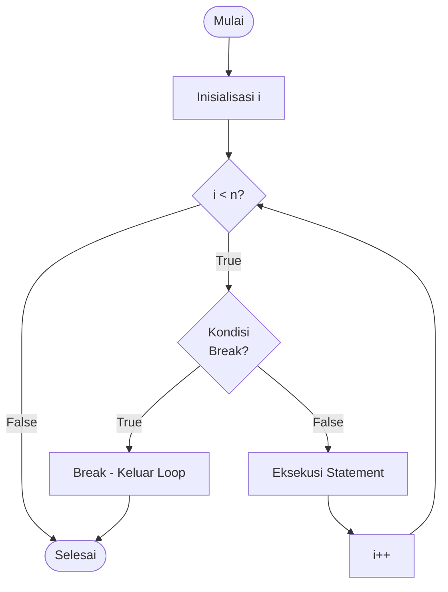
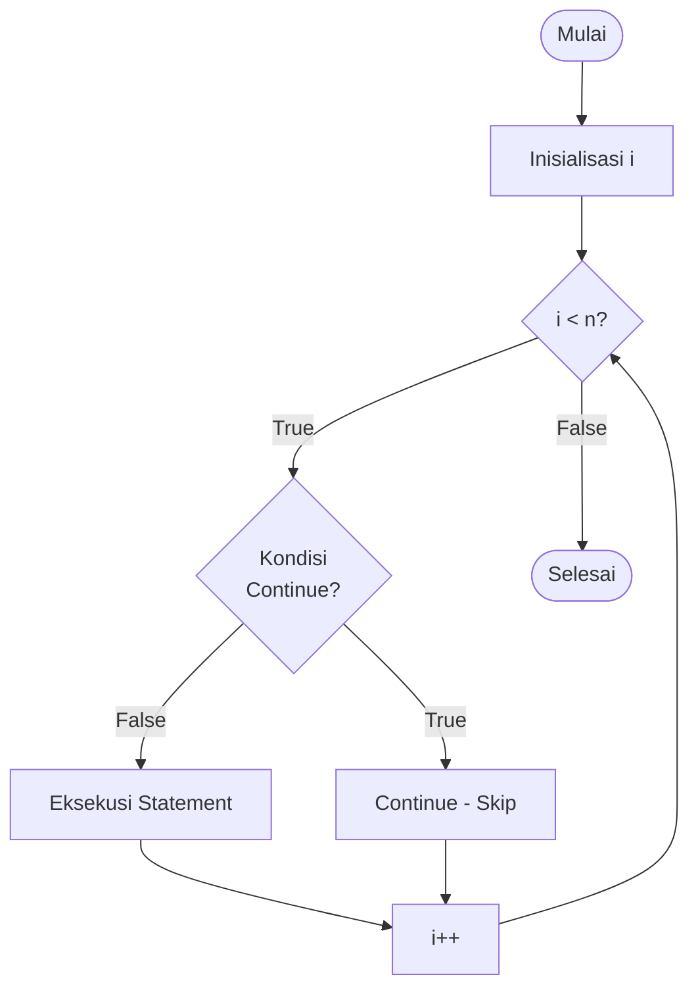

# Perulangan (Looping)

## Apa itu Perulangan?

**Perulangan** adalah struktur kontrol yang memungkinkan program menjalankan blok kode berulang kali selama kondisi tertentu terpenuhi.

## Flowchart Perulangan

### Flowchart For Loop



### Flowchart While Loop



### Flowchart Do-While Loop



### Flowchart Nested Loop



## Jenis-Jenis Perulangan

### 1. For Loop

Perulangan dengan jumlah iterasi yang sudah diketahui.

#### Python - For Loop dengan Range

```python
# Syntax
for variabel in range(start, stop, step):
    # kode yang diulang

# Contoh 1: 0 sampai 4
for i in range(5):
    print(i)  # Output: 0, 1, 2, 3, 4

# Contoh 2: 1 sampai 5
for i in range(1, 6):
    print(i)  # Output: 1, 2, 3, 4, 5

# Contoh 3: dengan step
for i in range(0, 10, 2):
    print(i)  # Output: 0, 2, 4, 6, 8
```

#### C++ - For Loop

```cpp
// Syntax
for (inisialisasi; kondisi; increment) {
    // kode yang diulang
}

// Contoh 1: 0 sampai 4
for (int i = 0; i < 5; i++) {
    cout << i << endl;
}

// Contoh 2: 1 sampai 5
for (int i = 1; i <= 5; i++) {
    cout << i << endl;
}

// Contoh 3: dengan step 2
for (int i = 0; i < 10; i += 2) {
    cout << i << endl;
}
```

### 2. While Loop

Perulangan yang terus berjalan selama kondisi bernilai True.

#### Python

```python
# Syntax
while kondisi:
    # kode yang diulang

# Contoh
i = 1
while i <= 5:
    print(i)
    i += 1  # Jangan lupa increment!
```

#### C++

```cpp
// Syntax
while (kondisi) {
    // kode yang diulang
}

// Contoh
int i = 1;
while (i <= 5) {
    cout << i << endl;
    i++;  // Jangan lupa increment!
}
```

### 3. Do-While Loop (C++)

Perulangan yang menjalankan kode minimal satu kali, baru cek kondisi.

```cpp
// Syntax
do {
    // kode yang diulang
} while (kondisi);

// Contoh
int i = 1;
do {
    cout << i << endl;
    i++;
} while (i <= 5);

// Contoh: Menu dengan validasi
int pilihan;
do {
    cout << "Pilih menu (1-4): ";
    cin >> pilihan;
    if (pilihan < 1 || pilihan > 4) {
        cout << "Pilihan tidak valid! Coba lagi." << endl;
    }
} while (pilihan < 1 || pilihan > 4);
```

## Perulangan dengan Koleksi Data

### Python - For Loop dengan List/String

```python
# Loop melalui list
buah = ["apel", "jeruk", "mangga"]
for item in buah:
    print(item)

# Loop melalui string
kata = "Python"
for huruf in kata:
    print(huruf)

# Loop dengan index
for index, item in enumerate(buah):
    print(f"{index}: {item}")
```

### C++ - Loop melalui Array

```cpp
// Array
int angka[] = {1, 2, 3, 4, 5};
int panjang = sizeof(angka) / sizeof(angka[0]);

for (int i = 0; i < panjang; i++) {
    cout << angka[i] << endl;
}

// Range-based for loop (C++11)
for (int nilai : angka) {
    cout << nilai << endl;
}
```

## Nested Loop (Loop Bersarang)

Loop di dalam loop.

### Contoh: Tabel Perkalian

```python
# Python
print("=== TABEL PERKALIAN ===")
for i in range(1, 11):
    for j in range(1, 11):
        hasil = i * j
        print(f"{i} x {j} = {hasil}")
    print()  # Baris kosong
```

```cpp
// C++
cout << "=== TABEL PERKALIAN ===" << endl;
for (int i = 1; i <= 10; i++) {
    for (int j = 1; j <= 10; j++) {
        cout << i << " x " << j << " = " << (i * j) << endl;
    }
    cout << endl;
}
```

### Contoh: Pola Bintang

```python
# Python - Segitiga siku-siku
for i in range(1, 6):
    for j in range(i):
        print("*", end="")
    print()

# Output:
# *
# **
# ***
# ****
# *****
```

```cpp
// C++ - Piramida
int tinggi = 5;
for (int i = 1; i <= tinggi; i++) {
    // Spasi
    for (int j = 1; j <= tinggi - i; j++) {
        cout << " ";
    }
    // Bintang
    for (int k = 1; k <= 2*i - 1; k++) {
        cout << "*";
    }
    cout << endl;
}

// Output:
//     *
//    ***
//   *****
//  *******
// *********
```

## Kontrol Loop

### Flowchart Break Statement



### Flowchart Continue Statement



### 1. Break - Menghentikan Loop

```python
# Python
for i in range(1, 11):
    if i == 5:
        break  # Keluar dari loop
    print(i)
# Output: 1, 2, 3, 4
```

```cpp
// C++
for (int i = 1; i <= 10; i++) {
    if (i == 5) {
        break;  // Keluar dari loop
    }
    cout << i << endl;
}
// Output: 1, 2, 3, 4
```

### 2. Continue - Skip Iterasi

```python
# Python
for i in range(1, 6):
    if i == 3:
        continue  # Skip ke iterasi berikutnya
    print(i)
# Output: 1, 2, 4, 5
```

```cpp
// C++
for (int i = 1; i <= 5; i++) {
    if (i == 3) {
        continue;  // Skip ke iterasi berikutnya
    }
    cout << i << endl;
}
// Output: 1, 2, 4, 5
```

### 3. Pass (Python) - Placeholder

```python
# Python
for i in range(5):
    if i == 3:
        pass  # Tidak melakukan apa-apa (placeholder)
    print(i)
```

## Studi Kasus Lengkap

### Kasus 1: Validasi Input

```python
# Python - Input dengan validasi
while True:
    try:
        umur = int(input("Masukkan umur (1-100): "))
        if 1 <= umur <= 100:
            break
        else:
            print("Umur harus antara 1-100!")
    except ValueError:
        print("Input harus berupa angka!")

print(f"Umur Anda: {umur}")
```

```cpp
// C++
int umur;
while (true) {
    cout << "Masukkan umur (1-100): ";
    cin >> umur;

    if (cin.fail()) {
        cin.clear();
        cin.ignore(10000, '\n');
        cout << "Input harus berupa angka!" << endl;
    } else if (umur >= 1 && umur <= 100) {
        break;
    } else {
        cout << "Umur harus antara 1-100!" << endl;
    }
}
cout << "Umur Anda: " << umur << endl;
```

### Kasus 2: Menghitung Faktorial

```python
# Python
def faktorial(n):
    hasil = 1
    for i in range(1, n + 1):
        hasil *= i
    return hasil

n = int(input("Masukkan bilangan: "))
print(f"{n}! = {faktorial(n)}")

# Contoh: 5! = 5 x 4 x 3 x 2 x 1 = 120
```

```cpp
// C++
#include <iostream>
using namespace std;

int main() {
    int n, hasil = 1;

    cout << "Masukkan bilangan: ";
    cin >> n;

    for (int i = 1; i <= n; i++) {
        hasil *= i;
    }

    cout << n << "! = " << hasil << endl;

    return 0;
}
```

### Kasus 3: Mencari Bilangan Prima

```python
# Python
def cek_prima(n):
    if n < 2:
        return False
    for i in range(2, int(n ** 0.5) + 1):
        if n % i == 0:
            return False
    return True

# Tampilkan bilangan prima 1-100
print("Bilangan prima dari 1-100:")
for angka in range(1, 101):
    if cek_prima(angka):
        print(angka, end=" ")
```

```cpp
// C++
#include <iostream>
#include <cmath>
using namespace std;

bool cekPrima(int n) {
    if (n < 2) return false;
    for (int i = 2; i <= sqrt(n); i++) {
        if (n % i == 0) {
            return false;
        }
    }
    return true;
}

int main() {
    cout << "Bilangan prima dari 1-100:" << endl;
    for (int i = 1; i <= 100; i++) {
        if (cekPrima(i)) {
            cout << i << " ";
        }
    }
    cout << endl;

    return 0;
}
```

### Kasus 4: Program ATM Sederhana

```python
# Python
saldo = 1000000

while True:
    print("\n=== ATM SEDERHANA ===")
    print(f"Saldo: Rp {saldo:,}")
    print("1. Tarik Tunai")
    print("2. Setor Tunai")
    print("3. Cek Saldo")
    print("4. Keluar")

    pilihan = input("Pilih menu (1-4): ")

    if pilihan == '1':
        jumlah = int(input("Jumlah penarikan: Rp "))
        if jumlah > saldo:
            print("Saldo tidak cukup!")
        elif jumlah <= 0:
            print("Jumlah tidak valid!")
        else:
            saldo -= jumlah
            print(f"Penarikan berhasil! Saldo: Rp {saldo:,}")

    elif pilihan == '2':
        jumlah = int(input("Jumlah setoran: Rp "))
        if jumlah <= 0:
            print("Jumlah tidak valid!")
        else:
            saldo += jumlah
            print(f"Setoran berhasil! Saldo: Rp {saldo:,}")

    elif pilihan == '3':
        print(f"Saldo Anda: Rp {saldo:,}")

    elif pilihan == '4':
        print("Terima kasih!")
        break

    else:
        print("Pilihan tidak valid!")
```

### Kasus 5: Tebak Angka

```python
# Python
import random

angka_rahasia = random.randint(1, 100)
kesempatan = 7

print("=== TEBAK ANGKA ===")
print("Saya memikirkan angka antara 1-100")
print(f"Anda punya {kesempatan} kesempatan")

for percobaan in range(1, kesempatan + 1):
    tebakan = int(input(f"\nPercobaan {percobaan}: "))

    if tebakan == angka_rahasia:
        print(f"🎉 BENAR! Angkanya adalah {angka_rahasia}")
        print(f"Anda menebak dalam {percobaan} percobaan")
        break
    elif tebakan < angka_rahasia:
        print("Terlalu kecil!")
    else:
        print("Terlalu besar!")

    if percobaan == kesempatan:
        print(f"\n❌ Game Over! Angka yang benar adalah {angka_rahasia}")
```

### Kasus 6: Menghitung Statistik Data

```python
# Python
def hitung_statistik():
    data = []

    print("=== INPUT DATA ===")
    print("Ketik 'selesai' untuk berhenti")

    # Input data
    while True:
        input_user = input("Masukkan angka: ")
        if input_user.lower() == 'selesai':
            break
        try:
            angka = float(input_user)
            data.append(angka)
        except ValueError:
            print("Input harus berupa angka!")

    if len(data) == 0:
        print("Tidak ada data!")
        return

    # Hitung statistik
    total = sum(data)
    rata_rata = total / len(data)
    minimum = min(data)
    maksimum = max(data)

    # Output
    print("\n=== HASIL STATISTIK ===")
    print(f"Jumlah data: {len(data)}")
    print(f"Total: {total}")
    print(f"Rata-rata: {rata_rata:.2f}")
    print(f"Minimum: {minimum}")
    print(f"Maksimum: {maksimum}")

    # Tampilkan data
    print("\nData:", data)

hitung_statistik()
```

## Performa dan Best Practice

### 1. Hindari Infinite Loop

```python
# ❌ BAHAYA - Infinite loop!
while True:
    print("Loop tanpa henti")

# ✅ BENAR - Ada kondisi keluar
i = 0
while i < 10:
    print(i)
    i += 1
```

### 2. Pilih Loop yang Tepat

```python
# Jika tahu jumlah iterasi → gunakan for
for i in range(10):
    print(i)

# Jika tidak tahu jumlah iterasi → gunakan while
while kondisi_tertentu:
    # kode
```

### 3. Hindari Nested Loop yang Dalam

```python
# ❌ BURUK - O(n³) kompleksitas
for i in range(n):
    for j in range(n):
        for k in range(n):
            # kode

# ✅ LEBIH BAIK - Optimalkan algoritma
```

### 4. Gunakan Break dengan Bijak

```python
# ✅ BAIK - Break saat menemukan hasil
for i in range(1000000):
    if kondisi_ditemukan:
        hasil = i
        break
```

## Latihan

1. **Program Deret Fibonacci**

   - Tampilkan n bilangan pertama dari deret Fibonacci
   - Contoh: 0, 1, 1, 2, 3, 5, 8, 13, ...

2. **Program Hitung Jumlah Digit**

   - Input: sebuah bilangan
   - Output: jumlah digit dari bilangan tersebut
   - Contoh: 12345 → 5 digit

3. **Program Balik Angka**

   - Input: 12345
   - Output: 54321

4. **Program Cek Palindrome**

   - Cek apakah sebuah kata/angka adalah palindrome
   - Contoh: "katak", "12321" adalah palindrome

5. **Program Tabel**

   - Buat tabel perkalian dari 1-10

6. **Program Segitiga Pascal**

   - Tampilkan segitiga Pascal dengan n baris

7. **Program FizzBuzz**
   - Cetak angka 1-100
   - Jika kelipatan 3: cetak "Fizz"
   - Jika kelipatan 5: cetak "Buzz"
   - Jika kelipatan keduanya: cetak "FizzBuzz"

## Rangkuman

- **For Loop**: Untuk jumlah iterasi yang sudah diketahui
- **While Loop**: Untuk iterasi berdasarkan kondisi
- **Do-While**: Minimal satu kali eksekusi (C++)
- **Nested Loop**: Loop di dalam loop
- **Break**: Keluar dari loop
- **Continue**: Skip iterasi saat ini
- Hindari infinite loop
- Pilih jenis loop yang sesuai dengan kebutuhan
- Perhatikan kompleksitas untuk nested loop

---

**Sebelumnya**: [Percabangan](./percabangan.md) | **Selanjutnya**: [Array](./array.md)
