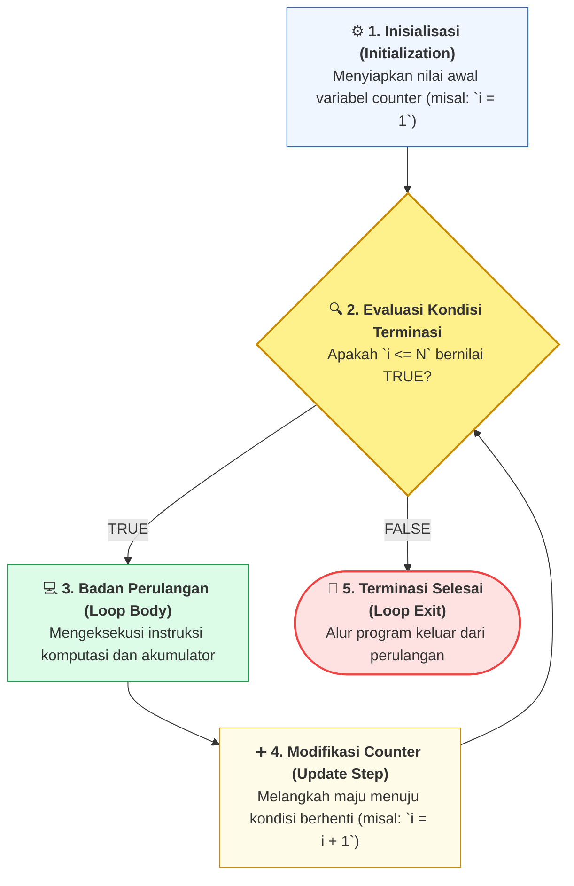
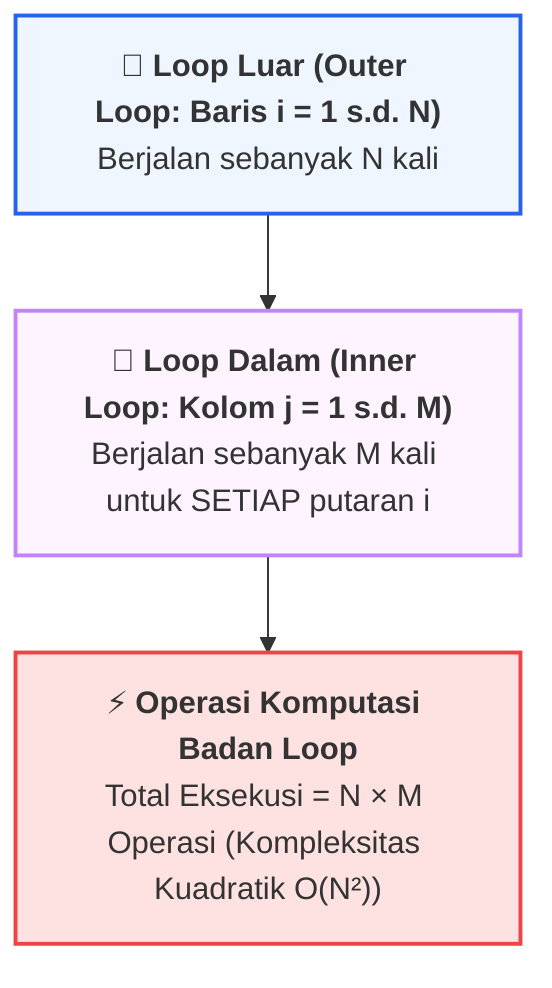

# 📘 Minggu 05-06: Struktur Kontrol Perulangan, Invariant Loop & Trace Tables

## 🎯 Capaian Pembelajaran (Sub-CPMK 3)
Setelah mempelajari modul ini, mahasiswa diharapkan mampu:
1. Memahami siklus hidup iterasi, membedakan antara **Counted Loop (`for`)** dan **Uncounted Loop (`while`, `do-while`)**.
2. Membuktikan kebenaran algoritma iteratif menggunakan konsep **Loop Invariant**.
3. Mengontrol terminasi iterasi secara terstruktur menggunakan **`break`** dan **`continue`**, serta mengidentifikasi penyebab **Infinite Loop**.
4. Menganalisis kompleksitas waktu geometris pada perulangan bersarang (**Nested Loops: $O(n)$, $O(n^2)$, $O(n^3)$**).
5. Menyusun **Tabel Penelusuran (*Trace Table / Dry Run*)** formal untuk memverifikasi transisi status variabel langkah-demi-langkah.
6. Mengimplementasikan algoritma iterasi bilangan prima (optimasi $\sqrt{n}$) dan deret menggunakan C++ dan Python 3.

---

## 1. Siklus Hidup Perulangan & Konsep Loop Invariant

Struktur perulangan (*iteration / looping*) mengeksekusi sekumpulan instruksi secara berulang hingga suatu kondisi terminasi terpenuhi:


```mermaid
flowchart TD
    Init["⚙️ <b>1. Inisialisasi (Initialization)</b><br>Menyiapkan nilai awal variabel counter (misal: `i = 1`)"]
    --> Cond{"🔍 <b>2. Evaluasi Kondisi Terminasi</b><br>Apakah `i <= N` bernilai TRUE?"}
    
    Cond -- TRUE --> Body["💻 <b>3. Badan Perulangan (Loop Body)</b><br>Mengeksekusi instruksi komputasi dan akumulator"]
    --> Update["➕ <b>4. Modifikasi Counter (Update Step)</b><br>Melangkah maju menuju kondisi berhenti (misal: `i = i + 1`)"]
    --> Cond
    
    Cond -- FALSE --> Exit(["🛑 <b>5. Terminasi Selesai (Loop Exit)</b><br>Alur program keluar dari perulangan"])

    style Init fill:#eff6ff,stroke:#2563eb,stroke-width:1px
    style Cond fill:#fef08a,stroke:#ca8a04,stroke-width:2px
    style Body fill:#dcfce7,stroke:#16a34a,stroke-width:1px
    style Update fill:#fefce8,stroke:#ca8a04,stroke-width:1px
    style Exit fill:#fee2e2,stroke:#ef4444,stroke-width:2px
```

### Konsep Teoretis: Loop Invariant
Dalam ilmu komputer teoretis, **Loop Invariant** adalah properti atau relasi matematis antar variabel yang bernilai **SELALU BENAR** pada 3 titik kritis:
1. **Initialization:** Benar sebelum perulangan pertama kali dimulai.
2. **Maintenance:** Jika benar sebelum suatu iterasi, properti tersebut tetap terbukti benar setelah iterasi selesai.
3. **Termination:** Saat perulangan berhenti, invariant memberikan bukti formal bahwa algoritma telah menghasilkan luaran yang benar.

---

## 2. Tiga Struktur Perulangan Fundamental

| Jenis Struktur Loop | Karakteristik Utama & Evaluasi | Kapan Wajib Digunakan? | Jumlah Eksekusi Minimum |
| :--- | :--- | :--- | :---: |
| **`for` loop** | **Counted Loop:** Evaluasi kondisi di awal (*Pre-test*). Counter terintegrasi rapi. | Jumlah putaran iterasi sudah diketahui secara pasti (misal: traversal $N$ elemen array). | **0 Kali** (Jika kondisi awal false) |
| **`while` loop** | **Uncounted Loop:** Evaluasi kondisi di awal (*Pre-test*). | Jumlah iterasi bergantung pada kejadian dinamis (membaca stream file, sensor, validasi input). | **0 Kali** (Jika kondisi awal false) |
| **`do-while` loop** | **Post-tested Loop:** Evaluasi kondisi dikerjakan di bagian akhir. | Blok program **harus dijalankan minimal 1 kali** sebelum validasi (misal: menampilkan menu aplikasi). | **1 Kali** (Pasti dieksekusi sekali) |

---

## 3. Kompleksitas Geometris: Nested Loops ($O(n) \to O(n^2)$)

Ketika sebuah perulangan berada di dalam perulangan lainnya (*Nested Loops*), total eksekusi instruksi dihitung dari perkalian jumlah iterasi loop luar dan loop dalam:


```mermaid
flowchart TD
    Outer["🔄 <b>Loop Luar (Outer Loop: Baris i = 1 s.d. N)</b><br>Berjalan sebanyak N kali"]
    --> Inner["🔁 <b>Loop Dalam (Inner Loop: Kolom j = 1 s.d. M)</b><br>Berjalan sebanyak M kali untuk SETIAP putaran i"]
    --> Work["⚡ <b>Operasi Komputasi Badan Loop</b><br>Total Eksekusi = N × M Operasi (Kompleksitas Kuadratik O(N²))"]

    style Outer fill:#eff6ff,stroke:#2563eb,stroke-width:2px
    style Inner fill:#fdf4ff,stroke:#c084fc,stroke-width:2px
    style Work fill:#fee2e2,stroke:#ef4444,stroke-width:2px
```

::: info 📐 Formula: Total Operasi Nested Loop Segitiga
> Untuk perulangan di mana loop dalam berjalan dari `j = 1` hingga `i`:
>
> **`Total Eksekusi = 1 + 2 + 3 + ... + N = N(N + 1) ÷ 2`**
>
> Menghasilkan kompleksitas asimtotik waktu: **`O(N²)`**.
:::

---

## 4. Tabel Penelusuran Formal (*Trace Table / Dry Run*)

Tabel penelusuran digunakan untuk memverifikasi alur logika dan transisi status variabel pada algoritma penjumlahan deret ganjil $N=4$:

```text
Algoritma:
total = 0
for i = 1 to 4:
    ganjil = 2 * i - 1
    total = total + ganjil
```

| Iterasi ke- | Status Awal `i` | Evaluasi `i <= 4` | Perhitungan `ganjil` | Nilai `total` Baru | Output Layar |
| :---: | :---: | :---: | :---: | :---: | :---: |
| *Inisialisasi* | `-` | `-` | `-` | `0` | `-` |
| **Iterasi 1** | `1` | `1 <= 4 (TRUE)` | $2(1) - 1 = 1$ | $0 + 1 = 1$ | `Suku: 1` |
| **Iterasi 2** | `2` | `2 <= 4 (TRUE)` | $2(2) - 1 = 3$ | $1 + 3 = 4$ | `Suku: 3` |
| **Iterasi 3** | `3` | `3 <= 4 (TRUE)` | $2(3) - 1 = 5$ | $4 + 5 = 9$ | `Suku: 5` |
| **Iterasi 4** | `4` | `4 <= 4 (TRUE)` | $2(4) - 1 = 7$ | $9 + 7 = 16$ | `Suku: 7` |
| **Terminasi** | `5` | `5 <= 4 (FALSE)`| *(Loop Berhenti)* | `16` | `Total Akhir: 16` |

---

## 5. Implementasi Kode Hands-on Dual-Stack (C++ & Python 3)

Berikut implementasi algoritma penentuan bilangan prima teroptimasi batas akar kuadrat ($O(\sqrt{n})$) dan pembuatan pola matriks piramida angka:

::: code-group
```cpp [C++]
#include <iostream>
#include <iomanip>
#include <cmath>

using namespace std;

// Fungsi Uji Bilangan Prima dengan Optimasi O(sqrt(N))
bool isPrima(int n) {
    if (n <= 1) return false;
    if (n <= 3) return true;
    if (n % 2 == 0 || n % 3 == 0) return false;

    // Cek pembagi ganjil hanya sampai batas sqrt(N)
    int batas = static_cast<int>(sqrt(n));
    for (int i = 5; i <= batas; i += 6) {
        if (n % i == 0 || n % (i + 2) == 0) {
            return false; // Ditemukan faktor pembagi -> Bukan Prima
        }
    }
    return true;
}

int main() {
    cout << "==================================================" << endl;
    cout << "  ALGORITMA PERULANGAN & PRIMA OPTIMAL (C++)      " << endl;
    cout << "==================================================" << endl;

    // 1. Mencari Seluruh Bilangan Prima dalam Rentang 1 s.d. 50
    cout << "1. Bilangan Prima antara 1 s.d. 50:" << endl;
    int counterPrima = 0;
    for (int num = 1; num <= 50; num++) {
        if (isPrima(num)) {
            cout << setw(3) << num << " ";
            counterPrima++;
        }
    }
    cout << "\n-> Total Ditemukan: " << counterPrima << " Bilangan Prima." << endl;

    // 2. Nested Loop: Pola Piramida Angka Simetris
    cout << "\n2. Pola Piramida Angka (N = 5):" << endl;
    int tinggi = 5;
    for (int baris = 1; baris <= tinggi; baris++) {
        // Spasi Indentasi
        for (int spasi = 1; spasi <= tinggi - baris; spasi++) {
            cout << "  ";
        }
        // Angka Naik
        for (int angka = 1; angka <= baris; angka++) {
            cout << angka << " ";
        }
        // Angka Turun
        for (int angka = baris - 1; angka >= 1; angka--) {
            cout << angka << " ";
        }
        cout << endl;
    }
    cout << "==================================================" << endl;

    return 0;
}
```

```python [Python 3]
import math

def is_prima(n: int) -> bool:
    """Uji keprimaan bilangan dengan kompleksitas O(sqrt(N))."""
    if n <= 1:
        return False
    if n <= 3:
        return True
    if n % 2 == 0 or n % 3 == 0:
        return False

    batas = int(math.isqrt(n))
    for i in range(5, batas + 1, 6):
        if n % i == 0 or n % (i + 2) == 0:
            return False
    return True


def main():
    print("=" * 50)
    print("  ALGORITMA PERULANGAN & PRIMA OPTIMAL (PYTHON 3) ")
    print("=" * 50)

    # 1. Bilangan Prima antara 1 s.d. 50
    print("1. Bilangan Prima antara 1 s.d. 50:")
    prima_list = [num for num in range(1, 51) if is_prima(num)]
    print(" ".join(f"{x:2d}" for x in prima_list))
    print(f"-> Total Ditemukan: {len(prima_list)} Bilangan Prima.")

    # 2. Nested Loop: Pola Piramida Angka Simetris
    print("\n2. Pola Piramida Angka (N = 5):")
    tinggi = 5
    for baris in range(1, tinggi + 1):
        spasi = "  " * (tinggi - baris)
        naik = " ".join(str(x) for x in range(1, baris + 1))
        turun = " ".join(str(x) for x in range(baris - 1, 0, -1))
        hasil = f"{spasi}{naik} {turun}".rstrip()
        print(hasil)

    print("=" * 50)


if __name__ == "__main__":
    main()
```
:::

---

## 6. Rangkuman & Latihan Mandiri

::: tip 💡 Rangkuman Konsep Kunci
1. **Pilihan Loop:** Gunakan `for` jika jumlah batas perulangan pasti, `while` untuk kondisi dinamis, dan `do-while` saat blok harus berjalan minimal 1 kali.
2. **Loop Invariant:** Jadikan invariant sebagai jaminan matematis bahwa setiap iterasi membawa status program semakin mendekati solusi akhir yang benar.
3. **Trace Table:** Selalu susun trace table di atas kertas untuk menelusuri bug pergeseran indeks (*off-by-one errors*) sebelum menjalankan program.
4. **Optimasi $\sqrt{n}$:** Batasi pemeriksaan pembagi pada algoritma bilangan prima hingga $\sqrt{n}$ untuk memangkas waktu eksekusi dari $O(n)$ menjadi $O(\sqrt{n})$.
:::

### 📝 Tugas Praktikum 5 (Mandiri)
1. **Analisis Trace Table Algoritma Euclid:** Susunlah Trace Table lengkap untuk mencari Faktor Persekutuan Terbesar (**FPB / GCD**) antara angka $A = 252$ dan $B = 105$ menggunakan algoritma pembagian modulo berulang Euclid:
   ```text
   while B != 0:
       sisa = A % B
       A = B
       B = sisa
   ```
2. **Deret Fibonacci Iteratif:** Buat program iteratif untuk mencetak $N$ suku pertama deret Fibonacci ($0, 1, 1, 2, 3, 5, 8, 13, \dots$) tanpa menggunakan teknik rekursi dengan alokasi memori $O(1)$.
3. **Deteksi Infinite Loop:** Identifikasi mengapa potongan kode berikut mengalami *infinite loop* pada arsitektur komputer riil dan perbaiki:
   ```cpp
   for (float x = 0.0f; x != 1.0f; x += 0.1f) {
       cout << x << " ";
   }
   ```
