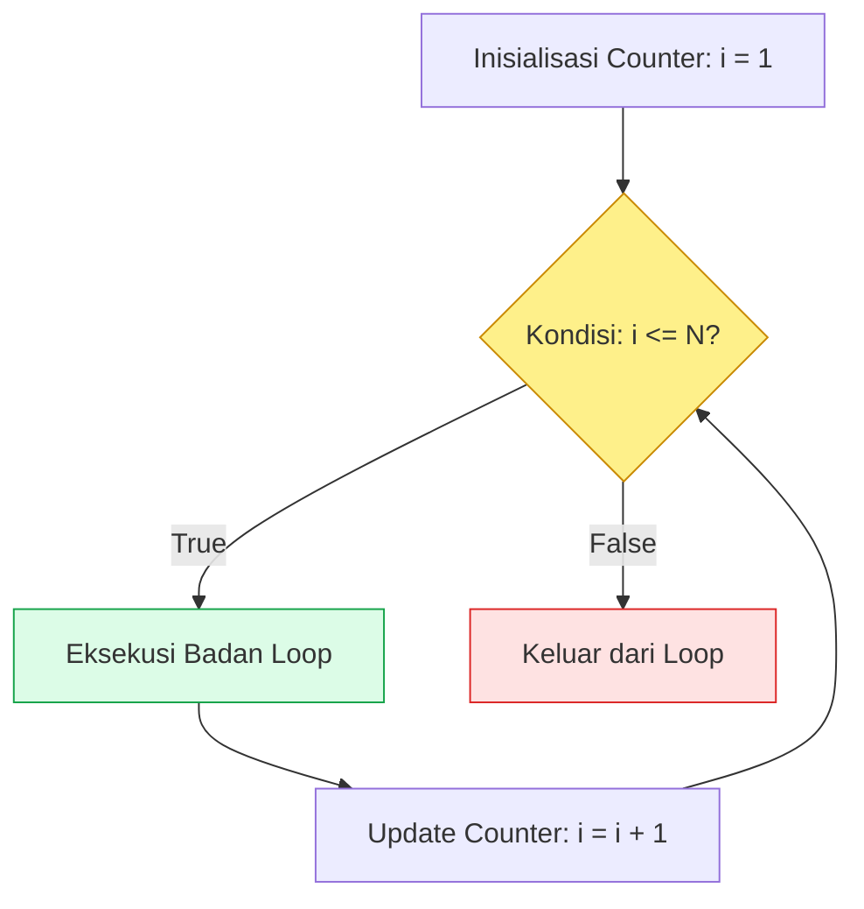

# Minggu 5-6: Struktur Kontrol Perulangan (Looping & Iterasi)

::: tip CAPAIAN PEMBELAJARAN (SUB-CPMK 3)
- **CPMK Terkait:** CPMK0101 (Konsep Dasar Pemrograman), CPMK0106 (Logika Algoritma)
- **CPL Terkait:** CPL01 (Pengetahuan Teori), CPL03 (Problem Solving), CPL04 (Solusi Rekayasa)
- **Indikator:** Mahasiswa mampu mengimplementasikan counted loop (`for`) dan uncounted loop (`while`, `do-while`), mengelola variabel counter dan akumulator, menyusun perulangan bersarang (*nested loop*), serta mengontrol terminasi iterasi dengan `break` dan `continue`.
:::

---

## 1. Hakikat Struktur Perulangan

Komputer unggul dalam mengeksekusi instruksi yang sama secara berulang-ulang dengan kecepatan tinggi dan akurasi sempurna. **Struktur Perulangan (*Looping / Iteration*)** memungkinkan sekumpulan instruksi dieksekusi berkali-kali hingga suatu kondisi terminasi terpenuhi.


```mermaid
graph TD
    A[Inisialisasi Counter: i = 1] --> B{Kondisi: i <= N?}
    B -- True --> C[Eksekusi Badan Loop]
    C --> D[Update Counter: i = i + 1]
    D --> B
    B -- False --> E[Keluar dari Loop]
    style B fill:#fef08a,stroke:#ca8a04
    style C fill:#dcfce7,stroke:#16a34a
    style E fill:#fee2e2,stroke:#dc2626
```

---

## 2. Tiga Jenis Struktur Perulangan Utama

| Jenis Loop | Karakteristik Utama | Kapan Digunakan? | Evaluasi Kondisi |
| :--- | :--- | :--- | :--- |
| **`for` loop** | *Counted Loop*: Jumlah iterasi sudah diketahui secara pasti sejak awal. | Iterasi deret angka, traversal array, matriks. | Di awal (*Pre-test*) |
| **`while` loop** | *Uncounted Loop*: Iterasi berlanjut selama kondisi bernilai `true`. | Validasi input pengguna, membaca stream data tak pasti. | Di awal (*Pre-test*) |
| **`do-while` loop** | Minimal dieksekusi **satu kali**, baru kemudian mengecek kondisi. | Menampilkan menu interaktif yang harus muncul dulu sekali. | Di akhir (*Post-test*) |

---

## 3. Contoh Implementasi Komparasi 3 Jenis Loop

::: code-group
```cpp [C++]
#include <iostream>
using namespace std;

int main() {
    int n = 5;

    // 1. FOR LOOP (Mencetak 1 s.d. 5)
    cout << "--- FOR LOOP ---" << endl;
    for (int i = 1; i <= n; i++) {
        cout << i << " ";
    }
    cout << endl;

    // 2. WHILE LOOP (Menghitung Total Akumulator)
    cout << "--- WHILE LOOP ---" << endl;
    int total = 0;
    int k = 1;
    while (k <= n) {
        total += k;
        k++;
    }
    cout << "Total penjumlahan 1 s.d. " << n << " = " << total << endl;

    // 3. DO-WHILE LOOP (Menu Validasi Input)
    cout << "--- DO-WHILE LOOP ---" << endl;
    int angka;
    do {
        cout << "Masukkan angka positif (> 0): ";
        cin >> angka;
    } while (angka <= 0);
    cout << "Angka valid diterima: " << angka << endl;

    return 0;
}
```

```python [Python 3]
n = 5

# 1. FOR LOOP
print("--- FOR LOOP ---")
for i in range(1, n + 1):
    print(i, end=" ")
print()

# 2. WHILE LOOP
print("--- WHILE LOOP ---")
total = 0
k = 1
while k <= n:
    total += k
    k += 1
print(f"Total penjumlahan 1 s.d. {n} = {total}")

# 3. DO-WHILE EMULATION (Menggunakan while True + break)
print("--- VALIDASI INPUT ---")
while True:
    angka = int(input("Masukkan angka positif (> 0): "))
    if angka > 0:
        break
    print("Angka tidak valid, coba lagi.")
print(f"Angka valid diterima: {angka}")
```
:::

---

## 4. Perulangan Bersarang (*Nested Loop*)

Perulangan bersarang digunakan saat memproses struktur data 2 dimensi atau menghasilkan pola visual:

```cpp
// Mencetak Pola Segitiga Bintang
int tinggi = 5;
for (int baris = 1; baris <= tinggi; baris++) {
    for (int kolom = 1; kolom <= baris; kolom++) {
        cout << "* ";
    }
    cout << endl;
}
```

---

## 📝 Evaluasi & Latihan Mandiri (Sub-CPMK 3)

1. Buatlah program untuk menghitung nilai faktorial ($N! = N \times (N-1) \times \dots \times 1$) dengan penanganan khusus untuk $0! = 1$.
2. Buatlah program untuk mencetak deret bilangan prima antara 1 hingga 100 menggunakan perulangan bersarang.
3. Rancanglah sistem kasir sederhana yang terus meminta input belanja barang dan menghitung total harga sampai kasir memasukkan angka `0` untuk selesai transaksi.
