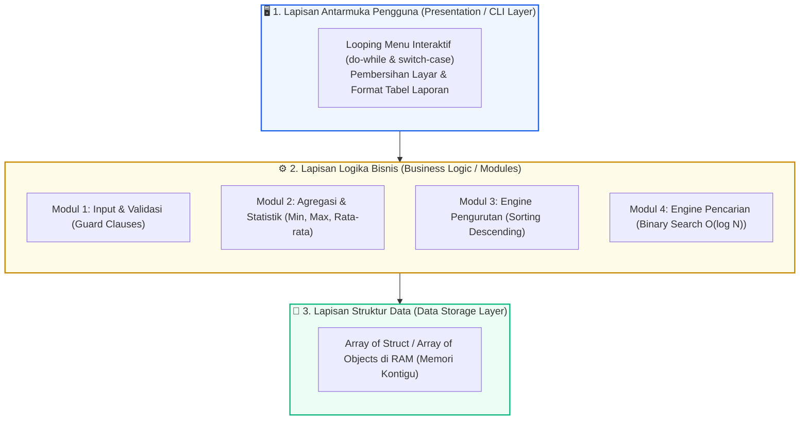
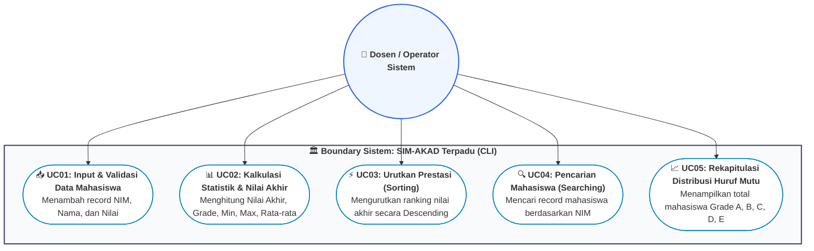

# 📘 Minggu 15: Integrasi Proyek Mini, Clean Code & Studi Kasus Terpadu

## 🎯 Capaian Pembelajaran (Sub-CPMK 7)
Setelah mempelajari modul ini, mahasiswa diharapkan mampu:
1. Mengintegrasikan seluruh konsep pemrograman: **Array of Struct / Objek**, **Modularitas Fungsi (Pass by Ref)**, **Algoritma Searching (Binary Search)**, dan **Algoritma Sorting (Insertion/Bubble Sort)** ke dalam satu arsitektur aplikasi perangkat lunak yang utuh.
2. Menerapkan kaidah rekayasa perangkat lunak dan **Clean Code Principles**: *Meaningful Names*, *Single Responsibility Principle (SRP)*, *DRY (Don't Repeat Yourself)*, dan *Defensive Programming (Guard Clauses)*.
3. Merancang diagram alur dan arsitektur sistem menggunakan **Diagram Use Case** dan **Flowchart Sistem Terpadu**.
4. Membangun aplikasi konsol interaktif berbasis menu (*Interactive CLI Application*) yang tangguh terhadap kesalahan input (*Crash-Proof*).
5. Mengimplementasikan solusi capstone project lengkap menggunakan C++ dan Python 3.

---

## 1. Arsitektur Rekayasa Perangkat Lunak Terstruktur

Pada tahapan akhir semester, pemrograman beralih dari sekadar menulis potongan instruksi sederhana (*syntax scripting*) menuju **Rekayasa Perangkat Lunak Terstruktur (*Software Engineering Architecture*)**:



---

## 2. Standar Clean Code & Defensive Programming

::: info 📐 Prinsip Kritis Clean Code (Robert C. Martin - Uncle Bob)
1. **Meaningful & Pronounceable Names:** Gunakan nama variabel dan fungsi yang mendeskripsikan tujuan bisnis secara jelas (contoh: `hitungNilaiAkhir()` alih-alih `calc()`; `totalMahasiswaLulus` alih-alih `tml`).
2. **Single Responsibility Principle (SRP):** Satu fungsi hanya boleh melakukan tepat satu tugas spesifik dan melakukannya dengan baik.
3. **DRY (Don't Repeat Yourself):** Jangan ada logika atau formula yang ditulis duplikat; ekstraksi ke dalam fungsi reusable.
4. **Guard Clauses (Early Exit):** Validasi prasyarat input data di baris-baris awal fungsi untuk menghindari cabang `if` bersarang yang dalam.
:::

---

## 3. Diagram Use Case Sistem Terpadu



---

## 4. Implementasi Proyek Mini Dual-Stack (C++ & Python 3)

Berikut adalah kode program aplikasi konsol terpadu yang memadukan seluruh materi perkuliahan dari Minggu 1 hingga Minggu 14:

::: code-group
```cpp [C++]
#include <iostream>
#include <iomanip>
#include <string>
#include <vector>

using namespace std;

// 1. Tipe Data Komposit (Struct Mahasiswa)
struct Mahasiswa {
    string nim;
    string nama;
    double nilaiTugas;
    double nilaiUTS;
    double nilaiUAS;
    double nilaiAkhir;
    char gradeMutu;
};

// 2. Modul Penentuan Huruf Mutu
char konversiGrade(double na) {
    if (na >= 85.0) return 'A';
    if (na >= 70.0) return 'B';
    if (na >= 55.0) return 'C';
    if (na >= 40.0) return 'D';
    return 'E';
}

// 3. Modul Hitung Nilai Akhir (Formula OBE)
void hitungNilaiMahasiswa(Mahasiswa& m) {
    m.nilaiAkhir = (0.30 * m.nilaiTugas) + (0.35 * m.nilaiUTS) + (0.35 * m.nilaiUAS);
    m.gradeMutu = konversiGrade(m.nilaiAkhir);
}

// 4. Modul Tampilkan Tabel Data
void tampilkanTabel(const vector<Mahasiswa>& daftar) {
    if (daftar.empty()) {
        cout << "\n[!] Belum ada data mahasiswa yang terdaftar.\n" << endl;
        return;
    }

    cout << "\n" << string(75, '=') << endl;
    cout << left << setw(12) << "NIM" 
         << setw(20) << "Nama Mahasiswa" 
         << right << setw(10) << "Tugas" 
         << setw(10) << "UTS" 
         << setw(10) << "UAS" 
         << setw(13) << "Nilai Akhir" 
         << setw(8) << "Grade" << endl;
    cout << string(75, '-') << endl;

    for (const auto& m : daftar) {
        cout << left << setw(12) << m.nim 
             << setw(20) << m.nama 
             << right << fixed << setprecision(1)
             << setw(10) << m.nilaiTugas 
             << setw(10) << m.nilaiUTS 
             << setw(10) << m.nilaiUAS 
             << setw(13) << setprecision(2) << m.nilaiAkhir 
             << setw(8) << m.gradeMutu << endl;
    }
    cout << string(75, '=') << endl;
}

// 5. Modul Pengurutan Data (Insertion Sort Descending by Nilai Akhir)
void urutkanRanking(vector<Mahasiswa>& daftar) {
    int n = daftar.size();
    for (int i = 1; i < n; i++) {
        Mahasiswa kunci = daftar[i];
        int j = i - 1;
        while (j >= 0 && daftar[j].nilaiAkhir < kunci.nilaiAkhir) {
            daftar[j + 1] = daftar[j];
            j--;
        }
        daftar[j + 1] = kunci;
    }
    cout << "\n[SUCCESS] Data berhasil diurutkan berdasarkan Nilai Akhir (Ranking Tertinggi ke Terendah)!\n" << endl;
}

// 6. Modul Pencarian Data (Binary Search by NIM)
void cariMahasiswaByNIM(vector<Mahasiswa> daftar, const string& targetNIM) {
    // Sort ascending by NIM terlebih dahulu untuk memenuhi syarat Binary Search
    int n = daftar.size();
    for (int i = 0; i < n - 1; i++) {
        for (int j = 0; j < n - i - 1; j++) {
            if (daftar[j].nim > daftar[j + 1].nim) {
                swap(daftar[j], daftar[j + 1]);
            }
        }
    }

    int kiri = 0, kanan = n - 1;
    int indexKetemu = -1;

    while (kiri <= kanan) {
        int mid = kiri + (kanan - kiri) / 2;
        if (daftar[mid].nim == targetNIM) {
            indexKetemu = mid;
            break;
        } else if (daftar[mid].nim < targetNIM) {
            kiri = mid + 1;
        } else {
            kanan = mid - 1;
        }
    }

    if (indexKetemu != -1) {
        const auto& m = daftar[indexKetemu];
        cout << "\n--- DATA MAHASISWA DITEMUKAN ---" << endl;
        cout << "• NIM         : " << m.nim << endl;
        cout << "• Nama        : " << m.nama << endl;
        cout << "• Nilai Akhir : " << fixed << setprecision(2) << m.nilaiAkhir << " (Grade: " << m.gradeMutu << ")" << endl;
    } else {
        cout << "\n[!] Mahasiswa dengan NIM '" << targetNIM << "' tidak ditemukan dalam sistem.\n" << endl;
    }
}

int main() {
    vector<Mahasiswa> database;

    // Data Mock Awal
    Mahasiswa m1 = {"240101", "Ahmad Fauzan", 85, 90, 88, 0, ' '};
    Mahasiswa m2 = {"240102", "Cut Siti Rahma", 92, 85, 95, 0, ' '};
    Mahasiswa m3 = {"240103", "Budi Santoso", 70, 65, 75, 0, ' '};
    Mahasiswa m4 = {"240104", "Dinda Lestari", 78, 80, 82, 0, ' '};

    hitungNilaiMahasiswa(m1);
    hitungNilaiMahasiswa(m2);
    hitungNilaiMahasiswa(m3);
    hitungNilaiMahasiswa(m4);

    database.push_back(m1);
    database.push_back(m2);
    database.push_back(m3);
    database.push_back(m4);

    cout << "==================================================" << endl;
    cout << "   SISTEM INFORMASI AKADEMIK TERPADU (C++)        " << endl;
    cout << "==================================================" << endl;

    cout << "1. Menampilkan Tabel Data Mahasiswa Awal:" << endl;
    tampilkanTabel(database);

    cout << "2. Mengurutkan Mahasiswa (Ranking Prestasi):" << endl;
    urutkanRanking(database);
    tampilkanTabel(database);

    cout << "3. Menguji Pencarian Cepat (Binary Search NIM '240102'):" << endl;
    cariMahasiswaByNIM(database, "240102");

    cout << "==================================================" << endl;
    return 0;
}
```

```python [Python 3]
from dataclasses import dataclass
from typing import List, Optional

@dataclass
class Mahasiswa:
    nim: str
    nama: str
    nilai_tugas: float
    nilai_uts: float
    nilai_uas: float
    nilai_akhir: float = 0.0
    grade_mutu: str = ""


def konversi_grade(na: float) -> str:
    """Konversi nilai angka ke huruf mutu standar OBE."""
    if na >= 85.0:
        return 'A'
    if na >= 70.0:
        return 'B'
    if na >= 55.0:
        return 'C'
    if na >= 40.0:
        return 'D'
    return 'E'


def hitung_nilai_mahasiswa(m: Mahasiswa) -> None:
    """Hitung nilai akhir berbasis bobot 30-35-35."""
    m.nilai_akhir = (0.30 * m.nilai_tugas) + (0.35 * m.nilai_uts) + (0.35 * m.nilai_uas)
    m.grade_mutu = konversi_grade(m.nilai_akhir)


def tampilkan_tabel(daftar: List[Mahasiswa]) -> None:
    """Cetak tabel data mahasiswa rapi."""
    if not daftar:
        print("\n[!] Belum ada data mahasiswa.\n")
        return

    print("\n" + "=" * 75)
    print(f"{'NIM':<10} {'Nama Mahasiswa':<20} {'Tugas':>8} {'UTS':>8} {'UAS':>8} {'Nilai Akhir':>13} {'Grade':>6}")
    print("-" * 75)
    for m in daftar:
        print(f"{m.nim:<10} {m.nama:<20} {m.nilai_tugas:>8.1f} {m.nilai_uts:>8.1f} {m.nilai_uas:>8.1f} {m.nilai_akhir:>13.2f} {m.grade_mutu:>6}")
    print("=" * 75 + "\n")


def urutkan_ranking(daftar: List[Mahasiswa]) -> None:
    """Insertion Sort Descending berdasarkan Nilai Akhir."""
    n = len(daftar)
    for i in range(1, n):
        kunci = daftar[i]
        j = i - 1
        while j >= 0 and daftar[j].nilai_akhir < kunci.nilai_akhir:
            daftar[j + 1] = daftar[j]
            j -= 1
        daftar[j + 1] = kunci
    print("[SUCCESS] Data berhasil diurutkan berdasarkan Nilai Akhir (Ranking Tertinggi ke Terendah)!")


def cari_mahasiswa_by_nim(daftar: List[Mahasiswa], target_nim: str) -> None:
    """Pencarian Binary Search berdasarkan NIM."""
    data_sorted = sorted(daftar, key=lambda x: x.nim)
    kiri, kanan = 0, len(data_sorted) - 1
    idx = -1

    while kiri <= kanan:
        mid = kiri + (kanan - kiri) // 2
        if data_sorted[mid].nim == target_nim:
            idx = mid
            break
        elif data_sorted[mid].nim < target_nim:
            kiri = mid + 1
        else:
            kanan = mid - 1

    if idx != -1:
        m = data_sorted[idx]
        print(f"\n--- DATA MAHASISWA DITEMUKAN ---")
        print(f"• NIM         : {m.nim}")
        print(f"• Nama        : {m.nama}")
        print(f"• Nilai Akhir : {m.nilai_akhir:.2f} (Grade: {m.grade_mutu})\n")
    else:
        print(f"\n[!] Mahasiswa dengan NIM '{target_nim}' tidak ditemukan.\n")


def main():
    print("=" * 50)
    print("   SISTEM INFORMASI AKADEMIK TERPADU (PYTHON 3)   ")
    print("=" * 50)

    db = [
        Mahasiswa("240101", "Ahmad Fauzan", 85, 90, 88),
        Mahasiswa("240102", "Cut Siti Rahma", 92, 85, 95),
        Mahasiswa("240103", "Budi Santoso", 70, 65, 75),
        Mahasiswa("240104", "Dinda Lestari", 78, 80, 82),
    ]

    for m in db:
        hitung_nilai_mahasiswa(m)

    print("1. Menampilkan Tabel Data Mahasiswa Awal:")
    tampilkan_tabel(db)

    print("2. Mengurutkan Mahasiswa (Ranking Prestasi):")
    urutkan_ranking(db)
    tampilkan_tabel(db)

    print("3. Menguji Pencarian Cepat (Binary Search NIM '240102'):")
    cari_mahasiswa_by_nim(db, "240102")
    print("=" * 50)


if __name__ == "__main__":
    main()
```
:::

---

## 5. Rangkuman & Persiapan Menghadapi Evaluasi UAS (Minggu 16)

::: tip 💡 Rangkuman Konsep Kunci
1. **Integrasi Sistem:** Kunci keberhasilan membangun aplikasi kompleks adalah pemisahan antarmuka (I/O), logika kalkulasi, dan struktur penyimpanan data.
2. **Defensive Coding:** Selalu validasi setiap batasan input pengguna sebelum operasi komputasi dilakukan.
3. **Efisiensi Algoritma:** Pilih algoritma pengurutan dan pencarian yang sesuai dengan volume data dan kebutuhan kestabilan sistem.
4. **Persiapan UAS:** Gunakan studi kasus ini sebagai acuan teknis dalam pengerjaan **Live Coding Test** dan **Capstone Mini-Project** pada Minggu 16.
:::

### 📝 Tugas Praktikum 15 (Mandiri)
1. **Fitur Ekspor Laporan Statistik:** Tambahkan modul baru pada aplikasi di atas untuk menghitung dan menampilkan:
   - Nilai rata-rata kelas.
   - Mahasiswa peraih nilai tertinggi (*Top Scorer*).
   - Mahasiswa peraih nilai terendah.
   - Persentase kelulusan (Grade A, B, C dianggap lulus; D dan E wajib mengulang).
2. **Fitur Update & Hapus Data:** Rancang modul untuk memperbarui (*edit*) nilai mahasiswa berdasarkan NIM dan modul untuk menghapus (*delete*) data mahasiswa dari memori.
