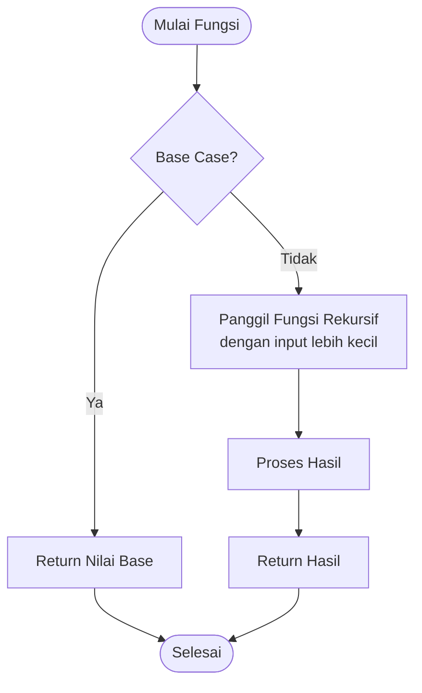
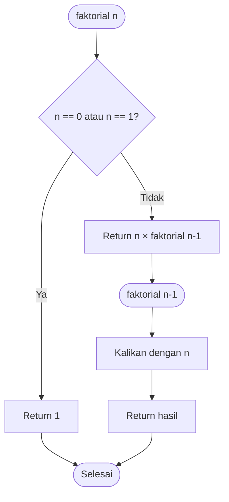
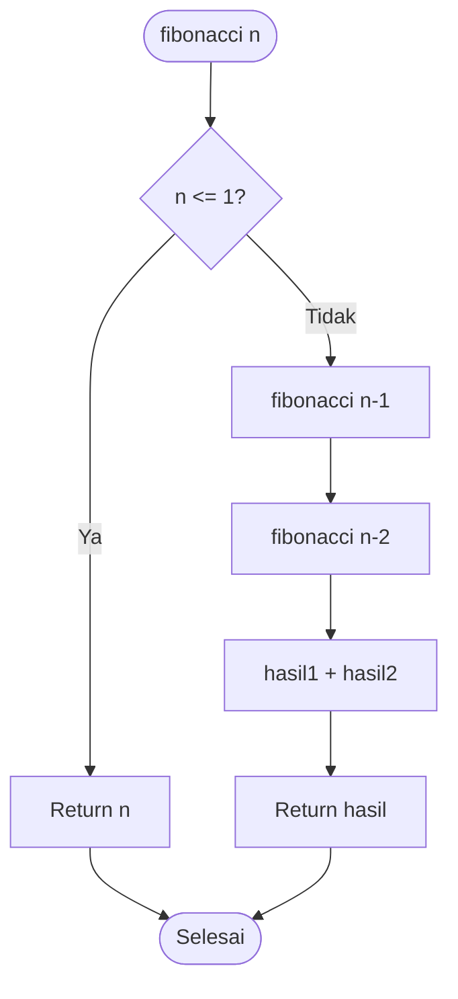
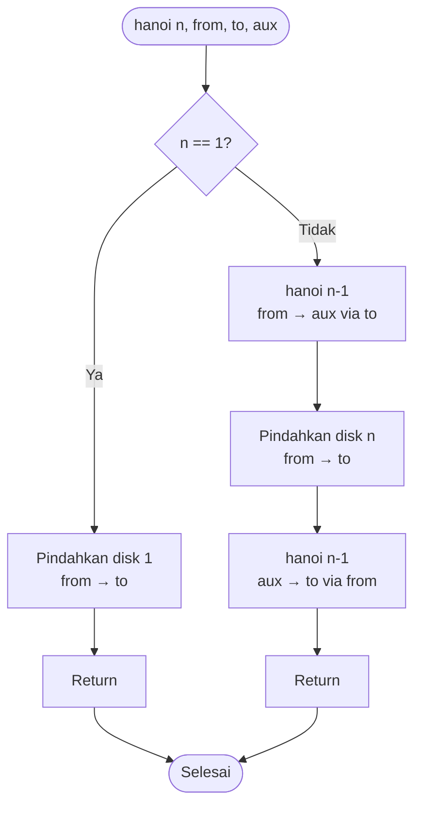

# Rekursi

## Apa itu Rekursi?

**Rekursi** adalah teknik pemrograman di mana sebuah fungsi memanggil dirinya sendiri untuk menyelesaikan masalah yang lebih besar dengan memecahnya menjadi sub-masalah yang lebih kecil.

### Analogi Rekursi

Seperti boneka matryoshka (boneka Rusia yang berisi boneka lebih kecil di dalamnya), rekursi memecah masalah besar menjadi masalah kecil yang strukturnya sama.

## Komponen Rekursi

### 1. Base Case (Kasus Dasar)

Kondisi yang menghentikan rekursi. Tanpa base case, rekursi akan berjalan tanpa henti (infinite recursion).

### 2. Recursive Case (Kasus Rekursif)

Bagian di mana fungsi memanggil dirinya sendiri dengan input yang lebih kecil.

## Flowchart: Struktur Rekursi

### Flowchart Konsep Rekursi Umum



### Flowchart Faktorial Rekursif



## Contoh Sederhana: Faktorial

### Iteratif vs Rekursif

```python
# Python - Iteratif
def faktorial_iteratif(n):
    hasil = 1
    for i in range(1, n + 1):
        hasil *= i
    return hasil

# Python - Rekursif
def faktorial_rekursif(n):
    # Base case
    if n == 0 or n == 1:
        return 1
    # Recursive case
    return n * faktorial_rekursif(n - 1)

# Penggunaan
print(faktorial_iteratif(5))   # 120
print(faktorial_rekursif(5))   # 120
```

```cpp
// C++ - Iteratif
int faktorialIteratif(int n) {
    int hasil = 1;
    for (int i = 1; i <= n; i++) {
        hasil *= i;
    }
    return hasil;
}

// C++ - Rekursif
int faktorialRekursif(int n) {
    // Base case
    if (n == 0 || n == 1) {
        return 1;
    }
    // Recursive case
    return n * faktorialRekursif(n - 1);
}
```

### Visualisasi Pemanggilan Faktorial(5)

```
faktorial(5)
    = 5 * faktorial(4)
    = 5 * (4 * faktorial(3))
    = 5 * (4 * (3 * faktorial(2)))
    = 5 * (4 * (3 * (2 * faktorial(1))))
    = 5 * (4 * (3 * (2 * 1)))
    = 5 * (4 * (3 * 2))
    = 5 * (4 * 6)
    = 5 * 24
    = 120
```

## Contoh: Fibonacci

### Flowchart Fibonacci Rekursif



### Implementasi

```python
# Python - Fibonacci Rekursif
def fibonacci(n):
    # Base case
    if n <= 1:
        return n
    # Recursive case
    return fibonacci(n - 1) + fibonacci(n - 2)

# Tampilkan deret Fibonacci
for i in range(10):
    print(fibonacci(i), end=" ")
# Output: 0 1 1 2 3 5 8 13 21 34
```

```cpp
// C++ - Fibonacci Rekursif
#include <iostream>
using namespace std;

int fibonacci(int n) {
    // Base case
    if (n <= 1) {
        return n;
    }
    // Recursive case
    return fibonacci(n - 1) + fibonacci(n - 2);
}

int main() {
    for (int i = 0; i < 10; i++) {
        cout << fibonacci(i) << " ";
    }
    cout << endl;
    // Output: 0 1 1 2 3 5 8 13 21 34

    return 0;
}
```

### Visualisasi Fibonacci(5)

```
                    fib(5)
                   /      \
              fib(4)        fib(3)
             /     \        /     \
        fib(3)   fib(2)  fib(2)  fib(1)
        /   \    /   \   /   \
    fib(2) fib(1) fib(1) fib(0) fib(1) fib(0)
    /   \
fib(1) fib(0)
```

## Rekursi dengan Lebih dari Satu Parameter

### Pangkat (Power)

```python
# Python
def pangkat(base, exp):
    # Base case
    if exp == 0:
        return 1
    if exp == 1:
        return base
    # Recursive case
    return base * pangkat(base, exp - 1)

print(pangkat(2, 5))  # 32
print(pangkat(3, 4))  # 81
```

### GCD (Greatest Common Divisor) - Algoritma Euclid

```python
# Python
def gcd(a, b):
    # Base case
    if b == 0:
        return a
    # Recursive case
    return gcd(b, a % b)

print(gcd(48, 18))  # 6
print(gcd(100, 35)) # 5
```

```cpp
// C++
int gcd(int a, int b) {
    // Base case
    if (b == 0) {
        return a;
    }
    // Recursive case
    return gcd(b, a % b);
}
```

## Rekursi pada Array

### Jumlah Elemen Array

```python
# Python
def sum_array(arr, n):
    # Base case
    if n == 0:
        return 0
    # Recursive case
    return arr[n-1] + sum_array(arr, n-1)

angka = [1, 2, 3, 4, 5]
print(sum_array(angka, len(angka)))  # 15
```

### Cari Nilai Maksimum

```cpp
// C++
#include <iostream>
#include <algorithm>
using namespace std;

int findMax(int arr[], int n) {
    // Base case
    if (n == 1) {
        return arr[0];
    }
    // Recursive case
    return max(arr[n-1], findMax(arr, n-1));
}

int main() {
    int angka[] = {3, 7, 2, 9, 4};
    int n = sizeof(angka) / sizeof(angka[0]);

    cout << "Nilai maksimum: " << findMax(angka, n) << endl;
    // Output: Nilai maksimum: 9

    return 0;
}
```

## Rekursi pada String

### Membalik String

```python
# Python
def reverse_string(s):
    # Base case
    if len(s) <= 1:
        return s
    # Recursive case
    return s[-1] + reverse_string(s[:-1])

print(reverse_string("hello"))  # "olleh"
print(reverse_string("Python")) # "nohtyP"
```

### Cek Palindrome

```python
# Python
def is_palindrome(s):
    # Base case
    if len(s) <= 1:
        return True
    # Recursive case
    if s[0] != s[-1]:
        return False
    return is_palindrome(s[1:-1])

print(is_palindrome("katak"))   # True
print(is_palindrome("python"))  # False
```

## Rekursi Binary Search

### Flowchart Binary Search Rekursif

```mermaid
flowchart TD
    Start([binary_search<br/>arr, x, low, high]) --> Check{low > high?}
    Check -->|Ya| Return1[Return -1<br/>tidak ditemukan]
    Check -->|Tidak| CalcMid[mid = low + high / 2]
    CalcMid --> CompMid{arr[mid] == x?}
    CompMid -->|Ya| Return2[Return mid]
    CompMid -->|Tidak| CompLess{arr[mid] > x?}
    CompLess -->|Ya| RecLeft[binary_search<br/>arr, x, low, mid-1]
    CompLess -->|Tidak| RecRight[binary_search<br/>arr, x, mid+1, high]
    RecLeft --> Return3[Return hasil]
    RecRight --> Return3
    Return1 --> End([Selesai])
    Return2 --> End
    Return3 --> End
```

### Implementasi

```python
# Python
def binary_search(arr, x, low, high):
    # Base case
    if low > high:
        return -1

    mid = (low + high) // 2

    # Ditemukan
    if arr[mid] == x:
        return mid
    # Cari di kiri
    elif arr[mid] > x:
        return binary_search(arr, x, low, mid - 1)
    # Cari di kanan
    else:
        return binary_search(arr, x, mid + 1, high)

# Contoh
angka = [1, 3, 5, 7, 9, 11, 13, 15]
x = 7
index = binary_search(angka, x, 0, len(angka) - 1)

if index != -1:
    print(f"Nilai {x} ditemukan di index {index}")
else:
    print(f"Nilai {x} tidak ditemukan")
```

## Rekursi Kompleks: Tower of Hanoi

### Masalah

Memindahkan n disk dari tiang A ke tiang C menggunakan tiang B sebagai perantara, dengan aturan:

- Hanya boleh memindahkan satu disk dalam satu waktu
- Disk yang lebih besar tidak boleh di atas disk yang lebih kecil

### Flowchart Tower of Hanoi



### Implementasi

```python
# Python
def hanoi(n, dari, ke, via):
    if n == 1:
        print(f"Pindahkan disk 1 dari {dari} ke {ke}")
        return

    # Pindahkan n-1 disk dari 'dari' ke 'via' menggunakan 'ke'
    hanoi(n - 1, dari, via, ke)

    # Pindahkan disk terbesar dari 'dari' ke 'ke'
    print(f"Pindahkan disk {n} dari {dari} ke {ke}")

    # Pindahkan n-1 disk dari 'via' ke 'ke' menggunakan 'dari'
    hanoi(n - 1, via, ke, dari)

# Contoh dengan 3 disk
print("Tower of Hanoi dengan 3 disk:")
hanoi(3, 'A', 'C', 'B')
```

Output:

```
Tower of Hanoi dengan 3 disk:
Pindahkan disk 1 dari A ke C
Pindahkan disk 2 dari A ke B
Pindahkan disk 1 dari C ke B
Pindahkan disk 3 dari A ke C
Pindahkan disk 1 dari B ke A
Pindahkan disk 2 dari B ke C
Pindahkan disk 1 dari A ke C
```

## Tail Recursion

**Tail recursion** adalah rekursi di mana pemanggilan rekursif adalah operasi terakhir dalam fungsi.

```python
# Non-tail recursion
def factorial_non_tail(n):
    if n == 1:
        return 1
    return n * factorial_non_tail(n - 1)  # Masih ada operasi * setelah rekursi

# Tail recursion
def factorial_tail(n, accumulator=1):
    if n == 1:
        return accumulator
    return factorial_tail(n - 1, n * accumulator)  # Rekursi adalah operasi terakhir

print(factorial_non_tail(5))   # 120
print(factorial_tail(5))       # 120
```

## Memoization - Optimasi Rekursi

Menyimpan hasil perhitungan sebelumnya untuk menghindari perhitungan ulang.

```python
# Python - Fibonacci dengan Memoization
def fibonacci_memo(n, memo={}):
    # Cek apakah sudah dihitung sebelumnya
    if n in memo:
        return memo[n]

    # Base case
    if n <= 1:
        return n

    # Simpan hasil ke memo
    memo[n] = fibonacci_memo(n - 1, memo) + fibonacci_memo(n - 2, memo)
    return memo[n]

# Jauh lebih cepat untuk n besar
print(fibonacci_memo(100))
```

## Perbandingan: Iteratif vs Rekursif

| Aspek             | Iteratif              | Rekursif                  |
| ----------------- | --------------------- | ------------------------- |
| Penggunaan memori | Lebih efisien         | Lebih banyak (call stack) |
| Kecepatan         | Umumnya lebih cepat   | Bisa lebih lambat         |
| Kompleksitas kode | Kadang lebih kompleks | Lebih elegan dan singkat  |
| Cocok untuk       | Loop sederhana        | Struktur data rekursif    |
| Risiko            | -                     | Stack overflow            |

## Kapan Menggunakan Rekursi?

✅ **Gunakan rekursi jika:**

- Masalah secara natural rekursif (Tree, Graph)
- Lebih mudah dipahami dengan pendekatan rekursif
- Struktur data rekursif (Binary Tree, Linked List)

❌ **Hindari rekursi jika:**

- Ada solusi iteratif yang sederhana
- Memerlukan performa tinggi
- Input sangat besar (risiko stack overflow)

## Latihan

1. **Sum of Digits**

   - Hitung jumlah digit dari sebuah angka
   - Contoh: 12345 → 15

2. **Pangkat Efisien**

   - Implementasi fast exponentiation
   - Contoh: 2^10 dengan lebih sedikit perkalian

3. **Print Pattern**

   - Cetak pola angka rekursif

   ```
   5 4 3 2 1 0 1 2 3 4 5
   ```

4. **Permutasi String**

   - Cetak semua permutasi dari string
   - Contoh: "ABC" → ABC, ACB, BAC, BCA, CAB, CBA

5. **Merge Sort**

   - Implementasi merge sort menggunakan rekursi

6. **Count Occurrences**

   - Hitung kemunculan elemen dalam array rekursif

7. **Nested Sum**
   - Hitung sum dari nested list
   - Contoh: [1, [2, 3], [4, [5, 6]]] → 21

## Rangkuman

- **Rekursi** adalah fungsi yang memanggil dirinya sendiri
- Harus memiliki **base case** untuk menghentikan rekursi
- **Recursive case** memecah masalah menjadi sub-masalah lebih kecil
- Cocok untuk masalah dengan struktur rekursif
- Gunakan **memoization** untuk optimasi
- Pertimbangkan trade-off antara elegance dan performance

---

**Sebelumnya**: [Fungsi dan Prosedur](./fungsi-prosedur.md) | **Selanjutnya**: [Algoritma Pencarian](./algoritma-pencarian.md)
