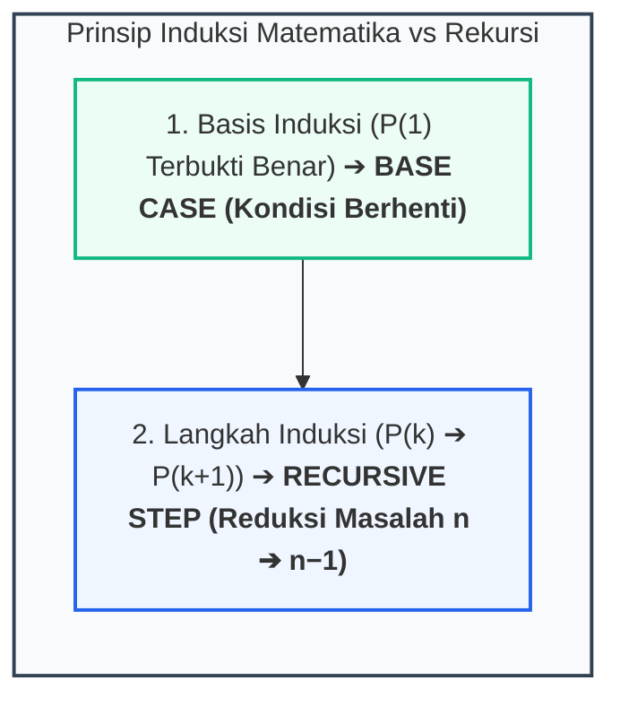
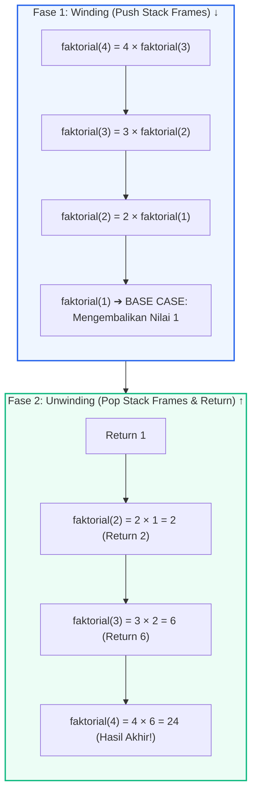
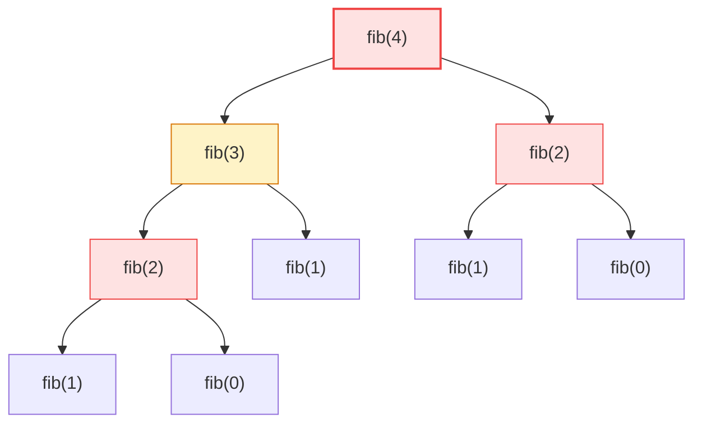

# 📘 Minggu 11: Teknik Rekursi, Call Stack Trace & Menara Hanoi

## 🎯 Capaian Pembelajaran (Sub-CPMK 5)
Setelah mempelajari modul ini, mahasiswa diharapkan mampu:
1. Memahami hakikat rekursi berlandaskan prinsip **Induksi Matematika** dan mengidentifikasi **Base Case** serta **Recursive Step**.
2. Memvisualisasikan siklus hidup memori: **Fase Winding (Push Frame)** dan **Fase Unwinding (Pop Frame)** pada Call Stack RAM.
3. Mengidentifikasi penyebab dan mencegah terjadinya bencana memori **Stack Overflow Error**.
4. Menganalisis pohon rekursi (**Recursion Tree**) dan memahami optimasi **Tail Call Optimization (TCO)** serta **Memoization**.
5. Memecahkan persoalan klasik komputasi **Menara Hanoi (*Tower of Hanoi*)** dan mengonversi algoritma rekursif menjadi bentuk iteratif.
6. Mengimplementasikan algoritma rekursif menggunakan C++ dan Python 3.

---

## 1. Hakikat Rekursi & Induksi Matematika

**Rekursi** adalah teknik pemrograman di mana sebuah fungsi **memanggil dirinya sendiri** untuk menyelesaikan versi sub-masalah yang lebih kecil hingga mencapai kondisi berhenti dasar:


```mermaid
flowchart TD
    subgraph InduksiMatematika["Prinsip Induksi Matematika vs Rekursi"]
        direction TB
        B1["1. Basis Induksi (P(1) Terbukti Benar) ➔ <b>BASE CASE (Kondisi Berhenti)</b>"]
        --> B2["2. Langkah Induksi (P(k) ➔ P(k+1)) ➔ <b>RECURSIVE STEP (Reduksi Masalah n ➔ n−1)</b>"]
    end

    style InduksiMatematika fill:#f8fafc,stroke:#334155,stroke-width:2px
    style B1 fill:#ecfdf5,stroke:#10b981,stroke-width:2px
    style B2 fill:#eff6ff,stroke:#2563eb,stroke-width:2px
```

::: info 📐 Formula: Definisi Rekursif Faktorial n!
> **`Faktorial(n) = 1`** jika `n = 0` atau `n = 1` *(Base Case)*
>
> **`Faktorial(n) = n × Faktorial(n − 1)`** jika `n > 1` *(Recursive Step)*
:::

---

## 2. Dekonstruksi Call Stack: Fase Winding & Unwinding

Ketika `faktorial(4)` dieksekusi, pemrosesan memori terjadi dalam dua fase:


```mermaid
flowchart TD
    subgraph Winding["Fase 1: Winding (Push Stack Frames) ↓"]
        direction TB
        W4["faktorial(4) = 4 × faktorial(3)"]
        --> W3["faktorial(3) = 3 × faktorial(2)"]
        --> W2["faktorial(2) = 2 × faktorial(1)"]
        --> W1["faktorial(1) ➔ BASE CASE: Mengembalikan Nilai 1"]
    end

    subgraph Unwinding["Fase 2: Unwinding (Pop Stack Frames & Return) ↑"]
        direction TB
        U1["Return 1"]
        --> U2["faktorial(2) = 2 × 1 = 2 (Return 2)"]
        --> U3["faktorial(3) = 3 × 2 = 6 (Return 6)"]
        --> U4["faktorial(4) = 4 × 6 = 24 (Hasil Akhir!)"]
    end

    Winding --> Unwinding

    style Winding fill:#eff6ff,stroke:#2563eb,stroke-width:2px
    style Unwinding fill:#ecfdf5,stroke:#10b981,stroke-width:2px
```

::: danger ⚠️ Bencana Stack Overflow
Jika fungsi rekursif **tidak memiliki Base Case** atau parameter tidak pernah mencapai Base Case, fungsi akan terus memanggil dirinya tanpa henti. Setiap pemanggilan mengonsumsi ~32-64 Bytes di memori Stack RAM hingga ruang stack habis dan memicu crash: **`Stack Overflow Error (Segmentation Fault)`**.
:::

---

## 3. Pohon Rekursi (Recursion Tree) Deret Fibonacci

Pada fungsi Fibonacci rekursif naif `F(n) = F(n-1) + F(n-2)`, pemanggilan fungsi bercabang dua membentuk **Pohon Rekursi Biner**:


```mermaid
flowchart TD
    F4["fib(4)"] --> F3["fib(3)"]
    F4 --> F2A["fib(2)"]

    F3 --> F2B["fib(2)"]
    F3 --> F1A["fib(1)"]

    F2A --> F1B["fib(1)"]
    F2A --> F0A["fib(0)"]

    F2B --> F1C["fib(1)"]
    F2B --> F0B["fib(0)"]

    style F4 fill:#fee2e2,stroke:#ef4444,stroke-width:2px
    style F3 fill:#fef3c7,stroke:#d97706,stroke-width:1px
    style F2A fill:#fee2e2,stroke:#ef4444,stroke-width:1px
    style F2B fill:#fee2e2,stroke:#ef4444,stroke-width:1px
```

* **Kompleksitas Waktu Eksponensial:** Pohon memiliki kedalaman $N$ dengan total pemanggilan mencapai **`O(2^N)`**!
* **Masalah Redundansi:** Sub-masalah `fib(2)` dihitung berulang kali secara sia-sia.
* **Solusi Optimasi (Memoization):** Simpan hasil yang sudah dihitung dalam tabel memori sehingga kompleksitas anjlok menjadi linier **`O(N)`**.

---

## 4. Mahakarya Algoritma: Teka-teki Menara Hanoi (*Tower of Hanoi*)

Teka-teki legendaris memindahkan $N$ piringan berdiameter berbeda dari **Tiang Asal (A)** ke **Tiang Tujuan (C)** dengan bantuan **Tiang Perantara (B)** mengikuti 2 aturan:
1. Hanya 1 piringan yang boleh dipindahkan dalam satu waktu.
2. Piringan besar **tidak boleh diletakkan di atas piringan yang lebih kecil**.

::: info 📐 Formula: Logika Divide and Conquer Menara Hanoi
> Untuk memindahkan $N$ piringan dari Tiang `Asal` ke `Tujuan`:
> 1. Pindahkan $(N − 1)$ piringan dari `Asal` ke `Bantuan` (Menggunakan rekursi).
> 2. Pindahkan 1 piringan terbesar (ke-$N$) langsung dari `Asal` ke `Tujuan`.
> 3. Pindahkan $(N − 1)$ piringan dari `Bantuan` ke `Tujuan` (Menggunakan rekursi).
>
> **`Total Langkah Minimum = 2^N − 1`**
:::

---

## 5. Implementasi Kode Hands-on Dual-Stack (C++ & Python 3)

Berikut implementasi komparasi rekursi faktorial, Fibonacci teroptimasi memoization, dan solver Menara Hanoi:

::: code-group
```cpp [C++]
#include <iostream>
#include <vector>

using namespace std;

// 1. Faktorial Rekursif
long long faktorial(int n) {
    if (n <= 1) return 1; // Base Case
    return n * faktorial(n - 1); // Recursive Step
}

// 2. Fibonacci dengan Optimasi Memoization O(N)
long long fibonacciMemo(int n, vector<long long>& memo) {
    if (n <= 0) return 0;
    if (n == 1) return 1;
    if (memo[n] != -1) return memo[n]; // Ambil dari cache jika sudah ada

    memo[n] = fibonacciMemo(n - 1, memo) + fibonacciMemo(n - 2, memo);
    return memo[n];
}

// 3. Solver Teka-teki Menara Hanoi
void solveHanoi(int n, char asal, char tujuan, char bantuan, int& stepCount) {
    if (n == 1) {
        stepCount++;
        cout << "Langkah " << stepCount << ": Pindahkan Piringan 1 dari Tiang " << asal << " ➔ Tiang " << tujuan << endl;
        return;
    }

    // Langkah 1: Pindahkan N-1 piringan dari Asal ke Bantuan
    solveHanoi(n - 1, asal, bantuan, tujuan, stepCount);

    // Langkah 2: Pindahkan piringan terbesar ke Tujuan
    stepCount++;
    cout << "Langkah " << stepCount << ": Pindahkan Piringan " << n << " dari Tiang " << asal << " ➔ Tiang " << tujuan << endl;

    // Langkah 3: Pindahkan N-1 piringan dari Bantuan ke Tujuan
    solveHanoi(n - 1, bantuan, tujuan, asal, stepCount);
}

int main() {
    cout << "==================================================" << endl;
    cout << "  TEKNIK REKURSI & MENARA HANOI (C++ STANDAR)     " << endl;
    cout << "==================================================" << endl;

    // Uji Faktorial
    cout << "1. 5! = " << faktorial(5) << endl;

    // Uji Fibonacci Teroptimasi Memoization
    int nFib = 40;
    vector<long long> memo(nFib + 1, -1);
    cout << "2. Fibonacci ke-" << nFib << " (O(N) Memoization) = " << fibonacciMemo(nFib, memo) << endl;

    // Uji Menara Hanoi (N = 3 Piringan -> 2^3 - 1 = 7 Langkah)
    cout << "\n3. Solusi Menara Hanoi untuk N = 3 Piringan:" << endl;
    int totalLangkah = 0;
    solveHanoi(3, 'A', 'C', 'B', totalLangkah);
    cout << "-> Total Langkah Minimum Terpakai: " << totalLangkah << " Langkah." << endl;

    cout << "==================================================" << endl;
    return 0;
}
```

```python [Python 3]
from functools import lru_cache

# 1. Faktorial Rekursif
def faktorial(n: int) -> int:
    if n <= 1:
        return 1
    return n * faktorial(n - 1)


# 2. Fibonacci dengan LRU Cache Memoization Otomatis O(N)
@lru_cache(maxsize=None)
def fibonacci(n: int) -> int:
    if n <= 0:
        return 0
    if n == 1:
        return 1
    return fibonacci(n - 1) + fibonacci(n - 2)


# 3. Solver Menara Hanoi
def solve_hanoi(n: int, asal: str, tujuan: str, bantuan: str, counter: list):
    if n == 1:
        counter[0] += 1
        print(f"Langkah {counter[0]}: Pindahkan Piringan 1 dari Tiang {asal} ➔ Tiang {tujuan}")
        return

    solve_hanoi(n - 1, asal, bantuan, tujuan, counter)
    counter[0] += 1
    print(f"Langkah {counter[0]}: Pindahkan Piringan {n} dari Tiang {asal} ➔ Tiang {tujuan}")
    solve_hanoi(n - 1, bantuan, tujuan, asal, counter)


def main():
    print("=" * 50)
    print("  TEKNIK REKURSI & MENARA HANOI (PYTHON 3)        ")
    print("=" * 50)

    print(f"1. 5! = {faktorial(5)}")

    n_fib = 40
    print(f"2. Fibonacci ke-{n_fib} (Memoized) = {fibonacci(n_fib)}")

    print("\n3. Solusi Menara Hanoi untuk N = 3 Piringan:")
    langkah = [0]
    solve_hanoi(3, 'A', 'C', 'B', langkah)
    print(f"-> Total Langkah Minimum Terpakai: {langkah[0]} Langkah.")
    print("=" * 50)


if __name__ == "__main__":
    main()
```
:::

---

## 6. Rangkuman & Latihan Mandiri

::: tip 💡 Rangkuman Konsep Kunci
1. **Dua Komponen Wajib:** Pastikan Base Case terdefinisi mutlak dan parameter selalu bergerak menuju Base Case demi mencegah *Stack Overflow*.
2. **Call Stack Unwinding:** Hasil komputasi rekursif dihitung saat Stack Frame di-pop mundur (*unwinding phase*).
3. **Pohon Rekursi:** Waspadai rekursi ganda yang memicu ledakan kompleksitas $O(2^n)$; selalu gunakan *memoization* untuk mereduksinya menjadi $O(n)$.
4. **Divide and Conquer:** Rekursi adalah alat paling elegan untuk memecahkan persoalan partisi seperti Menara Hanoi dan penjelajahan pohon/grafik.
:::

### 📝 Tugas Praktikum 11 (Mandiri)
1. **Perpangkatan Cepat Rekursif ($O(\log n)$):** Rancang fungsi rekursif `double power(double a, int b)` untuk menghitung $a^b$ dengan memanfaatkan sifat:
   - Jika $b$ genap: $a^b = (a^{b/2})^2$
   - Jika $b$ ganjil: $a^b = a \times a^{b-1}$
   Buktikan bahwa kompleksitasnya adalah $O(\log b)$!
2. **Pembalikan Teks Rekursif:** Buat fungsi rekursif yang mencetak kalimat string secara terbalik tanpa menggunakan perulangan `for`/`while` dan tanpa membalik array asli.
