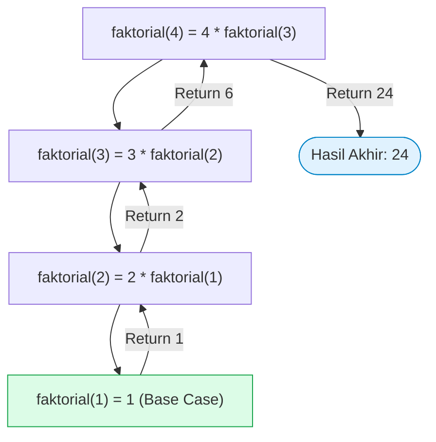

# Minggu 11: Teknik Rekursi & Call Stack Memory

::: tip CAPAIAN PEMBELAJARAN (SUB-CPMK 5)
- **CPMK Terkait:** CPMK0106 (Konsep Matematika Informatika & Logika Algoritma)
- **CPL Terkait:** CPL01 (Pengetahuan Teori), CPL03 (Problem Solving Dinamis)
- **Indikator:** Mahasiswa mampu menguraikan struktur dasar fungsi rekursif (Base Case & Recursive Case), memvisualisasikan mekanisme Call Stack RAM, mencegah terjadinya *Stack Overflow*, serta mengonversi algoritma rekursif menjadi iteratif.
:::

---

## 1. Hakikat dan Struktur Rekursi

**Rekursi** adalah teknik pemrograman di mana sebuah fungsi **memanggil dirinya sendiri** untuk menyelesaikan versi masalah yang lebih kecil hingga mencapai kondisi berhenti dasar (*base case*).

Sebuah fungsi rekursif **wajib memiliki 2 bagian mutlak**:
1. **Base Case (Kasus Dasar):** Kondisi terminasi di mana fungsi berhenti memanggil dirinya dan langsung mengembalikan nilai dasar.
2. **Recursive Step (Langkah Rekursif):** Instruksi di mana fungsi memanggil dirinya sendiri dengan parameter yang bergerak mendekati Base Case.

$$Faktorial:  n! = \begin{cases} 1 & jika  n = 0  atau  n = 1 \quad (Base Case) \\ n × (n-1)! & jika  n > 1 \quad (Recursive Case) \end{cases}$$


```mermaid
graph TD
    F4["faktorial(4) = 4 * faktorial(3)"] --> F3["faktorial(3) = 3 * faktorial(2)"]
    F3 --> F2["faktorial(2) = 2 * faktorial(1)"]
    F2 --> F1["faktorial(1) = 1 (Base Case)"]
    F1 -- Return 1 --> F2
    F2 -- Return 2 --> F3
    F3 -- Return 6 --> F4
    F4 -- Return 24 --> Out([Hasil Akhir: 24])
    style F1 fill:#dcfce7,stroke:#16a34a
    style Out fill:#e0f2fe,stroke:#0284c7
```

---

## 2. Visualisasi Call Stack & Risiko *Stack Overflow*

Setiap kali fungsi dipanggil, sistem komputasi mengalokasikan satu *Stack Frame* di memori RAM. Jika fungsi rekursif tidak memiliki Base Case yang benar, pemanggilan tanpa akhir akan memicu **Stack Overflow Error** (memori stack habis).

::: code-group
```cpp [C++]
#include <iostream>
using namespace std;

// 1. Faktorial Rekursif
long long faktorial(int n) {
    if (n <= 1) return 1; // Base Case
    return n * faktorial(n - 1); // Recursive Step
}

// 2. Fibonacci Rekursif
int fibonacci(int n) {
    if (n <= 0) return 0; // Base Case 1
    if (n == 1) return 1; // Base Case 2
    return fibonacci(n - 1) + fibonacci(n - 2);
}

int main() {
    cout << "5! = " << faktorial(5) << endl;
    cout << "Fibonacci ke-7 = " << fibonacci(7) << endl;
    return 0;
}
```

```python [Python 3]
def faktorial(n: int) -> int:
    if n <= 1:
        return 1
    return n * faktorial(n - 1)

def fibonacci(n: int) -> int:
    if n <= 0:
        return 0
    if n == 1:
        return 1
    return fibonacci(n - 1) + fibonacci(n - 2)

print("5! =", faktorial(5))
print("Fibonacci ke-7 =", fibonacci(7))
```
:::

---

## 📝 Evaluasi & Latihan Mandiri (Sub-CPMK 5)

1. Buatlah trace table alur pemanggilan stack untuk `fibonacci(4)`!
2. Rancanglah fungsi rekursif untuk menghitung perpangkatan $a^b$ ($a$ pangkat $b$).
3. Pecahkan teka-teki klasik **Menara Hanoi (*Tower of Hanoi*)** untuk memindahkan `N` piringan dari tiang sumber ke tiang tujuan secara rekursif!
