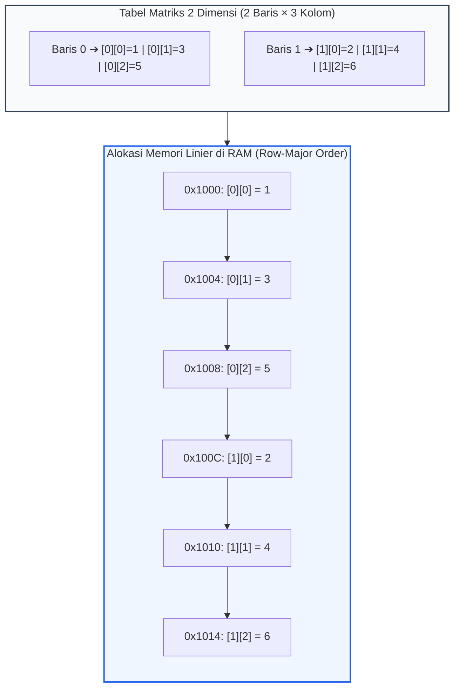
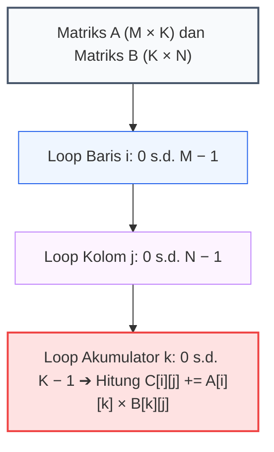
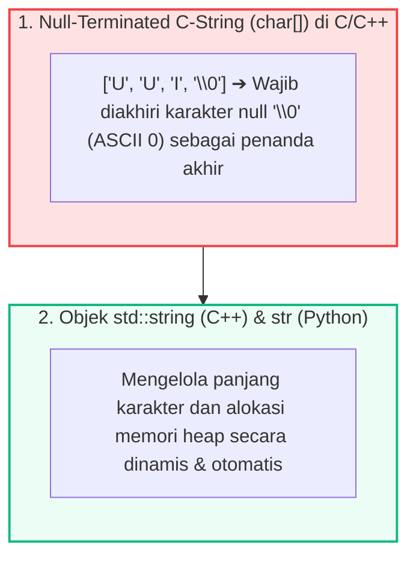

# 📘 Minggu 09: Array Multidimensi (Matriks) & Manipulasi String

## 🎯 Capaian Pembelajaran (Sub-CPMK 4)
Setelah mempelajari modul ini, mahasiswa diharapkan mampu:
1. Memahami representasi array 2 dimensi (matriks) dalam memori fisik RAM (**Row-Major vs Column-Major Order**) dan membuktikan rumus pengalamatannya.
2. Mengimplementasikan operasi aljabar matriks: **Penjumlahan ($O(n^2)$)** dan **Perkalian Matriks ($O(n^3)$)**.
3. Memahami arsitektur representasi teks: **ASCII**, **Unicode (UTF-8)**, *Null-Terminated C-Strings* (`char[]`), dan *Dynamic String Object*.
4. Mengimplementasikan algoritma pemrosesan string: **Validasi Palindrom (Two-Pointer)** dan **Enkripsi Caesar Cipher (Modulo 26)**.
5. Menyusun kode matriks dan manipulasi teks yang efisien menggunakan C++ dan Python 3.

---

## 1. Array 2 Dimensi & Pengalamatan Memori Row-Major

**Array 2 Dimensi (Matriks)** mengorganisasikan data dalam bentuk kisi-kisi berdimensi **Baris (*Row*)** dan **Kolom (*Column*)**. Meskipun secara konseptual berbentuk tabel 2D, memori fisik RAM komputer bersifat linier 1D:



::: info 📐 Formula: Rumus Pengalamatan Matriks 2D (Row-Major Order)
> **`Alamat(M[i][j]) = Base_Address + (i × JUMLAH_KOLOM + j) × Ukuran_Tipe_Data`**
>
> * **`i`:** Indeks baris yang dicari ($0 \le i < \text{BARIS}$).
> * **`j`:** Indeks kolom yang dicari ($0 \le j < \text{KOLOM}$).
> * **`JUMLAH_KOLOM`:** Total kapasitas kolom per baris.
:::

---

## 2. Aljabar Matriks: Perkalian Matriks $O(n^3)$

Dua buah matriks $A$ ($M \times K$) dan $B$ ($K \times N$) dapat dikalikan jika dan hanya jika **jumlah kolom matriks $A$ sama dengan jumlah baris matriks $B$**:

::: info 📐 Formula: Perkalian Matriks (Dot Product)
> **`C[i][j] = Σ ( A[i][k] × B[k][j] )` untuk `k = 0` hingga `K − 1`**
>
> Kompleksitas waktu untuk matriks persegi $N \times N$ adalah **`O(N³)`** (3 lapis nested loops).
:::



---

## 3. Representasi Karakter & Arsitektur String

Teks adalah kumpulan karakter diskrit yang dienkripsi menjadi kode numerik biner:
* **ASCII (American Standard Code for Information Interchange):** 7-bit / 8-bit (Karakter `'A'` = 65, `'a'` = 97, `'0'` = 48).
* **Unicode (UTF-8):** Pengkodean variabel (1 hingga 4 Bytes) yang mampu merepresentasikan seluruh aksara dunia dan emoji.



---

## 4. Implementasi Kode Hands-on Dual-Stack (C++ & Python 3)

Berikut adalah program komputasi lengkap untuk perkalian matriks 2D, validasi string palindrom, dan algoritma enkripsi teks klasik Caesar Cipher:

::: code-group
```cpp [C++]
#include <iostream>
#include <iomanip>
#include <string>
#include <cctype>

using namespace std;

// 1. Perkalian Matriks 2D O(N^3)
void kaliMatriks(const int A[2][3], const int B[3][2], int C[2][2]) {
    for (int i = 0; i < 2; i++) {
        for (int j = 0; j < 2; j++) {
            C[i][j] = 0;
            for (int k = 0; k < 3; k++) {
                C[i][j] += A[i][k] * B[k][j];
            }
        }
    }
}

// 2. Validasi Palindrom (Two-Pointer String)
bool isPalindrom(const string& teks) {
    int kiri = 0;
    int kanan = teks.length() - 1;
    while (kiri < kanan) {
        // Lewati spasi/non-alfanumerik
        while (kiri < kanan && !isalnum(teks[kiri])) kiri++;
        while (kiri < kanan && !isalnum(teks[kanan])) kanan--;

        if (tolower(teks[kiri]) != tolower(teks[kanan])) {
            return false; // Karakter tidak cocok -> Bukan Palindrom
        }
        kiri++;
        kanan--;
    }
    return true;
}

// 3. Enkripsi Caesar Cipher (Modulo 26)
string caesarCipher(const string& teks, int shift) {
    string hasil = "";
    for (char c : teks) {
        if (isupper(c)) {
            hasil += char((c - 'A' + shift) % 26 + 'A');
        } else if (islower(c)) {
            hasil += char((c - 'a' + shift) % 26 + 'a');
        } else {
            hasil += c; // Simbol/spasi tidak diubah
        }
    }
    return hasil;
}

int main() {
    cout << "==================================================" << endl;
    cout << "  MATRIKS 2D & MANIPULASI STRING (C++ STANDAR)    " << endl;
    cout << "==================================================" << endl;

    // A. Uji Perkalian Matriks (2x3 dikali 3x2 -> 2x2)
    int A[2][3] = {{1, 2, 3}, {4, 5, 6}};
    int B[3][2] = {{7, 8}, {9, 1}, {2, 3}};
    int C[2][2];

    kaliMatriks(A, B, C);
    cout << "1. Hasil Perkalian Matriks (2x2):" << endl;
    for (int i = 0; i < 2; i++) {
        for (int j = 0; j < 2; j++) {
            cout << setw(5) << C[i][j] << " ";
        }
        cout << endl;
    }

    // B. Uji Validasi Palindrom
    cout << "\n2. Uji Palindrom:" << endl;
    string kata1 = "Kasur ini rusak";
    string kata2 = "Algoritma Pemrograman";
    cout << "• '" << kata1 << "' ➔ " << (isPalindrom(kata1) ? "PALINDROM" : "BUKAN") << endl;
    cout << "• '" << kata2 << "' ➔ " << (isPalindrom(kata2) ? "PALINDROM" : "BUKAN") << endl;

    // C. Uji Caesar Cipher (Shift = 3)
    cout << "\n3. Enkripsi Caesar Cipher (Shift +3):" << endl;
    string pesan = "INFORMATIKA UUI 2026";
    string terenkripsi = caesarCipher(pesan, 3);
    cout << "• Pesan Asli   : " << pesan << endl;
    cout << "• Terenkripsi  : " << terenkripsi << endl;
    cout << "==================================================" << endl;

    return 0;
}
```

```python [Python 3]
def kali_matriks(A: list, B: list) -> list:
    """Perkalian Matriks 2D A (M x K) dan B (K x N) -> C (M x N)."""
    M, K = len(A), len(A[0])
    N = len(B[0])
    C = [[0] * N for _ in range(M)]

    for i in range(M):
        for j in range(N):
            total = 0
            for k in range(K):
                total += A[i][k] * B[k][j]
            C[i][j] = total
    return C


def is_palindrom(teks: str) -> bool:
    """Validasi Palindrom menggunakan Two-Pointer String."""
    bersih = [c.lower() for c in teks if c.isalnum()]
    kiri, kanan = 0, len(bersih) - 1
    while kiri < kanan:
        if bersih[kiri] != bersih[kanan]:
            return False
        kiri += 1
        kanan -= 1
    return True


def caesar_cipher(teks: str, shift: int) -> str:
    """Enkripsi teks dengan algoritma pergeseran Caesar Cipher Modulo 26."""
    hasil = []
    for c in teks:
        if c.isupper():
            hasil.append(chr((ord(c) - ord('A') + shift) % 26 + ord('A')))
        elif c.islower():
            hasil.append(chr((ord(c) - ord('a') + shift) % 26 + ord('a')))
        else:
            hasil.append(c)
    return "".join(hasil)


def main():
    print("=" * 50)
    print("  MATRIKS 2D & MANIPULASI STRING (PYTHON 3)       ")
    print("=" * 50)

    # A. Perkalian Matriks
    A = [[1, 2, 3], [4, 5, 6]]
    B = [[7, 8], [9, 1], [2, 3]]
    C = kali_matriks(A, B)

    print("1. Hasil Perkalian Matriks (2x2):")
    for baris in C:
        print("\t".join(f"{val:4d}" for val in baris))

    # B. Uji Palindrom
    print("\n2. Uji Palindrom:")
    k1 = "Kasur ini rusak"
    k2 = "Algoritma Pemrograman"
    print(f"• '{k1}' ➔ {'PALINDROM' if is_palindrom(k1) else 'BUKAN'}")
    print(f"• '{k2}' ➔ {'PALINDROM' if is_palindrom(k2) else 'BUKAN'}")

    # C. Caesar Cipher
    print("\n3. Enkripsi Caesar Cipher (Shift +3):")
    pesan = "INFORMATIKA UUI 2026"
    terenkripsi = caesar_cipher(pesan, 3)
    print(f"• Pesan Asli  : {pesan}")
    print(f"• Terenkripsi : {terenkripsi}")
    print("=" * 50)


if __name__ == "__main__":
    main()
```
:::

---

## 5. Rangkuman & Latihan Mandiri

::: tip 💡 Rangkuman Konsep Kunci
1. **Row-Major Layout:** Matriks 2D disimpan secara sekuensial per baris di RAM.
2. **Kompleksitas Matriks:** Penjumlahan matriks berordo $O(n^2)$, sedangkan perkalian matriks standar membutuhkan 3 lapis nested loop $O(n^3)$.
3. **Null Terminator:** C-String mengandalkan karakter `'\0'` untuk mendeteksi batas akhir teks; ketiadaan karakter ini akan memicu pembacaan memori liar.
4. **Modulo 26:** Operasi `(c + shift) % 26` memastikan karakter selalu berputar dalam 26 huruf alfabet alfabetik secara aman.
:::

### 📝 Tugas Praktikum 9 (Mandiri)
1. **Transpose Matriks:** Buatlah fungsi untuk menghitung **Transpose Matriks** $A^T$ di mana elemen baris diubah menjadi elemen kolom ($A^T[j][i] = A[i][j]$) untuk matriks berukuran $M \times N$.
2. **Hitung Frekuensi Karakter (Histogram Huruf):** Buat program untuk menghitung frekuensi kemunculan setiap huruf (A-Z) pada sebuah paragraf teks menggunakan array frekuensi berukuran 26.
3. **Pencarian Substring Sederhana:** Implementasikan algoritma pencarian teks naif (*Brute Force Substring Search*) untuk menemukan indeks kemunculan pertama kata kunci `Pola` di dalam kalimat panjang `Teks`.
