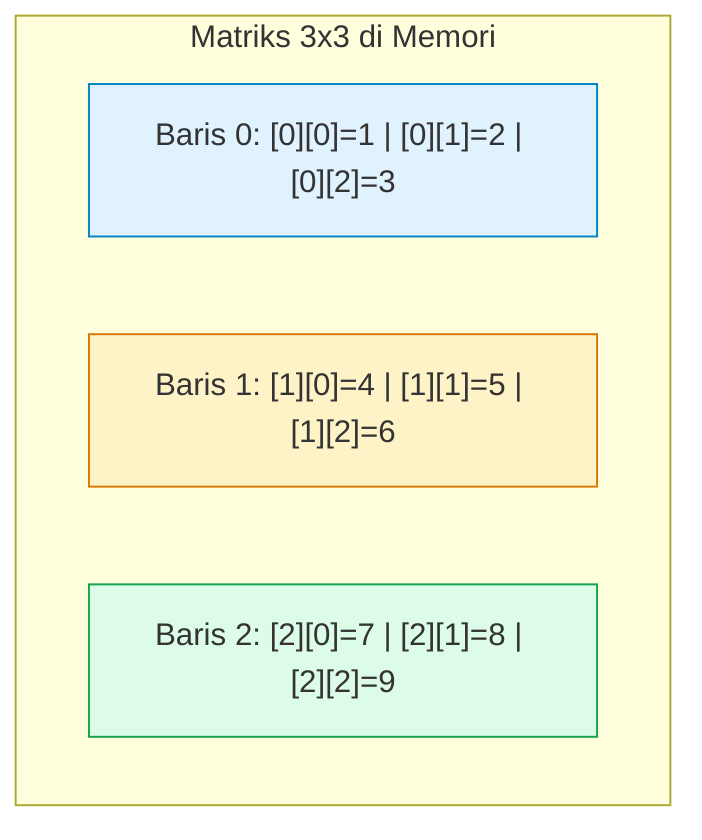

# Minggu 9: Array Multidimensi & Manipulasi String

::: tip CAPAIAN PEMBELAJARAN (SUB-CPMK 4)
- **CPMK Terkait:** CPMK0101 (Konsep Dasar Pemrograman)
- **CPL Terkait:** CPL01 (Pengetahuan Dasar), CPL04 (Solusi Komputasi)
- **Indikator:** Mahasiswa mampu mengimplementasikan representasi matriks 2 dimensi (baris & kolom), operasi aritmatika matriks, pemrosesan array of characters / string, serta manipulasi teks (validasi palindrom, pencarian substring).
:::

---

## 1. Konsep Array 2 Dimensi (Matriks)

**Array 2 Dimensi** dapat dianalogikan sebagai tabel atau matriks matematika yang terdiri atas **baris (*row*)** dan **kolom (*column*)**. Setiap elemen diidentifikasi dengan pasangan koordinat `[baris][kolom]`.



---

## 2. Operasi Penjumlahan Matriks 2D

Dua buah matriks $A$ dan $B$ berordo sama ($m × n$) dapat dijumlahkan dengan menjumlahkan elemen-elemen yang seletak:
$$C[i][j] = A[i][j] + B[i][j]$$

::: code-group
```cpp [C++]
#include <iostream>
using namespace std;

int main() {
    const int BARIS = 2, KOLOM = 3;
    int A[BARIS][KOLOM] = {{1, 3, 5}, {2, 4, 6}};
    int B[BARIS][KOLOM] = {{9, 7, 5}, {8, 6, 4}};
    int C[BARIS][KOLOM];

    cout << "=== HASIL PENJUMLAHAN MATRIKS (A + B) ===" << endl;
    for (int i = 0; i < BARIS; i++) {
        for (int j = 0; j < KOLOM; j++) {
            C[i][j] = A[i][j] + B[i][j];
            cout << C[i][j] << "\t";
        }
        cout << endl;
    }
    return 0;
}
```

```python [Python 3]
A = [[1, 3, 5], [2, 4, 6]]
B = [[9, 7, 5], [8, 6, 4]]

C = []
print("=== HASIL PENJUMLAHAN MATRIKS (A + B) ===")
for i in range(len(A)):
    baris_c = []
    for j in range(len(A[0])):
        baris_c.append(A[i][j] + B[i][j])
    C.append(baris_c)

for baris in C:
    print("\t".join(map(str, baris)))
```
:::

---

## 3. Manipulasi String & Deteksi Palindrom

**String** pada hakikatnya adalah larik dari karakter (*array of characters*). String mendukung berbagai operasi teks penting:

::: code-group
```cpp [C++]
#include <iostream>
#include <string>
#include <algorithm>
using namespace std;

bool isPalindrom(string kata) {
    int kiri = 0;
    int kanan = kata.length() - 1;
    while (kiri < kanan) {
        if (tolower(kata[kiri]) != tolower(kata[kanan])) {
            return false;
        }
        kiri++;
        kanan--;
    }
    return true;
}

int main() {
    string teks = "Katak";
    if (isPalindrom(teks)) {
        cout << "'" << teks << "' adalah KATA PALINDROM." << endl;
    } else {
        cout << "'" << teks << "' BUKAN kata palindrom." << endl;
    }
    return 0;
}
```

```python [Python 3]
def is_palindrom(kata: str) -> bool:
    kata_bersih = kata.lower().replace(" ", "")
    return kata_bersih == kata_bersih[::-1]

kata_uji = "Kasur ini rusak"
if is_palindrom(kata_uji):
    print(f"'{kata_uji}' adalah KALIMAT PALINDROM.")
else:
    print(f"'{kata_uji}' BUKAN palindrom.")
```
:::

---

## 📝 Evaluasi & Latihan Mandiri (Sub-CPMK 4)

1. Buatlah program untuk menghitung **perkalian dua buah matriks** $A_{m × k} × B_{k × n} = C_{m × n}$.
2. Buatlah program enkripsi teks sederhana menggunakan **Caesar Cipher** (menggeser setiap karakter sebanyak `k` langkah dalam alfabet).
