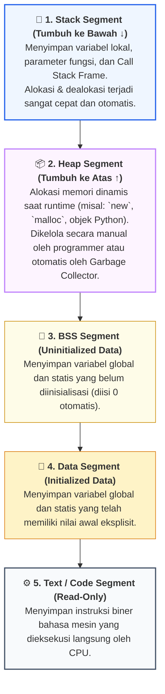
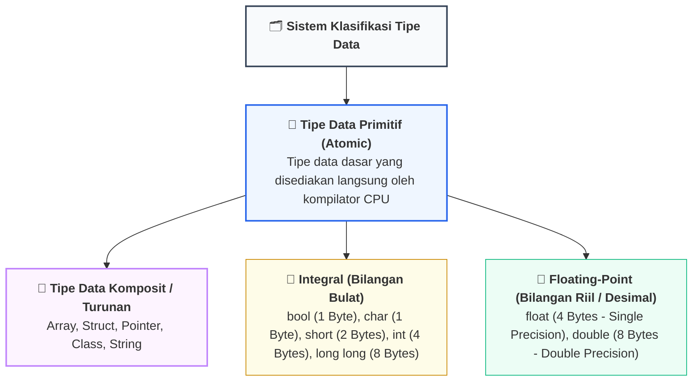
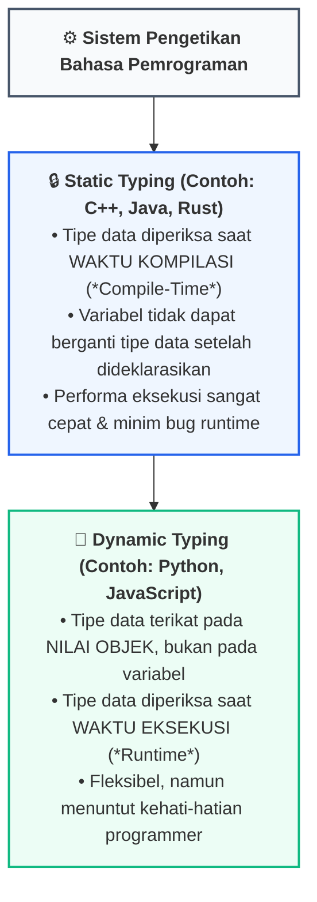

# 📘 Minggu 02: Variabel, Tipe Data & Dekonstruksi Memori Komputer

## 🎯 Capaian Pembelajaran (Sub-CPMK 2)
Setelah mempelajari modul ini, mahasiswa diharapkan mampu:
1. Memahami arsitektur memori program komputer (**Stack, Heap, Data, BSS, Text Segment**) dan peran variabel sebagai pemetaan alamat fisik RAM.
2. Mengklasifikasikan tipe data primitif dan memahami representasi binernya: **Two's Complement** untuk integer dan standar **IEEE 754** untuk *floating-point*.
3. Menganalisis dan mengantisipasi bahaya komputasi: **Integer Overflow/Underflow** serta **Floating-Point Imprecision**.
4. Membedakan sistem pengetikan bahasa (**Static vs Dynamic Typing**) dan melakukan konversi tipe data (**Type Casting**) secara aman.
5. Mengimplementasikan inspeksi memori, ukuran byte, dan konversi tipe data menggunakan C++ dan Python 3.

---

## 1. Arsitektur Memori Program & Abstraksi Variabel

Ketika sebuah program dijalankan oleh Sistem Operasi, sistem operasi mengalokasikan ruang alamat memori virtual (*Virtual Memory Address Space*) di RAM yang terbagi menjadi 5 segmen utama:



### Variabel sebagai Abstraksi Alamat Memori
**Variabel** pada hakikatnya adalah nama simbolik yang diberikan programmer untuk merujuk pada alamat memori fisik heksadesimal tertentu di RAM.

::: info 🔍 Anatomi 4 Atribut Variabel
1. **Identifier (Nama):** Label simbolik untuk kemudahan manusia (contoh: `umurMahasiswa`).
2. **Data Type (Tipe Data):** Menentukan jumlah alokasi byte dan interpretasi bit biner.
3. **Memory Address (Alamat Fisik):** Nomor indeks heksadesimal unik di RAM (contoh: `0x7ffee4b6a8`).
4. **Value (Nilai Data):** Pola bit biner aktual yang tersimpan di dalam sel memori tersebut.
:::

---

## 2. Taksonomi Tipe Data Primitif & Representasi Biner



### Tabel Spesifikasi Tipe Data Standar C++ / Arsitektur 64-bit

| Tipe Data | Ukuran | Representasi Bit Internal | Rentang Nilai Efektif |
| :--- | :---: | :--- | :--- |
| **`bool`** | 1 Byte | 8-bit (`00000000` atau `00000001`) | `false` (0) atau `true` (1) |
| **`char`** | 1 Byte | 8-bit ASCII / Signed Char | −128 s.d. +127 (atau 0 s.d. 255 untuk unsigned) |
| **`int`** | 4 Bytes | 32-bit Two's Complement | −2.147.483.648 s.d. +2.147.483.647 |
| **`unsigned int`** | 4 Bytes | 32-bit Biner Murni (Tanpa Negatif) | 0 s.d. +4.294.967.295 |
| **`long long`** | 8 Bytes | 64-bit Two's Complement | −9.223.372.036.854.775.808 s.d. +9.223.372.036.854.775.807 |
| **`float`** | 4 Bytes | 32-bit IEEE 754 (1 Sign, 8 Exp, 23 Mantissa) | ±1.18 × 10⁻³⁸ s.d. ±3.40 × 10³⁸ (~7 digit presisi) |
| **`double`** | 8 Bytes | 64-bit IEEE 754 (1 Sign, 11 Exp, 52 Mantissa) | ±2.23 × 10⁻³⁰⁸ s.d. ±1.79 × 10³⁰⁸ (~15-17 digit presisi) |

::: info 📐 Formula: Rentang Nilai Integer Bertanda n-bit (Two's Complement)
> **`Nilai Minimum = −2^(n−1)`**
>
> **`Nilai Maksimum = +2^(n−1) − 1`**
>
> *Contoh untuk 8-bit signed char:* Minimum = −2⁷ = −128, Maksimum = +2⁷ − 1 = +127.
:::

---

## 3. Fenomena Kritis: Integer Overflow & Floating-Point Error

### A. Fenomena Integer Overflow / Underflow
Ketika operasi aritmatika menghasilkan nilai yang melampaui kapasitas bit maksimum tipe data, bit paling kiri (*Most Significant Bit*) akan terbalik, menyebabkan nilai melompat ke sisi ekstrem yang berlawanan (*Circular Wrap-around*):

::: danger ⚠️ Contoh Nyata Integer Overflow (32-bit Signed Integer)
- `int nilaiMaks = 2147483647;`
- Jika dieksekusi `nilaiMaks + 1`, hasilnya menjadi **`-2147483648`** (Bukan 2.147.483.648!).
- Pada roket peluncur satelit **Ariane 5 (1996)**, konversi 64-bit float ke 16-bit signed integer yang mengalami overflow memicu ledakan roket berbiaya 370 juta dollar dalam waktu 37 detik setelah lepas landas.
:::

### B. Ketidakakuratan Bilangan Desimal (IEEE 754 Floating-Point Imprecision)
Dalam komputasi biner, pecahan basis-10 seperti 0.1 dan 0.2 tidak dapat direpresentasikan secara eksak dalam biner basis-2 (menghasilkan angka biner berulang tak hingga 0.0001100110011...₂).

::: warning ⚠️ Peringatan: Jangan Bandingkan Float dengan Operator `==`
```cpp
// SALAH: Dapat menghasilkan FALSE akibat selisih pembulatan biner!
if (0.1 + 0.2 == 0.3) { ... }

// BENAR: Gunakan toleransi batas kesalahan (Epsilon)!
if (abs((0.1 + 0.2) - 0.3) < 1e-9) { ... }
```
:::

---

## 4. Sistem Pengetikan Bahasa & Konversi Tipe Data (Type Casting)



### Dua Metode Type Casting:
1. **Implisit (Type Promotion / Coercion):** Dikerjakan otomatis oleh kompilator dari tipe kecil ke tipe lebih besar tanpa kehilangan data (contoh: `int` + `double` → `double`).
2. **Eksplisit (Manual Casting):** Diinstruksikan secara sadar oleh programmer ketika ada potensi pemotongan bit (*truncation*):
   - C++ Standar: `static_cast<int>(nilaiDesimal)`
   - Python: `int(nilai_desimal)`

---

## 5. Implementasi Kode Hands-on Dual-Stack (C++ & Python 3)

Berikut adalah kode praktikum untuk menginspeksi alokasi memori fisik RAM, membuktikan fenomena overflow, dan mendemonstrasikan konversi tipe data yang aman:

::: code-group
```cpp [C++]
#include <iostream>
#include <iomanip>
#include <climits> // Memuat batas integer
#include <cstdint> // Tipe data integer terstandarisasi

using namespace std;

int main() {
    cout << "==================================================" << endl;
    cout << "  INSPEKSI MEMORI RAM & TIPE DATA (C++ STANDAR)   " << endl;
    cout << "==================================================" << endl;

    // 1. Deklarasi Variabel Primitif
    int umur = 21;
    double ipk = 3.85;
    char grade = 'A';
    bool statusAktif = true;

    // 2. Inspeksi Ukuran Memori (Sizeof) dan Alamat Fisik di RAM (&)
    cout << "Variabel 'umur'        : " << umur 
         << " | Ukuran: " << sizeof(umur) << " Byte(s)"
         << " | Alamat RAM: " << &umur << endl;

    cout << "Variabel 'ipk'         : " << ipk 
         << " | Ukuran: " << sizeof(ipk) << " Byte(s)"
         << " | Alamat RAM: " << &ipk << endl;

    cout << "Variabel 'grade'       : " << grade 
         << " | Ukuran: " << sizeof(grade) << " Byte(s)"
         << " | Alamat RAM: " << (void*)&grade << endl;

    cout << "\n--------------------------------------------------" << endl;
    cout << "3. DEMONSTRASI FENOMENA INTEGER OVERFLOW" << endl;
    cout << "--------------------------------------------------" << endl;

    int maxInt = INT_MAX; // Nilai maksimum: 2.147.483.647
    cout << "Nilai INT_MAX Asli          : " << maxInt << endl;
    cout << "Nilai INT_MAX + 1 (OVERFLOW): " << maxInt + 1 << " (Melompat ke Negatif!)" << endl;

    cout << "\n--------------------------------------------------" << endl;
    cout << "4. TYPE CASTING AMAN VS PEMBAGIAN BULAT" << endl;
    cout << "--------------------------------------------------" << endl;

    int totalNilai = 275;
    int jumlahUjian = 3;

    // Pembagian bulat (Integer Division Truncation)
    double rataSalah = totalNilai / jumlahUjian; // 275 / 3 = 91 (desimal hilang)
    // Type Casting Eksplisit Aman
    double rataBenar = static_cast<double>(totalNilai) / jumlahUjian; // 91.6667

    cout << "Hasil Pembagian Integer (Salah): " << rataSalah << endl;
    cout << "Hasil dengan static_cast (Benar): " << fixed << setprecision(4) << rataBenar << endl;
    cout << "==================================================" << endl;

    return 0;
}
```

```python [Python 3]
import sys

def main():
    print("=" * 50)
    print("  INSPEKSI MEMORI & TIPE DATA DINAMIS (PYTHON 3)  ")
    print("=" * 50)

    # 1. Deklarasi Variabel Dinamis
    umur = 21
    ipk = 3.85
    grade = 'A'
    status_aktif = True

    # 2. Inspeksi Tipe Objek, Ukuran Objek (sys.getsizeof), dan ID Memori
    print(f"Variabel 'umur'        : {umur} | Tipe: {type(umur).__name__} | Ukuran Header+Data: {sys.getsizeof(umur)} Bytes | ID: {hex(id(umur))}")
    print(f"Variabel 'ipk'         : {ipk} | Tipe: {type(ipk).__name__} | Ukuran: {sys.getsizeof(ipk)} Bytes | ID: {hex(id(ipk))}")
    print(f"Variabel 'grade'       : {grade} | Tipe: {type(grade).__name__} | Ukuran: {sys.getsizeof(grade)} Bytes | ID: {hex(id(grade))}")
    print(f"Variabel 'status_aktif': {status_aktif} | Tipe: {type(status_aktif).__name__} | Ukuran: {sys.getsizeof(status_aktif)} Bytes | ID: {hex(id(status_aktif))}")

    print("\n" + "-" * 50)
    print("3. PENANGANAN INTEGER OVERFLOW DI PYTHON (ARBITRARY PRECISION)")
    print("-" * 50)

    # Python 3 secara otomatis beralih ke Arbitrary-Precision Bignum
    angka_raksasa = 2**63 - 1
    print(f"Batas Int 64-bit Maksimum : {angka_raksasa}")
    print(f"Angka Raksasa + 1 (Python): {angka_raksasa + 1} (Tidak Overflow, Memori Dialokasikan Dinamis!)")

    print("\n" + "-" * 50)
    print("4. PEMBAGIAN BULAT (//) VS PEMBAGIAN RIIL (/)")
    print("-" * 50)

    total_nilai = 275
    jumlah_ujian = 3

    pembagian_riil = total_nilai / jumlah_ujian    # Selalu menghasilkan float
    pembagian_bulat = total_nilai // jumlah_ujian  # Floor Division (integer)

    print(f"Pembagian Riil (/)   : {pembagian_riil:.4f}")
    print(f"Pembagian Bulat (//) : {pembagian_bulat}")
    print("=" * 50)

if __name__ == "__main__":
    main()
```
:::

---

## 6. Rangkuman & Latihan Mandiri

::: tip 💡 Rangkuman Konsep Kunci
1. **Memori Program:** Terbagi atas Stack (otomatis, cepat), Heap (dinamis), BSS, Data, dan Text Segment.
2. **Representasi Biner:** Bilangan bulat bertanda disimpan dalam *Two's Complement*, sedangkan pecahan desimal disimpan dalam format *IEEE 754*.
3. **Bahaya Overflow:** Waspadai batas maksimum `int` (+2.147.483.647); gunakan `long long` atau `int64_t` jika mengolah data transaksi finansial/NIM skala besar.
4. **Type Casting:** Selalu gunakan konversi eksplisit pada pembagian dua variabel integer agar bagian desimal tidak terpotong secara tidak sengaja.
:::

### 📝 Tugas Praktikum 2 (Mandiri)
1. **Analisis Bitwise Two's Complement:** Tuliskan representasi biner 8-bit untuk angka +45 dan angka −45 menggunakan metode *Two's Complement* (Langkah: Invert semua bit lalu tambahkan 1).
2. **Investigasi Floating-Point Precision:** Buatlah sebuah program sederhana yang menjumlahkan angka 0.1 sebanyak 10 kali ke dalam sebuah variabel akumulator. Cetak hasilnya dan jelaskan mengapa hasilnya tidak tepat bernilai 1.0000000000000000.
3. **Pemberian Tipe Data Optimal:** Tentukan tipe data yang paling efisien dari segi memori untuk menyimpan:
   - Jumlah hari dalam 1 bulan (1–31).
   - Populasi penduduk dunia (8.1 Miliar jiwa).
   - Saldo rekening bank dalam satuan Rupiah (hingga puluhan triliun).
   - Status kelulusan mata kuliah (Lulus / Gagal).
