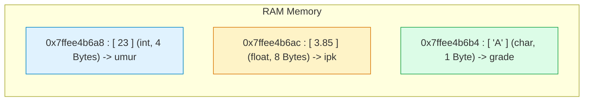
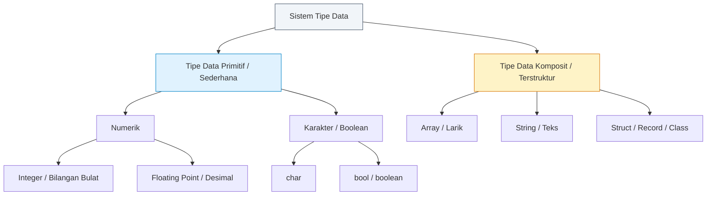

# Minggu 2: Variabel, Tipe Data & Alokasi Memori

::: tip CAPAIAN PEMBELAJARAN (SUB-CPMK 2)
- **CPMK Terkait:** CPMK0101 (Konsep Dasar Pemrograman)
- **CPL Terkait:** CPL01 (Pengetahuan Teori Dasar Informatika), CPL04 (Implementasi Solusi Komputasi)
- **Indikator:** Mahasiswa mampu mengidentifikasi dan memilih tipe data primitif secara tepat, memahami alokasi byte pada RAM, mendeklarasikan variabel dan konstanta, serta melakukan konversi tipe data (*type casting*) dengan aman.
:::

---

## 1. Konsep Variabel & Alokasi Memori Komputer

**Variabel** adalah lokasi bernama di dalam memori utama (*Random Access Memory / RAM*) yang digunakan untuk menyimpan nilai sementara selama eksekusi program. Setiap variabel memiliki 4 atribut utama:

1. **Nama / Identifier:** Identitas unik untuk mereferensikan lokasi memori.
2. **Tipe Data:** Menentukan ukuran byte dan jenis nilai yang diizinkan.
3. **Alamat Memori (*Memory Address*):** Lokasi heksadesimal fisik di RAM (misal: `0x7ffee4b6a8`).
4. **Nilai (*Value*):** Data aktual yang tersimpan dalam format bit biner.



---

## 2. Klasifikasi Tipe Data Standar



| Tipe Data | Ukuran Memori | Rentang Nilai Standar | Contoh Nilai |
| :--- | :---: | :--- | :--- |
| **`bool` / `boolean`** | 1 Byte | `true` (1) atau `false` (0) | `true`, `false` |
| **`char`** | 1 Byte | Karakter tunggal ASCII (0 s.d. 255) | `'A'`, `'7'`, `'#'` |
| **`int` (Integer)** | 4 Bytes (32-bit) | $-2.147.483.648$ s.d. $+2.147.483.647$ | `100`, `-45`, `0` |
| **`float` (Single Precision)** | 4 Bytes | Presisi ≈ 7 digit desimal | `3.14159f`, `-0.005f` |
| **`double` (Double Precision)**| 8 Bytes (64-bit) | Presisi ≈ 15-17 digit desimal | `3.141592653589793` |
| **`string`** | Dinamis | Kumpulan karakter teks | `"Universitas Ubudiyah"` |

---

## 3. Deklarasi, Inisialisasi & Konstanta

::: code-group
```cpp [C++]
#include <iostream>
#include <string>
using namespace std;

int main() {
    // 1. Deklarasi dan Inisialisasi Variabel
    string namaMahasiswa = "Ahmad Dani";
    int umur = 20;
    double ipk = 3.87;
    bool isActive = true;

    // 2. Konstanta (Nilai tidak dapat diubah setelah didefinisikan)
    const double NILAI_PI = 3.1415926535;
    const int SKS_MAX = 24;

    cout << "Mahasiswa: " << namaMahasiswa << " (Umur: " << umur << ")" << endl;
    cout << "IPK: " << ipk << " | Status Aktif: " << (isActive ? "Ya" : "Tidak") << endl;

    return 0;
}
```

```python [Python 3]
# Python menggunakan Dynamic Typing (tipe data ditentukan otomatis saat runtime)
nama_mahasiswa: str = "Ahmad Dani"
umur: int = 20
ipk: float = 3.87
is_active: bool = True

# Konstanta secara konvensi ditulis dalam UPPERCASE
NILAI_PI = 3.1415926535
SKS_MAX = 24

print(f"Mahasiswa: {nama_mahasiswa} (Umur: {umur})")
print(f"IPK: {ipk} | Status Aktif: {'Ya' if is_active else 'Tidak'}")
```
:::

---

## 4. Konversi Tipe Data (*Type Casting*)

### A. Konversi Implisit (*Widening / Automatic Conversion*)
Terjadi secara otomatis oleh compiler dari tipe data dengan ukuran memori lebih kecil ke lebih besar tanpa risiko kehilangan data (*data loss*). Contoh: `int` $\rightarrow$ `double`.

### B. Konversi Eksplisit (*Narrowing / Type Casting*)
Dilakukan secara sengaja oleh programmer untuk mengubah tipe data yang lebih besar ke lebih kecil atau antar tipe yang berbeda:

```cpp
double nilaiUjian = 87.75;
int nilaiBulat = (int)nilaiUjian; // Nilai menjadi 87 (terjadi pemotongan desimal)
```

---

## 📝 Evaluasi & Latihan Mandiri (Sub-CPMK 2)

1. Tentukan tipe data yang paling efisien untuk variabel-variabel berikut:
   - Jumlah mahasiswa dalam satu kelas (maksimal 50 orang).
   - Saldo rekening bank nasabah dalam rupiah.
   - Status kelulusan mahasiswa (`Lulus` / `Tidak Lulus`).
   - Huruf mutu akademik (`A`, `B`, `C`, `D`, `E`).
2. Tuliskan program untuk menghitung keliling dan luas lingkaran menggunakan konstanta $\pi = 3.14159$ dengan input jari-jari dari pengguna!
