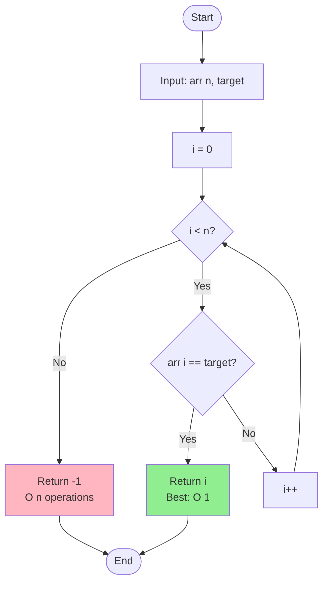
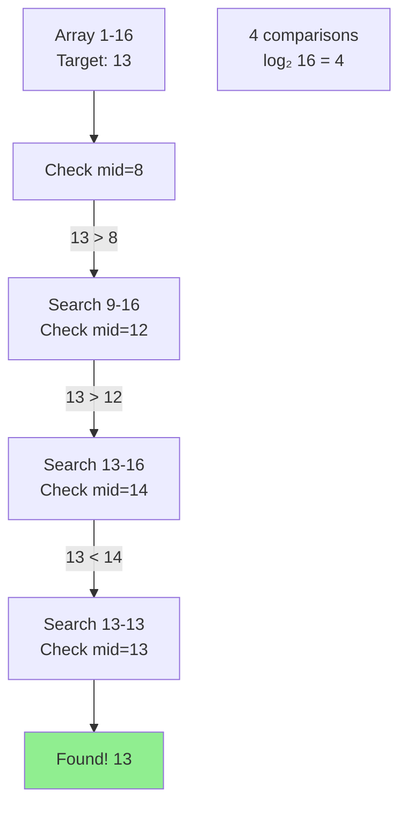
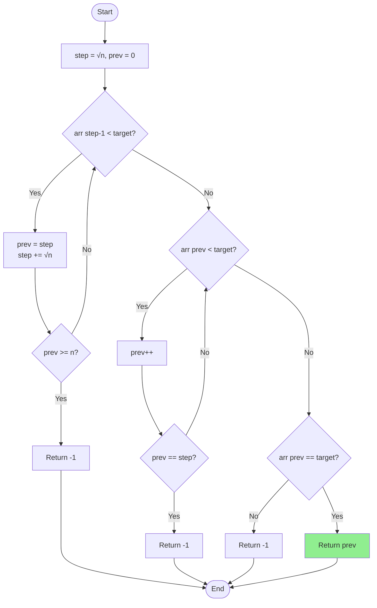
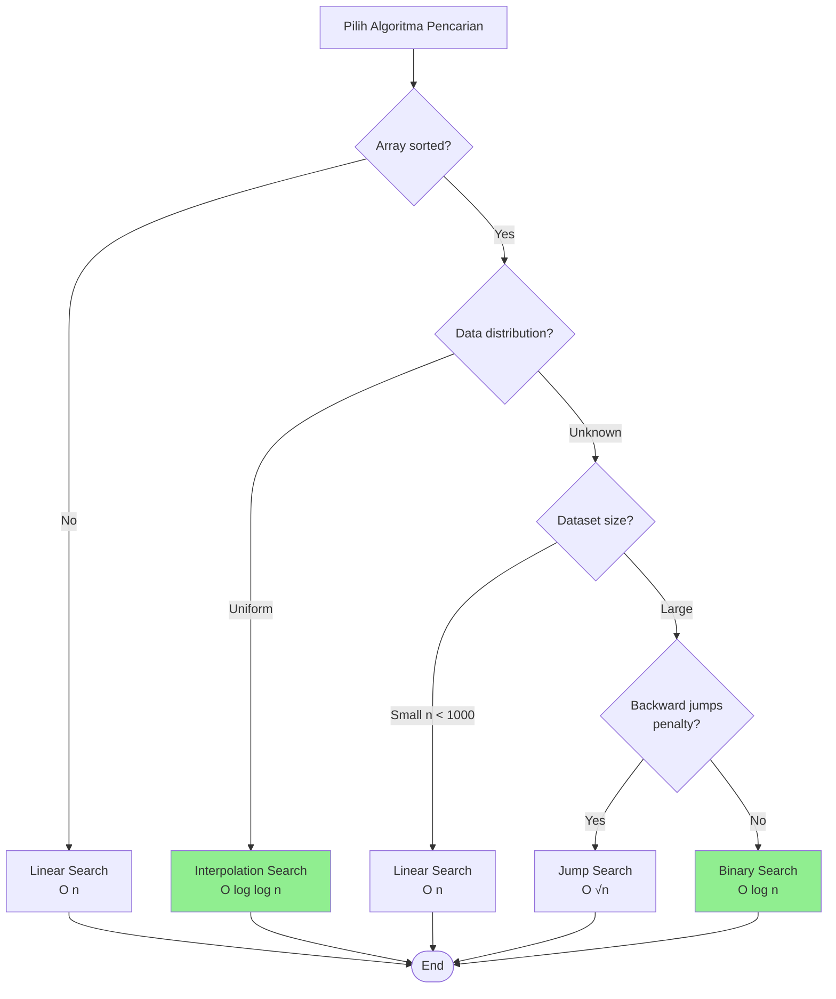

# Analisis Algoritma Pencarian

## Overview

Kita akan menganalisis kompleksitas berbagai algoritma pencarian yang sudah dipelajari:

1. Linear Search
2. Binary Search
3. Jump Search
4. Interpolation Search

## 1. Linear Search

### Algoritma

```python
def linear_search(arr, target):
    for i in range(len(arr)):
        if arr[i] == target:
            return i
    return -1
```

### Analisis Time Complexity

**Best Case - Ω(1):**

```python
arr = [5, 3, 7, 2, 8]
target = 5

# Elemen pertama langsung ketemu
# 1 perbandingan
```

**Average Case - Θ(n):**

```python
# Probabilitas elemen di posisi i: 1/n
# Expected comparisons:
# E = 1×(1/n) + 2×(1/n) + ... + n×(1/n)
#   = (1 + 2 + ... + n) / n
#   = n(n+1)/(2n)
#   = (n+1)/2
#   ≈ n/2
#   = Θ(n)
```

**Worst Case - O(n):**

```python
arr = [5, 3, 7, 2, 8]
target = 8  # atau tidak ada

# n perbandingan
```

### Analisis Space Complexity

```python
# Variabel: i, target
# Space: O(1)
```

### Summary

| Case    | Time | Space |
| ------- | ---- | ----- |
| Best    | Ω(1) | O(1)  |
| Average | Θ(n) | O(1)  |
| Worst   | O(n) | O(1)  |

### Flowchart



### Karakteristik

✅ **Advantages:**

- Simple implementation
- Works on unsorted array
- O(1) space

❌ **Disadvantages:**

- O(n) time - lambat untuk dataset besar
- Tidak efisien dibanding binary search untuk sorted array

### Kapan Menggunakan?

- Array kecil (n < 100)
- Array tidak terurut
- Single search operation

---

## 2. Binary Search

### Algoritma

```python
def binary_search(arr, target):
    left, right = 0, len(arr) - 1

    while left <= right:
        mid = (left + right) // 2

        if arr[mid] == target:
            return mid
        elif arr[mid] < target:
            left = mid + 1
        else:
            right = mid - 1

    return -1
```

### Analisis Time Complexity

**Best Case - Ω(1):**

```python
arr = [1, 3, 5, 7, 9, 11, 13]
target = 7

# Mid element langsung ketemu
# 1 perbandingan
```

**Average/Worst Case - O(log n):**

```python
# Setiap iterasi membagi search space jadi 2
# n → n/2 → n/4 → ... → 1

# Jumlah iterasi k sehingga n/2^k = 1
# n = 2^k
# k = log₂(n)

# Contoh n = 16:
# Iter 1: 16 elemen
# Iter 2: 8 elemen
# Iter 3: 4 elemen
# Iter 4: 2 elemen
# Iter 5: 1 elemen
# Total: log₂(16) = 4 iterasi
```

### Recurrence Relation

```
T(n) = T(n/2) + O(1)

# Master Theorem:
# a = 1, b = 2, f(n) = O(1)
# log_b(a) = log_2(1) = 0
# f(n) = O(n^0) → Case 2

T(n) = Θ(log n)
```

### Analisis Space Complexity

**Iterative - O(1):**

```python
# Variabel: left, right, mid
# Space: O(1)
```

**Recursive - O(log n):**

```python
def binary_search_recursive(arr, target, left, right):
    if left > right:
        return -1

    mid = (left + right) // 2
    if arr[mid] == target:
        return mid
    elif arr[mid] < target:
        return binary_search_recursive(arr, target, mid + 1, right)
    else:
        return binary_search_recursive(arr, target, left, mid - 1)

# Call stack depth: log n
# Space: O(log n)
```

### Summary

| Version   | Time (Best) | Time (Worst) | Space    |
| --------- | ----------- | ------------ | -------- |
| Iterative | Ω(1)        | O(log n)     | O(1)     |
| Recursive | Ω(1)        | O(log n)     | O(log n) |

### Visualisasi



### Karakteristik

✅ **Advantages:**

- O(log n) - sangat cepat
- Efficient untuk dataset besar
- Iterative version: O(1) space

❌ **Disadvantages:**

- Requires sorted array
- Not efficient untuk single search dengan sorting cost

### Kapan Menggunakan?

- Array sudah terurut
- Multiple search operations
- Dataset besar (n > 1000)

---

## 3. Jump Search

### Algoritma

```python
import math

def jump_search(arr, target):
    n = len(arr)
    step = int(math.sqrt(n))
    prev = 0

    # Jump to find block
    while arr[min(step, n) - 1] < target:
        prev = step
        step += int(math.sqrt(n))
        if prev >= n:
            return -1

    # Linear search in block
    while arr[prev] < target:
        prev += 1
        if prev == min(step, n):
            return -1

    if arr[prev] == target:
        return prev

    return -1
```

### Analisis Time Complexity

**Optimal Jump Size:**

```
Jump size = √n

# Alasan:
# - Jumlah jumps: n/√n = √n
# - Linear search dalam block: √n
# - Total: √n + √n = 2√n = O(√n)
```

**Best Case - Ω(1):**

```python
# Target di posisi jump pertama
```

**Worst Case - O(√n):**

```python
# n = 16, target = 15

# Jumps: √16 = 4
# Step 1: Jump 0 → 4
# Step 2: Jump 4 → 8
# Step 3: Jump 8 → 12
# Step 4: Jump 12 → 16 (out of range)

# Linear search: 12 → 13 → 14 → 15
# Total: 3 jumps + 3 linear = 6 = O(√16)
```

### Analisis Space Complexity

```python
# Space: O(1)
```

### Summary

| Case  | Time  | Space |
| ----- | ----- | ----- |
| Best  | Ω(1)  | O(1)  |
| Worst | O(√n) | O(1)  |

### Perbandingan dengan Binary Search

```
For n = 10,000:
- Binary Search: log₂(10,000) ≈ 13 comparisons
- Jump Search: √10,000 = 100 comparisons

Binary Search lebih cepat!

Mengapa masih pakai Jump Search?
- Backward jumping tidak efisien di beberapa hardware
- Jump Search hanya forward jumps
- Bermanfaat untuk sistem dengan backward penalty
```

### Flowchart



---

## 4. Interpolation Search

### Algoritma

```python
def interpolation_search(arr, target):
    left, right = 0, len(arr) - 1

    while left <= right and target >= arr[left] and target <= arr[right]:
        # Interpolation formula
        pos = left + int((target - arr[left]) * (right - left) /
                         (arr[right] - arr[left]))

        if arr[pos] == target:
            return pos

        if arr[pos] < target:
            left = pos + 1
        else:
            right = pos - 1

    return -1
```

### Analisis Time Complexity

**Best Case - Ω(1):**

```python
# Interpolation langsung ke target
```

**Average Case (uniform distribution) - O(log log n):**

```python
# Untuk data terdistribusi uniform
# Interpolation sangat akurat
# Pertumbuhan lebih lambat dari O(log n)!

# Contoh:
# n = 1,000,000
# Binary Search: log₂(1,000,000) ≈ 20
# Interpolation: log₂(log₂(1,000,000)) ≈ 4-5
```

**Worst Case - O(n):**

```python
# Data tidak uniform
# Contoh: [1, 2, 3, ..., 100, 10000]
# Interpolation bisa mirip linear search
```

### Analisis Space Complexity

```python
# Space: O(1)
```

### Summary

| Case              | Time         | Space |
| ----------------- | ------------ | ----- |
| Best              | Ω(1)         | O(1)  |
| Average (uniform) | O(log log n) | O(1)  |
| Worst             | O(n)         | O(1)  |

### Kapan Menggunakan?

✅ **Good:**

- Data uniform distribution
- Dataset sangat besar
- Fast average case needed

❌ **Bad:**

- Non-uniform data
- Small dataset
- Worst case important

---

## Perbandingan Lengkap

### Time Complexity

| Algorithm     | Best | Average      | Worst    | Requires Sorted? |
| ------------- | ---- | ------------ | -------- | ---------------- |
| Linear        | O(1) | O(n)         | O(n)     | No               |
| Binary        | O(1) | O(log n)     | O(log n) | Yes              |
| Jump          | O(1) | O(√n)        | O(√n)    | Yes              |
| Interpolation | O(1) | O(log log n) | O(n)     | Yes (uniform)    |

### Space Complexity

| Algorithm          | Space    |
| ------------------ | -------- |
| Linear (iterative) | O(1)     |
| Binary (iterative) | O(1)     |
| Binary (recursive) | O(log n) |
| Jump               | O(1)     |
| Interpolation      | O(1)     |

### Performa untuk n = 1,000,000

| Algorithm     | Best | Average | Worst     |
| ------------- | ---- | ------- | --------- |
| Linear        | 1    | 500,000 | 1,000,000 |
| Binary        | 1    | 20      | 20        |
| Jump          | 1    | 1,000   | 1,000     |
| Interpolation | 1    | 5       | 1,000,000 |

### Grafik Perbandingan



## Latihan

1. Untuk array dengan 1 miliar elemen, berapa perbandingan maksimum yang dibutuhkan:

   - Linear Search?
   - Binary Search?
   - Jump Search?

2. Jelaskan mengapa Interpolation Search bisa O(n) pada worst case.

3. Implementasikan dan bandingkan performa 4 algoritma untuk:
   ```python
   # Dataset 1: [1, 2, 3, ..., 10000]
   # Dataset 2: [1, 10, 100, 1000, 10000]
   # Target: 9999
   ```

## Rangkuman

- **Linear Search**: O(n) - simple, works on unsorted
- **Binary Search**: O(log n) - fastest untuk sorted array
- **Jump Search**: O(√n) - good untuk forward-only systems
- **Interpolation Search**: O(log log n) average - best untuk uniform data
- Pilih algoritma berdasarkan: sorted?, distribution?, size?

---

**Sebelumnya**: [Asymptotic Analysis](./asymptotic-analysis.md) | **Selanjutnya**: [Analisis Algoritma Sorting](./analisis-sorting.md)
