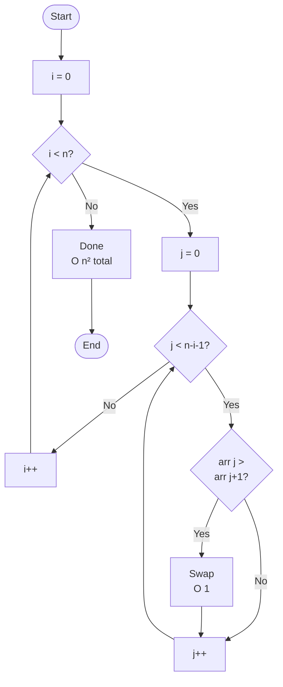
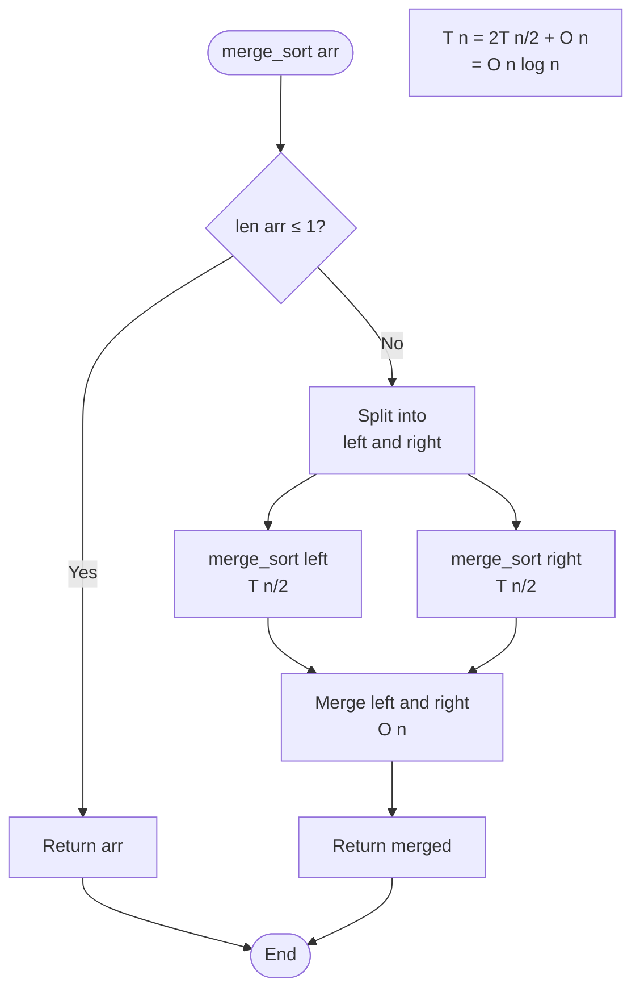
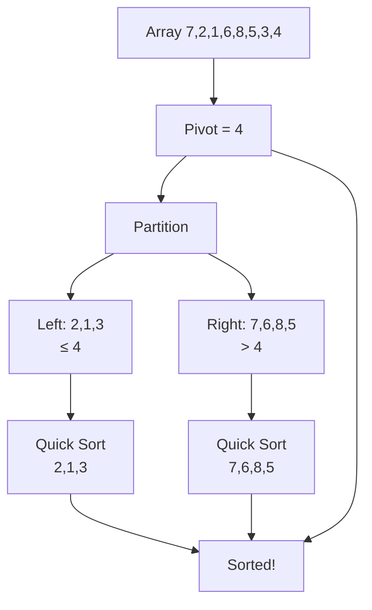
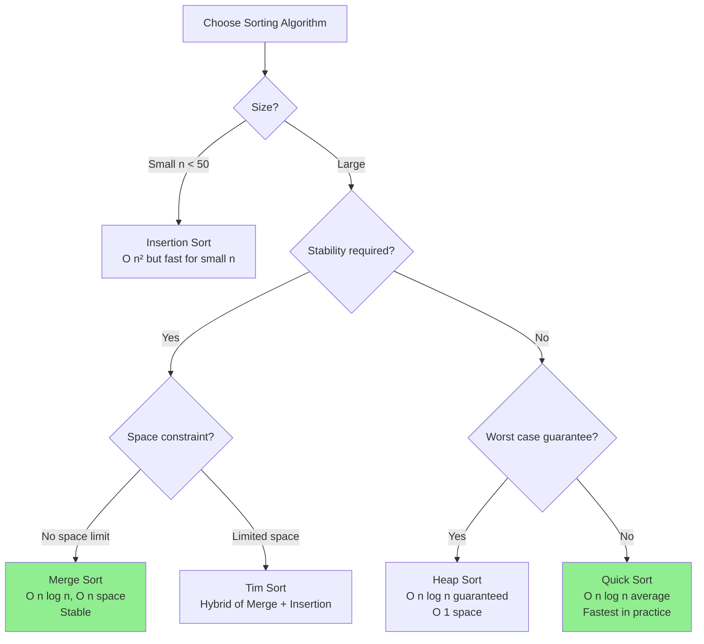

# Analisis Algoritma Sorting

## Overview

Kita akan menganalisis kompleksitas berbagai algoritma sorting:

### Simple Sorts - O(n²)

1. Bubble Sort
2. Selection Sort
3. Insertion Sort

### Efficient Sorts - O(n log n)

4. Merge Sort
5. Quick Sort
6. Heap Sort

## 1. Bubble Sort

### Algoritma

```python
def bubble_sort(arr):
    n = len(arr)
    for i in range(n):
        for j in range(n - i - 1):
            if arr[j] > arr[j + 1]:
                arr[j], arr[j+1] = arr[j+1], arr[j]
    return arr
```

### Analisis Time Complexity

**Best Case - Ω(n²):**

```python
# Array sudah terurut: [1, 2, 3, 4, 5]
# Tetap melakukan semua perbandingan
# Outer loop: n
# Inner loop: n + (n-1) + ... + 1 = n(n-1)/2
# Total: O(n²)
```

**Optimized Best Case - Ω(n):**

```python
def bubble_sort_optimized(arr):
    n = len(arr)
    for i in range(n):
        swapped = False
        for j in range(n - i - 1):
            if arr[j] > arr[j + 1]:
                arr[j], arr[j+1] = arr[j+1], arr[j]
                swapped = True
        if not swapped:  # Early termination
            break
    return arr

# Best case dengan flag: O(n)
# Array sudah sorted, 1 pass saja
```

**Worst Case - O(n²):**

```python
# Array terurut terbalik: [5, 4, 3, 2, 1]
# Comparisons: n(n-1)/2
# Swaps: n(n-1)/2
```

### Counting Operations

```
Pass 1: n-1 comparisons
Pass 2: n-2 comparisons
...
Pass n-1: 1 comparison

Total = (n-1) + (n-2) + ... + 1
      = n(n-1)/2
      = O(n²)
```

### Analisis Space Complexity

```python
# In-place sorting
# Space: O(1)
```

### Summary

| Version   | Best  | Average | Worst | Space | Stable? |
| --------- | ----- | ------- | ----- | ----- | ------- |
| Standard  | O(n²) | O(n²)   | O(n²) | O(1)  | ✓       |
| Optimized | O(n)  | O(n²)   | O(n²) | O(1)  | ✓       |

### Flowchart



---

## 2. Selection Sort

### Algoritma

```python
def selection_sort(arr):
    n = len(arr)
    for i in range(n):
        min_idx = i
        for j in range(i + 1, n):
            if arr[j] < arr[min_idx]:
                min_idx = j
        arr[i], arr[min_idx] = arr[min_idx], arr[i]
    return arr
```

### Analisis Time Complexity

**All Cases - Θ(n²):**

```python
# Selalu melakukan n(n-1)/2 perbandingan
# Tidak peduli input!

# Pass 1: n-1 comparisons
# Pass 2: n-2 comparisons
# ...
# Total: n(n-1)/2 = O(n²)
```

**Karakteristik Unik:**

- **Minimal swaps**: Hanya n-1 swaps maksimum
- Best, Average, Worst **sama semua**: O(n²)

### Analisis Space Complexity

```python
# Space: O(1)
```

### Summary

| Case | Time  | Swaps | Space | Stable? |
| ---- | ----- | ----- | ----- | ------- |
| All  | Θ(n²) | O(n)  | O(1)  | ✗       |

### Perbandingan dengan Bubble Sort

```
For n = 1000:

Bubble Sort:
- Comparisons: ~500,000
- Swaps: ~250,000 (average)

Selection Sort:
- Comparisons: ~500,000
- Swaps: ~1,000 (always)

Selection Sort lebih baik jika swap operation mahal!
```

---

## 3. Insertion Sort

### Algoritma

```python
def insertion_sort(arr):
    for i in range(1, len(arr)):
        key = arr[i]
        j = i - 1
        while j >= 0 and arr[j] > key:
            arr[j + 1] = arr[j]
            j -= 1
        arr[j + 1] = key
    return arr
```

### Analisis Time Complexity

**Best Case - Ω(n):**

```python
# Array sudah terurut: [1, 2, 3, 4, 5]
# Setiap elemen: 1 perbandingan, 0 shift
# Total: n perbandingan = O(n)
```

**Average Case - Θ(n²):**

```python
# Array acak
# Rata-rata shift: i/2 untuk posisi i
# Total: 1/2 + 2/2 + 3/2 + ... + n/2
#      = (1+2+...+n)/2
#      = n(n+1)/4
#      ≈ n²/4
#      = O(n²)
```

**Worst Case - O(n²):**

```python
# Array terurut terbalik: [5, 4, 3, 2, 1]
# Setiap elemen shift maksimal
# Total: 1 + 2 + 3 + ... + (n-1)
#      = n(n-1)/2
#      = O(n²)
```

### Analisis Space Complexity

```python
# Space: O(1)
```

### Summary

| Case    | Time  | Space | Stable? | Online? |
| ------- | ----- | ----- | ------- | ------- |
| Best    | O(n)  | O(1)  | ✓       | ✓       |
| Average | O(n²) | O(1)  | ✓       | ✓       |
| Worst   | O(n²) | O(1)  | ✓       | ✓       |

### Karakteristik Spesial

✅ **Online Algorithm**: Bisa sort data yang datang streaming
✅ **Adaptive**: Cepat untuk nearly sorted data
✅ **Stable**: Mempertahankan urutan elemen sama

### Kapan Menggunakan?

- Small arrays (n < 50)
- Nearly sorted data
- Online/streaming data
- Stable sort required

---

## 4. Merge Sort

### Algoritma

```python
def merge_sort(arr):
    if len(arr) <= 1:
        return arr

    mid = len(arr) // 2
    left = merge_sort(arr[:mid])
    right = merge_sort(arr[mid:])

    return merge(left, right)

def merge(left, right):
    result = []
    i = j = 0

    while i < len(left) and j < len(right):
        if left[i] <= right[j]:
            result.append(left[i])
            i += 1
        else:
            result.append(right[j])
            j += 1

    result.extend(left[i:])
    result.extend(right[j:])
    return result
```

### Analisis Time Complexity

**All Cases - Θ(n log n):**

```
Recurrence relation:
T(n) = 2T(n/2) + O(n)

Master Theorem:
a = 2, b = 2, f(n) = n
log_b(a) = log_2(2) = 1
f(n) = Θ(n^1) → Case 2

T(n) = Θ(n log n)
```

**Visualisasi:**

```
Level 0: [8,4,2,1,7,3,9,5]           → O(n)
         /                \
Level 1: [8,4,2,1]    [7,3,9,5]      → O(n)
         /    \        /    \
Level 2: [8,4] [2,1] [7,3] [9,5]     → O(n)
         ...

Total levels: log n
Work per level: n
Total: O(n log n)
```

### Counting Operations

```
For n = 8:

Divide phase:
- Level 0: 1 array of size 8 → split
- Level 1: 2 arrays of size 4 → split
- Level 2: 4 arrays of size 2 → split
- Level 3: 8 arrays of size 1 → base case
Levels: log₂(8) = 3

Merge phase:
- Level 3 → 2: 4 merges of 2 elements = 8 operations
- Level 2 → 1: 2 merges of 4 elements = 8 operations
- Level 1 → 0: 1 merge of 8 elements = 8 operations
Total: 3 × 8 = 24 = 8 × log₂(8) = n log n
```

### Analisis Space Complexity

```python
# Temporary arrays: O(n)
# Recursion stack: O(log n)
# Total: O(n)
```

### Summary

| Case | Time       | Space | Stable? | In-Place? |
| ---- | ---------- | ----- | ------- | --------- |
| All  | Θ(n log n) | O(n)  | ✓       | ✗         |

### Flowchart



---

## 5. Quick Sort

### Algoritma

```python
def quick_sort(arr):
    if len(arr) <= 1:
        return arr

    pivot = arr[0]  # or random
    left = [x for x in arr[1:] if x <= pivot]
    right = [x for x in arr[1:] if x > pivot]

    return quick_sort(left) + [pivot] + quick_sort(right)
```

### Analisis Time Complexity

**Best Case - Ω(n log n):**

```python
# Pivot selalu membagi array 50-50
# Same as merge sort analysis
# T(n) = 2T(n/2) + O(n) = O(n log n)
```

**Average Case - Θ(n log n):**

```python
# Pivot cukup baik (tidak harus perfect)
# Probabilistic analysis shows Θ(n log n)
```

**Worst Case - O(n²):**

```python
# Pivot selalu elemen terkecil/terbesar
# Example: already sorted + first element as pivot

arr = [1, 2, 3, 4, 5]
pivot = 1

# Partition: [] + [1] + [2,3,4,5]
# Recurse: quick_sort([2,3,4,5])
#   pivot = 2
#   Partition: [] + [2] + [3,4,5]
#   ...

# Levels: n
# Work per level: n, n-1, n-2, ..., 1
# Total: n + (n-1) + ... + 1 = n(n+1)/2 = O(n²)
```

### Optimasi Worst Case

**1. Random Pivot:**

```python
import random

def quick_sort(arr):
    if len(arr) <= 1:
        return arr

    pivot = random.choice(arr)
    # ...
```

**2. Median-of-Three:**

```python
def get_pivot(arr):
    first = arr[0]
    mid = arr[len(arr) // 2]
    last = arr[-1]
    return sorted([first, mid, last])[1]
```

### Analisis Space Complexity

**Best Case - O(log n):**

```python
# Balanced partitions
# Recursion depth: log n
```

**Worst Case - O(n):**

```python
# Unbalanced partitions
# Recursion depth: n
```

### Summary

| Case    | Time       | Space    | Stable? | In-Place? |
| ------- | ---------- | -------- | ------- | --------- |
| Best    | Ω(n log n) | O(log n) | ✗       | ✓         |
| Average | Θ(n log n) | O(log n) | ✗       | ✓         |
| Worst   | O(n²)      | O(n)     | ✗       | ✓         |

### Visualisasi Partitioning



---

## 6. Heap Sort

### Algoritma

```python
def heap_sort(arr):
    n = len(arr)

    # Build max heap
    for i in range(n // 2 - 1, -1, -1):
        heapify(arr, n, i)

    # Extract elements
    for i in range(n - 1, 0, -1):
        arr[0], arr[i] = arr[i], arr[0]
        heapify(arr, i, 0)

    return arr

def heapify(arr, n, i):
    largest = i
    left = 2 * i + 1
    right = 2 * i + 2

    if left < n and arr[left] > arr[largest]:
        largest = left

    if right < n and arr[right] > arr[largest]:
        largest = right

    if largest != i:
        arr[i], arr[largest] = arr[largest], arr[i]
        heapify(arr, n, largest)
```

### Analisis Time Complexity

**Build Heap - O(n):**

```python
# Walaupun ada n/2 heapify calls
# Complexity analysis shows O(n), not O(n log n)!
```

**Extraction - O(n log n):**

```python
# n extractions
# Each extraction: heapify = O(log n)
# Total: n × log n = O(n log n)
```

**Total - O(n log n):**

```
T(n) = O(n) + O(n log n) = O(n log n)
```

### Analisis Space Complexity

```python
# In-place, recursive heapify
# Recursion depth: O(log n)
# Space: O(log n)

# Iterative heapify: O(1)
```

### Summary

| Case | Time       | Space  | Stable? | In-Place? |
| ---- | ---------- | ------ | ------- | --------- |
| All  | Θ(n log n) | O(1)\* | ✗       | ✓         |

\*O(1) for iterative, O(log n) for recursive

### Karakteristik

✅ **Guaranteed O(n log n)**: Tidak ada worst case O(n²)
✅ **In-place**: O(1) extra space
❌ **Not stable**: Bisa mengubah urutan elemen sama
❌ **Cache-unfriendly**: Random access pattern

---

## Perbandingan Lengkap

### Time Complexity

| Algorithm | Best       | Average    | Worst      | Stable? |
| --------- | ---------- | ---------- | ---------- | ------- |
| Bubble    | O(n)\*     | O(n²)      | O(n²)      | ✓       |
| Selection | O(n²)      | O(n²)      | O(n²)      | ✗       |
| Insertion | O(n)       | O(n²)      | O(n²)      | ✓       |
| Merge     | O(n log n) | O(n log n) | O(n log n) | ✓       |
| Quick     | O(n log n) | O(n log n) | O(n²)      | ✗       |
| Heap      | O(n log n) | O(n log n) | O(n log n) | ✗       |

\*With optimization

### Space Complexity

| Algorithm | Space        | In-Place? |
| --------- | ------------ | --------- |
| Bubble    | O(1)         | ✓         |
| Selection | O(1)         | ✓         |
| Insertion | O(1)         | ✓         |
| Merge     | O(n)         | ✗         |
| Quick     | O(log n) avg | ✓         |
| Heap      | O(1)         | ✓         |

### Performa untuk n = 10,000

| Algorithm | Operations (approx) |
| --------- | ------------------- |
| Bubble    | 100,000,000         |
| Selection | 100,000,000         |
| Insertion | 50,000,000 (avg)    |
| Merge     | 133,000             |
| Quick     | 133,000 (avg)       |
| Heap      | 200,000             |

### Decision Tree



## Lower Bound untuk Comparison-Based Sort

**Theorem**: Tidak ada comparison-based sorting algorithm yang bisa lebih cepat dari O(n log n) pada worst/average case.

**Proof Sketch:**

```
- Decision tree height: h
- Leaves (possible permutations): n!
- h ≥ log₂(n!)
- h ≥ log₂(n^n/e^n) (Stirling approximation)
- h ≥ n log₂(n) - n log₂(e)
- h = Ω(n log n)

∴ O(n log n) adalah optimal!
```

## Non-Comparison Sorts

Beberapa algoritma bisa O(n) dengan asumsi khusus:

| Algorithm     | Time        | Assumption           |
| ------------- | ----------- | -------------------- |
| Counting Sort | O(n + k)    | Integer range k      |
| Radix Sort    | O(d(n + k)) | d-digit numbers      |
| Bucket Sort   | O(n + k)    | Uniform distribution |

## Latihan

1. Hitung berapa kali perbandingan untuk:

   ```python
   arr = [5, 2, 8, 1, 9]
   # Bubble Sort vs Selection Sort
   ```

2. Jelaskan mengapa Merge Sort selalu O(n log n) tapi Quick Sort bisa O(n²).

3. Implementasikan dan bandingkan:
   ```python
   # Dataset: [1, 2, 3, ..., 10000]
   # Mana yang tercepat? Mengapa?
   ```

## Rangkuman

- **Simple sorts (O(n²))**: Good untuk small n atau nearly sorted
- **Efficient sorts (O(n log n))**: Required untuk large n
- **Merge Sort**: Stable, guaranteed, but O(n) space
- **Quick Sort**: Fastest average, but O(n²) worst
- **Heap Sort**: Guaranteed O(n log n), O(1) space, but not stable
- **O(n log n) adalah lower bound** untuk comparison-based sorting

---

**Sebelumnya**: [Analisis Algoritma Pencarian](./analisis-pencarian.md) | **Selanjutnya**: [Optimasi Algoritma](./optimasi.md)
