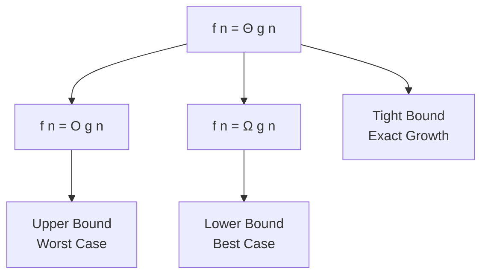
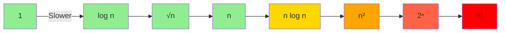
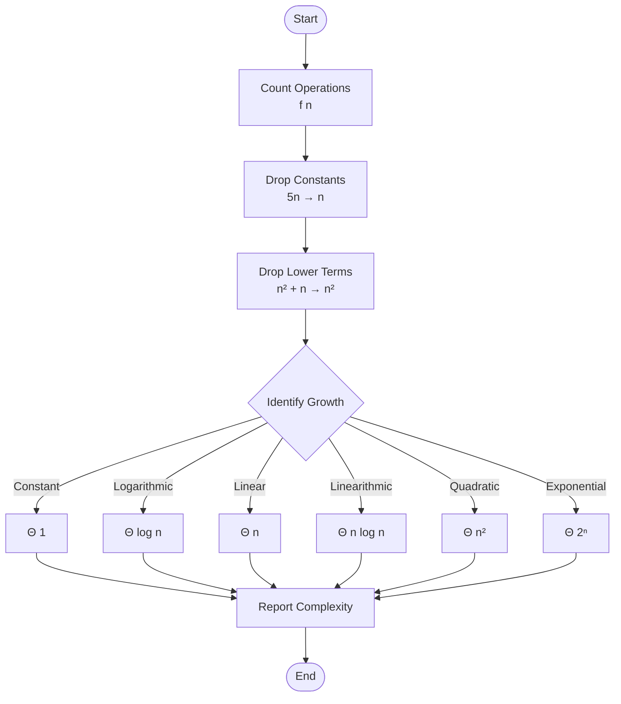

# Asymptotic Analysis (Analisis Asimptotik)

## Pengertian

**Asymptotic Analysis** adalah metode untuk menganalisis performa algoritma saat ukuran input **mendekati tak hingga** (n → ∞).

> "Bagaimana algoritma berperilaku untuk dataset yang sangat besar?"

## Mengapa Asimptotik?

### Fokus pada Pertumbuhan

Kita tidak peduli konstanta kecil, hanya **rate of growth**.

```python
# Algoritma A: 100n operasi
# Algoritma B: 2n² operasi

# Untuk n kecil (n = 10):
# A: 1000 operasi
# B: 200 operasi → B lebih cepat!

# Untuk n besar (n = 1000):
# A: 100,000 operasi
# B: 2,000,000 operasi → A lebih cepat!

# Asimptotik: O(n) < O(n²)
```

### Independen dari Hardware

```python
# Computer A: 1 GHz
# Computer B: 3 GHz

# Konstanta berbeda, tapi pertumbuhan sama
# O(n) tetap O(n) di semua komputer
```

## Notasi Asimptotik

### 1. Big O (O) - Upper Bound

**Definisi:** f(n) = O(g(n)) jika ada konstanta c > 0 dan n₀ sehingga:

```
f(n) ≤ c × g(n) untuk semua n ≥ n₀
```

**Arti:** f(n) **tidak tumbuh lebih cepat** dari g(n).

**Contoh:**

```python
def function(n):
    sum = 0
    for i in range(n):      # n iterasi
        sum += i            # O(1)
    return sum

# f(n) = n
# f(n) = O(n)
# Juga valid: f(n) = O(n²), O(n³), ...
# (tapi O(n) adalah tight bound)
```

**Grafik:**

```
f(n)
  |
  |        c×g(n)
  |       ╱
  |      ╱
  |     ╱   f(n)
  |    ╱   ╱
  |   ╱   ╱
  |  ╱___╱
  | ╱____
  |╱_____n₀
  +------------→ n
```

### 2. Omega (Ω) - Lower Bound

**Definisi:** f(n) = Ω(g(n)) jika ada konstanta c > 0 dan n₀ sehingga:

```
f(n) ≥ c × g(n) untuk semua n ≥ n₀
```

**Arti:** f(n) **tumbuh setidaknya secepat** g(n).

**Contoh:**

```python
def function(n):
    sum = 0
    for i in range(n):
        sum += i
    return sum

# f(n) = n
# f(n) = Ω(n)
# Juga valid: f(n) = Ω(1), Ω(log n), ...
# (tapi Ω(n) adalah tight bound)
```

### 3. Theta (Θ) - Tight Bound

**Definisi:** f(n) = Θ(g(n)) jika:

```
f(n) = O(g(n)) DAN f(n) = Ω(g(n))
```

**Arti:** f(n) **tumbuh dengan rate yang sama** dengan g(n).

**Contoh:**

```python
def function(n):
    sum = 0
    for i in range(n):
        sum += i
    return sum

# f(n) = n
# f(n) = Θ(n)
# (bound paling akurat)
```

**Grafik:**

```
f(n)
  |
  |    c₂×g(n)
  |   ╱
  |  ╱  f(n)
  | ╱  ╱
  |╱__╱___c₁×g(n)
  |╱___╱
  +------------→ n
     n₀

c₁×g(n) ≤ f(n) ≤ c₂×g(n)
```

### Hubungan Notasi



## Contoh Analisis

### Contoh 1: Linear Function

```python
def sum_array(arr):
    total = 0           # 1 operasi
    for i in arr:       # n iterasi
        total += i      # 1 operasi per iterasi
    return total        # 1 operasi

# Total operasi: 1 + n×1 + 1 = n + 2

# Analisis Asimptotik:
# f(n) = n + 2
# f(n) = O(n)     → Upper bound
# f(n) = Ω(n)     → Lower bound
# f(n) = Θ(n)     → Tight bound
```

**Proof O(n):**

```
f(n) = n + 2
Pilih c = 3, n₀ = 1

Untuk n ≥ 1:
n + 2 ≤ 3n  ✓ (karena 2 ≤ 2n untuk n ≥ 1)

∴ f(n) = O(n)
```

### Contoh 2: Quadratic Function

```python
def bubble_sort(arr):
    n = len(arr)
    for i in range(n):          # n iterasi
        for j in range(n-1):    # n iterasi
            if arr[j] > arr[j+1]:
                arr[j], arr[j+1] = arr[j+1], arr[j]

# Total operasi: n × n = n²

# Analisis:
# f(n) = n²
# f(n) = O(n²)
# f(n) = Ω(n²)
# f(n) = Θ(n²)
```

### Contoh 3: Logarithmic Function

```python
def binary_search(arr, target):
    left, right = 0, len(arr) - 1

    while left <= right:
        mid = (left + right) // 2
        if arr[mid] == target:
            return mid
        elif arr[mid] < target:
            left = mid + 1
        else:
            right = mid - 1
    return -1

# Setiap iterasi: n → n/2
# Jumlah iterasi: log₂(n)

# Analisis:
# f(n) = log₂(n)
# f(n) = O(log n)
# f(n) = Ω(log n)
# f(n) = Θ(log n)
```

## Aturan Simplifikasi

### 1. Drop Constants

```python
# f(n) = 5n + 100
# f(n) = Θ(n)  (bukan Θ(5n) atau Θ(n + 100))

# Alasan:
# Untuk n besar, konstanta tidak signifikan
# 5n ≈ n untuk analisis asimptotik
```

### 2. Drop Lower-Order Terms

```python
# f(n) = n² + 5n + 10
# f(n) = Θ(n²)  (drop 5n dan 10)

# Alasan:
# n² dominan untuk n besar
# Contoh n = 1000:
#   n² = 1,000,000
#   5n = 5,000
#   10 = 10
# n² >> 5n + 10
```

### 3. Different Variables

```python
def function(arr1, arr2):
    # Loop 1
    for i in arr1:        # n kali
        print(i)

    # Loop 2
    for j in arr2:        # m kali
        print(j)

# f(n,m) = n + m
# f(n,m) = Θ(n + m)  (BUKAN Θ(n))
```

## Ranking Fungsi

Dari paling lambat tumbuh ke paling cepat:

```
1 < log log n < log n < √n < n < n log n < n² < n³ < 2ⁿ < n! < nⁿ
```

**Contoh untuk n = 1000:**

| Fungsi  | Nilai     |
| ------- | --------- |
| 1       | 1         |
| log n   | ~10       |
| √n      | ~31       |
| n       | 1,000     |
| n log n | ~10,000   |
| n²      | 1,000,000 |
| 2ⁿ      | ~10³⁰⁰    |
| n!      | ~10²⁵⁶⁸   |



## Limit Method

Untuk membandingkan dua fungsi, gunakan **limit**:

```
lim (n→∞) f(n) / g(n)
```

- **= 0**: f(n) tumbuh lebih lambat → f(n) = O(g(n))
- **= ∞**: f(n) tumbuh lebih cepat → f(n) = Ω(g(n))
- **= c (konstanta)**: tumbuh sama cepat → f(n) = Θ(g(n))

**Contoh 1:**

```
f(n) = n²
g(n) = n³

lim (n→∞) n² / n³ = lim (n→∞) 1/n = 0

∴ f(n) = O(g(n))
  n² tumbuh lebih lambat dari n³
```

**Contoh 2:**

```
f(n) = 2n + 5
g(n) = n

lim (n→∞) (2n + 5) / n
= lim (n→∞) (2 + 5/n)
= 2

∴ f(n) = Θ(g(n))
  2n + 5 tumbuh sama cepat dengan n
```

## Recurrence Relations

### Master Theorem

Untuk rekursi bentuk:

```
T(n) = aT(n/b) + f(n)
```

Dimana:

- a = jumlah subproblem
- n/b = ukuran setiap subproblem
- f(n) = cost combine

**Cases:**

1. **f(n) = O(n^c) dimana c < log_b(a)**

   ```
   T(n) = Θ(n^(log_b(a)))
   ```

2. **f(n) = Θ(n^c) dimana c = log_b(a)**

   ```
   T(n) = Θ(n^c log n)
   ```

3. **f(n) = Ω(n^c) dimana c > log_b(a)**
   ```
   T(n) = Θ(f(n))
   ```

**Contoh 1: Binary Search**

```python
T(n) = T(n/2) + O(1)

# a = 1, b = 2, f(n) = O(1) = O(n^0)
# log_b(a) = log_2(1) = 0
# c = 0, c = log_b(a) → Case 2

T(n) = Θ(n^0 log n) = Θ(log n)
```

**Contoh 2: Merge Sort**

```python
T(n) = 2T(n/2) + O(n)

# a = 2, b = 2, f(n) = O(n) = O(n^1)
# log_b(a) = log_2(2) = 1
# c = 1, c = log_b(a) → Case 2

T(n) = Θ(n^1 log n) = Θ(n log n)
```

**Contoh 3: Binary Tree Traversal**

```python
T(n) = 2T(n/2) + O(1)

# a = 2, b = 2, f(n) = O(1) = O(n^0)
# log_b(a) = log_2(2) = 1
# c = 0, c < log_b(a) → Case 1

T(n) = Θ(n^1) = Θ(n)
```

## Substitution Method

Untuk rekursi yang tidak match Master Theorem.

**Langkah:**

1. Guess solusi
2. Prove dengan induksi

**Contoh:**

```python
T(n) = T(n-1) + n
T(1) = 1

# Guess: T(n) = O(n²)

# Prove:
# Base case: T(1) = 1 ≤ c×1² untuk c ≥ 1 ✓

# Inductive step:
# Assume T(k) ≤ ck² untuk k < n
# Show T(n) ≤ cn²

T(n) = T(n-1) + n
     ≤ c(n-1)² + n        (by hypothesis)
     = c(n² - 2n + 1) + n
     = cn² - 2cn + c + n
     = cn² - (2c - 1)n + c
     ≤ cn²                (untuk c ≥ 1, n ≥ 1)

∴ T(n) = O(n²)
```

## Flowchart: Asymptotic Analysis



## Latihan

1. Gunakan limit method untuk membandingkan:

   ```
   a) f(n) = n log n vs g(n) = n²
   b) f(n) = 2ⁿ vs g(n) = n!
   c) f(n) = n³ vs g(n) = 2ⁿ
   ```

2. Gunakan Master Theorem:

   ```
   a) T(n) = 4T(n/2) + n
   b) T(n) = 2T(n/2) + n²
   c) T(n) = T(n/2) + n
   ```

3. Prove dengan substitution:
   ```
   T(n) = 2T(n/2) + 1
   Guess: T(n) = O(n)
   ```

## Rangkuman

- **Asymptotic Analysis** fokus pada pertumbuhan saat n → ∞
- **Big O (O)**: Upper bound - worst case
- **Omega (Ω)**: Lower bound - best case
- **Theta (Θ)**: Tight bound - exact growth
- **Drop constants** dan **lower-order terms**
- **Master Theorem** untuk divide-and-conquer recurrence
- Fokus pada **rate of growth**, bukan nilai absolut

---

**Sebelumnya**: [Best, Average, Worst Case](./best-average-worst.md) | **Selanjutnya**: [Analisis Algoritma Pencarian](./analisis-pencarian.md)
