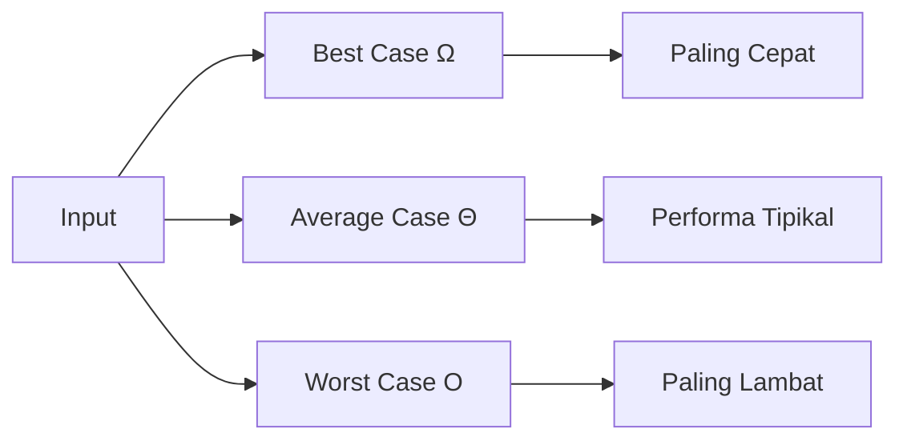
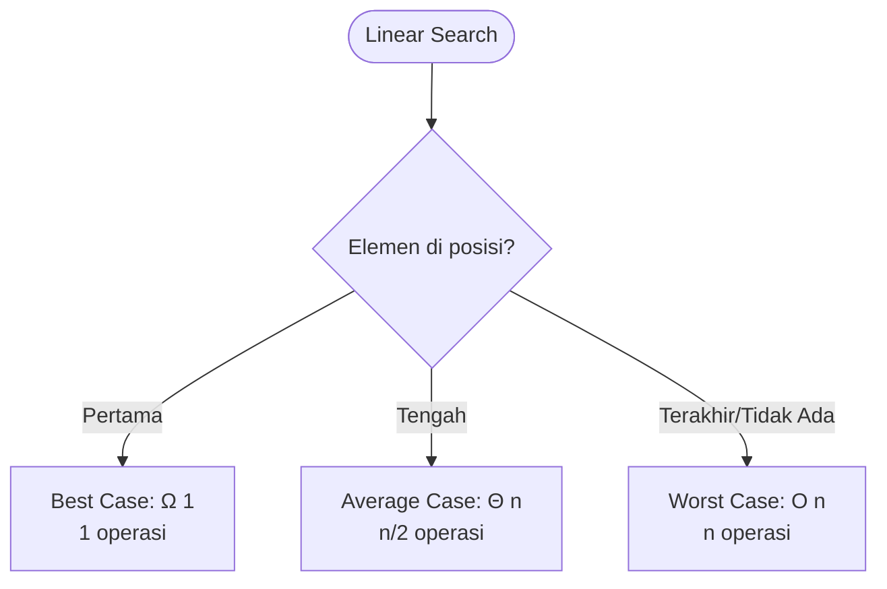
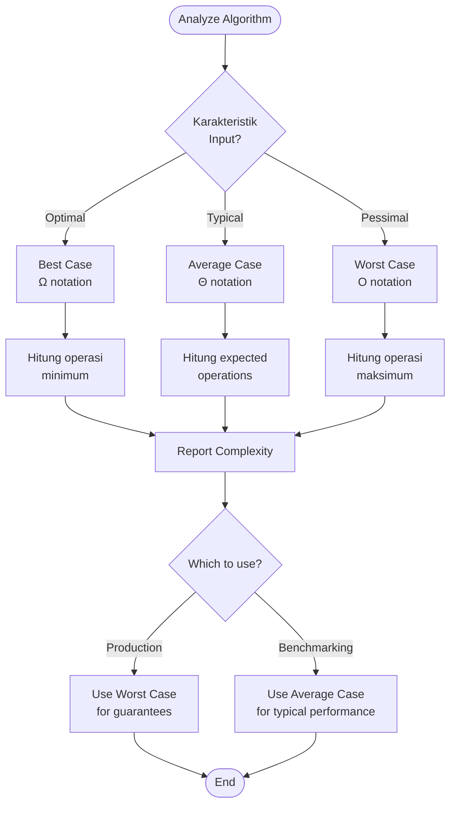

# Best, Average, dan Worst Case

## Pengertian

Sebuah algoritma dapat memiliki performa yang **berbeda** tergantung pada **karakteristik input**. Kita menganalisis tiga skenario:

1. **Best Case** - Input terbaik, algoritma paling cepat
2. **Average Case** - Input rata-rata, performa tipikal
3. **Worst Case** - Input terburuk, algoritma paling lambat

## Notasi

- **Best Case**: Ω(f(n)) - Omega notation (lower bound)
- **Average Case**: Θ(f(n)) - Theta notation (tight bound)
- **Worst Case**: O(f(n)) - Big O notation (upper bound)



## Contoh: Linear Search

```python
def linear_search(arr, target):
    for i in range(len(arr)):
        if arr[i] == target:
            return i
    return -1
```

### Best Case - Ω(1)

**Kondisi:** Elemen yang dicari ada di **posisi pertama**.

```python
arr = [5, 3, 7, 2, 8]
target = 5

# Iterasi 1: arr[0] == 5 ✓
# return 0
```

**Operasi:** 1 perbandingan
**Kompleksitas:** Ω(1)

### Average Case - Θ(n)

**Kondisi:** Elemen bisa ada di **posisi mana saja** dengan probabilitas sama.

```python
# Kemungkinan:
# Posisi 0: 1/n probabilitas → 1 operasi
# Posisi 1: 1/n probabilitas → 2 operasi
# Posisi 2: 1/n probabilitas → 3 operasi
# ...
# Posisi n-1: 1/n probabilitas → n operasi
# Tidak ada: 1/n probabilitas → n operasi

# Average = (1 + 2 + 3 + ... + n) / n
#         = n(n+1)/2n
#         = (n+1)/2
#         ≈ n/2
```

**Kompleksitas:** Θ(n)

### Worst Case - O(n)

**Kondisi:** Elemen ada di **posisi terakhir** atau **tidak ada**.

```python
arr = [5, 3, 7, 2, 8]
target = 8  # atau target = 100 (tidak ada)

# Iterasi 1: arr[0] != 8 ✗
# Iterasi 2: arr[1] != 8 ✗
# Iterasi 3: arr[2] != 8 ✗
# Iterasi 4: arr[3] != 8 ✗
# Iterasi 5: arr[4] == 8 ✓
```

**Operasi:** n perbandingan
**Kompleksitas:** O(n)

### Summary

| Case    | Kondisi                   | Kompleksitas |
| ------- | ------------------------- | ------------ |
| Best    | Elemen pertama            | Ω(1)         |
| Average | Posisi acak               | Θ(n)         |
| Worst   | Elemen terakhir/tidak ada | O(n)         |



## Contoh: Binary Search

```python
def binary_search(arr, target):
    left, right = 0, len(arr) - 1

    while left <= right:
        mid = (left + right) // 2

        if arr[mid] == target:
            return mid
        elif arr[mid] < target:
            left = mid + 1
        else:
            right = mid - 1

    return -1
```

### Best Case - Ω(1)

**Kondisi:** Elemen ada di **posisi tengah** pada iterasi pertama.

```python
arr = [1, 3, 5, 7, 9, 11, 13]
target = 7

# Iterasi 1: mid = 3, arr[3] = 7 ✓
```

**Kompleksitas:** Ω(1)

### Average Case - Θ(log n)

**Kondisi:** Elemen ada di posisi acak.

Setiap iterasi membagi search space jadi 2:

```
n → n/2 → n/4 → ... → 1
```

**Kompleksitas:** Θ(log n)

### Worst Case - O(log n)

**Kondisi:** Elemen tidak ada atau di leaf node.

```python
arr = [1, 3, 5, 7, 9, 11, 13, 15]
target = 16  # tidak ada

# Iterasi 1: [1,3,5,7,9,11,13,15] → mid = 7
# Iterasi 2: [9,11,13,15] → mid = 11
# Iterasi 3: [13,15] → mid = 13
# Iterasi 4: [15] → mid = 15
# left > right → return -1
```

**Kompleksitas:** O(log n)

### Summary

| Case    | Kompleksitas |
| ------- | ------------ |
| Best    | Ω(1)         |
| Average | Θ(log n)     |
| Worst   | O(log n)     |

## Contoh: Quick Sort

```python
def quick_sort(arr):
    if len(arr) <= 1:
        return arr

    pivot = arr[0]
    left = [x for x in arr[1:] if x <= pivot]
    right = [x for x in arr[1:] if x > pivot]

    return quick_sort(left) + [pivot] + quick_sort(right)
```

### Best Case - Ω(n log n)

**Kondisi:** Pivot **selalu membagi array jadi 2 bagian sama besar**.

```
Partisi seimbang:
Level 1: n elemen → 1 pivot
Level 2: n/2 + n/2 elemen → 2 pivot
Level 3: n/4 + n/4 + n/4 + n/4 → 4 pivot
...
Level log n: 1+1+...+1 → n pivot

Work per level: O(n)
Total levels: log n
Total: O(n log n)
```

**Kompleksitas:** Ω(n log n)

### Average Case - Θ(n log n)

**Kondisi:** Pivot **cukup baik**, tidak selalu optimal tapi juga tidak buruk.

Secara probabilitas, quick sort akan membagi array dengan cukup baik.

**Kompleksitas:** Θ(n log n)

### Worst Case - O(n²)

**Kondisi:** Pivot **selalu elemen terkecil atau terbesar**.

```python
arr = [1, 2, 3, 4, 5]  # Already sorted
pivot = 1

# Partisi:
# [] + [1] + [2,3,4,5]
# [] + [2] + [3,4,5]
# [] + [3] + [4,5]
# [] + [4] + [5]

# Level 1: 5 elemen
# Level 2: 4 elemen
# Level 3: 3 elemen
# ...
# Total: 5 + 4 + 3 + 2 + 1 = 15 = n(n+1)/2 = O(n²)
```

**Kompleksitas:** O(n²)

### Summary

| Case    | Kondisi              | Kompleksitas |
| ------- | -------------------- | ------------ |
| Best    | Pivot selalu tengah  | Ω(n log n)   |
| Average | Pivot cukup baik     | Θ(n log n)   |
| Worst   | Pivot selalu ekstrem | O(n²)        |

**Optimasi:** Pilih pivot secara random atau gunakan median-of-three.

## Contoh: Insertion Sort

```python
def insertion_sort(arr):
    for i in range(1, len(arr)):
        key = arr[i]
        j = i - 1

        while j >= 0 and arr[j] > key:
            arr[j + 1] = arr[j]
            j -= 1

        arr[j + 1] = key

    return arr
```

### Best Case - Ω(n)

**Kondisi:** Array **sudah terurut**.

```python
arr = [1, 2, 3, 4, 5]

# Iterasi 1: key = 2, arr[0] = 1 < 2 → tidak ada shift
# Iterasi 2: key = 3, arr[1] = 2 < 3 → tidak ada shift
# ...
# Total: n perbandingan, 0 shift
```

**Kompleksitas:** Ω(n)

### Average Case - Θ(n²)

**Kondisi:** Array **acak**.

Rata-rata, setiap elemen perlu di-shift setengah dari elemen sebelumnya:

```
Total shift ≈ 1/2 + 2/2 + 3/2 + ... + n/2
            = (1 + 2 + 3 + ... + n) / 2
            = n(n+1) / 4
            ≈ n²/4
```

**Kompleksitas:** Θ(n²)

### Worst Case - O(n²)

**Kondisi:** Array **terurut terbalik**.

```python
arr = [5, 4, 3, 2, 1]

# Iterasi 1: key = 4, shift 1 elemen (5)
# Iterasi 2: key = 3, shift 2 elemen (5, 4)
# Iterasi 3: key = 2, shift 3 elemen (5, 4, 3)
# Iterasi 4: key = 1, shift 4 elemen (5, 4, 3, 2)
# Total: 1 + 2 + 3 + 4 = 10 = n(n-1)/2
```

**Kompleksitas:** O(n²)

### Summary

| Case    | Kondisi          | Kompleksitas |
| ------- | ---------------- | ------------ |
| Best    | Sudah terurut    | Ω(n)         |
| Average | Acak             | Θ(n²)        |
| Worst   | Terurut terbalik | O(n²)        |

## Comparison Table

### Searching Algorithms

| Algoritma     | Best | Average  | Worst    | Space |
| ------------- | ---- | -------- | -------- | ----- |
| Linear Search | Ω(1) | Θ(n)     | O(n)     | O(1)  |
| Binary Search | Ω(1) | Θ(log n) | O(log n) | O(1)  |
| Jump Search   | Ω(1) | Θ(√n)    | O(√n)    | O(1)  |

### Sorting Algorithms

| Algoritma      | Best       | Average    | Worst      | Space    | Stable? |
| -------------- | ---------- | ---------- | ---------- | -------- | ------- |
| Bubble Sort    | Ω(n)       | Θ(n²)      | O(n²)      | O(1)     | ✓       |
| Selection Sort | Ω(n²)      | Θ(n²)      | O(n²)      | O(1)     | ✗       |
| Insertion Sort | Ω(n)       | Θ(n²)      | O(n²)      | O(1)     | ✓       |
| Merge Sort     | Ω(n log n) | Θ(n log n) | O(n log n) | O(n)     | ✓       |
| Quick Sort     | Ω(n log n) | Θ(n log n) | O(n²)      | O(log n) | ✗       |
| Heap Sort      | Ω(n log n) | Θ(n log n) | O(n log n) | O(1)     | ✗       |

## Mengapa Fokus pada Worst Case?

### 1. Guarantees

Worst case memberikan **jaminan** bahwa algoritma tidak akan lebih lambat.

```python
# Jika worst case: O(n log n)
# Maka kita yakin tidak akan ada input yang membuat O(n²)
```

### 2. Predictability

Lebih mudah untuk **merencanakan resource**.

```python
# Server dengan 1000 request/detik
# Jika worst case: 10ms per request
# Total waktu maksimal: 10s
```

### 3. Realistic

Untuk beberapa aplikasi, worst case sering terjadi.

```python
# Database search untuk record yang tidak ada
# → Selalu worst case!
```

## Kapan Mempertimbangkan Average Case?

### 1. Algoritma dengan Worst Case Buruk tapi Jarang

**Quick Sort:**

- Worst case: O(n²)
- Average case: O(n log n)
- Dalam praktik: Average case hampir selalu terjadi

### 2. Randomized Algorithms

```python
def randomized_quick_sort(arr):
    if len(arr) <= 1:
        return arr

    pivot = random.choice(arr)  # Random pivot
    # ... rest of quick sort
```

**Dengan random pivot:**

- Worst case: O(n²) - sangat jarang
- Expected case: O(n log n) - hampir selalu

### 3. Hash Table

- Worst case: O(n) - collision semua key
- Average case: O(1) - dengan hash function baik

## Flowchart: Case Analysis



## Latihan

1. Analisis best, average, worst case:

   ```python
   def find_max(arr):
       max_val = arr[0]
       for i in range(1, len(arr)):
           if arr[i] > max_val:
               max_val = arr[i]
       return max_val
   ```

2. Bubble Sort dengan early termination:

   ```python
   def bubble_sort_optimized(arr):
       n = len(arr)
       for i in range(n):
           swapped = False
           for j in range(n - i - 1):
               if arr[j] > arr[j + 1]:
                   arr[j], arr[j+1] = arr[j+1], arr[j]
                   swapped = True
           if not swapped:
               break
       return arr
   ```

   Apa best, average, dan worst case?

3. Jelaskan mengapa Binary Search memiliki best case O(1) tapi worst case O(log n).

## Rangkuman

- **Best Case (Ω)**: Input optimal, performa terbaik
- **Average Case (Θ)**: Input tipikal, performa rata-rata
- **Worst Case (O)**: Input terburuk, performa terburuk
- **Fokus pada Worst Case** untuk guarantees dan predictability
- **Average Case** penting untuk algoritma randomized atau dengan worst case jarang
- Setiap algoritma memiliki karakteristik berbeda tergantung input

---

**Sebelumnya**: [Space Complexity](./space-complexity.md) | **Selanjutnya**: [Asymptotic Analysis](./asymptotic-analysis.md)
