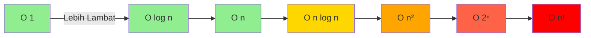

# Notasi Big O

## Apa itu Big O?

**Big O Notation** adalah cara matematis untuk mendeskripsikan kompleksitas algoritma dalam bentuk **upper bound** (batas atas) dari pertumbuhan fungsi.

> "Seberapa lambat algoritma ini dalam worst case?"

## Definisi Formal

Fungsi f(n) = O(g(n)) jika ada konstanta c dan n₀ sehingga:

```
f(n) ≤ c × g(n) untuk semua n ≥ n₀
```

Artinya: f(n) tidak tumbuh lebih cepat dari g(n) (dengan konstanta pengali).

## Jenis-Jenis Kompleksitas

### 1. O(1) - Constant Time

**Waktu eksekusi tidak bergantung pada ukuran input.**

```python
def get_first(arr):
    return arr[0]  # Selalu 1 operasi

def get_middle(arr):
    return arr[len(arr) // 2]  # Selalu 1 operasi
```

**Karakteristik:**

- ✓ Paling efisien
- ✓ Waktu konstan
- Contoh: akses array, hash table lookup

**Grafik:**

```
Operasi
   |
 5 |●●●●●●●●●●●●●●
   |
   +-------------→ n
```

### 2. O(log n) - Logarithmic Time

**Waktu tumbuh secara logaritmik.**

```python
def binary_search(arr, x):
    low, high = 0, len(arr) - 1

    while low <= high:
        mid = (low + high) // 2
        if arr[mid] == x:
            return mid
        elif arr[mid] < x:
            low = mid + 1
        else:
            high = mid - 1
    return -1

# Setiap iterasi membagi n jadi 2
# n → n/2 → n/4 → ... → 1
```

**Karakteristik:**

- ✓ Sangat efisien
- Divide and conquer
- Contoh: binary search, balanced tree operations

**Perbandingan:**

```
n = 1,000       → ~10 operasi
n = 1,000,000   → ~20 operasi
n = 1,000,000,000 → ~30 operasi
```

### 3. O(n) - Linear Time

**Waktu berbanding lurus dengan ukuran input.**

```python
def linear_search(arr, x):
    for item in arr:  # Loop n kali
        if item == x:
            return True
    return False

def sum_array(arr):
    total = 0
    for num in arr:   # Loop n kali
        total += num
    return total
```

**Karakteristik:**

- ✓ Efisien untuk dataset sedang
- Satu kali iterasi
- Contoh: linear search, traversal array

**Grafik:**

```
Operasi
   |                    ●
   |                ●
   |            ●
   |        ●
   |    ●
   |●
   +-------------→ n
```

### 4. O(n log n) - Linearithmic Time

**Kombinasi linear dan logarithmic.**

```python
def merge_sort(arr):
    if len(arr) <= 1:
        return arr

    mid = len(arr) // 2
    left = merge_sort(arr[:mid])    # O(log n) pembagian
    right = merge_sort(arr[mid:])

    return merge(left, right)       # O(n) merge

# Total: O(n log n)
```

**Karakteristik:**

- ✓ Efisien untuk sorting
- Optimal untuk comparison-based sort
- Contoh: merge sort, quick sort (average), heap sort

**Perbandingan:**

```
n = 100       → ~700 operasi
n = 1,000     → ~10,000 operasi
n = 10,000    → ~130,000 operasi
```

### 5. O(n²) - Quadratic Time

**Waktu tumbuh kuadratik.**

```python
def bubble_sort(arr):
    n = len(arr)
    for i in range(n):           # n kali
        for j in range(n - 1):   # n kali
            if arr[j] > arr[j + 1]:
                arr[j], arr[j+1] = arr[j+1], arr[j]

# Total: n × n = n²
```

**Karakteristik:**

- ⚠ Lambat untuk dataset besar
- Nested loops
- Contoh: bubble sort, selection sort, insertion sort

**Grafik:**

```
Operasi
   |                        ●
   |                    ●
   |                ●
   |            ●
   |        ●
   |    ●
   |●
   +-------------→ n
```

### 6. O(2ⁿ) - Exponential Time

**Waktu berlipat ganda setiap kali n bertambah 1.**

```python
def fibonacci_naive(n):
    if n <= 1:
        return n
    return fibonacci_naive(n-1) + fibonacci_naive(n-2)

# Setiap panggilan membuat 2 panggilan rekursif
# Tree: 2⁰ + 2¹ + 2² + ... + 2ⁿ
```

**Karakteristik:**

- ✗ Sangat tidak efisien
- Rekursi tanpa memoization
- Contoh: naive fibonacci, brute force solutions

**Perbandingan:**

```
n = 10  → 1,024 operasi
n = 20  → 1,048,576 operasi
n = 30  → 1,073,741,824 operasi
```

### 7. O(n!) - Factorial Time

**Waktu tumbuh faktorial.**

```python
def permutations(arr):
    if len(arr) <= 1:
        return [arr]

    result = []
    for i in range(len(arr)):
        rest = arr[:i] + arr[i+1:]
        for p in permutations(rest):
            result.append([arr[i]] + p)
    return result

# Jumlah permutasi: n!
```

**Karakteristik:**

- ✗ Sangat sangat tidak efisien
- Hanya praktis untuk n sangat kecil
- Contoh: permutations, traveling salesman (brute force)

**Perbandingan:**

```
n = 5   → 120
n = 10  → 3,628,800
n = 15  → 1,307,674,368,000
```

## Hirarki Kompleksitas

Dari yang paling efisien ke paling lambat:

```
O(1) < O(log n) < O(n) < O(n log n) < O(n²) < O(n³) < O(2ⁿ) < O(n!)
```



## Notasi Lain

### Omega (Ω) - Lower Bound

Mendeskripsikan **best case** kompleksitas.

```python
def linear_search(arr, x):
    for i in range(len(arr)):
        if arr[i] == x:
            return i
    return -1

# Best case: Ω(1) - elemen pertama
# Worst case: O(n) - elemen terakhir
```

### Theta (Θ) - Tight Bound

Mendeskripsikan kompleksitas yang **sama untuk best dan worst case**.

```python
def print_all(arr):
    for item in arr:
        print(item)

# Selalu O(n), Ω(n), dan Θ(n)
```

## Aturan Analisis Big O

### 1. Drop Constants

```python
# O(2n) = O(n)
def print_twice(arr):
    for i in arr:      # O(n)
        print(i)
    for i in arr:      # O(n)
        print(i)
# Total: O(2n) = O(n)
```

### 2. Drop Non-Dominant Terms

```python
# O(n² + n) = O(n²)
def function(arr):
    for i in arr:                # O(n)
        print(i)

    for i in arr:                # O(n²)
        for j in arr:
            print(i, j)
# Total: O(n + n²) = O(n²)
```

### 3. Different Inputs = Different Variables

```python
def intersect(arr1, arr2):
    result = []
    for i in arr1:              # O(n)
        if i in arr2:           # O(m)
            result.append(i)
# Total: O(n × m) - BUKAN O(n²)
```

### 4. Amortized Time

```python
# Python list.append()
# Worst case: O(n) - saat resize
# Amortized: O(1) - rata-rata
arr = []
for i in range(n):
    arr.append(i)  # O(1) amortized
# Total: O(n)
```

## Contoh Analisis Kompleks

### Contoh 1: Multiple Loops

```python
def function(arr):
    # Loop 1
    for i in arr:              # O(n)
        print(i)

    # Loop 2
    for i in arr:              # O(n)
        for j in arr:          # O(n)
            print(i, j)

    # Loop 3
    for i in arr:              # O(n)
        print(i)

# Analisis:
# O(n) + O(n²) + O(n)
# = O(n² + 2n)
# = O(n²)  ← Drop non-dominant term
```

### Contoh 2: Recursive Function

```python
def factorial(n):
    if n == 0:          # O(1)
        return 1
    return n * factorial(n - 1)

# Analisis:
# T(n) = T(n-1) + O(1)
# T(n) = T(n-2) + O(1) + O(1)
# ...
# T(n) = O(n)
```

### Contoh 3: Binary Search Tree

```python
class Node:
    def __init__(self, value):
        self.value = value
        self.left = None
        self.right = None

def search(root, value):
    if root is None or root.value == value:
        return root

    if value < root.value:
        return search(root.left, value)
    return search(root.right, value)

# Best case (balanced tree): O(log n)
# Worst case (skewed tree): O(n)
```

## Cheat Sheet

| Struktur Data  | Access   | Search   | Insert   | Delete   |
| -------------- | -------- | -------- | -------- | -------- |
| Array          | O(1)     | O(n)     | O(n)     | O(n)     |
| Linked List    | O(n)     | O(n)     | O(1)     | O(1)     |
| Stack          | O(n)     | O(n)     | O(1)     | O(1)     |
| Queue          | O(n)     | O(n)     | O(1)     | O(1)     |
| Hash Table     | O(1)     | O(1)     | O(1)     | O(1)     |
| BST (balanced) | O(log n) | O(log n) | O(log n) | O(log n) |

| Algoritma      | Best       | Average    | Worst      | Space    |
| -------------- | ---------- | ---------- | ---------- | -------- |
| Bubble Sort    | O(n)       | O(n²)      | O(n²)      | O(1)     |
| Selection Sort | O(n²)      | O(n²)      | O(n²)      | O(1)     |
| Insertion Sort | O(n)       | O(n²)      | O(n²)      | O(1)     |
| Merge Sort     | O(n log n) | O(n log n) | O(n log n) | O(n)     |
| Quick Sort     | O(n log n) | O(n log n) | O(n²)      | O(log n) |
| Binary Search  | O(1)       | O(log n)   | O(log n)   | O(1)     |

## Latihan

1. Analisis kompleksitas:

   ```python
   def mystery1(n):
       for i in range(n):
           for j in range(i, n):
               print(i, j)
   ```

2. Optimasi dari O(n²) ke O(n):

   ```python
   def find_duplicate(arr):
       for i in range(len(arr)):
           for j in range(i+1, len(arr)):
               if arr[i] == arr[j]:
                   return True
       return False
   ```

3. Hitung kompleksitas:
   ```python
   def function(n):
       i = 1
       while i < n:
           print(i)
           i *= 2
   ```

## Rangkuman

- **Big O** mengukur worst case complexity
- Fokus pada **pertumbuhan** saat n → ∞
- **Drop constants** dan **non-dominant terms**
- Hirarki: O(1) < O(log n) < O(n) < O(n log n) < O(n²) < O(2ⁿ) < O(n!)
- Pilih algoritma dengan kompleksitas lebih rendah

---

**Sebelumnya**: [Pengenalan](./pengenalan.md) | **Selanjutnya**: [Time Complexity](./time-complexity.md)
