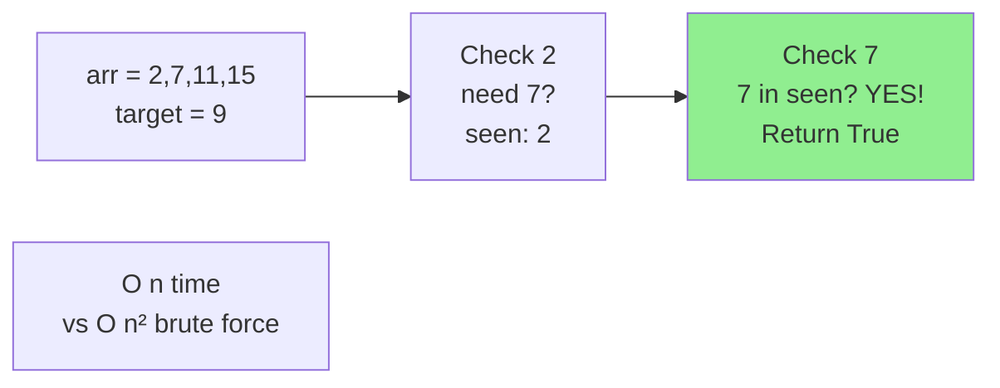
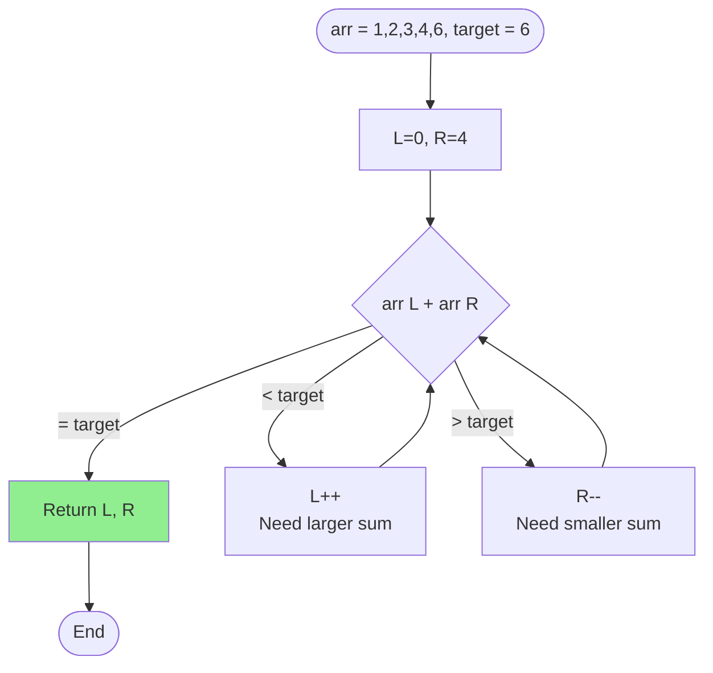
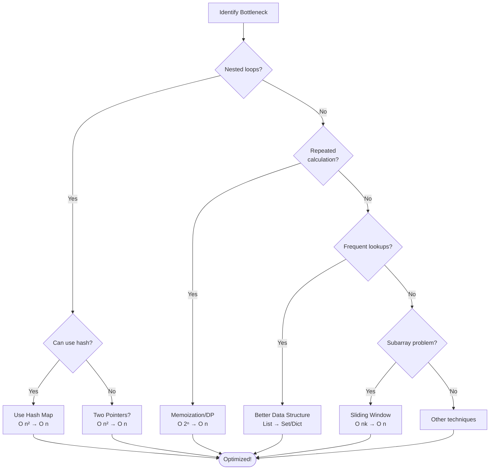

# Optimasi Algoritma

## Pengertian

**Optimasi Algoritma** adalah proses meningkatkan efisiensi algoritma dengan mengurangi:

1. **Time Complexity** - waktu eksekusi
2. **Space Complexity** - penggunaan memori

## Strategi Optimasi

### 1. Reduce Complexity Class

Ubah dari complexity class lebih tinggi ke lebih rendah.

```
O(n²) → O(n log n) → O(n) → O(log n) → O(1)
```

### 2. Eliminate Redundant Operations

Hapus operasi yang tidak perlu atau berulang.

### 3. Use Better Data Structures

Pilih struktur data yang sesuai dengan operasi.

### 4. Trade Space for Time

Gunakan memori ekstra untuk mempercepat algoritma.

### 5. Precomputation

Hitung hasil sebelumnya untuk digunakan nanti.

---

## Teknik Optimasi

### 1. Remove Nested Loops

#### ❌ Before - O(n²)

```python
def find_pair_sum(arr, target):
    """Find if any two numbers sum to target"""
    for i in range(len(arr)):
        for j in range(i + 1, len(arr)):
            if arr[i] + arr[j] == target:
                return True
    return False

# Time: O(n²)
# Space: O(1)
```

#### ✅ After - O(n)

```python
def find_pair_sum_optimized(arr, target):
    """Use hash set for O(n) solution"""
    seen = set()
    for num in arr:
        complement = target - num
        if complement in seen:
            return True
        seen.add(num)
    return False

# Time: O(n)
# Space: O(n)
# Trade-off: Extra O(n) space for O(n) time!
```

**Visualisasi:**



---

### 2. Memoization (Dynamic Programming)

Simpan hasil perhitungan untuk menghindari rekompulasi.

#### ❌ Before - O(2ⁿ)

```python
def fibonacci(n):
    if n <= 1:
        return n
    return fibonacci(n-1) + fibonacci(n-2)

# fib(5) calls fib(4) and fib(3)
# fib(4) calls fib(3) and fib(2)
# fib(3) dipanggil 2x!
# Time: O(2^n)
```

**Recursion Tree:**

```
                fib(5)
              /        \
          fib(4)      fib(3)
         /     \      /     \
     fib(3)  fib(2) fib(2) fib(1)
     /   \
 fib(2) fib(1)

fib(3) dihitung 2x
fib(2) dihitung 3x
→ Banyak redundant calculation!
```

#### ✅ After - O(n)

```python
def fibonacci_memo(n, memo={}):
    if n in memo:
        return memo[n]

    if n <= 1:
        return n

    memo[n] = fibonacci_memo(n-1, memo) + fibonacci_memo(n-2, memo)
    return memo[n]

# Time: O(n) - each fib(i) computed once
# Space: O(n) - memo dictionary
```

**Perbandingan:**

```
n = 40:
- Without memoization: ~2-3 seconds
- With memoization: ~0.0001 seconds
Speedup: 30,000x!
```

---

### 3. Better Data Structure

#### ❌ Before - O(n)

```python
def frequent_lookup(items, queries):
    """Check if each query exists in items"""
    results = []
    for query in queries:
        if query in items:  # O(n) for list
            results.append(True)
        else:
            results.append(False)
    return results

# Time: O(m × n) where m = len(queries), n = len(items)
```

#### ✅ After - O(1)

```python
def frequent_lookup_optimized(items, queries):
    """Use set for O(1) lookup"""
    item_set = set(items)  # O(n) conversion

    results = []
    for query in queries:
        if query in item_set:  # O(1) for set!
            results.append(True)
        else:
            results.append(False)
    return results

# Time: O(n + m) where n = convert to set, m = queries
# Much better for large n!
```

**Data Structure Lookup Times:**

| Data Structure              | Search   | Insert | Delete |
| --------------------------- | -------- | ------ | ------ |
| List                        | O(n)     | O(1)   | O(n)   |
| Set                         | O(1)     | O(1)   | O(1)   |
| Dict                        | O(1)     | O(1)   | O(1)   |
| Sorted List + Binary Search | O(log n) | O(n)   | O(n)   |

---

### 4. Early Termination

Hentikan loop lebih awal jika hasil sudah ditemukan.

#### ❌ Before

```python
def has_duplicate(arr):
    """Check if array has duplicates"""
    for i in range(len(arr)):
        for j in range(i + 1, len(arr)):
            if arr[i] == arr[j]:
                return True  # Already returns early!
    return False

# Already optimal for logic, but O(n²)
```

#### ✅ After - O(n)

```python
def has_duplicate_optimized(arr):
    """Use set to track seen elements"""
    seen = set()
    for item in arr:
        if item in seen:
            return True  # Early termination
        seen.add(item)
    return False

# Time: O(n)
# Space: O(n)
```

---

### 5. Precomputation & Caching

Hitung sekali, gunakan berkali-kali.

#### ❌ Before

```python
def sum_range(arr, queries):
    """Sum elements from index i to j for each query"""
    results = []
    for i, j in queries:
        total = sum(arr[i:j+1])  # O(n) per query
        results.append(total)
    return results

# Time: O(m × n) where m = number of queries
```

#### ✅ After - O(1) per query

```python
def sum_range_optimized(arr, queries):
    """Precompute prefix sums"""
    # Prefix sum: prefix[i] = sum of arr[0:i]
    prefix = [0]
    for num in arr:
        prefix.append(prefix[-1] + num)

    # Now sum(arr[i:j+1]) = prefix[j+1] - prefix[i]
    results = []
    for i, j in queries:
        total = prefix[j+1] - prefix[i]  # O(1)!
        results.append(total)

    return results

# Precomputation: O(n)
# Each query: O(1)
# Total: O(n + m)
```

**Contoh:**

```python
arr = [1, 2, 3, 4, 5]
prefix = [0, 1, 3, 6, 10, 15]

# Query: sum(arr[1:3]) = 2 + 3 + 4 = 9
# Answer: prefix[4] - prefix[1] = 10 - 1 = 9 ✓
```

---

### 6. Two Pointers Technique

Gunakan dua pointer untuk mengurangi nested loops.

#### ❌ Before - O(n²)

```python
def two_sum_sorted(arr, target):
    """Find pair that sums to target in sorted array"""
    for i in range(len(arr)):
        for j in range(i + 1, len(arr)):
            if arr[i] + arr[j] == target:
                return [i, j]
    return None

# Time: O(n²)
```

#### ✅ After - O(n)

```python
def two_sum_sorted_optimized(arr, target):
    """Two pointers from both ends"""
    left, right = 0, len(arr) - 1

    while left < right:
        current_sum = arr[left] + arr[right]

        if current_sum == target:
            return [left, right]
        elif current_sum < target:
            left += 1  # Need larger sum
        else:
            right -= 1  # Need smaller sum

    return None

# Time: O(n)
# Space: O(1)
```

**Visualisasi:**

```
arr = [1, 2, 3, 4, 6]
target = 6

Step 1: L=0, R=4 → 1+6=7 > 6 → R--
Step 2: L=0, R=3 → 1+4=5 < 6 → L++
Step 3: L=1, R=3 → 2+4=6 ✓
```



---

### 7. Sliding Window

Untuk subarray/substring problems.

#### ❌ Before - O(n²)

```python
def max_sum_subarray(arr, k):
    """Find max sum of subarray of size k"""
    max_sum = float('-inf')

    for i in range(len(arr) - k + 1):
        current_sum = sum(arr[i:i+k])  # O(k) per iteration
        max_sum = max(max_sum, current_sum)

    return max_sum

# Time: O(n × k)
```

#### ✅ After - O(n)

```python
def max_sum_subarray_optimized(arr, k):
    """Sliding window approach"""
    # First window
    window_sum = sum(arr[:k])
    max_sum = window_sum

    # Slide window
    for i in range(k, len(arr)):
        window_sum = window_sum - arr[i-k] + arr[i]
        max_sum = max(max_sum, window_sum)

    return max_sum

# Time: O(n)
```

**Visualisasi:**

```
arr = [1, 3, 2, 5, 1, 1], k = 3

Window 1: [1, 3, 2]     sum = 6
Window 2:    [3, 2, 5]  sum = 10 = 6 - 1 + 5
Window 3:       [2, 5, 1] sum = 8  = 10 - 3 + 1
Window 4:          [5, 1, 1] sum = 7  = 8 - 2 + 1

Max = 10
```

---

### 8. Avoid String Concatenation

String immutable → concatenation creates new string.

#### ❌ Before - O(n²)

```python
def join_strings(strings):
    result = ""
    for s in strings:
        result += s  # O(n) per iteration!
    return result

# Time: O(n²) where n = total characters
```

#### ✅ After - O(n)

```python
def join_strings_optimized(strings):
    return "".join(strings)  # O(n)

# Or use list then join
def join_strings_list(strings):
    result = []
    for s in strings:
        result.append(s)  # O(1)
    return "".join(result)  # O(n)

# Time: O(n)
```

---

### 9. Batch Operations

Kurangi jumlah operasi mahal.

#### ❌ Before

```python
def process_items(items):
    for item in items:
        # Open database connection
        conn = connect_db()
        # Process
        result = conn.query(item)
        # Close connection
        conn.close()

# Database connection per item - very slow!
```

#### ✅ After

```python
def process_items_optimized(items):
    # Open connection once
    conn = connect_db()

    results = []
    for item in items:
        result = conn.query(item)
        results.append(result)

    # Close once
    conn.close()
    return results

# Much faster - fewer connection overhead!
```

---

### 10. Binary Search on Answer

Untuk optimization problems.

#### Problem: Find Minimum Maximum

```python
def smallest_max_sum(arr, k):
    """
    Split array into k subarrays.
    Minimize the maximum sum among subarrays.
    """
    pass
```

#### ✅ Binary Search Solution - O(n log S)

```python
def can_split(arr, k, max_sum):
    """Check if we can split into k parts with max sum ≤ max_sum"""
    count = 1
    current_sum = 0

    for num in arr:
        if current_sum + num > max_sum:
            count += 1
            current_sum = num
            if count > k:
                return False
        else:
            current_sum += num

    return True

def smallest_max_sum(arr, k):
    left = max(arr)  # Min possible answer
    right = sum(arr)  # Max possible answer

    while left < right:
        mid = (left + right) // 2

        if can_split(arr, k, mid):
            right = mid  # Try smaller
        else:
            left = mid + 1  # Need larger

    return left

# Time: O(n log S) where S = sum(arr)
```

---

## Optimization Patterns

### Pattern 1: Hash Map for O(1) Lookup

```python
# Instead of: if x in list (O(n))
# Use: if x in set/dict (O(1))
```

### Pattern 2: Sorting + Two Pointers

```python
# For pair/triplet problems on sorted data
arr.sort()  # O(n log n)
# Then two pointers: O(n)
```

### Pattern 3: Prefix Sum for Range Queries

```python
# Precompute: O(n)
# Query: O(1)
```

### Pattern 4: Sliding Window for Subarray

```python
# Instead of checking all subarrays: O(n²)
# Slide window: O(n)
```

### Pattern 5: Binary Search

```python
# Instead of linear search: O(n)
# Binary search on sorted: O(log n)
```

---

## Decision Tree: Which Optimization?



---

## Case Study: Optimize Real Problem

### Problem

```python
def find_common_elements(list1, list2, list3):
    """Find elements common in all three lists"""
    result = []
    for item in list1:
        if item in list2 and item in list3:
            result.append(item)
    return result
```

### Analysis

- `item in list2`: O(n)
- `item in list3`: O(n)
- Loop: O(n)
- **Total: O(n³)**

### Optimization

```python
def find_common_elements_optimized(list1, list2, list3):
    """Use sets for O(1) lookup"""
    set2 = set(list2)  # O(n)
    set3 = set(list3)  # O(n)

    result = []
    for item in list1:  # O(n)
        if item in set2 and item in set3:  # O(1) + O(1)
            result.append(item)

    return result

# Total: O(n)
```

**Or even simpler:**

```python
def find_common_elements_set(list1, list2, list3):
    """Use set intersection"""
    return list(set(list1) & set(list2) & set(list3))

# Total: O(n)
```

**Speedup:**

```
n = 10,000:
- Original: ~10,000³ = 1,000,000,000,000 ops
- Optimized: ~30,000 ops
Speedup: 33,000,000x!
```

---

## Latihan

1. Optimasi dari O(n²) ke O(n):

   ```python
   def count_pairs_with_sum(arr, target):
       count = 0
       for i in range(len(arr)):
           for j in range(i+1, len(arr)):
               if arr[i] + arr[j] == target:
                   count += 1
       return count
   ```

2. Optimasi dengan memoization:

   ```python
   def tribonacci(n):
       if n <= 1:
           return n
       if n == 2:
           return 1
       return tribonacci(n-1) + tribonacci(n-2) + tribonacci(n-3)
   ```

3. Optimasi dengan sliding window:
   ```python
   def longest_substring_k_distinct(s, k):
       # Find longest substring with at most k distinct characters
       pass
   ```

---

## Rangkuman

### Key Principles

1. **Reduce complexity class**: O(n²) → O(n log n) → O(n) → O(log n)
2. **Hash map for lookups**: List O(n) → Set/Dict O(1)
3. **Memoization**: Eliminate redundant calculations
4. **Two pointers**: Reduce nested loops for sorted data
5. **Sliding window**: Optimize subarray problems
6. **Precomputation**: Trade space for time
7. **Better data structures**: Match structure to operations

### Trade-offs

- **Time vs Space**: Faster algorithm may use more memory
- **Simplicity vs Performance**: Complex optimization may be harder to maintain
- **Precomputation vs Dynamic**: Upfront cost vs runtime cost

### When to Optimize?

✅ **Do optimize when:**

- Algorithm is clearly bottleneck
- Dataset is large (n > 10,000)
- Algorithm runs frequently

❌ **Don't optimize when:**

- Dataset is small (n < 100)
- Code runs rarely
- Premature optimization

> "Premature optimization is the root of all evil" - Donald Knuth

---

**Sebelumnya**: [Analisis Algoritma Sorting](./analisis-sorting.md) | **Kembali ke**: [Index](./index.md)
