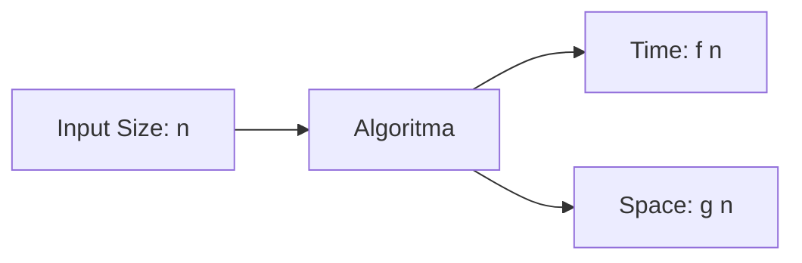
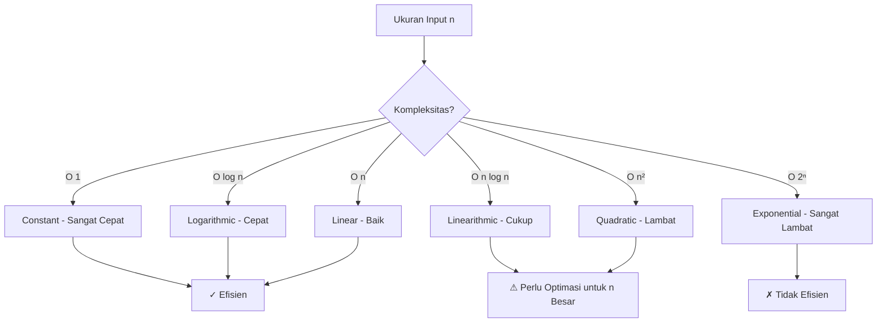

# Pengenalan Kompleksitas Algoritma

## Apa itu Kompleksitas Algoritma?

**Kompleksitas Algoritma** adalah cara untuk mengukur efisiensi sebuah algoritma berdasarkan:

1. **Time Complexity** - berapa lama waktu yang dibutuhkan
2. **Space Complexity** - berapa banyak memori yang digunakan

### Mengapa Penting?

Bayangkan Anda punya dua cara untuk menyelesaikan masalah yang sama:

```python
# Cara 1: Cepat
def cari_max_v1(arr):
    return max(arr)  # O(n)

# Cara 2: Lambat
def cari_max_v2(arr):
    for i in arr:
        is_max = True
        for j in arr:
            if j > i:
                is_max = False
        if is_max:
            return i  # O(n²)
```

Untuk array berisi 1000 elemen:

- Cara 1: ~1000 operasi
- Cara 2: ~1,000,000 operasi

**Perbedaan 1000x lipat!**

## Ukuran Input (n)

Kompleksitas dinyatakan dalam fungsi ukuran input **n**:

- Array dengan 10 elemen → n = 10
- Array dengan 1 juta elemen → n = 1,000,000



## Contoh Sederhana

### Linear Time - O(n)

```python
def print_semua(arr):
    for item in arr:  # Loop sebanyak n kali
        print(item)
# Kompleksitas: O(n)
```

Jika n = 5, maka ada 5 operasi.

### Constant Time - O(1)

```python
def get_first(arr):
    return arr[0]  # Hanya 1 operasi
# Kompleksitas: O(1)
```

Tidak peduli berapa panjang array, hanya 1 operasi.

### Quadratic Time - O(n²)

```python
def print_pairs(arr):
    for i in arr:      # Loop n kali
        for j in arr:  # Loop n kali lagi
            print(i, j)
# Kompleksitas: O(n²)
```

Jika n = 5, maka ada 5 × 5 = 25 operasi.

## Perbandingan Kompleksitas

| Kompleksitas | n=10  | n=100     | n=1000    | n=10000     |
| ------------ | ----- | --------- | --------- | ----------- |
| O(1)         | 1     | 1         | 1         | 1           |
| O(log n)     | 3     | 7         | 10        | 13          |
| O(n)         | 10    | 100       | 1,000     | 10,000      |
| O(n log n)   | 30    | 700       | 10,000    | 130,000     |
| O(n²)        | 100   | 10,000    | 1,000,000 | 100,000,000 |
| O(2ⁿ)        | 1,024 | 1.27×10³⁰ | ∞         | ∞           |

### Grafik Pertumbuhan



## Cara Menghitung Kompleksitas

### Aturan Dasar

1. **Assignment/Aritmatika** = O(1)

   ```python
   x = 5        # O(1)
   y = x + 10   # O(1)
   ```

2. **Sequential Statements** = Jumlahkan

   ```python
   x = 5        # O(1)
   y = 10       # O(1)
   z = x + y    # O(1)
   # Total: O(1) + O(1) + O(1) = O(1)
   ```

3. **Loop** = O(n × isi loop)

   ```python
   for i in range(n):  # O(n)
       print(i)        # O(1)
   # Total: O(n × 1) = O(n)
   ```

4. **Nested Loop** = Kalikan

   ```python
   for i in range(n):      # O(n)
       for j in range(n):  # O(n)
           print(i, j)     # O(1)
   # Total: O(n × n × 1) = O(n²)
   ```

5. **Function Call** = Kompleksitas fungsi tersebut

   ```python
   def linear(n):
       for i in range(n):
           print(i)
   # Kompleksitas: O(n)

   linear(100)  # O(100) = O(n)
   ```

## Contoh Analisis

### Contoh 1: Pencarian Linear

```python
def linear_search(arr, x):
    for i in range(len(arr)):  # O(n)
        if arr[i] == x:         # O(1)
            return i             # O(1)
    return -1                    # O(1)

# Analisis:
# - Loop: O(n)
# - Operasi dalam loop: O(1)
# - Total: O(n × 1) = O(n)
```

### Contoh 2: Bubble Sort

```python
def bubble_sort(arr):
    n = len(arr)                          # O(1)
    for i in range(n):                    # O(n)
        for j in range(n - i - 1):        # O(n)
            if arr[j] > arr[j + 1]:       # O(1)
                arr[j], arr[j+1] = arr[j+1], arr[j]  # O(1)
    return arr

# Analisis:
# - Outer loop: O(n)
# - Inner loop: O(n)
# - Operasi dalam loop: O(1)
# - Total: O(n × n × 1) = O(n²)
```

### Contoh 3: Binary Search

```python
def binary_search(arr, x):
    low, high = 0, len(arr) - 1           # O(1)

    while low <= high:                     # O(log n)
        mid = (low + high) // 2            # O(1)

        if arr[mid] == x:                  # O(1)
            return mid
        elif arr[mid] < x:                 # O(1)
            low = mid + 1
        else:
            high = mid - 1

    return -1

# Analisis:
# - Setiap iterasi membagi search space jadi 2
# - n → n/2 → n/4 → n/8 → ... → 1
# - Jumlah iterasi: log₂(n)
# - Total: O(log n)
```

## Aturan Penyederhanaan

### 1. Drop Constants

```python
# O(2n) = O(n)
# O(n + 100) = O(n)
# O(5n²) = O(n²)
```

### 2. Drop Non-Dominant Terms

```python
# O(n² + n) = O(n²)
# O(n³ + n² + n) = O(n³)
# O(n log n + n) = O(n log n)
```

### 3. Different Variables

```python
def function(arr1, arr2):
    for i in arr1:        # O(n)
        print(i)
    for j in arr2:        # O(m)
        print(j)
# Total: O(n + m) - BUKAN O(n)!
```

## Best Case, Average Case, Worst Case

```python
def search(arr, x):
    for i in range(len(arr)):
        if arr[i] == x:
            return i
    return -1

# Best Case: O(1) - elemen pertama
# Average Case: O(n/2) = O(n)
# Worst Case: O(n) - elemen terakhir atau tidak ada
```

Biasanya kita fokus pada **Worst Case** karena:

- Lebih aman (guarantees)
- Lebih mudah dianalisis
- Lebih practical

## Latihan

1. Hitung kompleksitas:

   ```python
   def mystery(n):
       sum = 0
       for i in range(n):
           for j in range(i):
               sum += 1
       return sum
   ```

2. Bandingkan:

   ```python
   # Algoritma A: O(n²)
   # Algoritma B: O(n log n)
   # Mana yang lebih cepat untuk n = 1000?
   ```

3. Optimasi:
   ```python
   # Buat versi yang lebih efisien
   def has_duplicates(arr):
       for i in range(len(arr)):
           for j in range(len(arr)):
               if i != j and arr[i] == arr[j]:
                   return True
       return False
   # Kompleksitas: O(n²)
   # Bisakah dibuat O(n)?
   ```

## Rangkuman

- **Kompleksitas Algoritma** mengukur efisiensi berdasarkan waktu dan ruang
- **Big O Notation** untuk menyatakan kompleksitas
- **Time Complexity**: berapa lama eksekusi
- **Space Complexity**: berapa banyak memori
- Fokus pada **Worst Case** untuk analisis
- **Drop constants** dan **non-dominant terms**
- Pilih algoritma dengan kompleksitas lebih rendah untuk dataset besar

---

**Selanjutnya**: [Notasi Big O](./big-o.md)
