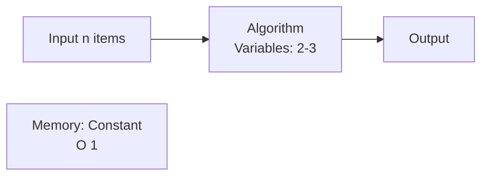
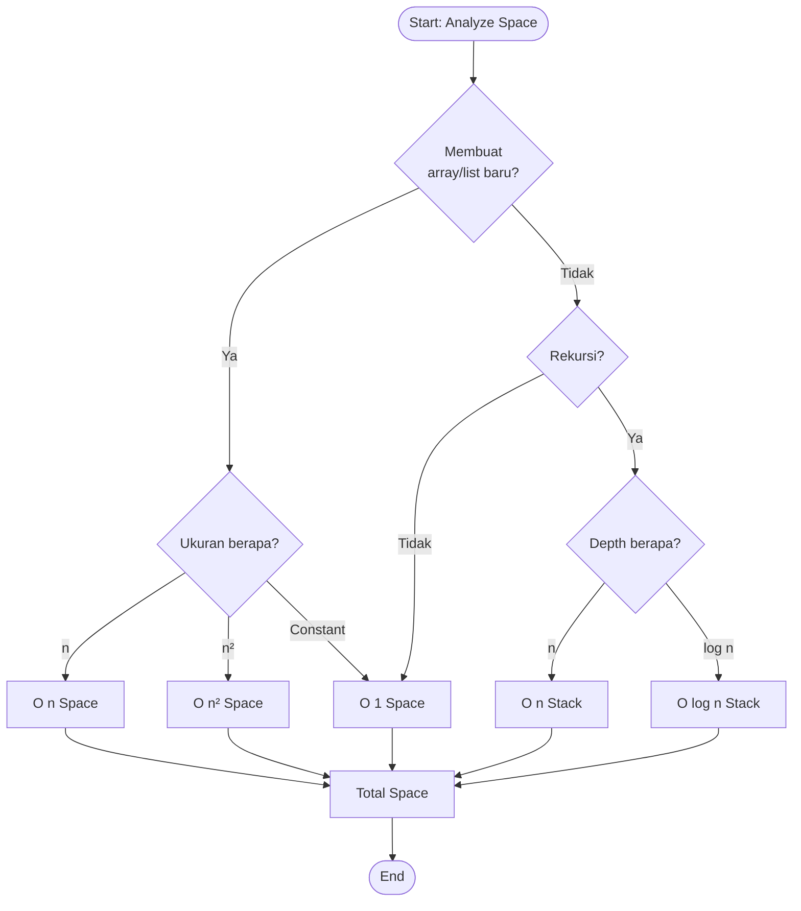

# Space Complexity (Kompleksitas Ruang)

## Definisi

**Space Complexity** adalah ukuran seberapa banyak memori tambahan yang dibutuhkan algoritma sebagai fungsi dari ukuran input.

> "Berapa banyak memori yang digunakan algoritma?"

## Komponen Space Complexity

### 1. Fixed Space (Auxiliary Space)

Memori yang konstan, tidak bergantung pada input:

```python
def sum_array(arr):
    total = 0      # O(1) - 1 variabel
    count = 0      # O(1) - 1 variabel

    for num in arr:
        total += num
        count += 1

    return total

# Space: O(1) - hanya 2 variabel
```

### 2. Variable Space

Memori yang bergantung pada ukuran input:

```python
def create_array(n):
    result = [0] * n  # O(n) - array dengan n elemen
    return result

# Space: O(n)
```

### 3. Recursive Stack Space

Memori yang digunakan call stack:

```python
def factorial(n):
    if n == 0:
        return 1
    return n * factorial(n - 1)

# Call stack: f(n) → f(n-1) → ... → f(0)
# Space: O(n) untuk stack
```

## Formula

```
Total Space = Fixed Space + Variable Space + Stack Space
```

Biasanya kita fokus pada **Variable Space** (Auxiliary Space).

## Contoh Analisis

### O(1) - Constant Space

**Tidak membuat struktur data baru yang bergantung pada input.**

```python
def sum_array(arr):
    total = 0           # O(1)
    for num in arr:
        total += num
    return total

# Space: O(1) - hanya 1 variabel
```

```python
def max_element(arr):
    max_val = arr[0]    # O(1)
    for num in arr:
        if num > max_val:
            max_val = num
    return max_val

# Space: O(1)
```

**Karakteristik:**

- Tidak membuat array/list baru
- Hanya variabel sederhana
- In-place modification



### O(n) - Linear Space

**Membuat struktur data dengan ukuran proporsional dengan input.**

```python
def create_copy(arr):
    result = []                 # O(n)
    for item in arr:
        result.append(item)
    return result

# Space: O(n) - array baru dengan n elemen
```

```python
def reverse_array(arr):
    reversed_arr = [0] * len(arr)  # O(n)
    n = len(arr)

    for i in range(n):
        reversed_arr[i] = arr[n - i - 1]

    return reversed_arr

# Space: O(n)
```

**Hash Table / Set:**

```python
def remove_duplicates(arr):
    seen = set()           # O(n) worst case
    result = []            # O(n) worst case

    for item in arr:
        if item not in seen:
            seen.add(item)
            result.append(item)

    return result

# Space: O(n) + O(n) = O(n)
```

### O(n²) - Quadratic Space

**Membuat struktur data 2D atau nested.**

```python
def create_matrix(n):
    matrix = []
    for i in range(n):
        row = [0] * n      # O(n)
        matrix.append(row)
    return matrix

# Space: O(n × n) = O(n²)
```

```python
def multiplication_table(n):
    table = [[0] * n for _ in range(n)]  # O(n²)

    for i in range(n):
        for j in range(n):
            table[i][j] = i * j

    return table

# Space: O(n²)
```

### O(log n) - Logarithmic Space

**Biasanya dari recursive call stack dalam divide-and-conquer.**

```python
def binary_search_recursive(arr, target, left, right):
    if left > right:
        return -1

    mid = (left + right) // 2

    if arr[mid] == target:
        return mid
    elif arr[mid] < target:
        return binary_search_recursive(arr, target, mid + 1, right)
    else:
        return binary_search_recursive(arr, target, left, mid - 1)

# Call stack depth: log n
# Space: O(log n)
```

**Visualisasi Call Stack:**

```
Call 1: search(arr, 0, 15)    ← level 1
Call 2: search(arr, 8, 15)    ← level 2
Call 3: search(arr, 12, 15)   ← level 3
Call 4: search(arr, 14, 15)   ← level 4

Max depth: log₂(16) = 4
```

## Time vs Space Trade-off

Sering ada trade-off antara waktu dan space:

### Contoh 1: Fibonacci

**❌ Naive - O(2ⁿ) time, O(n) space (stack):**

```python
def fib(n):
    if n <= 1:
        return n
    return fib(n-1) + fib(n-2)
```

**✅ Memoization - O(n) time, O(n) space:**

```python
def fib_memo(n, memo={}):
    if n in memo:
        return memo[n]
    if n <= 1:
        return n
    memo[n] = fib_memo(n-1, memo) + fib_memo(n-2, memo)
    return memo[n]
```

**✅ Iterative - O(n) time, O(1) space:**

```python
def fib_iter(n):
    if n <= 1:
        return n

    prev, curr = 0, 1
    for _ in range(2, n + 1):
        prev, curr = curr, prev + curr

    return curr
```

| Metode      | Time  | Space | Catatan               |
| ----------- | ----- | ----- | --------------------- |
| Naive       | O(2ⁿ) | O(n)  | Sangat lambat         |
| Memoization | O(n)  | O(n)  | Cepat, butuh memory   |
| Iterative   | O(n)  | O(1)  | Cepat, minimal memory |

### Contoh 2: Sum Array

**Iterative - O(1) space:**

```python
def sum_iter(arr):
    total = 0
    for num in arr:
        total += num
    return total

# Space: O(1)
```

**Recursive - O(n) space:**

```python
def sum_rec(arr):
    if len(arr) == 0:
        return 0
    return arr[0] + sum_rec(arr[1:])

# Space: O(n) untuk call stack
```

## Optimasi Space

### 1. In-Place Modification

❌ **Extra Space - O(n):**

```python
def reverse(arr):
    result = []
    for i in range(len(arr) - 1, -1, -1):
        result.append(arr[i])
    return result

# Space: O(n)
```

✅ **In-Place - O(1):**

```python
def reverse_in_place(arr):
    left, right = 0, len(arr) - 1
    while left < right:
        arr[left], arr[right] = arr[right], arr[left]
        left += 1
        right -= 1
    return arr

# Space: O(1)
```

### 2. Iterative vs Recursive

❌ **Recursive - O(n) space:**

```python
def factorial_rec(n):
    if n == 0:
        return 1
    return n * factorial_rec(n - 1)

# Stack space: O(n)
```

✅ **Iterative - O(1) space:**

```python
def factorial_iter(n):
    result = 1
    for i in range(1, n + 1):
        result *= i
    return result

# Space: O(1)
```

### 3. Generator vs List

❌ **List - O(n) space:**

```python
def get_squares(n):
    result = []
    for i in range(n):
        result.append(i * i)
    return result

squares = get_squares(1000000)  # Butuh 8MB memory
```

✅ **Generator - O(1) space:**

```python
def get_squares(n):
    for i in range(n):
        yield i * i

squares = get_squares(1000000)  # Minimal memory
# Process one at a time
```

## Analisis Algoritma Sorting

### Bubble Sort

```python
def bubble_sort(arr):
    n = len(arr)
    for i in range(n):
        for j in range(n - i - 1):
            if arr[j] > arr[j + 1]:
                arr[j], arr[j+1] = arr[j+1], arr[j]
    return arr

# Time: O(n²)
# Space: O(1) - in-place
```

### Merge Sort

```python
def merge_sort(arr):
    if len(arr) <= 1:
        return arr

    mid = len(arr) // 2
    left = merge_sort(arr[:mid])
    right = merge_sort(arr[mid:])

    return merge(left, right)

# Time: O(n log n)
# Space: O(n) - temporary arrays
```

**Comparison:**

| Algorithm      | Time           | Space    | In-Place? |
| -------------- | -------------- | -------- | --------- |
| Bubble Sort    | O(n²)          | O(1)     | ✓         |
| Selection Sort | O(n²)          | O(1)     | ✓         |
| Insertion Sort | O(n²)          | O(1)     | ✓         |
| Merge Sort     | O(n log n)     | O(n)     | ✗         |
| Quick Sort     | O(n log n) avg | O(log n) | ✓         |
| Heap Sort      | O(n log n)     | O(1)     | ✓         |

## Call Stack Depth

### Linear Recursion - O(n)

```python
def print_numbers(n):
    if n == 0:
        return
    print(n)
    print_numbers(n - 1)

# Stack depth: n
# Space: O(n)
```

**Stack:**

```
print_numbers(5)
  → print_numbers(4)
    → print_numbers(3)
      → print_numbers(2)
        → print_numbers(1)
          → print_numbers(0)

Max depth: 6 ≈ O(n)
```

### Binary Recursion - O(n)

```python
def fibonacci(n):
    if n <= 1:
        return n
    return fibonacci(n-1) + fibonacci(n-2)

# Stack depth: n (longest path)
# Space: O(n)
```

**Stack (worst path):**

```
fib(5)
  → fib(4)
    → fib(3)
      → fib(2)
        → fib(1)

Max depth: 5 ≈ O(n)
```

### Divide-and-Conquer - O(log n)

```python
def binary_search(arr, target, left, right):
    if left > right:
        return -1

    mid = (left + right) // 2
    if arr[mid] == target:
        return mid
    elif arr[mid] < target:
        return binary_search(arr, target, mid + 1, right)
    else:
        return binary_search(arr, target, left, mid - 1)

# Stack depth: log n
# Space: O(log n)
```

## Flowchart: Space Analysis



## Latihan

1. Hitung space complexity:

   ```python
   def mystery1(n):
       result = []
       for i in range(n):
           row = []
           for j in range(n):
               row.append(i * j)
           result.append(row)
       return result
   ```

2. Optimasi space dari O(n) ke O(1):

   ```python
   def is_palindrome(s):
       reversed_s = s[::-1]
       return s == reversed_s
   ```

3. Bandingkan space complexity:

   ```python
   # A
   def sum_a(arr):
       if len(arr) == 0:
           return 0
       return arr[0] + sum_a(arr[1:])

   # B
   def sum_b(arr):
       total = 0
       for num in arr:
           total += num
       return total
   ```

## Rangkuman

- **Space Complexity** mengukur penggunaan memori
- Terdiri dari: Fixed Space + Variable Space + Stack Space
- **O(1)**: Constant space - paling efisien
- **O(n)**: Linear space - membuat struktur data baru
- **O(log n)**: Logarithmic space - biasanya dari rekursi divide-and-conquer
- **Trade-off**: Sering harus memilih antara time dan space
- **Optimasi**: In-place modification, iterative vs recursive, generator

---

**Sebelumnya**: [Time Complexity](./time-complexity.md) | **Selanjutnya**: [Best, Average, Worst Case](./best-average-worst.md)
