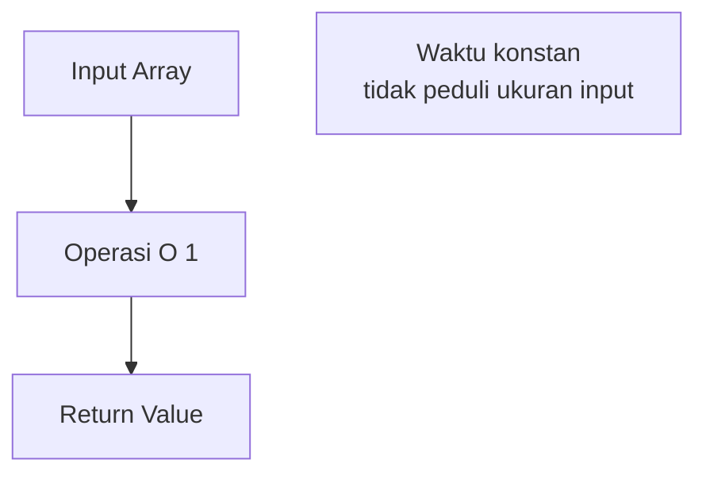
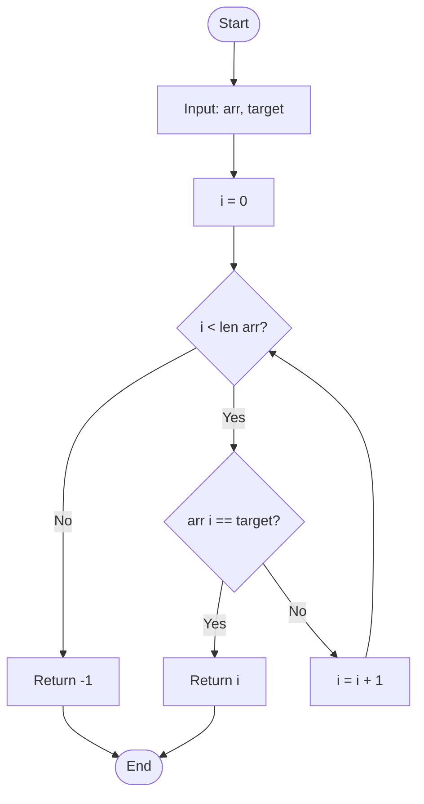
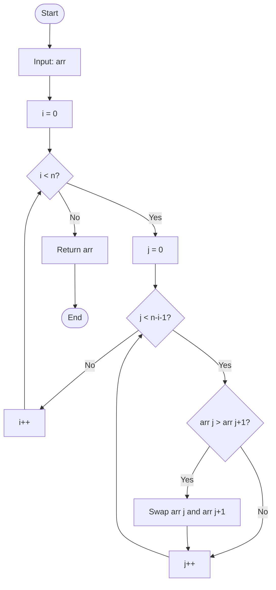

# Time Complexity (Kompleksitas Waktu)

## Definisi

**Time Complexity** adalah ukuran seberapa lama waktu yang dibutuhkan algoritma untuk berjalan sebagai fungsi dari ukuran input.

> "Berapa banyak operasi primitif yang dilakukan algoritma?"

## Mengapa Penting?

```python
# Algoritma A: O(n²)
def find_pair_sum_slow(arr, target):
    for i in range(len(arr)):
        for j in range(len(arr)):
            if arr[i] + arr[j] == target:
                return True
    return False

# Algoritma B: O(n)
def find_pair_sum_fast(arr, target):
    seen = set()
    for num in arr:
        if target - num in seen:
            return True
        seen.add(num)
    return False

# Untuk n = 10,000:
# A: 100,000,000 operasi (~10 detik)
# B: 10,000 operasi (~0.001 detik)
```

Perbedaan **10,000x lipat**!

## Menghitung Time Complexity

### Aturan Dasar

1. **Operasi Primitif = O(1)**

   ```python
   x = 5           # O(1)
   y = x + 10      # O(1)
   arr[i] = x      # O(1)
   return x        # O(1)
   ```

2. **Sequential = Jumlahkan**

   ```python
   x = 5           # O(1)
   y = 10          # O(1)
   z = x + y       # O(1)
   # Total: O(1) + O(1) + O(1) = O(1)
   ```

3. **Loop = Kalikan**

   ```python
   for i in range(n):  # O(n)
       print(i)        # O(1)
   # Total: O(n × 1) = O(n)
   ```

4. **Nested Loop = Kalikan Semua**
   ```python
   for i in range(n):      # O(n)
       for j in range(n):  # O(n)
           print(i, j)     # O(1)
   # Total: O(n × n × 1) = O(n²)
   ```

## Analisis Step-by-Step

### Contoh 1: Simple Loop

```python
def sum_array(arr):
    total = 0                    # O(1)
    for num in arr:              # O(n)
        total += num             # O(1)
    return total                 # O(1)

# Analisis:
# Line 2: O(1)
# Line 3-4: O(n × 1) = O(n)
# Line 5: O(1)
# Total: O(1) + O(n) + O(1) = O(n)
```

### Contoh 2: Nested Loop

```python
def print_pairs(arr):
    n = len(arr)                        # O(1)
    for i in range(n):                  # O(n)
        for j in range(n):              # O(n)
            print(arr[i], arr[j])       # O(1)

# Analisis:
# Line 2: O(1)
# Line 3: O(n)
# Line 4: O(n)
# Line 5: O(1)
# Total: O(1) + O(n × n × 1) = O(n²)
```

### Contoh 3: Multiple Loops

```python
def function(arr):
    # First loop
    for i in arr:                # O(n)
        print(i)                 # O(1)

    # Second loop
    for i in arr:                # O(n)
        for j in arr:            # O(n)
            print(i, j)          # O(1)

# Analisis:
# First loop: O(n)
# Second loop: O(n²)
# Total: O(n) + O(n²) = O(n²)
# (Drop non-dominant term)
```

## Contoh Algoritma

### O(1) - Constant Time

```python
def get_first(arr):
    return arr[0]

def get_last(arr):
    return arr[-1]

def get_middle(arr):
    return arr[len(arr) // 2]
```

**Karakteristik:**

- Tidak ada loop
- Akses langsung
- Tidak bergantung pada n



### O(log n) - Logarithmic Time

```python
def binary_search(arr, target):
    left, right = 0, len(arr) - 1

    while left <= right:
        mid = (left + right) // 2

        if arr[mid] == target:
            return mid
        elif arr[mid] < target:
            left = mid + 1
        else:
            right = mid - 1

    return -1

# Setiap iterasi membagi search space jadi 2
# n → n/2 → n/4 → n/8 → ... → 1
# Jumlah iterasi: log₂(n)
```

**Visualisasi:**

```
Iterasi 1: [1,2,3,4,5,6,7,8] → cek 4
Iterasi 2: [5,6,7,8]         → cek 6
Iterasi 3: [7,8]             → cek 7
Iterasi 4: [8]               → cek 8

4 iterasi untuk 8 elemen = log₂(8) = 3
```

### O(n) - Linear Time

```python
def linear_search(arr, target):
    for i in range(len(arr)):
        if arr[i] == target:
            return i
    return -1

def count_occurrences(arr, target):
    count = 0
    for item in arr:
        if item == target:
            count += 1
    return count
```

**Flowchart:**



### O(n log n) - Linearithmic Time

```python
def merge_sort(arr):
    if len(arr) <= 1:
        return arr

    mid = len(arr) // 2
    left = merge_sort(arr[:mid])    # T(n/2)
    right = merge_sort(arr[mid:])   # T(n/2)

    return merge(left, right)        # O(n)

def merge(left, right):
    result = []
    i = j = 0

    while i < len(left) and j < len(right):
        if left[i] <= right[j]:
            result.append(left[i])
            i += 1
        else:
            result.append(right[j])
            j += 1

    result.extend(left[i:])
    result.extend(right[j:])
    return result

# Rekursi: T(n) = 2T(n/2) + O(n)
# Solusi: T(n) = O(n log n)
```

**Visualisasi Merge Sort:**

```
Level 0: [8,4,2,1,7,3,9,5]         → O(n)
         /                \
Level 1: [8,4,2,1]    [7,3,9,5]    → O(n)
         /    \        /    \
Level 2: [8,4] [2,1] [7,3] [9,5]   → O(n)
         ...

Total levels: log n
Work per level: n
Total: O(n log n)
```

### O(n²) - Quadratic Time

```python
def bubble_sort(arr):
    n = len(arr)
    for i in range(n):              # n kali
        for j in range(n - i - 1):  # n kali
            if arr[j] > arr[j + 1]:
                arr[j], arr[j+1] = arr[j+1], arr[j]
    return arr

def selection_sort(arr):
    n = len(arr)
    for i in range(n):              # n kali
        min_idx = i
        for j in range(i+1, n):     # n kali
            if arr[j] < arr[min_idx]:
                min_idx = j
        arr[i], arr[min_idx] = arr[min_idx], arr[i]
    return arr
```

**Flowchart Bubble Sort:**



### O(2ⁿ) - Exponential Time

```python
def fibonacci(n):
    if n <= 1:
        return n
    return fibonacci(n-1) + fibonacci(n-2)

# Tree:
#           fib(5)
#          /      \
#      fib(4)    fib(3)
#     /    \      /    \
# fib(3) fib(2) fib(2) fib(1)
#  ...

# Jumlah node: 2⁰ + 2¹ + ... + 2ⁿ ≈ 2ⁿ⁺¹
```

**Optimasi dengan Memoization → O(n):**

```python
def fibonacci_memo(n, memo={}):
    if n in memo:
        return memo[n]
    if n <= 1:
        return n

    memo[n] = fibonacci_memo(n-1, memo) + fibonacci_memo(n-2, memo)
    return memo[n]
```

## Loop Variations

### 1. Dependent Loops

```python
def triangle(n):
    for i in range(n):      # n kali
        for j in range(i):  # 0, 1, 2, ..., n-1
            print('*')

# Total: 0 + 1 + 2 + ... + (n-1) = n(n-1)/2 = O(n²)
```

### 2. Logarithmic Loop

```python
def log_loop(n):
    i = 1
    while i < n:
        print(i)
        i *= 2       # i = 1, 2, 4, 8, 16, ...

# Iterasi: log₂(n)
# Complexity: O(log n)
```

### 3. Loop with Division

```python
def div_loop(n):
    i = n
    while i > 0:
        print(i)
        i //= 2      # i = n, n/2, n/4, ...

# Complexity: O(log n)
```

## Rekursi

### Linear Recursion - O(n)

```python
def factorial(n):
    if n == 0:
        return 1
    return n * factorial(n - 1)

# T(n) = T(n-1) + O(1)
# T(n) = O(n)
```

### Binary Recursion - O(2ⁿ)

```python
def fib(n):
    if n <= 1:
        return n
    return fib(n-1) + fib(n-2)

# T(n) = T(n-1) + T(n-2) + O(1)
# T(n) = O(2ⁿ)
```

### Divide-and-Conquer - O(n log n)

```python
def merge_sort(arr):
    if len(arr) <= 1:
        return arr
    mid = len(arr) // 2
    left = merge_sort(arr[:mid])
    right = merge_sort(arr[mid:])
    return merge(left, right)

# T(n) = 2T(n/2) + O(n)
# T(n) = O(n log n)
```

## Best, Average, Worst Case

```python
def linear_search(arr, x):
    for i in range(len(arr)):
        if arr[i] == x:
            return i
    return -1
```

- **Best Case**: O(1) - elemen pertama
- **Average Case**: O(n/2) = O(n)
- **Worst Case**: O(n) - elemen terakhir atau tidak ada

**Biasanya kita fokus pada Worst Case** karena memberikan guarantee.

## Tips Optimasi

### 1. Hindari Nested Loop yang Tidak Perlu

❌ **Slow - O(n²):**

```python
def has_duplicate(arr):
    for i in range(len(arr)):
        for j in range(i+1, len(arr)):
            if arr[i] == arr[j]:
                return True
    return False
```

✅ **Fast - O(n):**

```python
def has_duplicate(arr):
    seen = set()
    for item in arr:
        if item in seen:
            return True
        seen.add(item)
    return False
```

### 2. Gunakan Data Structure yang Tepat

❌ **Slow - O(n):**

```python
def search(arr, x):
    return x in arr  # List lookup: O(n)
```

✅ **Fast - O(1):**

```python
def search(s, x):
    return x in s  # Set/dict lookup: O(1)
```

### 3. Cache Result (Memoization)

❌ **Slow - O(2ⁿ):**

```python
def fib(n):
    if n <= 1:
        return n
    return fib(n-1) + fib(n-2)
```

✅ **Fast - O(n):**

```python
def fib(n, memo={}):
    if n in memo:
        return memo[n]
    if n <= 1:
        return n
    memo[n] = fib(n-1, memo) + fib(n-2, memo)
    return memo[n]
```

## Latihan

1. Hitung time complexity:

   ```python
   def mystery1(n):
       i = 1
       while i < n:
           j = 1
           while j < n:
               print(i, j)
               j *= 2
           i += 1
   ```

2. Optimasi dari O(n³) ke O(n²):

   ```python
   def three_sum(arr):
       result = []
       for i in range(len(arr)):
           for j in range(i+1, len(arr)):
               for k in range(j+1, len(arr)):
                   if arr[i] + arr[j] + arr[k] == 0:
                       result.append([arr[i], arr[j], arr[k]])
       return result
   ```

3. Bandingkan kompleksitas:

   ```python
   # A
   def func_a(arr):
       return arr[0] + arr[-1]

   # B
   def func_b(arr):
       total = 0
       for item in arr:
           total += item
       return total

   # C
   def func_c(arr):
       for i in arr:
           for j in arr:
               print(i * j)
   ```

## Rangkuman

- **Time Complexity** mengukur jumlah operasi
- Fokus pada **worst case** (Big O)
- **Loop**: O(n), **Nested loop**: O(n²), **Divide**: O(log n)
- **Drop constants** dan **non-dominant terms**
- Gunakan **data structure** dan **algorithm** yang tepat untuk optimasi

---

**Sebelumnya**: [Notasi Big O](./big-o.md) | **Selanjutnya**: [Space Complexity](./space-complexity.md)
