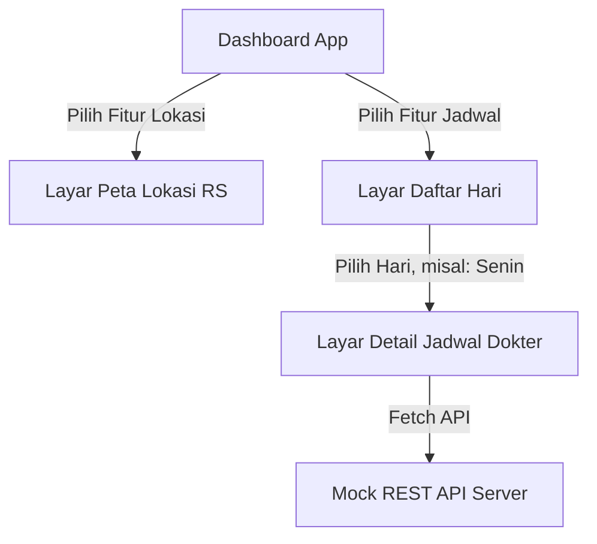

# Manajemen Integrasi Lanjut: Library Lokasi Geografis & Peta (Maps)

Fitur pencarian LBS (Location Based System) berbasis sensor koordinat GPS, sering menjadi nilai fungsi utama (vital) pada banyak program populer seluler moden, misalnya Ojek Online driver-rider App tracking, Fitness Activity Tracker Langkah Jarak Lari, dan sebagainya.

Untuk mengakses Modul Perangkat Keras GPS Handphone (koordinat satelit `Lat`, `Lng`), kita butuh melakukan **Ekslporasi integrasi Sistem Permission Hak Akses (Izin)** sistem OS Android & iOS, dan memvisualisasikannya di sebuah Widget Map Kartograf (SDK Google Maps atau Mapkit Apple).

## 1. Expo-Location (Mengambil Sensor Titik Kordinat User Hardware)

Instalasi Sensor Library Bawaan Expo Ecosystem:
```bash
npx expo install expo-location
```
Modul API Eksternal ini memungkinkan Anda membaca geolokasi terkini ponsel, memantau *geofencing/Background tracking live*, ataupun konversi nama jalan tempat titik kota ke sebuah koordinat (Geocoding-Reverse Geocoding Map).

### Contoh Flow Konsep Memanggil Permintaan Posisi HP

1. Harus melakukan cek validitas status Izinkan Tracking GPS terlebih dahulu pada layar HP. Jika Anda langsung melibas meminta data Hardware Coordinate Sensor Satellit ke OS Ponsel tanpa minta Permohonan Persetujuan Security Layar Depan Izin, App akan *Crash / Force Close / Access Denied!*
2. Jika pengguna meng-GRANTS/Setuju "Allow Once" / "Allow All the time", Ambil datanya.
3. Tunggu respon Koordinat. Set result di State Object Komponen Utama.

Kode Penggunaan Request Standard `expo-location`:

```javascript
import React, { useState, useEffect } from 'react';
import { View, Text, StyleSheet } from 'react-native';

// Module API Periperal External (Hardware System Bindings)
import * as ModuleGPSLokasi from 'expo-location'; 

export default function PetaTrackingAplikasi() {
  const [dataPosisiku, setPosisiku] = useState(null);
  const [kalimatStatusSistem, setKalimatPesan] = useState('Menginisialisasi sistem radar gps satelit...');

  useEffect(() => {
    // Fungsi Anonymous IIFE di hook Async Langsung:
    (async () => {
      // #Langkah 1 Hak Akses Security Minta Izin
      let hakAksesTanyaUser = await ModuleGPSLokasi.requestForegroundPermissionsAsync();
      
      // Jika pengguna hp menge-klik Tombol Layar Popup Tolak "Deny Permission GPS", Block!!
      if (hakAksesTanyaUser.status !== 'granted') {
        setKalimatPesan('Dilarang/Permintaan Izin Akses Sensor Lokasi Ponsel di Tolak oleh Pemilik.');
        return; 
      }

      setKalimatPesan('Meminta Koneksi Sensor Detik ini...');

      // #Langkah 2: Proses memanen Koordinat Kalkulasi presisi Medium/Best Satelit.
      let koordinatPosisiResultRaw = await ModuleGPSLokasi.getCurrentPositionAsync({
           // Opsional Tuning Sensitivitas Akurasi (Low/Highest/BestForNavigations) (Hati-Hati, Tinggi = HP cepat Habis Baterai).
           accuracy: ModuleGPSLokasi.Accuracy.High 
      });

      // Update View React dengan Result Variable yang terdeteksi
      setPosisiku(koordinatPosisiResultRaw.coords); 
    })(); 
  }, []); // Run lifecycle once per Open Screen Module.

  // Render teks Kondisi Loading Waiter
  let layarPesanAkhirInfo = kalimatStatusSistem;
  
  if (dataPosisiku) {
    // Parsing String JSON Hasil Data Sensor Koordinat yang Panjang Menjadi Tulisan Cantik Titik Sumbu Bumi:
    layarPesanAkhirInfo = `TITIK POTENSI DITEMUKAN PADA KORDINAT MAPS \n LINTANG (Latitude): ${dataPosisiku.latitude} \n BUJUR (Longitude): ${dataPosisiku.longitude} \n KEPADATAN POSISI METER: ${Math.round(dataPosisiku.accuracy)} M`;
  }

  return (
    <View style={stylerefer.containerLayout}>
      <Text style={stylerefer.fontInfoSensor}>{layarPesanAkhirInfo}</Text>
    </View>
  );
}

const stylerefer = StyleSheet.create({
  containerLayout: { flex: 1, backgroundColor:"#fff", alignItems: 'center', justifyContent: 'center', margin: 25 },
  fontInfoSensor: { fontSize: 18, color:"blue", fontWeight:"bold", textAlign: "center" }
});
```


## 2. Rendering UI Modul Map Interaktif Peta Bumi: React-Native-Maps (Opsional Advanced)

Untuk menggambar komponen Kartografis Modul Peta Navigasi interaktif mirip App Google Map (Dengan dukungan Pin Markers, Polygons Rute Arsitektur, Tampilan Satelit):
Standard yang dipakai adalah dependensi `react-native-maps` SDK yang disupport oleh komunitas AirBnb dan React Group secara kuat.

Instalasi untuk base library:
```bash
npm install react-native-maps
```
**Catatan Modul Berat:** Library ini meng-implement *bridging code native* berat. (Jika menggunakan instalasi Expo Web CLI Biasa mungkin ada konfigurasi plugin ekstras. Paling stabil digunakan di Bare Workflow `React Native CLI Murni` atau sistem Development Build EXPO EAS.)

Komponen Render Map Interaktif Dasar dengan Tagging Komponen Markernya:
```javascript
import MapView, { Marker } from 'react-native-maps';
import { StyleSheet, View, Text } from 'react-native';

export default function PetaModulAplikasi() {
  // Sumbu tengah layar titik Jakarta Monas Default Konfigurasi Lensa Satelit
  const baseTengahanJakarta = {
    latitude: -6.1751,
    longitude: 106.8272,
    latitudeDelta: 0.0922,   // Setting Skala Level Zoom Lensa Vertikal Bawah Atap Peta
    longitudeDelta: 0.0421,  // Level Horisontal 
  };

  return (
    <View style={styles.container}>
      {/* Penggambaran Parent Layer SDK Native Google/Apple Maps Engine Core Modul Engine Canvas */}
      <MapView 
         style={styles.layolengMapeSistemAbsolute} 
         initialRegion={baseTengahanJakarta}
         showsUserLocation={true}    // Fitur Built in Marker Pin Biru titik Pengguna sendiri (GPS Required Permisson aktif!)
      >
          {/* Membuat Komponen Sub-Marker Pin Merah Custom Di Suatu Tempat */}
          <Marker
             coordinate={{ latitude: -6.1754, longitude: 106.8276 }}
             title="Monumen Nasional"
             description="Simbol Kebanggaan Jakarta."
             pinColor="red"  // Gaya opsi Warna marker standar bawaan 
          />
      </MapView>
      
      <View style={styles.bubbleStatusCardTengahAtas}>
         <Text>Aplikasi Pemandu LOKASI Wisata</Text>
      </View>
    </View>
  );
}

const styles = StyleSheet.create({
  container: {
    flex: 1,  
  },
  bubbleStatusCardTengahAtas: { position:"absolute", top: 50, left: 30, right:30, padding: 15, elevation:10, backgroundColor: "white", borderRadius:10 , alignItems:"center"},
  layolengMapeSistemAbsolute: {
    width: '100%',
    height: '100%',   // Melebarkan Full Layar Canvas Rendering Peta Lensa!
  },
});
```

*Prasyarat Server Key Google Cloud Billing API Maps Production*: Apabila sistem dirilis ke Aplikasi App Store Apple / Playstore Google, Maps Native ini mewajibkan anda mengatur key token SDK Native `AndroidManifest.xml API KEY Map` dari Dashboard Google Cloud Platform Developer! Kegagalan integrasi Google Key menyebabkan peta akan Blank Putih kosong / Error layar Render Frame Abu-Abu!

---

## 🔍 Studi Kasus Integrasi: Sistem Jadwal Dokter & Peta Poliklinik (RS Sultan Iskandar Muda)

Sebagai bentuk implementasi dari materi **Integrasi API** dan **Peta Lokasi**, kita akan mengambil studi kasus nyata dari penelitian berjudul **"Sistem Pendajadwalan Dokter dan Fasilitas Poli pada Rumah Sakit Sultan Iskandar Muda Nagan Raya Berbasis Android"** (Payana, dkk., 2023).

Pada studi kasus ini, kita akan mengadaptasi rancangan aplikasi tersebut ke dalam **React Native** dengan membangun fitur:
1. **Peta Interaktif** untuk menampilkan lokasi fisik RSUD Sultan Iskandar Muda beserta koordinatnya.
2. **Integrasi REST API** untuk mengambil dan menampilkan jadwal praktek dokter secara dinamis berdasarkan hari yang dipilih.



### 1. Mock REST API Data Jadwal Dokter (`jadwal_dokter.json`)

Berikut adalah contoh struktur data JSON yang disediakan oleh Web API Server untuk mengembalikan daftar dokter yang aktif di hari tertentu:

```json
{
  "status": "success",
  "data": [
    {
      "id": "d-101",
      "nama": "dr. Fheryanto, Sp.M",
      "spesialis": "Spesialis Mata",
      "poli": "Poliklinik Mata",
      "jam_mulai": "14:00:00",
      "jam_selesai": "18:00:00",
      "foto_url": "https://raw.githubusercontent.com/mahendaruui/Perkuliahan/main/docs/public/images/doctor1.png"
    },
    {
      "id": "d-102",
      "nama": "dr. Ana Adista, Sp.A",
      "spesialis": "Spesialis Anak",
      "poli": "Poliklinik Anak",
      "jam_mulai": "09:00:00",
      "jam_selesai": "14:00:00",
      "foto_url": "https://raw.githubusercontent.com/mahendaruui/Perkuliahan/main/docs/public/images/doctor2.png"
    }
  ]
}
```

### 2. Implementasi Peta Lokasi RSUD Sultan Iskandar Muda

Berdasarkan koordinat lokasi fisik rumah sakit pada alamat *Jl. Nasional Meulaboh-Tapak Tuan Km. 28.5 Ujung Patihah, Kabupaten Nagan Raya, Aceh* (Latitude: **4.1345**, Longitude: **96.2234** - koordinat simulasi), berikut adalah kode React Native untuk merender peta lokasinya:

```javascript
import React from 'react';
import { StyleSheet, View, Text, Dimensions } from 'react-native';
import MapView, { Marker } from 'react-native-maps';

export default function PetaRumahSakit() {
  // Titik koordinat RSUD Sultan Iskandar Muda Nagan Raya
  const lokasiRSUD = {
    latitude: 4.1345,
    longitude: 96.2234,
    latitudeDelta: 0.015,
    longitudeDelta: 0.015,
  };

  return (
    <View style={styles.container}>
      <MapView
        style={styles.map}
        initialRegion={lokasiRSUD}
        showsUserLocation={true}
      >
        <Marker
          coordinate={{ latitude: 4.1345, longitude: 96.2234 }}
          title="RSUD Sultan Iskandar Muda"
          description="Jl. Nasional Meulaboh-Tapak Tuan Km. 28.5 Ujung Patihah"
          pinColor="blue"
        />
      </MapView>
      <View style={styles.infoCard}>
        <Text style={styles.title}>RSUD Sultan Iskandar Muda</Text>
        <Text style={styles.address}>Jl. Nasional Meulaboh-Tapak Tuan Km. 28.5, Ujung Patihah, Nagan Raya, Aceh.</Text>
      </View>
    </View>
  );
}

const styles = StyleSheet.create({
  container: {
    flex: 1,
    backgroundColor: '#fff',
  },
  map: {
    width: Dimensions.get('window').width,
    height: Dimensions.get('window').height - 150,
  },
  infoCard: {
    padding: 15,
    backgroundColor: 'white',
    borderTopLeftRadius: 20,
    borderTopRightRadius: 20,
    shadowColor: '#000',
    shadowOffset: { width: 0, height: -2 },
    shadowOpacity: 0.25,
    shadowRadius: 3.84,
    elevation: 5,
  },
  title: {
    fontSize: 18,
    fontWeight: 'bold',
    color: '#333',
  },
  address: {
    fontSize: 14,
    color: '#666',
    marginTop: 5,
  },
});
```

### 3. Implementasi Fetch Jadwal Dokter Dinamis (React Native)

Berikut adalah komponen untuk mengambil data jadwal dokter secara asinkronus menggunakan Fetch API dan merendernya dalam bentuk list dinamis (`FlatList`):

```javascript
import React, { useEffect, useState } from 'react';
import { View, Text, FlatList, Image, ActivityIndicator, StyleSheet } from 'react-native';

export default function DetailJadwalDokter({ route }) {
  // Mengambil parameter hari yang dikirim lewat navigasi (default: 'senin')
  const { hari } = route?.params || { hari: 'senin' };
  
  const [loading, setLoading] = useState(true);
  const [jadwalList, setJadwalList] = useState([]);

  const fetchJadwal = async () => {
    try {
      // Endpoint API simulasi
      const endpoint = `https://api.simulasi-rsudsim.id/jadwal?hari=${hari}`;
      const response = await fetch(endpoint);
      const json = await response.json();
      setJadwalList(json.data);
    } catch (error) {
      console.error("Gagal memuat jadwal dokter:", error);
    } finally {
      setLoading(false);
    }
  };

  useEffect(() => {
    fetchJadwal();
  }, [hari]);

  if (loading) {
    return (
      <View style={styles.center}>
        <ActivityIndicator size="large" color="#00ff00" />
        <Text style={{ marginTop: 10 }}>Memuat Jadwal Dokter...</Text>
      </View>
    );
  }

  return (
    <View style={styles.container}>
      <Text style={styles.header}>Jadwal Praktek Dokter - Hari {hari.toUpperCase()}</Text>
      <FlatList
        data={jadwalList}
        keyExtractor={(item) => item.id}
        renderItem={({ item }) => (
          <View style={styles.card}>
            <Image source={{ uri: item.foto_url }} style={styles.avatar} />
            <View style={styles.infoContainer}>
              <Text style={styles.docName}>{item.nama}</Text>
              <Text style={styles.docSpec}>{item.spesialis}</Text>
              <Text style={styles.docPoli}>{item.poli}</Text>
              <Text style={styles.docTime}>🕒 {item.jam_mulai} - {item.jam_selesai}</Text>
            </View>
          </View>
        )}
      />
    </View>
  );
}

const styles = StyleSheet.create({
  container: {
    flex: 1,
    padding: 15,
    backgroundColor: '#f5f5f5',
  },
  center: {
    flex: 1,
    justifyContent: 'center',
    alignItems: 'center',
  },
  header: {
    fontSize: 18,
    fontWeight: 'bold',
    marginBottom: 15,
    color: '#2e7d32',
  },
  card: {
    flexDirection: 'row',
    backgroundColor: 'white',
    padding: 15,
    borderRadius: 10,
    marginBottom: 10,
    elevation: 3,
  },
  avatar: {
    width: 70,
    height: 70,
    borderRadius: 35,
    backgroundColor: '#ccc',
  },
  infoContainer: {
    flex: 1,
    marginLeft: 15,
    justifyContent: 'center',
  },
  docName: {
    fontSize: 16,
    fontWeight: 'bold',
    color: '#333',
  },
  docSpec: {
    fontSize: 14,
    color: '#00796b',
    fontWeight: '600',
  },
  docPoli: {
    fontSize: 13,
    color: '#757575',
  },
  docTime: {
    fontSize: 13,
    color: '#d84315',
    fontWeight: '600',
    marginTop: 5,
  },
});
```

---

## 🏋️ Latihan & Tugas Praktikum

1. **Tambahkan Fitur Filter**: Buatlah menu dropdown pada layar jadwal dokter agar pengguna bisa memfilter daftar dokter berdasarkan Poliklinik (misal: hanya memunculkan Poliklinik Mata).
2. **Kalkulasi Jarak (Opsional)**: Dengan menggabungkan `expo-location` dan koordinat RSUD Sultan Iskandar Muda, buatlah fungsi yang menghitung dan menampilkan estimasi jarak (dalam Km) dari posisi GPS pengguna saat ini menuju ke lokasi rumah sakit.
3. **Penyimpanan Lokal Sesi**: Implementasikan `AsyncStorage` untuk menyimpan hari terakhir yang dicari oleh pengguna, sehingga ketika aplikasi dibuka kembali, hari tersebut yang otomatis terpilih di halaman jadwal.

---

## 📚 Referensi Penelitian
* Payana, M. D., Musliyana, Z., Ardhiban, Z., Wibawa, M. B., & Yusian, D. R. (2023). Sistem Pendajadwalan Dokter dan Fasilitas Poli pada Rumah Sakit Sultan Iskandar Muda Nagan Raya Berbasis Android Menggunakan Flutter. *Journal of Informatics and Computer Science*, 9(1).

