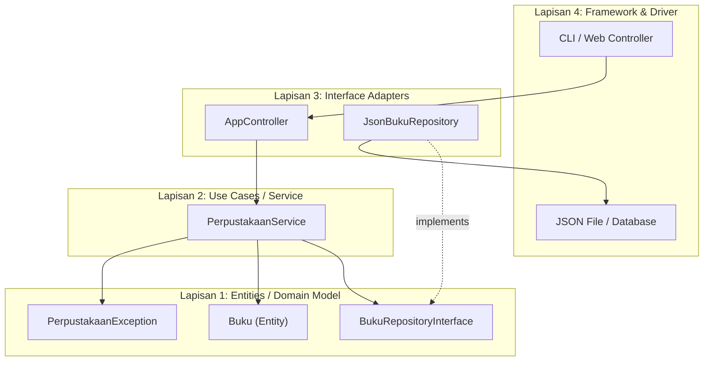

# Minggu 14: Arsitektur Aplikasi Berorientasi Objek (Model-Service-Repository)

## 🎯 Capaian Pembelajaran (Sub-CPMK 6)
Setelah menyelesaikan materi pada bab ini, mahasiswa diharapkan mampu:
1. Memahami filosofi **Arsitektur Berlapis (*Layered Architecture*)** dan **Aturan Ketergantungan (*Dependency Rule*)** dari *Clean Architecture* (Robert C. Martin, 2017).
2. Membedakan peran dan tanggung jawab 4 lapisan konsentris: **Entity → Use Case → Interface Adapter → Framework/Driver**.
3. Menguasai pola **Model/Entity** sebagai representasi data domain murni yang bebas dari dependensi infrastruktur.
4. Menerapkan pola **Repository** sebagai abstraksi akses data yang memisahkan logika bisnis dari detail penyimpanan (*Database Agnostic*).
5. Merancang **Service Layer** sebagai orkestrator aturan bisnis yang mengkoordinasikan Repository, Validator, dan Notifier.
6. Membangun aplikasi CLI lengkap berpola **Model-Service-Repository** dengan persistensi JSON dan struktur folder terstandar PSR-4.

> [!IMPORTANT]
> 🏛️ **Aturan Ketergantungan (Dependency Rule):** Dependensi kode sumber hanya boleh menunjuk ke arah **dalam** (dari lapisan luar ke lapisan dalam). Lapisan **Entity** dan **Use Case** tidak boleh mengetahui apa pun tentang lapisan **Framework/Driver** (database, web framework, UI).

---

## 1. Filosofi Clean Architecture & Arsitektur Berlapis



### A. Mengapa Arsitektur Berlapis Diperlukan?
Tanpa pemisahan lapisan yang tegas, sebuah aplikasi monolitik akan mengalami gejala berikut:
- **Logika bisnis tertanam di dalam controller** → Tidak dapat diuji tanpa men-*deploy* seluruh server web.
- **SQL query tersebar di berbagai class** → Perubahan skema database memaksa modifikasi di puluhan berkas sekaligus.
- **Dependensi framework merembes ke inti domain** → Migrasi framework (misal dari Laravel ke Symfony) memaksa penulisan ulang total.

### B. 4 Lapisan Konsentris Clean Architecture
Robert C. Martin dalam buku *"Clean Architecture: A Craftsman's Guide to Software Structure and Design"* (2017) memperkenalkan arsitektur konsentris:

| Lapisan | Peran | Contoh di PHP |
|---------|-------|---------------|
| **1. Entities** | Aturan bisnis enterprise yang paling stabil & murni | Class `Buku`, `Mahasiswa`, Enum `StatusPinjam` |
| **2. Use Cases** | Aturan bisnis aplikasi spesifik (alur kerja) | `PerpustakaanService`, `PeminjamanUseCase` |
| **3. Interface Adapters** | Penerjemah format data antar lapisan | `JsonBukuRepository`, `AppController`, `CsvExporter` |
| **4. Frameworks & Drivers** | Detail infrastruktur paling luar | CLI `readline()`, File JSON, Database PDO, Web Framework |

---

## 2. Lapisan 1: Entity / Domain Model

Entity merepresentasikan objek bisnis inti yang **bebas dari dependensi infrastruktur** (tidak mengimpor database, file system, atau framework):

```php
<?php
declare(strict_types=1);

namespace App\Domain\Model;

// Backed Enum sebagai State yang aman dan ekspresif
enum StatusPinjam: string
{
    case Tersedia  = 'tersedia';
    case Dipinjam  = 'dipinjam';
    case Rusak     = 'rusak';
}

class Buku
{
    private StatusPinjam $status = StatusPinjam::Tersedia;

    public function __construct(
        public readonly string $isbn,
        public readonly string $judul,
        public readonly string $pengarang,
        public readonly int $tahunTerbit
    ) {}

    public function getStatus(): StatusPinjam { return $this->status; }

    public function pinjam(): void
    {
        if ($this->status !== StatusPinjam::Tersedia) {
            throw new \App\Domain\Exception\BukuTidakTersediaException(
                $this->isbn, $this->status
            );
        }
        $this->status = StatusPinjam::Dipinjam;
    }

    public function kembalikan(): void
    {
        $this->status = StatusPinjam::Tersedia;
    }

    public function __toString(): string
    {
        return sprintf("[%s] %s - %s (%d) [%s]",
            $this->isbn, $this->judul, $this->pengarang,
            $this->tahunTerbit, $this->status->value
        );
    }
}
```

### Domain Exception (Masih di Lapisan 1):
```php
<?php
declare(strict_types=1);

namespace App\Domain\Exception;

use App\Domain\Model\StatusPinjam;

class BukuTidakTersediaException extends \DomainException
{
    public function __construct(
        public readonly string $isbn,
        public readonly StatusPinjam $statusSaatIni,
        int $code = 0,
        ?\Throwable $previous = null
    ) {
        $pesan = sprintf(
            "Buku [%s] tidak dapat dipinjam. Status saat ini: '%s'.",
            $isbn, $statusSaatIni->value
        );
        parent::__construct($pesan, $code, $previous);
    }
}
```

---

## 3. Lapisan 1-2: Repository Interface (Kontrak Abstraksi)

Repository Interface dideklarasikan di **lapisan domain** (lapisan dalam), bukan di lapisan infrastruktur:

```php
<?php
declare(strict_types=1);

namespace App\Domain\Repository;

use App\Domain\Model\Buku;

interface BukuRepositoryInterface
{
    public function simpan(Buku $buku): void;
    public function cariBerdasarkanIsbn(string $isbn): ?Buku;
    /** @return Buku[] */
    public function ambilSemua(): array;
    public function hapus(string $isbn): bool;
    public function hitungTotal(): int;
}
```

> [!NOTE]
> 💡 **Mengapa Interface di Lapisan Domain?** Karena **Dependency Rule** menuntut agar arah ketergantungan mengarah ke dalam. Lapisan Service (Use Case) hanya mengenal interface ini. Implementasi konkret (`JsonBukuRepository`, `PdoBukuRepository`) berada di lapisan luar (Interface Adapters) dan mengimplementasikan kontrak ini.

---

## 4. Lapisan 2: Service Layer (Use Case / Business Orchestrator)

Service Layer mengkoordinasikan Entity dan Repository tanpa mengetahui **bagaimana** data disimpan:

```php
<?php
declare(strict_types=1);

namespace App\Application\Service;

use App\Domain\Model\Buku;
use App\Domain\Repository\BukuRepositoryInterface;
use App\Domain\Exception\BukuTidakTersediaException;

class PerpustakaanService
{
    public function __construct(
        private BukuRepositoryInterface $bukuRepository
    ) {}

    public function daftarkanBukuBaru(
        string $isbn, string $judul, string $pengarang, int $tahunTerbit
    ): Buku {
        // Validasi duplikasi
        if ($this->bukuRepository->cariBerdasarkanIsbn($isbn) !== null) {
            throw new \InvalidArgumentException("Buku dengan ISBN [{$isbn}] sudah terdaftar!");
        }

        $buku = new Buku($isbn, $judul, $pengarang, $tahunTerbit);
        $this->bukuRepository->simpan($buku);
        return $buku;
    }

    public function pinjamBuku(string $isbn): Buku
    {
        $buku = $this->bukuRepository->cariBerdasarkanIsbn($isbn)
            ?? throw new \RuntimeException("Buku dengan ISBN [{$isbn}] tidak ditemukan.");

        $buku->pinjam(); // Memicu BukuTidakTersediaException jika status bukan 'tersedia'
        $this->bukuRepository->simpan($buku);
        return $buku;
    }

    public function kembalikanBuku(string $isbn): Buku
    {
        $buku = $this->bukuRepository->cariBerdasarkanIsbn($isbn)
            ?? throw new \RuntimeException("Buku dengan ISBN [{$isbn}] tidak ditemukan.");

        $buku->kembalikan();
        $this->bukuRepository->simpan($buku);
        return $buku;
    }

    /** @return Buku[] */
    public function tampilkanSemuaBuku(): array
    {
        return $this->bukuRepository->ambilSemua();
    }

    public function hitungStatistik(): array
    {
        $semua = $this->bukuRepository->ambilSemua();
        $tersedia = array_filter($semua, fn(Buku $b) => $b->getStatus() === \App\Domain\Model\StatusPinjam::Tersedia);
        $dipinjam = array_filter($semua, fn(Buku $b) => $b->getStatus() === \App\Domain\Model\StatusPinjam::Dipinjam);

        return [
            'total'     => count($semua),
            'tersedia'  => count($tersedia),
            'dipinjam'  => count($dipinjam),
        ];
    }
}
```

---

## 5. Lapisan 3: Implementasi Repository Konkret (Interface Adapter)

Implementasi konkret berada di **lapisan luar** dan bertanggung jawab terhadap detail penyimpanan:

```php
<?php
declare(strict_types=1);

namespace App\Infrastructure\Persistence;

use App\Domain\Model\Buku;
use App\Domain\Model\StatusPinjam;
use App\Domain\Repository\BukuRepositoryInterface;

class JsonBukuRepository implements BukuRepositoryInterface
{
    public function __construct(private string $filePath)
    {
        if (!file_exists($this->filePath)) {
            file_put_contents($this->filePath, json_encode([], JSON_PRETTY_PRINT), LOCK_EX);
        }
    }

    public function ambilSemua(): array
    {
        $json = file_get_contents($this->filePath);
        $data = json_decode($json, true, 512, JSON_THROW_ON_ERROR);

        return array_map(function (array $item): Buku {
            $buku = new Buku($item['isbn'], $item['judul'], $item['pengarang'], $item['tahun_terbit']);

            // Merestorasi status dari persisten storage
            if ($item['status'] === StatusPinjam::Dipinjam->value) {
                $buku->pinjam();
            }
            return $buku;
        }, $data);
    }

    public function simpan(Buku $buku): void
    {
        $semua = $this->ambilSemua();
        $ditemukan = false;

        foreach ($semua as $i => $existing) {
            if ($existing->isbn === $buku->isbn) {
                $semua[$i] = $buku;
                $ditemukan = true;
                break;
            }
        }
        if (!$ditemukan) {
            $semua[] = $buku;
        }

        $this->persistKeFile($semua);
    }

    public function cariBerdasarkanIsbn(string $isbn): ?Buku
    {
        foreach ($this->ambilSemua() as $buku) {
            if ($buku->isbn === $isbn) return $buku;
        }
        return null;
    }

    public function hapus(string $isbn): bool
    {
        $semua = $this->ambilSemua();
        $filtered = array_filter($semua, fn(Buku $b) => $b->isbn !== $isbn);
        if (count($filtered) === count($semua)) return false;
        $this->persistKeFile(array_values($filtered));
        return true;
    }

    public function hitungTotal(): int { return count($this->ambilSemua()); }

    /** @param Buku[] $koleksi */
    private function persistKeFile(array $koleksi): void
    {
        $data = array_map(fn(Buku $b) => [
            'isbn'         => $b->isbn,
            'judul'        => $b->judul,
            'pengarang'    => $b->pengarang,
            'tahun_terbit' => $b->tahunTerbit,
            'status'       => $b->getStatus()->value
        ], $koleksi);

        file_put_contents(
            $this->filePath,
            json_encode($data, JSON_PRETTY_PRINT | JSON_UNESCAPED_UNICODE | JSON_THROW_ON_ERROR),
            LOCK_EX
        );
    }
}
```

---

## 6. Struktur Folder Proyek Terstandar PSR-4

```
perpustakaan-app/
├── composer.json
├── data/
│   └── buku.json
├── src/
│   ├── Domain/
│   │   ├── Model/
│   │   │   ├── Buku.php
│   │   │   └── StatusPinjam.php
│   │   ├── Exception/
│   │   │   └── BukuTidakTersediaException.php
│   │   └── Repository/
│   │       └── BukuRepositoryInterface.php
│   ├── Application/
│   │   └── Service/
│   │       └── PerpustakaanService.php
│   └── Infrastructure/
│       └── Persistence/
│           └── JsonBukuRepository.php
└── bin/
    └── app.php
```

> [!TIP]
> **Keuntungan Struktur ini:** Jika suatu hari Anda mengganti penyimpanan dari file JSON ke database MySQL (PDO), Anda hanya perlu membuat class `PdoBukuRepository implements BukuRepositoryInterface` di folder `Infrastructure/Persistence/` — **tanpa mengubah satu baris pun** di folder `Domain/` atau `Application/`.

---

## 💻 7. Praktikum Terbimbing: Aplikasi CLI Perpustakaan Terpadu

```php
<?php
// bin/app.php
declare(strict_types=1);

require_once __DIR__ . '/../vendor/autoload.php';

use App\Application\Service\PerpustakaanService;
use App\Infrastructure\Persistence\JsonBukuRepository;

// Dependency Injection: Wiring lapisan luar ke lapisan dalam
$repository = new JsonBukuRepository(__DIR__ . '/../data/buku.json');
$service = new PerpustakaanService($repository);

while (true) {
    echo "\n╔══════════════════════════════════════╗\n";
    echo "║  📚 SISTEM PERPUSTAKAAN MINI (CLI)   ║\n";
    echo "╠══════════════════════════════════════╣\n";
    echo "║ 1. Tampilkan Semua Buku              ║\n";
    echo "║ 2. Tambah Buku Baru                  ║\n";
    echo "║ 3. Pinjam Buku                       ║\n";
    echo "║ 4. Kembalikan Buku                   ║\n";
    echo "║ 5. Statistik Perpustakaan            ║\n";
    echo "║ 0. Keluar                            ║\n";
    echo "╚══════════════════════════════════════╝\n";
    $opsi = trim(readline("Pilih menu [0-5]: "));

    try {
        match($opsi) {
            '1' => (function() use ($service) {
                foreach ($service->tampilkanSemuaBuku() as $b) echo "  {$b}\n";
            })(),
            '2' => (function() use ($service) {
                $service->daftarkanBukuBaru(
                    trim(readline("ISBN        : ")),
                    trim(readline("Judul       : ")),
                    trim(readline("Pengarang   : ")),
                    (int) trim(readline("Tahun Terbit: "))
                );
                echo "✅ Buku berhasil didaftarkan.\n";
            })(),
            '3' => (function() use ($service) {
                $service->pinjamBuku(trim(readline("ISBN: ")));
                echo "✅ Buku berhasil dipinjam.\n";
            })(),
            '4' => (function() use ($service) {
                $service->kembalikanBuku(trim(readline("ISBN: ")));
                echo "✅ Buku berhasil dikembalikan.\n";
            })(),
            '5' => (function() use ($service) {
                $stat = $service->hitungStatistik();
                echo "📊 Total: {$stat['total']} | Tersedia: {$stat['tersedia']} | Dipinjam: {$stat['dipinjam']}\n";
            })(),
            '0' => exit("Terima kasih! 👋\n"),
            default => print("⚠️ Pilihan tidak valid.\n"),
        };
    } catch (\Throwable $e) {
        echo "❌ {$e->getMessage()}\n";
    }
}
```

---

## 📝 Evaluasi & Tugas Praktikum Mandiri

1. **Implementasi `PdoBukuRepository`:**
   - Buat implementasi kedua dari `BukuRepositoryInterface` yang menggunakan database SQLite melalui PDO.
   - Pastikan `PerpustakaanService` **tidak perlu diubah** sama sekali saat mengganti repository.
2. **Tambahkan Fitur Pencarian:**
   - Tambahkan method `cariBerdasarkanJudul(string $keyword): array` pada interface dan kedua implementasi repository.
3. **Analisis Reflektif:**
   - Gambarkan diagram aliran ketergantungan (*dependency flow*) proyek Anda. Pastikan tidak ada panah yang mengarah dari lapisan dalam (Entity/Service) ke lapisan luar (Infrastructure).
   - Mengapa **Repository Interface** harus dideklarasikan di lapisan Domain dan bukan di lapisan Infrastructure?
