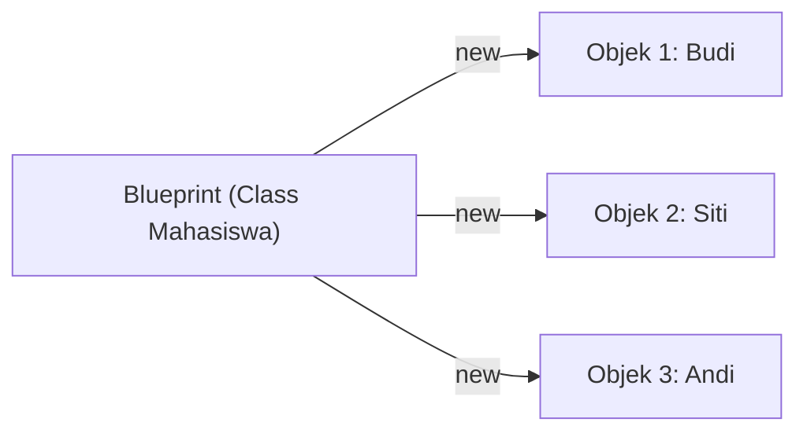

# Minggu 2: Class dan Object

## 🎯 Capaian Pembelajaran (Sub-CPMK 2)
Setelah menyelesaikan materi ini, mahasiswa mampu:
1. Mendefinisikan **Class** sebagai cetak biru dan **Object** sebagai wujud nyata.
2. Mendeklarasikan **properti** (*properties*) dan **method** di dalam class PHP.
3. Melakukan instansiasi objek menggunakan kata kunci `new`.
4. Menggunakan variabel `$this` untuk merujuk properti dan method internal.

---

## 1. Konsep Class dan Object



- **Class**: Template/cetak biru yang mendefinisikan properti dan method.
- **Object**: Instance konkret dari class yang memiliki nilai tersendiri.

---

## 2. Struktur Dasar Class di PHP

```php
<?php

class Mahasiswa
{
    // 1. Deklarasi Properti (PHP 7.4+ typed properties)
    public string $nim;
    public string $nama;
    public string $jurusan;
    public float $ipk;

    // 2. Deklarasi Method
    public function belajar(): void
    {
        echo "{$this->nama} sedang belajar pemrograman PHP.\n";
    }

    public function cetakInfo(): void
    {
        echo "=== DATA MAHASISWA ===\n";
        echo "NIM     : {$this->nim}\n";
        echo "Nama    : {$this->nama}\n";
        echo "Jurusan : {$this->jurusan}\n";
        echo "IPK     : {$this->ipk}\n";
    }
}
```

---

## 3. Membuat Objek (Instansiasi dengan `new`)

```php
<?php
require_once 'Mahasiswa.php';

// 1. Instansiasi Objek 1
$mhs1 = new Mahasiswa();
$mhs1->nim = "240101001";
$mhs1->nama = "Ahmad Pratama";
$mhs1->jurusan = "Sistem Informasi";
$mhs1->ipk = 3.85;

// 2. Instansiasi Objek 2
$mhs2 = new Mahasiswa();
$mhs2->nim = "240101002";
$mhs2->nama = "Rina Melati";
$mhs2->jurusan = "Informatika";
$mhs2->ipk = 3.92;

// 3. Memanggil method
$mhs1->cetakInfo();
$mhs1->belajar();

echo "\n";

$mhs2->cetakInfo();
$mhs2->belajar();
```

### Output Eksekusi:
```text
=== DATA MAHASISWA ===
NIM     : 240101001
Nama    : Ahmad Pratama
Jurusan : Sistem Informasi
IPK     : 3.85
Ahmad Pratama sedang belajar pemrograman PHP.

=== DATA MAHASISWA ===
NIM     : 240101002
Nama    : Rina Melati
Jurusan : Informatika
IPK     : 3.92
Rina Melati sedang belajar pemrograman PHP.
```

---

## 4. Operator Arrow (`->`) dan Variabel `$this`

Di PHP, akses ke properti dan method objek menggunakan operator **arrow** (`->`):

```php
$objek->namaProperti;   // Akses properti
$objek->namaMethod();   // Panggil method
```

Kata kunci `$this` digunakan di dalam class untuk merujuk pada objek saat ini (*current instance*):

```php
<?php

class Buku
{
    public string $judul;
    public string $penulis;

    public function setInfo(string $judul, string $penulis): void
    {
        // $this->judul merujuk properti class
        // $judul merujuk parameter method
        $this->judul = $judul;
        $this->penulis = $penulis;
    }
}
```

---

## 💻 Praktikum: Sistem Kasir Toko

```php
<?php

class Barang
{
    public string $kodeBarang;
    public string $namaBarang;
    public float $harga;
    public int $stok;

    public function tambahStok(int $jumlah): void
    {
        $this->stok += $jumlah;
        echo "{$jumlah} unit ditambahkan ke {$this->namaBarang}\n";
    }

    public function kurangiStok(int $jumlah): void
    {
        if ($this->stok >= $jumlah) {
            $this->stok -= $jumlah;
            echo "{$jumlah} unit dibeli dari {$this->namaBarang}\n";
        } else {
            echo "Stok {$this->namaBarang} tidak mencukupi!\n";
        }
    }

    public function tampilkanDetail(): void
    {
        echo "-------------------------\n";
        echo "Kode  : {$this->kodeBarang}\n";
        echo "Nama  : {$this->namaBarang}\n";
        echo "Harga : Rp " . number_format($this->harga, 0, ',', '.') . "\n";
        echo "Stok  : {$this->stok} pcs\n";
        echo "-------------------------\n";
    }
}
```

---

## 📝 Tugas Praktikum

1. Buat class `Karyawan` dengan properti: `$idKaryawan`, `$nama`, `$divisi`, dan `$gajiPokok`.
2. Tambahkan method `hitungTunjangan()` yang mengembalikan 10% dari gaji pokok.
3. Tambahkan method `cetakSlipGaji()` yang menampilkan total gaji (`$gajiPokok` + tunjangan).
4. Buat file `main.php` untuk membuat minimal 2 objek karyawan dan cetak slip gajinya.
