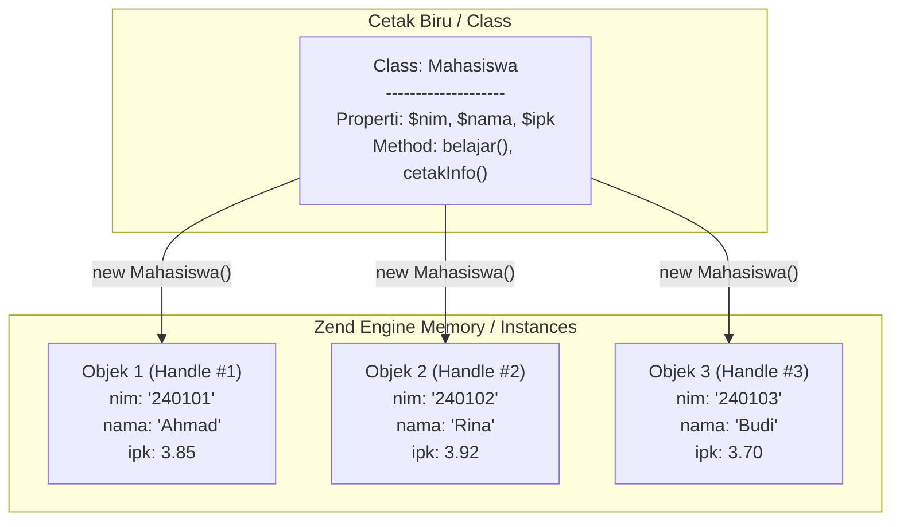

# Minggu 2: Class, Object, dan Perilaku di PHP 8+

## 🎯 Capaian Pembelajaran (Sub-CPMK 2)
Setelah menyelesaikan materi ini, mahasiswa mampu:
1. Mendefinisikan **Class** sebagai cetak biru (*blueprint*) dan **Object** sebagai wujud nyata (*instance*).
2. Mendeklarasikan **Typed Properties** (PHP 7.4/8+) dan **Method** di dalam class PHP.
3. Melakukan instansiasi objek menggunakan kata kunci `new` dan mengakses member objek dengan operator arrow (`->`).
4. Menggunakan variabel pseudo **`$this`** untuk mengakses data internal objek.
5. Memahami bagaimana PHP mengelola memori objek melalui *Object Handles / Referensi*.

> [!TIP]
> 📽️ **Slide Presentasi Perkuliahan:** Anda dapat melihat dan memutar [Slide Interaktif Pertemuan 2 PHP](/presentasi/pertemuan-2-php) atau [Buka Layar Penuh (Tab Baru)](/Perkuliahan/presentasi/pertemuan-2-class-object-php.html){target="_blank"}.

---

## 1. Konsep Fundamental: Class vs Object



- **Class**: Struktur, cetak biru, atau tipe data abstrak bentukan pengembang yang mendefinisikan atribut dan perilaku.
- **Object**: Wujud konkret yang dialokasikan di memori (*Zend Engine Memory*) dan memiliki data spesifik (*state*).

---

## 2. Struktur Sintaks Class di PHP 8+

PHP modern mendukung deklarasi tipe data yang ketat (*Strict Typing*) pada properti dan return value method.

```php
<?php
declare(strict_types=1);

class Mahasiswa
{
    // 1. Properti Bertipe Data (Typed Properties)
    public string $nim;
    public string $nama;
    public string $jurusan = "Sistem Informasi"; // Default value
    public float $ipk = 0.0;

    // 2. Method (Perilaku Objek)
    public function belajar(string $mataKuliah): void
    {
        echo "{$this->nama} sedang belajar mata kuliah {$mataKuliah}.\n";
    }

    public function cetakInfo(): void
    {
        echo "==============================\n";
        echo "NIM     : {$this->nim}\n";
        echo "Nama    : {$this->nama}\n";
        echo "Jurusan : {$this->jurusan}\n";
        echo "IPK     : " . number_format($this->ipk, 2) . "\n";
        echo "==============================\n";
    }
}
```

---

## 3. Instansiasi Objek & Mengakses Member

Untuk membuat objek baru dari class, gunakan operator `new`:

```php
<?php
require_once 'Mahasiswa.php';

// Instansiasi Objek 1
$mhs1 = new Mahasiswa();
$mhs1->nim = "240101001";
$mhs1->nama = "Ahmad Pratama";
$mhs1->ipk = 3.85;

// Instansiasi Objek 2
$mhs2 = new Mahasiswa();
$mhs2->nim = "240101002";
$mhs2->nama = "Rina Melati";
$mhs2->jurusan = "Informatika"; // Mengubah nilai default
$mhs2->ipk = 3.92;

// Memanggil method masing-masing objek
$mhs1->cetakInfo();
$mhs1->belajar("Pemrograman Berorientasi Objek");

echo "\n";

$mhs2->cetakInfo();
$mhs2->belajar("Struktur Data");
```

---

## 4. Variabel Khusus `$this`

Di dalam badan method sebuah class, variabel `$this` merujuk secara otomatis ke objek yang sedang memanggil method tersebut (*current instance*).

```php
<?php

class PersegiPanjang
{
    public float $panjang;
    public float $lebar;

    public function hitungLuas(): float
    {
        // $this->panjang mengakses nilai panjang objek yang bersangkutan
        return $this->panjang * $this->lebar;
    }

    public function hitungKeliling(): float
    {
        return 2 * ($this->panjang + $this->lebar);
    }
}

$pp = new PersegiPanjang();
$pp->panjang = 10.0;
$pp->lebar = 5.0;

echo "Luas     : " . $pp->hitungLuas() . " cm²\n";     // 50 cm²
echo "Keliling : " . $pp->hitungKeliling() . " cm\n"; // 30 cm
```

---

## 5. Jebakan Error: Uninitialized Typed Property

Di PHP 7.4+, jika Anda mendeklarasikan properti bertipe (misal `public string $nama;`) tanpa nilai default dan mencoba membacanya sebelum mengisinya, PHP akan melempar **`Error: Typed property must not be accessed before initialization`**.

```php
$mhs = new Mahasiswa();
// echo $mhs->nama; // ❌ FATAL ERROR: Properti $nama belum diinisialisasi!

// Solusi: Isi terlebih dahulu atau berikan nilai default di class
$mhs->nama = "Budi";
echo $mhs->nama; // ✅ Aman
```

---

## 6. Bagaimana PHP Mengelola Objek di Memori?

Di PHP, variabel objek menyimpan **Object Identifier / Handle**, bukan nilai mentah (*by-handle assignment*):

```php
<?php
$a = new Mahasiswa();
$a->nama = "Budi";

// $b menyalin referensi handle objek yang sama, BUKAN duplikat fisik
$b = $a;
$b->nama = "Siti";

echo $a->nama; // Output: "Siti" (Karena $a dan $b menunjuk ke objek yang sama!)

// Jika ingin menduplikasi objek secara fisik, gunakan keyword clone:
$c = clone $a;
$c->nama = "Andi";
echo $a->nama; // Output tetap "Siti"
```

---

## 💻 Praktikum Terbimbing: Sistem Manajemen Produk Kasir

```php
<?php
declare(strict_types=1);

class Produk
{
    public string $kode;
    public string $nama;
    public float $harga;
    public int $stok = 0;

    public function tambahStok(int $jumlah): void
    {
        if ($jumlah > 0) {
            $this->stok += $jumlah;
            echo "✅ {$jumlah} unit {$this->nama} berhasil ditambahkan.\n";
        } else {
            echo "❌ Jumlah penambahan harus lebih dari 0!\n";
        }
    }

    public function jual(int $jumlah): bool
    {
        if ($jumlah <= 0) {
            echo "❌ Jumlah penjualan tidak valid!\n";
            return false;
        }

        if ($this->stok >= $jumlah) {
            $this->stok -= $jumlah;
            $subtotal = $this->harga * $jumlah;
            echo "🛒 {$jumlah}x {$this->nama} terjual! Total: Rp " . number_format($subtotal, 0, ',', '.') . "\n";
            return true;
        }

        echo "⚠️ Stok {$this->nama} tidak cukup (Tersedia: {$this->stok} unit).\n";
        return false;
    }

    public function tampilkanDetail(): void
    {
        echo "-------------------------------------\n";
        echo "Kode  : {$this->kode}\n";
        echo "Nama  : {$this->nama}\n";
        echo "Harga : Rp " . number_format($this->harga, 0, ',', '.') . "\n";
        echo "Stok  : {$this->stok} pcs\n";
        echo "-------------------------------------\n";
    }
}

// Uji Program
$p1 = new Produk();
$p1->kode = "PRD-001";
$p1->nama = "Kopi Robusta 250g";
$p1->harga = 45000;
$p1->stok = 10;

$p1->tampilkanDetail();
$p1->jual(3);  // Berhasil jual 3 unit
$p1->jual(10); // Gagal karena stok sisa 7
$p1->tambahStok(5); // Tambah 5 unit
$p1->tampilkanDetail();
```

---

## 📝 Tugas Praktikum Mandiri

1. Buat file `Karyawan.php` yang memuat class `Karyawan` dengan properti:
   - `$idKaryawan` (string)
   - `$nama` (string)
   - `$divisi` (string)
   - `$gajiPokok` (float)
   - `$jumlahJamLembur` (int, default 0)
2. Tambahkan method:
   - `tambahLembur(int $jam)`: Menambah jam lembur karyawan.
   - `hitungUangLembur()`: Mengembalikan uang lembur (tarif: Rp 50.000 / jam).
   - `hitungTotalGaji()`: Mengembalikan `$gajiPokok` + hasil `hitungUangLembur()`.
   - `cetakSlipGaji()`: Menampilkan rincian slip gaji lengkap.
3. Buat file `main.php`, instansiasi minimal 2 objek karyawan dengan jam lembur berbeda, lalu cetak slip gajinya!
