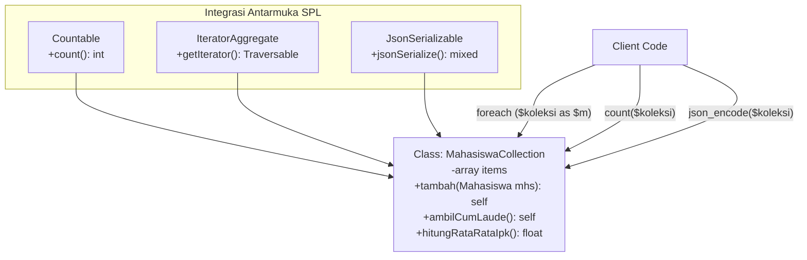

# Minggu 11: Koleksi Objek (Object Collections) & Manipulasi Array Modern di PHP 8+

## 🎯 Capaian Pembelajaran (Sub-CPMK 4)
Setelah menyelesaikan materi pada bab ini, mahasiswa diharapkan mampu:
1. Memahami filosofi **First-Class Collections** (*Object Calisthenics*) dan batasan keamanan tipe (*Type Safety*) pada array bawaan PHP.
2. Membangun **Type-Safe Object Collection** yang mengenkapsulasi array internal dan mencegah kontaminasi data heterogen.
3. Mengintegrasikan antarmuka pustaka standar PHP (**SPL**): **`Countable`**, **`IteratorAggregate`**, **`ArrayAccess`**, dan **`JsonSerializable`**.
4. Menguasai paradigma pemrograman fungsional pada manipulasi data menggunakan **`array_map`**, **`array_filter`**, **`array_reduce`**, dan **Arrow Functions (`fn() =>`)**.
5. Menerapkan fitur modern PHP 8+: **Array Unpacking dengan String Keys (PHP 8.1+)**, **`array_is_list()` (PHP 8.1+)**, serta *Method Chaining* (Fluent Interface).
6. Merancang modul rekapitulasi data akademik skala besar berbasis *Immutable Collection Transformation*.

> [!NOTE]
> 💡 **Standar Desain:** Pola *First-Class Collection* mengajarkan bahwa setiap class yang memegang koleksi entitas dilarang memiliki properti lain, sehingga seluruh logika manipulasi data terisolasi secara kohesif.

---

## 1. Filosofi First-Class Collections & Masalah Type Safety



### A. Kelemahan Array Primitif di PHP
Array bawaan PHP sangat fleksibel namun bersifat *loosely-typed*. Array dapat menampung campuran tipe data integer, string, boolean, dan beragam instance class berbeda tanpa perlindungan kompilasi:

```php
$daftar = [];
$daftar[] = new Mahasiswa("240101", "Ahmad", 3.8);
$daftar[] = "Teks liar yang merusak"; // ❌ Tidak ada type-check!
$daftar[] = 12345;                     // ❌ Rawan Fatal Error saat di-loop
```

### B. Solusi First-Class Collection
Pola **First-Class Collection** membungkus array di dalam class khusus yang hanya menerima tipe objek spesifik (`Mahasiswa`). Hal ini memberikan garansi *Type Safety 100%* dan memungkinkan penambahan metode analitik bisnis langsung pada objek koleksi tersebut.

---

## 2. Mengintegrasikan Antarmuka Standar PHP (SPL)

Agar objek koleksi dapat diperlakukan senyaman array bawaan PHP (dihitung dengan `count()`, diulang dengan `foreach`, dan diserialisasi dengan `json_encode()`), implementasikan antarmuka SPL berikut:

```php
<?php
declare(strict_types=1);

namespace App\Domain\Model;

use Countable;
use IteratorAggregate;
use JsonSerializable;
use ArrayIterator;
use Traversable;

class Mahasiswa
{
    public function __construct(
        public readonly string $nim,
        public string $nama,
        public float $ipk
    ) {}
}

class MahasiswaCollection implements Countable, IteratorAggregate, JsonSerializable
{
    /** @var Mahasiswa[] */
    private array $items = [];

    public function __construct(Mahasiswa ...$mahasiswa)
    {
        foreach ($mahasiswa as $mhs) {
            $this->tambah($mhs);
        }
    }

    // 1. Type-Safe Addition (Mendukung Method Chaining)
    public function tambah(Mahasiswa $mhs): self
    {
        $this->items[$mhs->nim] = $mhs;
        return $this;
    }

    // 2. Implementasi Countable: Mengizinkan pemanggilan count($collection)
    public function count(): int
    {
        return count($this->items);
    }

    // 3. Implementasi IteratorAggregate: Mengizinkan loop 'foreach ($collection as $mhs)'
    public function getIterator(): Traversable
    {
        return new ArrayIterator($this->items);
    }

    // 4. Implementasi JsonSerializable: Mengizinkan pemanggilan json_encode($collection)
    public function jsonSerialize(): array
    {
        return array_values($this->items);
    }

    public function cariBerdasarkanNim(string $nim): ?Mahasiswa
    {
        return $this->items[$nim] ?? null;
    }
}
```

---

## 3. Manipulasi Fungsional: `array_map`, `array_filter`, `array_reduce`

Pendekatan fungsional memastikan data asli tidak mengalami mutasi liar (*Side-Effect Free*):

```php
<?php
// Melanjutkan Class MahasiswaCollection:

// A. FILTERING: Menghasilkan instance MahasiswaCollection BARU
public function filterCumLaude(): self
{
    $hasil = array_filter($this->items, fn(Mahasiswa $m) => $m->ipk >= 3.50);
    $koleksiBaru = new self();
    $koleksiBaru->items = $hasil;
    return $koleksiBaru;
}

// B. MAPPING: Mengambil daftar nama saja (Pluck)
public function ambilSemuaNama(): array
{
    return array_map(fn(Mahasiswa $m) => $m->nama, array_values($this->items));
}

// C. REDUCING: Mengkalkulasi rata-rata IPK seluruh angkatan
public function hitungRataRataIpk(): float
{
    if (empty($this->items)) {
        return 0.0;
    }
    $totalIpk = array_reduce($this->items, fn(float $total, Mahasiswa $m) => $total + $m->ipk, 0.0);
    return $totalIpk / count($this->items);
}

// D. SORTING: Mengurutkan IPK tertinggi ke terendah (Descending)
public function urutkanBerdasarkanIpkTertinggi(): self
{
    $salinan = $this->items;
    uasort($salinan, fn(Mahasiswa $a, Mahasiswa $b) => $b->ipk <=> $a->ipk);
    $koleksiBaru = new self();
    $koleksiBaru->items = $salinan;
    return $koleksiBaru;
}
```

---

## 4. Fitur Modern Array di PHP 8+

### A. Arrow Functions (`fn() =>`)
Meringkas penulisan closure tanpa perlu menyertakan `use ($variabelLuar)`:
```php
$ambangBatas = 3.75;
// Otomatis menangkap $ambangBatas dari scope luar:
$bintangKelas = array_filter($daftar, fn(Mahasiswa $m) => $m->ipk >= $ambangBatas);
```

### B. Array Unpacking dengan String Keys (PHP 8.1+)
```php
$dataAwal = ['A' => 'Sistem Informasi', 'B' => 'Informatika'];
$dataBaru = ['C' => 'Teknik Elektro', ...$dataAwal]; // PHP 8.1+ mendukung string keys unpacking
```

### C. Fungsi `array_is_list()` (PHP 8.1+)
Memastikan apakah array berbentuk sequential list (0, 1, 2, ...):
```php
array_is_list(['Apel', 'Jeruk']);        // true
array_is_list(['nama' => 'Budi']);        // false
array_is_list([0 => 'A', 2 => 'B']);      // false (karena indeks 1 melompat)
```

---

## 💻 5. Praktikum Terbimbing: Analisis Data Yudisium

```php
<?php
declare(strict_types=1);

require_once __DIR__ . '/MahasiswaCollection.php';

use App\Domain\Model\Mahasiswa;
use App\Domain\Model\MahasiswaCollection;

$angkatan2024 = new MahasiswaCollection(
    new Mahasiswa("240101", "Cut Meurah Intan", 3.92),
    new Mahasiswa("240102", "Teuku Rayhan", 3.45),
    new Mahasiswa("240103", "Siti Nurhaliza", 3.88),
    new Mahasiswa("240104", "Muhammad Fajar", 3.20),
    new Mahasiswa("240105", "Zulfa Safira", 3.95)
);

echo "========================================================\n";
echo "REKAPITULASI AKADEMIK ANGKATAN 2024\n";
echo "Total Mahasiswa : " . count($angkatan2024) . " orang\n";
echo sprintf("Rata-rata IPK   : %.2f\n", $angkatan2024->hitungRataRataIpk());
echo "--------------------------------------------------------\n";

echo "DAFTAR MAHASISWA CUMLAUDE (IPK >= 3.50) URUT TERTINGGI:\n";
$cumlaudeSorted = $angkatan2024->filterCumLaude()->urutkanBerdasarkanIpkTertinggi();

foreach ($cumlaudeSorted as $mhs) {
    echo sprintf("🏆 [%s] %-20s : IPK %.2f\n", $mhs->nim, $mhs->nama, $mhs->ipk);
}

echo "--------------------------------------------------------\n";
echo "SERIALISASI JSON RESMI:\n";
echo json_encode($cumlaudeSorted, JSON_PRETTY_PRINT) . "\n";
echo "========================================================\n";
```

---

## 📝 Evaluasi & Tugas Praktikum Mandiri

1. **Rancang Class `ProdukCollection`:**
   - Model `ItemProduk` dengan properti `$sku`, `$nama`, `$harga`, `$stok`, dan `$kategori`.
   - Bangun `ProdukCollection` yang mengimplementasikan `Countable`, `IteratorAggregate`, dan `JsonSerializable`.
   - Tambahkan method `filterByKategori(string $kat): self`, `hitungTotalNilaiAset(): float`, dan `ambilStokKritis(int $ambang = 5): self`.
2. **Penerapan Paginate pada Koleksi:**
   - Tambahkan method `paginate(int $halaman, int $perHalaman): self` yang mengembalikan potongan sub-koleksi menggunakan `array_slice`.
3. **Analisis Reflektif:**
   - Mengapa method-method manipulasi pada *First-Class Collection* (seperti `filter` dan `sort`) sebaiknya mengembalikan *instance* objek baru (*Immutable*) daripada mengubah array internal secara langsung?
