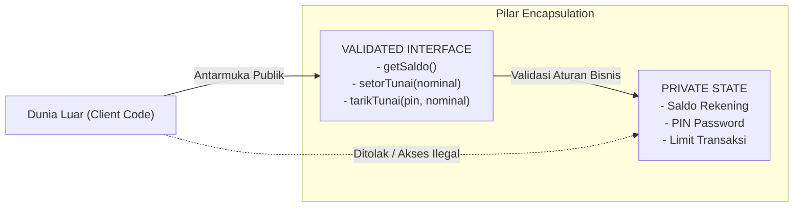

# Minggu 4: Encapsulation, Visibility, Readonly & Asymmetric Visibility di PHP 8+

## 🎯 Capaian Pembelajaran (Sub-CPMK 3)
Setelah menyelesaikan materi pada bab ini, mahasiswa diharapkan mampu:
1. Memahami filosofi fundamental **Encapsulation**, **Information Hiding**, dan konsep **State Invariant**.
2. Menguasai secara mendalam 3 tingkatan **Visibility Modifiers**: `public`, `protected`, dan `private` pada properti, method, dan konstanta class.
3. Mengimplementasikan **Getter (Accessor)** dan **Setter (Mutator)** dengan validasi aturan domain bisnis (*Domain Invariants*) serta pola *Method Chaining*.
4. Menerapkan fitur modern **`readonly` Properties (PHP 8.1+)** dan **`readonly class` (PHP 8.2+)** untuk menjamin kekekalan status data (*Data Immutability*).
5. Menganalisis dan mengimplementasikan fitur mutakhir PHP 8.4: **Asymmetric Visibility (`private(set)`)** dan **Property Hooks (`get`/`set`)**.
6. Memahami mekanisme kendali properti dinamis melalui magic methods **`__get()`**, **`__set()`**, **`__isset()`**, dan **`__unset()`** serta aturan penolakan *Dynamic Properties* di PHP 8.2+.

> [!TIP]
> 📽️ **Slide Presentasi Perkuliahan:** Anda dapat melihat dan memutar [Slide Interaktif Pertemuan 4 PHP](/presentasi/pertemuan-4-php) atau [Buka Layar Penuh (Tab Baru)](/Perkuliahan/presentasi/pertemuan-4-encapsulation-php.html){target="_blank"}.

---

## 1. Filosofi dan Fondasi Teoretis Enkapsulasi



### A. Konsep Information Hiding (David Parnas, 1972)
Dalam rekayasa perangkat lunak modern, **Enkapsulasi (Encapsulation)** adalah pilar fundamental yang menyatukan data (*properties/attributes*) dan perilaku (*methods/functions*) ke dalam satu unit struktural mandiri (*Class*), seraya menyembunyikan detail representasi internal yang sensitif dari jangkauan luar (*Information Hiding*).

Prinsip ini pertama kali dicetuskan secara ilmiah oleh David Parnas (1972), yang menegaskan bahwa modul perangkat lunak yang baik harus menyembunyikan keputusan perancangan internalnya dari modul lain. Kode pemanggil (*client code*) tidak perlu dan tidak boleh mengetahui bagaimana data disimpan secara fisik—cukup mengetahui *antarmuka publik (public interface)* apa saja yang disediakan.

### B. Menjaga Integritas Data (*State Invariant*)
Salah satu tujuan terpenting dari enkapsulasi adalah memelihara **State Invariant**, yaitu kondisi atau aturan kebenaran bisnis yang harus selalu bernilai benar sepanjang masa hidup objek.
- **Contoh Invariant 1:** Saldo rekening perbankan tidak boleh bernilai negatif secara sembarangan.
- **Contoh Invariant 2:** Usia manusia harus berada pada rentang logis (0 s.d. 130 tahun).
- **Contoh Invariant 3:** Nilai ujian akademik harus berada pada skala 0.00 hingga 100.00.

Jika seluruh properti dibiarkan `public`, pihak luar dapat merusak invariant kapan saja (`$rekening->saldo = -999999;`). Melalui enkapsulasi, akses penulisan hanya dapat dilakukan melalui method yang memeriksa invariant terlebih dahulu.

### C. Prinsip *"Tell, Don't Ask"* vs *Anemic Domain Model*
Salah satu kesalahan umum pemula adalah menerapkan enkapsulasi setengah hati dengan membuat semua properti `private`, namun langsung membuatkan `getFoo()` dan `setFoo()` tanpa logika validasi apa pun. Pola ini disebut **Anemic Domain Model** (model domain yang tidak memiliki logika).

Prinsip desain berorientasi objek yang benar adalah **Tell, Don't Ask**:
- ❌ **Ask (Salah):** Mengambil saldo dari objek, menghitung sendiri pengurangan uang di luar, lalu men-set saldo baru (`$saldo = $rek->getSaldo(); $rek->setSaldo($saldo - $tarik);`).
- ✅ **Tell (Benar):** Memerintahkan objek rekening untuk mengeksekusi penarikan secara mandiri (`$rek->tarikTunai($nominal, $pin);`). Objek sendiri yang memeriksa saldo, mencocokkan PIN, dan memotong nominal.

---

## 2. Tiga Tingkat Hak Akses (*Visibility Modifiers*) di PHP

PHP menyediakan 3 kata kunci pengatur hak akses (*Visibility Modifiers*) yang dapat disematkan pada properti, method, dan konstanta:

| Modifier | Dari Dalam Class Sendiri | Dari Child Class (`extends`) | Dari Luar Class (*Client Code*) | Tingkat Keamanan |
| :--- | :---: | :---: | :---: | :--- |
| **`public`** | ✅ Diizinkan | ✅ Diizinkan | ✅ Bebas Diakses | Terbuka (Public API) |
| **`protected`** | ✅ Diizinkan | ✅ Diizinkan | ❌ Dilarang (*Fatal Error*) | Internal Keluarga Warisan |
| **`private`** | ✅ Diizinkan | ❌ Dilarang | ❌ Dilarang (*Fatal Error*) | Terkunci Paling Rapat |

### A. Contoh Penerapan Visibility Modifiers:
```php
<?php
declare(strict_types=1);

class RekeningInduk
{
    public string $nomorRekening;      // Bebas dibaca dan ditulis siapapun
    protected float $saldo = 0.0;      // Hanya bisa diakses oleh class ini dan subclass-nya
    private string $pinRahasia;        // Hanya bisa diakses di dalam class RekeningInduk

    public function __construct(string $nomor, float $saldoAwal, string $pin)
    {
        $this->nomorRekening = $nomor;
        $this->saldo = $saldoAwal;
        $this->pinRahasia = $pin;
    }

    protected function verifikasiPin(string $pinInput): bool
    {
        return $this->pinRahasia === $pinInput;
    }
}

class RekeningTabungan extends RekeningInduk
{
    public function ambilUang(float $nominal, string $pinInput): void
    {
        // ✅ Boleh mengakses method dan properti protected milik parent:
        if (!$this->verifikasiPin($pinInput)) {
            throw new \DomainException("Autentikasi PIN gagal!");
        }

        if ($nominal > $this->saldo) {
            throw new \UnderflowException("Saldo tidak mencukupi!");
        }

        $this->saldo -= $nominal; // ✅ Boleh mengubah properti protected
        // $this->pinRahasia = "000"; // ❌ ERROR: private milik parent tidak dapat diakses!
    }
}
```

### B. Hak Akses pada Konstanta Class (`Class Constants`)
Sejak PHP 7.1+, konstanta di dalam class dapat diberi modifier hak akses:
```php
<?php
class KonfigurasiSistem
{
    public const VERSI_APLIKASI = "2.4.0";       // Dapat diakses publik: KonfigurasiSistem::VERSI_APLIKASI
    protected const BATAS_MAKSIMAL_KLIEN = 100; // Hanya untuk class ini dan subclass
    private const KUNCI_ENKRIPSI_INTERNAL = "UUI-SECRET-KEY-2025"; // Rahasia internal
}
```

---

## 3. Getter, Setter, dan Validasi Aturan Bisnis

### A. Implementasi Lengkap Mutator & Accessor
```php
<?php
declare(strict_types=1);

class PasienRumahSakit
{
    private string $rekamMedisId;
    private string $nama;
    private int $umur;
    private float $suhuTubuh;

    public function __construct(string $id, string $nama, int $umur, float $suhuTubuh)
    {
        $this->setRekamMedisId($id);
        $this->setNama($nama);
        $this->setUmur($umur);
        $this->setSuhuTubuh($suhuTubuh);
    }

    // Getter & Setter Rekam Medis (Format Khusus RM-XXXXX)
    public function getRekamMedisId(): string
    {
        return $this->rekamMedisId;
    }

    private function setRekamMedisId(string $id): void
    {
        if (!preg_match('/^RM-\d{5}$/', $id)) {
            throw new \InvalidArgumentException("Format ID Rekam Medis tidak valid (Harus RM-XXXXX)!");
        }
        $this->rekamMedisId = $id;
    }

    // Getter & Setter Nama
    public function getNama(): string
    {
        return $this->nama;
    }

    public function setNama(string $nama): self
    {
        $namaBersih = trim($nama);
        if (strlen($namaBersih) < 3) {
            throw new \InvalidArgumentException("Nama pasien minimal terdiri dari 3 karakter!");
        }
        $this->nama = $namaBersih;
        return $this; // Mendukung Method Chaining
    }

    // Getter & Setter Umur
    public function getUmur(): int
    {
        return $this->umur;
    }

    public function setUmur(int $umur): self
    {
        if ($umur < 0 || $umur > 130) {
            throw new \InvalidArgumentException("Rentang umur tidak realistis: {$umur} tahun!");
        }
        $this->umur = $umur;
        return $this;
    }

    // Getter & Setter Suhu Tubuh (Celsius)
    public function getSuhuTubuh(): float
    {
        return $this->suhuTubuh;
    }

    public function setSuhuTubuh(float $suhu): self
    {
        if ($suhu < 30.0 || $suhu > 45.0) {
            throw new \InvalidArgumentException("Pengukuran suhu tubuh di luar ambang batas medis manusia!");
        }
        $this->suhuTubuh = $suhu;
        return $this;
    }

    // Business Logic Method: Peringatan Demam
    public function isDemamTinggi(): bool
    {
        return $this->suhuTubuh >= 38.5;
    }
}
```

### B. Method Chaining (*Fluent Interface*)
Dengan mengembalikan `$this` pada setiap setter, kita dapat menulis kode inisialisasi yang elegan:
```php
$pasien = new PasienRumahSakit("RM-10245", "Teuku Iskandar", 28, 36.6);

// Fluent setter updates:
$pasien->setNama("Teuku Iskandar Muda")
       ->setUmur(29)
       ->setSuhuTubuh(37.1);
```

---

## 4. Konsep Immutability: `readonly` di PHP 8.1 dan PHP 8.2

Dalam arsitektur *Domain-Driven Design (DDD)*, **Value Object** adalah objek yang tidak memiliki identitas konseptual yang berubah-ubah, melainkan nilainya bersifat kekal (*Immutable*). Sekali diciptakan di memori, nilainya tidak boleh dimodifikasi.

### A. Readonly Properties (PHP 8.1+)
```php
<?php
declare(strict_types=1);

class KoordinatGPS
{
    // Properti readonly hanya dapat diisi satu kali saat constructor
    public function __construct(
        public readonly float $latitude,
        public readonly float $longitude,
        public readonly string $labelLokasi
    ) {}
}

$kampus = new KoordinatGPS(5.5724, 95.3621, "Kampus UUI Banda Aceh");
echo $kampus->labelLokasi; // ✅ Boleh dibaca langsung

// $kampus->latitude = 6.0; // ❌ FATAL ERROR: Cannot modify readonly property KoordinatGPS::$latitude
```

### B. Readonly Class (PHP 8.2+)
Jika sebuah class dideklarasikan sebagai `readonly class`, maka:
1. Seluruh properti di dalamnya otomatis bersifat `readonly`.
2. Penulisan *dynamic properties* dilarang secara ketat.
```php
<?php
declare(strict_types=1);

readonly class Uang
{
    public function __construct(
        public float $nominal,
        public string $mataUang = "IDR"
    ) {
        if ($nominal < 0) {
            throw new \InvalidArgumentException("Nominal uang tidak boleh negatif!");
        }
    }

    public function tambah(Uang $lain): self
    {
        if ($this->mataUang !== $lain->mataUang) {
            throw new \InvalidArgumentException("Tidak dapat menjumlahkan mata uang yang berbeda!");
        }
        // Menghasilkan objek BARU (tidak mengubah objek lama):
        return new self($this->nominal + $lain->nominal, $this->mataUang);
    }
}

$uang1 = new Uang(50_000, "IDR");
$uang2 = new Uang(25_000, "IDR");
$total = $uang1->tambah($uang2); // Objek baru dengan nominal 75.000
```

---

## 5. Paradigma Mutakhir: *Asymmetric Visibility* & *Property Hooks* (PHP 8.4)

PHP 8.4 menghadirkan evolusi terbesar dalam mekanisme enkapsulasi modern:

### A. Asymmetric Visibility (`public private(set)`)
Seringkali kita menginginkan properti yang **bebas dibaca oleh publik**, namun **hanya boleh diubah nilainya oleh internal class itu sendiri**. Di masa lalu, kita terpaksa membuat properti `private` dan menulis getter method manual. 

Di PHP 8.4, hal ini diselesaikan langsung melalui deklarasi asimetris:
```php
<?php
declare(strict_types=1);

class Pelanggan
{
    // Publik boleh membaca ($p->id, $p->nama), tapi penulisan dikunci di dalam class:
    public private(set) string $id;
    public private(set) string $nama;
    public private(set) int $totalPoin = 0;

    public function __construct(string $id, string $nama)
    {
        $this->id = $id;
        $this->nama = $nama;
    }

    public function tambahPoinBelanja(float $totalBelanja): void
    {
        $poinBaru = (int)($totalBelanja / 10_000);
        $this->totalPoin += $poinBaru; // ✅ Boleh: diubah dari dalam class
    }
}

$cust = new Pelanggan("CUST-001", "Siti Aminah");
echo $cust->nama;       // ✅ Boleh dibaca langsung! Output: Siti Aminah
echo $cust->totalPoin;  // ✅ Boleh dibaca langsung! Output: 0

// $cust->totalPoin = 1000; // ❌ FATAL ERROR: Cannot modify private(set) property Pelanggan::$totalPoin from global scope
$cust->tambahPoinBelanja(150_000); // ✅ Poin bertambah 15 poin melalui jalur validasi resmi
```

### B. Property Hooks (`get` and `set` Hooks) di PHP 8.4
Property Hooks memungkinkan penyematan logika mutasi dan komputasi nilai virtual langsung pada properti publik tanpa perlu membuat method pembantu:
```php
<?php
declare(strict_types=1);

class PenggunaSistem
{
    // Property Hook dengan validasi format email otomatis
    public string $email {
        get => $this->email;
        set(string $nilaiBaru) {
            if (!filter_var($nilaiBaru, FILTER_VALIDATE_EMAIL)) {
                throw new \InvalidArgumentException("Format email '{$nilaiBaru}' tidak valid!");
            }
            $this->email = strtolower(trim($nilaiBaru));
        }
    }

    public string $namaDepan;
    public string $namaBelakang;

    // Virtual Property (tidak memakan memori, dikomputasi saat dibaca)
    public string $namaLengkap {
        get => "{$this->namaDepan} {$this->namaBelakang}";
    }

    public function __construct(string $email, string $depan, string $belakang)
    {
        $this->email = $email;
        $this->namaDepan = $depan;
        $this->namaBelakang = $belakang;
    }
}

$user = new PenggunaSistem("Mahendar@UUI.AC.ID", "Mahendar Dwi", "Payana");
echo $user->email;       // Output otomatis huruf kecil: mahendar@uui.ac.id
echo $user->namaLengkap; // Output virtual: Mahendar Dwi Payana
```

---

## 6. Magic Methods: `__get()`, `__set()`, `__isset()`, `__unset()`

Magic methods digunakan untuk mencegat (*intercept*) akses ke properti yang bersifat `private`, `protected`, atau belum didefinisikan:

```php
<?php
class KonfigurasiDinamis
{
    private array $storage = [];

    // Mencegat penulisan: $obj->key = $value
    public function __set(string $name, mixed $value): void
    {
        $this->storage[$name] = $value;
    }

    // Mencegat pembacaan: echo $obj->key
    public function __get(string $name): mixed
    {
        return $this->storage[$name] ?? null;
    }

    // Mencegat pemeriksaan: isset($obj->key)
    public function __isset(string $name): bool
    {
        return isset($this->storage[$name]);
    }

    // Mencegat penghapusan: unset($obj->key)
    public function __unset(string $name): void
    {
        unset($this->storage[$name]);
    }
}
```

> [!WARNING]
> **Peringatan PHP 8.2+:** Penulisan properti dinamis secara bebas tanpa deklarasi (`$obj->propertiBaru = 123;`) telah di-**deprecate** di PHP 8.2 dan memicu *Deprecated Notice*. Gunakan class bertipe terdefinisi atau atribut `#[AllowDynamicProperties]` jika benar-benar diperlukan.

---

## 💻 7. Praktikum Terbimbing: Dompet Digital (E-Wallet)

```php
<?php
declare(strict_types=1);

class DompetDigital
{
    private float $saldo = 0.0;
    private array $riwayatMutasi = [];

    public function __construct(
        public readonly string $nomorHp,
        public readonly string $namaPemilik,
        private string $pinTransaksi,
        float $saldoAwal = 0.0
    ) {
        $this->setPin($pinTransaksi);
        if ($saldoAwal > 0) {
            $this->topUp($saldoAwal);
        }
    }

    public function getSaldo(): float
    {
        return $this->saldo;
    }

    public function setPin(string $pinBaru): void
    {
        if (strlen($pinBaru) !== 6 || !ctype_digit($pinBaru)) {
            throw new \InvalidArgumentException("PIN transaksi wajib terdiri dari 6 digit angka numerik!");
        }
        $this->pinTransaksi = $pinBaru;
    }

    public function topUp(float $nominal): void
    {
        if ($nominal < 10_000.0) {
            throw new \InvalidArgumentException("Batas minimal top-up adalah Rp 10.000,00!");
        }
        $this->saldo += $nominal;
        $this->catatMutasi("TOPUP", $nominal, "Isi saldo mandiri");
        echo "✅ Sukses Top-Up: +Rp " . number_format($nominal, 0, ',', '.') . " | Saldo Sekarang: Rp " . number_format($this->saldo, 0, ',', '.') . "\n";
    }

    public function transfer(string $pinInput, string $nomorTujuan, float $nominal): bool
    {
        if ($pinInput !== $this->pinTransaksi) {
            throw new \DomainException("Otorisasi Gagal: PIN Transaksi yang Anda masukkan salah!");
        }

        if ($nominal <= 0.0) {
            throw new \InvalidArgumentException("Nominal transfer harus bernilai positif!");
        }

        if ($nominal > $this->saldo) {
            throw new \UnderflowException("Saldo tidak mencukupi untuk melakukan transfer sebesar Rp " . number_format($nominal, 0, ',', '.') . "!");
        }

        $this->saldo -= $nominal;
        $this->catatMutasi("TRANSFER_KELUAR", $nominal, "Transfer ke {$nomorTujuan}");
        echo "🚀 Sukses Transfer ke {$nomorTujuan}: -Rp " . number_format($nominal, 0, ',', '.') . " | Sisa Saldo: Rp " . number_format($this->saldo, 0, ',', '.') . "\n";
        return true;
    }

    private function catatMutasi(string $tipe, float $nominal, string $keterangan): void
    {
        $this->riwayatMutasi[] = [
            'waktu'      => date('Y-m-d H:i:s'),
            'tipe'       => $tipe,
            'nominal'    => $nominal,
            'keterangan' => $keterangan,
            'saldo_sisa' => $this->saldo
        ];
    }

    public function getRiwayatMutasi(): array
    {
        // Mengembalikan salinan array mutasi (defensive copy)
        return $this->riwayatMutasi;
    }
}

// ==========================================
// Uji Kasus Penggunaan Sistem Dompet Digital
// ==========================================
try {
    $dompet = new DompetDigital(
        nomorHp: "081269001122",
        namaPemilik: "Mahendar Dwi Payana",
        pinTransaksi: "240101",
        saldoAwal: 500_000.0
    );

    // 1. Uji Operasi Legal
    $dompet->topUp(200_000.0);
    $dompet->transfer("240101", "085277889900", 150_000.0);

    // 2. Uji Penolakan Ilegal (PIN Salah)
    // $dompet->transfer("000000", "085277889900", 50_000.0);

    // 3. Uji Penolakan Ilegal (Saldo Tidak Cukup)
    // $dompet->transfer("240101", "085277889900", 10_000_000.0);

} catch (\Throwable $e) {
    echo "❌ Error Bisnis Terdeteksi: " . $e->getMessage() . "\n";
}
```

---

## 📝 Evaluasi & Tugas Praktikum Mandiri

1. **Studi Kasus Penilaian Akademik:**
   - Buat class `NilaiAkademik` dengan properti private: `$nilaiTugas` (float), `$nilaiUTS` (float), `$nilaiUAS` (float).
   - Buat Setter dan Getter untuk masing-masing nilai dengan validasi ketat: Nilai wajib berada dalam rentang `0.0` sampai `100.0`.
   - Buat method `hitungNilaiAkhir()` dengan formula: $\text{Nilai Akhir} = (0.30 \times \text{Tugas}) + (0.30 \times \text{UTS}) + (0.40 \times \text{UAS})$.
   - Buat method `getGrade()` yang mengembalikan huruf mutu: A ($\ge 85$), B ($\ge 70$), C ($\ge 55$), D ($\ge 40$), E ($< 40$).

2. **Analisis Reflektif:**
   - Mengapa enkapsulasi dengan prinsip *"Tell, Don't Ask"* jauh lebih unggul dibandingkan membuat Getter dan Setter untuk seluruh data secara membabi buta (*Anemic Domain Model*)?
   - Jelaskan bagaimana fitur *Asymmetric Visibility* di PHP 8.4 menghemat penulisan kode tanpa mengorbankan keamanan data!
