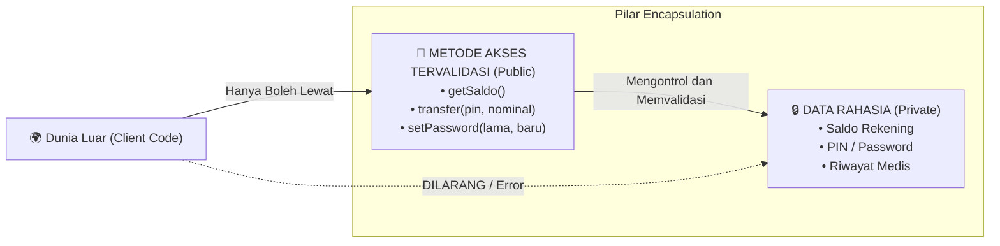

# Minggu 4: Encapsulation, Visibility & Readonly di PHP 8+

## 🎯 Capaian Pembelajaran (Sub-CPMK 3)
Setelah menyelesaikan materi ini, mahasiswa mampu:
1. Memahami prinsip fundamental **Encapsulation** dan **Information Hiding**.
2. Menguasai 3 jenis **Visibility Modifiers**: `public`, `protected`, dan `private`.
3. Mengimplementasikan **Getter & Setter** dengan validasi logika bisnis (*data validation*).
4. Menerapkan fitur modern **`readonly` Properties (PHP 8.1+)** dan **`readonly class` (PHP 8.2+)**.
5. Memahami magic methods **`__get()`** dan **`__set()`** untuk akses properti dinamis yang aman.

> [!TIP]
> 📽️ **Slide Presentasi Perkuliahan:** Anda dapat melihat dan memutar [Slide Interaktif Pertemuan 4 PHP](/presentasi/pertemuan-4-php) atau [Buka Layar Penuh (Tab Baru)](/Perkuliahan/presentasi/pertemuan-4-encapsulation-php.html){target="_blank"}.

---

## 1. Analogi & Konsep Encapsulation



**Encapsulation (Pembungkusan)** adalah mekanisme mengikat data (properti) dan fungsi pemroses data (method) ke dalam satu wadah (*Class*), sekaligus membatasi akses langsung dari luar (*Information Hiding*) demi menjaga integritas data.

---

## 2. Tiga Tingkat Visibility Modifiers di PHP

| Modifier | Dari Dalam Class Sendiri | Dari Child Class (`extends`) | Dari Luar Class (Client Code) |
| :--- | :---: | :---: | :---: |
| **`public`** | ✅ Ya | ✅ Ya | ✅ Ya (Bebas diakses) |
| **`protected`** | ✅ Ya | ✅ Ya | ❌ Tidak Boleh |
| **`private`** | ✅ Ya | ❌ Tidak Boleh | ❌ Tidak Boleh (Terkunci rapat) |

---

## 3. Getter dan Setter dengan Validasi

Getter digunakan untuk membaca nilai private, sedangkan Setter digunakan untuk mengubah nilai private disertai **aturan validasi**:

```php
<?php
declare(strict_types=1);

class Pasien
{
    private string $nama;
    private int $umur = 0;
    private float $beratBadan = 0.0;

    public function __construct(string $nama, int $umur, float $beratBadan)
    {
        $this->nama = $nama;
        $this->setUmur($umur);
        $this->setBeratBadan($beratBadan);
    }

    // Getter Nama (Read-Only)
    public function getNama(): string
    {
        return $this->nama;
    }

    // Setter Umur dengan Validasi Logis
    public function setUmur(int $umur): void
    {
        if ($umur >= 0 && $umur <= 130) {
            $this->umur = $umur;
        } else {
            throw new \InvalidArgumentException("Umur tidak valid: {$umur} tahun!");
        }
    }

    public function getUmur(): int
    {
        return $this->umur;
    }

    // Setter Berat Badan (Harus Positif)
    public function setBeratBadan(float $berat): void
    {
        if ($berat > 0.0) {
            $this->beratBadan = $berat;
        } else {
            throw new \InvalidArgumentException("Berat badan harus bernilai positif!");
        }
    }

    public function getBeratBadan(): float
    {
        return $this->beratBadan;
    }
}
```

---

## 4. `readonly` Properties (PHP 8.1+) & `readonly class` (PHP 8.2+)

Fitur `readonly` menjamin sebuah properti **hanya dapat diisi 1 kali** saat inisialisasi di constructor, dan setelah itu nilainya menjadi *immutable* (tidak bisa dimodifikasi):

```php
<?php

class Transaksi
{
    public function __construct(
        public readonly string $idTransaksi, // Tidak bisa diubah setelah dibuat
        public readonly float $nominal,
        private string $status = "PENDING"
    ) {}

    public function setStatus(string $status): void
    {
        $this->status = $status; // Properti non-readonly tetap bisa diubah
    }

    public function getStatus(): string
    {
        return $this->status;
    }
}

$trx = new Transaksi("TRX-001", 250_000);
echo $trx->idTransaksi; // ✅ Boleh dibaca (public readonly)
// $trx->idTransaksi = "TRX-999"; // ❌ FATAL ERROR: Cannot modify readonly property
```

---

## 5. Magic Methods: `__get()` dan `__set()`

Magic methods memungkinkan penanganan akses properti yang tidak ada (*inaccessible*) secara dinamis:

```php
<?php

class KonfigurasiAplikasi
{
    private array $data = [];

    // Otomatis dipanggil saat menulis properti private/tidak ada
    public function __set(string $key, mixed $value): void
    {
        echo "Menyimpan setting '{$key}' => '{$value}'\n";
        $this->data[$key] = $value;
    }

    // Otomatis dipanggil saat membaca properti private/tidak ada
    public function __get(string $key): mixed
    {
        return $this->data[$key] ?? "Default Setting";
    }
}

$config = new KonfigurasiAplikasi();
$config->theme = "Dark Mode"; // Memicu __set
echo $config->theme;          // Memicu __get: Dark Mode
```

---

## 💻 Praktikum Terbimbing: Dompet Digital (E-Wallet)

```php
<?php
declare(strict_types=1);

class DompetDigital
{
    private float $saldo;

    public function __construct(
        public readonly string $nomorPonsel,
        private string $pin,
        float $saldoAwal = 0.0
    ) {
        $this->saldo = max(0.0, $saldoAwal);
    }

    public function getSaldo(): float
    {
        return $this->saldo;
    }

    public function topUp(float $jumlah): void
    {
        if ($jumlah >= 10_000) {
            $this->saldo += $jumlah;
            echo "✅ Top-up Rp " . number_format($jumlah, 0, ',', '.') . " berhasil!\n";
        } else {
            echo "❌ Minimal top-up adalah Rp 10.000!\n";
        }
    }

    public function transfer(string $pinInput, float $jumlah, string $nomorTujuan): bool
    {
        if ($this->pin !== $pinInput) {
            echo "❌ Transaksi ditolak: PIN Anda salah!\n";
            return false;
        }

        if ($jumlah <= 0 || $this->saldo < $jumlah) {
            echo "❌ Transaksi gagal: Saldo Anda tidak mencukupi!\n";
            return false;
        }

        $this->saldo -= $jumlah;
        echo "🚀 Sukses transfer Rp " . number_format($jumlah, 0, ',', '.') . " ke {$nomorTujuan}!\n";
        return true;
    }
}

// Uji Keamanan E-Wallet
$dompet = new DompetDigital("081234567890", "123456", 100_000);

// $dompet->saldo = 999_999_999; // ❌ FATAL ERROR: Saldo terlindungi!
$dompet->topUp(50_000);
$dompet->transfer("999999", 50_000, "085299887766"); // Gagal (PIN Salah)
$dompet->transfer("123456", 50_000, "085299887766"); // Berhasil (PIN Benar)

echo "Saldo Akhir: Rp " . number_format($dompet->getSaldo(), 0, ',', '.') . "\n";
```

---

## 📝 Tugas Praktikum Mandiri

1. Buat class `NilaiAkademik` dengan properti private:
   - `$nilaiTugas` (float)
   - `$nilaiUTS` (float)
   - `$nilaiUAS` (float)
2. Buat Setter dan Getter untuk masing-masing nilai dengan validasi ketat: Nilai harus berada dalam rentang `0.0` sampai `100.0`.
3. Buat method `hitungNilaiAkhir()` dengan bobot: Tugas 30%, UTS 30%, UAS 40%.
4. Buat method `getGrade()` yang mengembalikan huruf mutu:
   - $\ge 85 \rightarrow$ **A**
   - $\ge 70 \rightarrow$ **B**
   - $\ge 55 \rightarrow$ **C**
   - $\ge 40 \rightarrow$ **D**
   - $< 40 \rightarrow$ **E**
5. Buat file `main.php` untuk menguji objek dengan data valid dan data invalid (menguji penolakan setter)!
