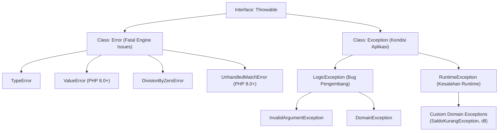

# Minggu 10: Penanganan Kesalahan (Exception Handling) & Robust Error Flow di PHP 8+

## 🎯 Capaian Pembelajaran (Sub-CPMK 4)
Setelah menyelesaikan materi pada bab ini, mahasiswa diharapkan mampu:
1. Memahami filosofi **Exception Handling** dan prinsip **Fail-Fast** dibandingkan metode *error status code* konvensional.
2. Menguasai pohon hierarki antarmuka **`Throwable`**, serta membedakan secara tajam antara **`Error`**, **`LogicException`**, dan **`RuntimeException`**.
3. Menerapkan blok kontrol **`try-catch-finally`**, teknik **Multi-Catch Exceptions**, dan penangkapan anonim (*Non-capturing Catches* di **PHP 8.0+**).
4. Menggunakan fitur **`throw` as an Expression (PHP 8.0+)** pada *Null Coalescing* dan ekspresi *match*.
5. Merancang **Custom Domain Exceptions** yang kaya konteks (*Rich Contextual Exceptions*) serta menerapkan **Exception Chaining / Wrapping** untuk melestarikan *root cause stack trace*.
6. Mengonfigurasi penanganan kesalahan terpusat (*Global Exception Handler*) berstandar keamanan enterprise.

> [!NOTE]
> 💡 **Standar Keamanan:** Jangan pernah mengekspos *raw exception trace* ke layar pengguna akhir di lingkungan produksi untuk mencegah kebocoran kredensial database dan struktur internal server.

---

## 1. Filosofi Exception Handling & Hierarki `Throwable`



### A. Fail-Fast Principle vs Silent Failure
Dalam pemrograman kuno, penanganan error sering dilakukan dengan mengembalikan nilai `false` atau `-1`. Pendekatan ini sangat berbahaya karena kode pemanggil kerap lupa memeriksa nilai balikan tersebut, sehingga data yang korup tetap diproses lebih jauh (*Silent Failure*).

Prinsip **Fail-Fast** menyatakan bahwa ketika terjadi anomali atau pelanggaran aturan bisnis, program harus segera menghentikan eksekusi normal dan melempar *Exception* terstruktur.

### B. Taksonomi `Throwable` di PHP Modern
Sejak PHP 7+, seluruh error dan exception disatukan di bawah payung interface `\Throwable`:
1. **`\Error`:** Mewakili kegagalan fatal pada level Zend Engine (misal tipe argumen salah pada *strict types*, pembagian dengan nol, atau ekspresi `match` yang tidak lengkap).
2. **`\LogicException`:** Mewakili kesalahan logika program yang **seharusnya dapat dicegah oleh programmer** melalui perbaikan kode (contoh: parameter invalid, index array di luar jangkauan).
3. **`\RuntimeException`:** Mewakili kesalahan yang **tidak dapat diprediksi secara mutlak saat compile-time** dan bergantung pada lingkungan runtime (contoh: database mati, file disk penuh, jaringan terputus).

---

## 2. Blok Kontrol `try-catch-finally` & Multi-Catch Syntax

### A. Penangkapan Spesifik ke Generik
Urutan blok `catch` harus disusun dari class exception yang paling spesifik ke class yang paling umum:

```php
<?php
declare(strict_types=1);

namespace App\Keuangan;

use InvalidArgumentException;
use DomainException;
use Exception;
use Throwable;

function kalkulasiBagiHasil(float $modal, float $rasio): float
{
    if ($modal <= 0) {
        throw new InvalidArgumentException("Modal investasi harus lebih besar dari 0!");
    }
    if ($rasio < 0.0 || $rasio > 1.0) {
        throw new DomainException("Rasio bagi hasil harus berada di antara 0.0 s.d. 1.0!");
    }
    return $modal * $rasio;
}

try {
    echo "Memulai kalkulasi investasi...\n";
    $hasil = kalkulasiBagiHasil(100_000_000.0, 0.25);
    echo "Hasil Bagi Hasil: Rp " . number_format($hasil, 0, ',', '.') . "\n";
} catch (InvalidArgumentException | DomainException $e) {
    // 1. Multi-Catch: Menangani beberapa exception sejenis dalam 1 blok
    echo "⚠️ [VALIDASI DOMAIN GAGAL] " . $e->getMessage() . "\n";
} catch (Exception $e) {
    // 2. Fallback Exception Aplikasi Umum
    echo "❌ [EXCEPTION UMUM] Terjadi kesalahan: " . $e->getMessage() . "\n";
} catch (Throwable $e) {
    // 3. Fallback Tingkat Terakhir: Tangkap Error Fatal Engine
    echo "🚨 [FATAL ENGINE ERROR] " . $e->getMessage() . "\n";
} finally {
    // 4. Blok Finally: Selalu dieksekusi untuk pelepasan sumber daya (Close DB / File Handle)
    echo "ℹ️ [CLEANUP] Proses transaksi selesai dievaluasi.\n";
}
```

---

## 3. Fitur Modern PHP 8+: `throw` Expression & Non-Capturing Catches

### A. `throw` sebagai Expression (PHP 8.0+)
Di PHP 8+, kata kunci `throw` adalah sebuah *expression* (bukan lagi sekadar *statement*), sehingga dapat diletakkan di dalam operator *null coalescing*, *ternary*, *arrow functions*, dan ekspresi *match*:

```php
<?php
declare(strict_types=1);

class ProfilPengguna
{
    public function __construct(
        public readonly string $username,
        public readonly string $email
    ) {}

    public static function dariArray(array $payload): self
    {
        return new self(
            // Throw langsung pada Null Coalescing Operator:
            $payload['username'] ?? throw new \InvalidArgumentException("Username wajib diisi!"),
            $payload['email'] ?? throw new \InvalidArgumentException("Email wajib diisi!")
        );
    }
}
```

### B. Non-Capturing Catches (PHP 8.0+)
Jika variabel exception tidak digunakan di dalam blok `catch`, penulisan variabel (`$e`) dapat diabaikan:

```php
<?php
try {
    $token = autotentikasiHeader();
} catch (\App\Exception\JwtExpiredException) {
    // Tidak perlu menulis 'catch (JwtExpiredException $e)' jika $e tidak dibaca
    echo "Sesi login telah kedaluwarsa. Silakan login kembali.\n";
}
```

---

## 4. Merancang Custom Domain Exceptions & Exception Chaining

### A. Rich Contextual Custom Exception
Membangun class exception khusus yang menyimpan informasi status internal:

```php
<?php
declare(strict_types=1);

namespace App\Exception;

class SaldoTidakCukupException extends \RuntimeException
{
    public function __construct(
        public readonly string $nomorRekening,
        public readonly float $saldoTersedia,
        public readonly float $nominalDiminta,
        int $code = 400,
        ?\Throwable $previous = null
    ) {
        $pesan = sprintf(
            "Penarikan gagal pada rekening [%s]. Saldo tersedia: Rp %s, nominal diminta: Rp %s.",
            $nomorRekening,
            number_format($saldoTersedia, 0, ',', '.'),
            number_format($nominalDiminta, 0, ',', '.')
        );
        parent::__construct($pesan, $code, $previous);
    }
}
```

### B. Exception Chaining / Wrapping (Melestarikan Root Cause)
Ketika error level rendah (seperti `PDOException`) terjadi, lapisan service tidak boleh membocorkan query database mentah ke pengguna. Bungkus (*wrap*) error tersebut ke dalam *Service Exception* seraya menyematkan error asli pada parameter `$previous`:

```php
<?php
namespace App\Service;

use App\Exception\SaldoTidakCukupException;
use App\Exception\TransferDanaException;

class TransferService
{
    public function transfer(string $rekSumber, string $rekTujuan, float $nominal): void
    {
        try {
            // Simulasi operasi database...
            if ($nominal > 500_000.0) {
                throw new SaldoTidakCukupException($rekSumber, 500_000.0, $nominal);
            }
        } catch (SaldoTidakCukupException $e) {
            // Exception Chaining: Bungkus ke domain service exception tingkat tinggi
            throw new TransferDanaException(
                "Layanan transfer antar-bank gagal diproses.",
                500,
                $e // Sertakan root cause asli di sini
            );
        }
    }
}
```

---

## 💻 5. Praktikum Terbimbing: Alur Transaksi Perbankan Aman

```php
<?php
declare(strict_types=1);

namespace App\Domain;

class RekeningBank
{
    public function __construct(
        public readonly string $nomorRekening,
        private float $saldo
    ) {}

    public function getSaldo(): float
    {
        return $this->saldo;
    }

    public function tarik(float $nominal): void
    {
        if ($nominal <= 0) {
            throw new \InvalidArgumentException("Nominal penarikan harus bernilai positif.");
        }
        if ($nominal > $this->saldo) {
            throw new \App\Exception\SaldoTidakCukupException($this->nomorRekening, $this->saldo, $nominal);
        }
        $this->saldo -= $nominal;
    }
}

// Simulasi Konsumen:
$akun = new RekeningBank("UUI-ACC-1024", 1_000_000.0);

try {
    echo "Saldo Awal: Rp " . number_format($akun->getSaldo(), 0, ',', '.') . "\n";
    $akun->tarik(1_500_000.0); // Memicu Exception
} catch (\App\Exception\SaldoTidakCukupException $e) {
    echo "❌ [TRANSAKSI DITOLAK] " . $e->getMessage() . "\n";
    echo "   Detail: Kekurangan Dana sebesar Rp " . number_format($e->nominalDiminta - $e->saldoTersedia, 0, ',', '.') . "\n";
}
```

---

## 📝 Evaluasi & Tugas Praktikum Mandiri

1. **Rancang Custom Exception Hierarki:**
   - Buat abstract class `DomainExceptionBase extends \RuntimeException`.
   - Buat subclass `BatasKreditTerlampauiException` dan `AkunTerkunciException`.
2. **Implementasi Throw Expression:**
   - Buat class `ValidasiRegistrasi` yang memvalidasi `nik`, `nama`, dan `tanggalLahir` langsung menggunakan operator throw expression pada constructor.
3. **Analisis Reflektif:**
   - Mengapa Exception Chaining (`$previous`) sangat penting dalam investigasi *debugging* di log server produksi tanpa mengorbankan keamanan antarmuka pengguna?
