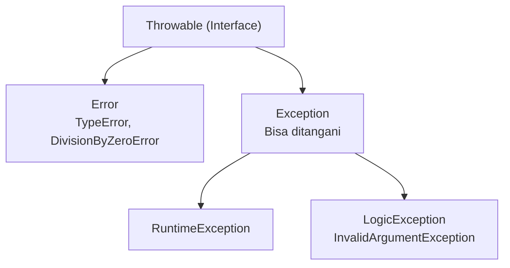

# Minggu 10: Exception Handling

## 🎯 Capaian Pembelajaran (Sub-CPMK 4)
Setelah menyelesaikan materi ini, mahasiswa mampu:
1. Memahami hierarki **Exception** di PHP.
2. Menerapkan blok **`try-catch-finally`**.
3. Menggunakan kata kunci **`throw`** untuk melempar exception.
4. Membuat **Custom Exception** sesuai kebutuhan aplikasi.

---

## 1. Hierarki Exception di PHP



---

## 2. Blok `try-catch-finally`

```php
<?php

function bagi(float $a, float $b): float
{
    if ($b == 0) {
        throw new \DivisionByZeroError("Tidak bisa membagi dengan nol!");
    }
    return $a / $b;
}

try {
    $hasil = bagi(10, 0);
    echo "Hasil: {$hasil}\n";
} catch (\DivisionByZeroError $e) {
    echo "❌ Error Matematika: {$e->getMessage()}\n";
} catch (\Exception $e) {
    echo "❌ Error Umum: {$e->getMessage()}\n";
} finally {
    echo "ℹ️ Blok finally selalu dieksekusi.\n";
}
```

---

## 3. Custom Exception

```php
<?php

class SaldoKurangException extends \Exception
{
    public function __construct(
        private float $saldoSekarang,
        private float $jumlahTarik
    ) {
        $pesan = "Saldo tidak cukup! Saldo: Rp " . number_format($saldoSekarang)
               . ", Penarikan: Rp " . number_format($jumlahTarik);
        parent::__construct($pesan);
    }
}

class AkunBank
{
    public function __construct(private float $saldo) {}

    public function tarik(float $jumlah): void
    {
        if ($jumlah > $this->saldo) {
            throw new SaldoKurangException($this->saldo, $jumlah);
        }
        $this->saldo -= $jumlah;
        echo "Penarikan Rp " . number_format($jumlah)
           . " berhasil. Sisa: Rp " . number_format($this->saldo) . "\n";
    }
}

// Pengujian
$akun = new AkunBank(100_000);
try {
    $akun->tarik(50_000);   // Berhasil
    $akun->tarik(200_000);  // Akan throw exception
} catch (SaldoKurangException $e) {
    echo "❌ {$e->getMessage()}\n";
}
```

---

## 📝 Tugas Praktikum

1. Buat custom exception `BatasKreditException`.
2. Buat class `KartuKredit` dengan `$limitKredit` dan `$totalPemakaian`.
3. Buat method `gesek(float $nominal)` yang throw `BatasKreditException` jika melebihi limit.
4. Uji dengan blok `try-catch-finally`.
