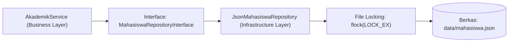

# Minggu 11: Manajemen Berkas (File Handling & I/O Streams) di PHP 8+

## 🎯 Capaian Pembelajaran (Sub-CPMK 4)
Setelah menyelesaikan materi pada bab ini, mahasiswa diharapkan mampu:
1. Memahami filosofi persistensi data berbasis berkas (*File-based Persistence*) serta perbedaan antara **Stream-based I/O** dan **Buffered I/O**.
2. Menguasai teknik pencegahan *Race Condition* dan korupsi data menggunakan **File Locking (`flock`)** pada operasi konkuren.
3. Menerapkan pustaka berorientasi objek modern **`SplFileObject`** dan **`SplFileInfo`** untuk membaca dan menulis berkas secara *memory-efficient*.
4. Mengolah berkas berformat **CSV** dan **JSON** menggunakan standar keamanan modern (**`JSON_THROW_ON_ERROR`**, **`json_validate()` di PHP 8.3+**).
5. Membangun pola desain **File-Based Repository Pattern** yang memisahkan logika persistensi berkas dari lapisan domain bisnis.
6. Merancang modul *Audit Logger* persisten dengan rotasi berkas otomatis.

> [!NOTE]
> 💡 **Standar Performa:** Gunakan *Stream I/O* (`fgets` / `SplFileObject`) untuk memproses berkas besar (ratusan megabyte) baris per baris agar tidak melampaui batas alokasi memori PHP (`memory_limit`).

---

## 1. Filosofi Persistensi Berkas & Pencegahan Race Condition



### A. Bahaya Konkurensi Tanpa File Locking
Pada aplikasi web yang melayani ratusan permintaan pengguna secara bersamaan (*concurrent requests*), operasi penulisan file rentan mengalami **Race Condition**. Jika Pengguna A dan Pengguna B menulis ke berkas yang sama pada milidetik yang identik tanpa penguncian, isi berkas akan terpotong atau korup (*Data Inconsistency*).

PHP menyediakan fungsi **`flock()`** untuk mengendalikan penguncian berkas:
- **`LOCK_SH` (Shared Lock):** Izin membaca berkas secara bersamaan oleh banyak proses.
- **`LOCK_EX` (Exclusive Lock):** Izin menulis berkas khusus untuk satu proses saja (proses lain harus antre).
- **`LOCK_UN` (Unlock):** Melepaskan kunci berkas setelah operasi selesai.

---

## 2. Pemrosesan Berkas Berorientasi Objek dengan `SplFileObject`

Pustaka Standar PHP (**SPL**) menyediakan class **`SplFileObject`** yang membungkus fungsi I/O tradisional ke dalam antarmuka OOP yang elegan:

```php
<?php
declare(strict_types=1);

namespace App\Infrastructure\IO;

use SplFileObject;
use RuntimeException;

class CsvMahasiswaReader
{
    /**
     * Membaca file CSV besar secara hemat memori (Memory-Efficient Stream)
     */
    public function bacaData(string $pathFile): array
    {
        if (!file_exists($pathFile)) {
            throw new RuntimeException("Berkas CSV tidak ditemukan: {$pathFile}");
        }

        $file = new SplFileObject($pathFile, 'r');
        $file->setFlags(SplFileObject::READ_CSV | SplFileObject::SKIP_EMPTY | SplFileObject::DROP_NEW_LINE);

        $daftarMahasiswa = [];
        $isHeader = true;

        foreach ($file as $baris) {
            // Lewati baris header CSV
            if ($isHeader) {
                $isHeader = false;
                continue;
            }

            if (is_array($baris) && count($baris) >= 3) {
                $daftarMahasiswa[] = [
                    'nim'  => trim($baris[0]),
                    'nama' => trim($baris[1]),
                    'ipk'  => (float) trim($baris[2])
                ];
            }
        }

        return $daftarMahasiswa;
    }
}
```

---

## 3. Manipulasi JSON Modern di PHP 8+

Pengolahan JSON modern diwajibkan menggunakan flag **`JSON_THROW_ON_ERROR`** untuk memastikan setiap kesalahan format langsung memicu `\JsonException`:

```php
<?php
declare(strict_types=1);

$dataAkademik = [
    'fakultas' => 'Fakultas Sains dan Teknologi',
    'prodi'    => 'Informatika',
    'daftar_mahasiswa' => [
        ['nim' => '240101', 'nama' => 'Cut Meurah Intan', 'ipk' => 3.92],
        ['nim' => '240102', 'nama' => 'Teuku Rayhan', 'ipk' => 3.85]
    ]
];

// 1. Serialization ke format JSON Aman
$jsonString = json_encode(
    $dataAkademik, 
    JSON_PRETTY_PRINT | JSON_UNESCAPED_UNICODE | JSON_THROW_ON_ERROR
);

// 2. Operasi Penulisan Atomic dengan File Locking
file_put_contents('data_akademik.json', $jsonString, LOCK_EX);

// 3. Verifikasi Keabsahan JSON di PHP 8.3+ (Tanpa memakan alokasi RAM objek)
if (function_exists('json_validate') && json_validate($jsonString)) {
    echo "✅ Format JSON valid dan terverifikasi secara native.\n";
}

// 4. Deserialization Aman
$hasilDecode = json_decode($jsonString, true, 512, JSON_THROW_ON_ERROR);
echo "Jumlah Mahasiswa Terdaftar: " . count($hasilDecode['daftar_mahasiswa']) . " orang\n";
```

---

## 4. Pola Desain: File-Based Repository Pattern

Pola Repository memisahkan lapisan logika bisnis dari media penyimpanan fisik (file JSON/CSV/Database):

```php
<?php
declare(strict_types=1);

namespace App\Domain\Repository;

use App\Domain\Model\Mahasiswa;

interface MahasiswaRepositoryInterface
{
    public function simpan(Mahasiswa $mhs): void;
    public function cariBerdasarkanNim(string $nim): ?Mahasiswa;
    /** @return Mahasiswa[] */
    public function ambilSemua(): array;
    public function hapus(string $nim): bool;
}
```

### Implementasi `JsonMahasiswaRepository` dengan Exclusive Lock:
```php
<?php
declare(strict_types=1);

namespace App\Infrastructure\Persistence;

use App\Domain\Model\Mahasiswa;
use App\Domain\Repository\MahasiswaRepositoryInterface;
use RuntimeException;

class JsonMahasiswaRepository implements MahasiswaRepositoryInterface
{
    public function __construct(
        private string $filePath
    ) {
        if (!file_exists($this->filePath)) {
            file_put_contents($this->filePath, json_encode([], JSON_PRETTY_PRINT), LOCK_EX);
        }
    }

    public function ambilSemua(): array
    {
        $json = file_get_contents($this->filePath);
        $data = json_decode($json, true, 512, JSON_THROW_ON_ERROR);

        $koleksi = [];
        foreach ($data as $item) {
            $koleksi[$item['nim']] = new Mahasiswa(
                nim: $item['nim'],
                nama: $item['nama'],
                ipk: (float) $item['ipk']
            );
        }
        return $koleksi;
    }

    public function cariBerdasarkanNim(string $nim): ?Mahasiswa
    {
        $semua = $this->ambilSemua();
        return $semua[$nim] ?? null;
    }

    public function simpan(Mahasiswa $mhs): void
    {
        $semua = $this->ambilSemua();
        $semua[$mhs->nim] = $mhs;

        $arrayData = array_map(fn(Mahasiswa $m) => [
            'nim'  => $m->nim,
            'nama' => $m->nama,
            'ipk'  => $m->ipk
        ], array_values($semua));

        file_put_contents(
            $this->filePath,
            json_encode($arrayData, JSON_PRETTY_PRINT | JSON_THROW_ON_ERROR),
            LOCK_EX // Menjamin keamanan penulisan konkuren
        );
    }

    public function hapus(string $nim): bool
    {
        $semua = $this->ambilSemua();
        if (!isset($semua[$nim])) {
            return false;
        }
        unset($semua[$nim]);

        $arrayData = array_map(fn(Mahasiswa $m) => [
            'nim'  => $m->nim,
            'nama' => $m->nama,
            'ipk'  => $m->ipk
        ], array_values($semua));

        file_put_contents(
            $this->filePath,
            json_encode($arrayData, JSON_PRETTY_PRINT | JSON_THROW_ON_ERROR),
            LOCK_EX
        );
        return true;
    }
}
```

---

## 💻 5. Praktikum Terbimbing: Persistent Audit Logger

```php
<?php
declare(strict_types=1);

namespace App\Infrastructure\Logging;

class DailyAuditLogger
{
    public function __construct(
        private string $logDirectory
    ) {
        if (!is_dir($this->logDirectory)) {
            mkdir($this->logDirectory, 0755, true);
        }
    }

    public function log(string $tingkat, string $pesan): void
    {
        $namaFile = sprintf("%s/audit_%s.log", $this->logDirectory, date('Y-m-d'));
        $timestamp = date('Y-m-d H:i:s');
        $barisLog = sprintf("[%s] [%s] %s\n", $timestamp, strtoupper($tingkat), $pesan);

        file_put_contents($namaFile, $barisLog, FILE_APPEND | LOCK_EX);
    }
}

// Eksekusi:
$logger = new DailyAuditLogger(__DIR__ . '/../../logs');
$logger->log('info', 'Pengguna admin berhasil mengekspor berkas transkrip nilai.');
$logger->log('warning', 'Percobaan akses kredensial tidak sah dari IP 192.168.1.50.');
echo "✅ Audit log berhasil dicatat secara persisten ke sistem berkas.\n";
```

---

## 📝 Evaluasi & Tugas Praktikum Mandiri

1. **Rancang `JsonProdukRepository`:**
   - Bangun repository berbasis file JSON untuk entitas `ItemProduk` (SKU, Nama, Harga, Stok).
   - Pastikan operasi `tambahStok()`, `kurangStok()`, dan `ambilSemua()` dilindungi oleh `LOCK_EX`.
2. **Implementasi Exporter CSV:**
   - Buat service `CsvExportService` yang membaca seluruh data mahasiswa dari repository lalu mengekspornya ke berkas `laporan_kelulusan.csv` menggunakan `SplFileObject` atau `fputcsv`.
3. **Analisis Reflektif:**
   - Mengapa penggunaan flag `JSON_THROW_ON_ERROR` wajib diimplementasikan pada aplikasi modern dibandingkan fungsi `json_last_error()` gaya lama?
