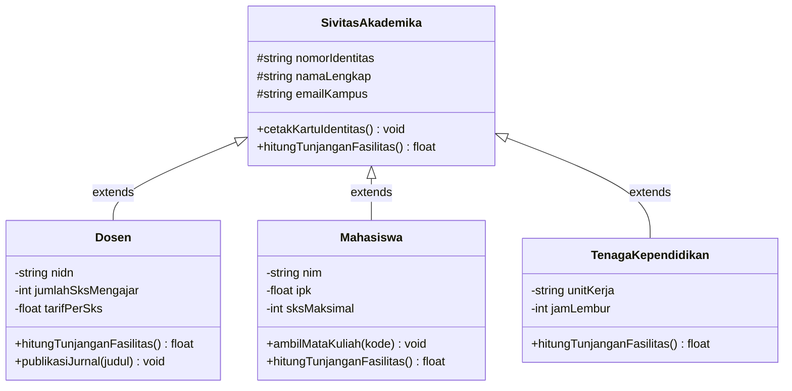
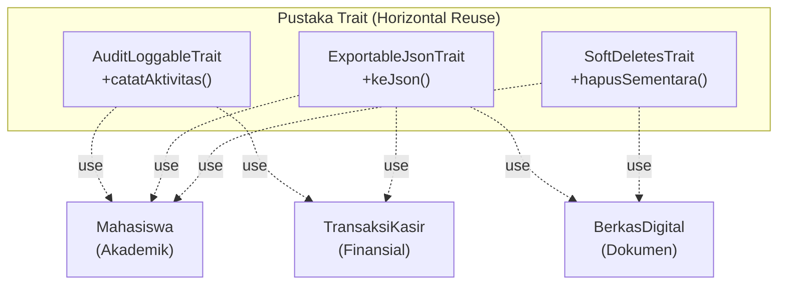

# Minggu 5: Inheritance (Pewarisan), Final Keyword & Trait di PHP 8+

## 🎯 Capaian Pembelajaran (Sub-CPMK 3)
Setelah menyelesaikan materi pada bab ini, mahasiswa diharapkan mampu:
1. Memahami fondasi teoretis **Inheritance (Pewarisan Sifat)**, prinsip **Taksonomi "Is-A"**, serta perbedaan antara *Subtyping* dan *Code Reuse*.
2. Mengimplementasikan pewarisan menggunakan kata kunci **`extends`** dan mengelola siklus hidup inisialisasi menggunakan **`parent::__construct()`**.
3. Menerapkan teknik **Method Overriding** untuk menyesuaikan perilaku subclass seraya mempertahankan integritas antarmuka induk.
4. Mengendalikan dan mengamankan rancangan hierarki menggunakan kata kunci **`final`** pada class, method, dan class constants (**PHP 8.1+**).
5. Mengatasi keterbatasan *Single Inheritance* di PHP menggunakan **Trait (*Horizontal Code Reuse*)**, mengelola resolusi konflik (**`insteadof`** dan **`as`**), serta memanfaatkan konstanta di dalam Trait (**PHP 8.2+**).
6. Menganalisis kelemahan desain hierarki (*Fragile Base Class Problem*) dan menerapkan prinsip *"Favor Composition over Inheritance"*.

> [!TIP]
> 📽️ **Slide Presentasi Perkuliahan:** Anda dapat melihat dan memutar [Slide Interaktif Pertemuan 5 PHP](/presentasi/pertemuan-5-php) atau [Buka Layar Penuh (Tab Baru)](/Perkuliahan/presentasi/pertemuan-5-inheritance-trait-php.html){target="_blank"}.

---

## 1. Filosofi dan Fondasi Teoretis Pewarisan



### A. Hakikat Pewarisan dan Hubungan "Is-A"
Dalam pemrograman berorientasi objek, **Pewarisan (Inheritance)** adalah mekanisme yang memungkinkan suatu class baru (**Subclass / Child Class**) mengadopsi seluruh variabel (state) dan metode (behavior) yang dimiliki oleh class yang sudah ada sebelumnya (**Superclass / Parent Class**).

Hubungan ini mencerminkan relasi taksonomi **"Is-A"** (Adalah Seorang / Adalah Sebuah):
- Dosen *adalah seorang* Sivitas Akademika.
- Mahasiswa *adalah seorang* Sivitas Akademika.
- Mobil Listrik *adalah sebuah* Kendaraan.

Dengan pewarisan, atribut dan perilaku umum yang berlaku untuk seluruh entitas (seperti nama, nomor identitas, dan email kampus) cukup didefinisikan satu kali pada superclass. Hal ini mewujudkan prinsip **DRY (Don't Repeat Yourself)** secara maksimal.

### B. Bahaya Arsitektur: *Fragile Base Class Problem*
Meskipun pewarisan sangat berguna, penggunaan pewarisan yang serampangan dapat menimbulkan kerapuhan arsitektur yang dikenal sebagai **Fragile Base Class Problem**. Ketika hierarki class dibuat terlalu dalam (misal lebih dari 3 tingkat: `A → B → C → D → E`), perubahan kecil pada implementasi internal superclass `A` dapat merusak atau mengubah perilaku ratusan subclass di bawahnya secara tidak terduga.

Prinsip desain Gang of Four (GoF) merekomendasikan:
> *"Favor Composition over Inheritance"* (Utamakan Komposisi dan Trait dibandingkan Pewarisan Kelas yang Terlalu Dalam).

---

## 2. Anatomi Pewarisan: `extends`, `parent::`, dan Method Overriding

### A. Mekanisme Constructor Chaining
Ketika subclass mendefinisikan constructor-nya sendiri, Zend Engine tidak secara otomatis memanggil constructor milik parent class. Pengembang **wajib** memanggil `parent::__construct(...)` secara eksplisit pada baris pertama constructor subclass.

```php
<?php
declare(strict_types=1);

namespace App\Domain;

// Superclass (Parent)
class SivitasAkademika
{
    public function __construct(
        protected readonly string $nomorIdentitas,
        protected string $namaLengkap,
        protected string $emailKampus
    ) {
        if (empty($nomorIdentitas) || empty($namaLengkap)) {
            throw new \InvalidArgumentException("Nomor Identitas dan Nama wajib diisi!");
        }
    }

    public function cetakIdentitas(): void
    {
        echo "========================================\n";
        echo "Kartu Sivitas Akademika UUI\n";
        echo "ID    : {$this->nomorIdentitas}\n";
        echo "Nama  : {$this->namaLengkap}\n";
        echo "Email : {$this->emailKampus}\n";
        echo "Peran : " . static::class . "\n";
    }

    public function hitungBantuanFasilitas(): float
    {
        return 100_000.0; // Bantuan kuota internet dasar untuk semua sivitas
    }
}

// Subclass 1: Dosen
class Dosen extends SivitasAkademika
{
    public function __construct(
        string $nidn,
        string $namaLengkap,
        string $emailKampus,
        private string $jabatanFungsional = "Asisten Ahli",
        private int $sksMengajar = 12
    ) {
        // 1. Constructor Chaining: Panggil constructor superclass
        parent::__construct($nidn, $namaLengkap, $emailKampus);
    }

    // 2. Method Overriding: Menyesuaikan implementasi perhitungan bantuan/tunjangan
    public function hitungBantuanFasilitas(): float
    {
        $dasar = parent::hitungBantuanFasilitas(); // Mengambil nilai Rp 100.000 dari parent
        $tunjanganSks = $this->sksMengajar * 50_000.0;
        return $dasar + $tunjanganSks;
    }

    public function cetakIdentitas(): void
    {
        parent::cetakIdentitas();
        echo "Jabatan Fungsional : {$this->jabatanFungsional}\n";
        echo "Beban Mengajar     : {$this->sksMengajar} SKS\n";
        echo "Total Bantuan Fas. : Rp " . number_format($this->hitungBantuanFasilitas(), 0, ',', '.') . "\n";
        echo "========================================\n";
    }
}
```

---

## 3. Pengendalian Hierarki dengan Kata Kunci `final`

Kata kunci `final` digunakan untuk mengunci arsitektur agar tidak dapat diperluas atau diubah oleh pengembang lain:

### A. `final class` (Mengunci Seluruh Kelas)
Mencegah sebuah class dijadikan parent bagi class lain:
```php
<?php
// Class ini aman dari risiko modifikasi inheritance liar:
final class KoneksiDatabaseSecurity
{
    public function __construct(
        public readonly string $host,
        public readonly string $dbName
    ) {}
}

// class HackConnection extends KoneksiDatabaseSecurity {} 
// ❌ FATAL ERROR: Class HackConnection may not inherit from final class (KoneksiDatabaseSecurity)
```

### B. `final method` (Mengunci Method Spesifik)
Mencegah method tertentu di-override oleh child class (sangat berguna pada *Template Method Pattern*):
```php
<?php
class AlgoritmaPenilaian
{
    // Algoritma kelulusan dikunci final: tidak boleh diubah oleh prodi manapun
    final public function tentukanKelulusan(float $nilaiAkhir): string
    {
        return $nilaiAkhir >= 60.0 ? "LULUS" : "TIDAK LULUS";
    }

    // Method ini boleh di-override untuk penyesuaian bobot
    public function hitungNilaiAkhir(float $tugas, float $uts, float $uas): float
    {
        return ($tugas * 0.3) + ($uts * 0.3) + ($uas * 0.4);
    }
}
```

### C. `final class constant` (PHP 8.1+)
Sejak PHP 8.1, konstanta class dapat ditandai sebagai `final const` agar nilainya tidak dapat ditimpa oleh subclass:
```php
<?php
class StandardProtokol
{
    final public const PROTOCOL_VERSION = "TLSv1.3"; // Nilai mutlak
}

class CustomProtokol extends StandardProtokol
{
    // public const PROTOCOL_VERSION = "TLSv1.0"; 
    // ❌ FATAL ERROR: CustomProtokol::PROTOCOL_VERSION cannot override final constant StandardProtokol::PROTOCOL_VERSION
}
```

---

## 4. Trait: Solusi *Horizontal Code Reuse* di PHP

PHP menganut model **Single Inheritance** (setiap class hanya boleh memiliki satu parent langsung melalui `extends`). Namun dalam rekayasa nyata, kita kerap membutuhkan fungsionalitas yang sama pada class-class yang pohon hierarkinya sama sekali tidak berhubungan.

**Trait** menyediakan mekanisme *Horizontal Code Reuse* untuk menyisipkan kumpulan method dan properti ke dalam banyak class secara bebas menggunakan kata kunci `use`.



### A. Contoh Komposisi Multi-Trait:
```php
<?php
declare(strict_types=1);

namespace App\Traits;

trait AuditLoggableTrait
{
    public function catatAktivitas(string $pesan): void
    {
        $waktu = date('Y-m-d H:i:s');
        $namaClass = static::class;
        echo "[AUDIT LOG] [{$waktu}] [{$namaClass}] {$pesan}\n";
    }
}

trait ExportableJsonTrait
{
    public function keJson(): string
    {
        return json_encode(get_object_vars($this), JSON_PRETTY_PRINT | JSON_UNESCAPED_UNICODE);
    }
}

// Fitur PHP 8.2+: Konstanta di dalam Trait
trait KonfigurasiCacheTrait
{
    public const DEFAULT_CACHE_TTL = 3600; // 1 Jam
}
```

---

## 5. Resolusi Konflik Trait: `insteadof` dan `as`

Jika sebuah class menggunakan dua Trait yang memiliki nama method yang sama, Zend Engine akan memunculkan *Fatal Error* akibat bentrok nama (*Name Collision*). PHP menyediakan operator **`insteadof`** dan **`as`** untuk menyelesaikan konflik secara presisi:

```php
<?php
declare(strict_types=1);

trait ServerNotifierTrait
{
    public function kirimPeringatan(string $pesan): void
    {
        echo "🚨 [SERVER ALERT] Mengirim broadcast socket: {$pesan}\n";
    }
}

trait TelegramNotifierTrait
{
    public function kirimPeringatan(string $pesan): void
    {
        echo "📱 [TELEGRAM ALERT] Mengirim pesan Telegram Bot: {$pesan}\n";
    }
}

class MonitoringSistem
{
    use ServerNotifierTrait, TelegramNotifierTrait {
        // 1. Resolusi Konflik: Gunakan method milik TelegramNotifierTrait untuk kirimPeringatan utama
        TelegramNotifierTrait::kirimPeringatan insteadof ServerNotifierTrait;

        // 2. Beri nama alias untuk method milik ServerNotifierTrait agar tetap bisa dipanggil
        ServerNotifierTrait::kirimPeringatan as kirimKeServer;

        // 3. Mengubah visibility method trait menjadi private/protected jika diperlukan:
        // ServerNotifierTrait::kirimPeringatan as private kirimInternal;
    }
}

$monitor = new MonitoringSistem();
$monitor->kirimPeringatan("Beban CPU server mencapai 92%!"); // Memanggil Telegram
$monitor->kirimKeServer("Pencatatan metrik server.");        // Memanggil ServerNotifier
```

---

## 6. Abstract Method di dalam Trait

Trait dapat mendefinisikan **Abstract Method** untuk mewajibkan class pengguna menyediakan method atau atribut tertentu agar logika di dalam Trait dapat berjalan:

```php
<?php
trait PenomoranSuratTrait
{
    // Mewajibkan class yang menggunakan trait ini memiliki method getKodeDepartemen()
    abstract public function getKodeDepartemen(): string;

    public function generateNomorSurat(int $urutan): string
    {
        $tahun = date('Y');
        $kode = $this->getKodeDepartemen(); // Memanggil method abstrak yang disediakan class
        return sprintf("%04d/UUI-%s/%s", $urutan, $kode, $tahun);
    }
}

class SuratTugasDosen
{
    use PenomoranSuratTrait;

    public function getKodeDepartemen(): string
    {
        return "IF-FST"; // Program Studi Informatika FST
    }
}

$surat = new SuratTugasDosen();
echo $surat->generateNomorSurat(42); // Output: 0042/UUI-IF-FST/2025
```

---

## 💻 7. Praktikum Terbimbing: Sistem Manajemen Pegawai & Dosen

```php
<?php
declare(strict_types=1);

// Parent Class Pegawai
abstract class Pegawai
{
    public function __construct(
        protected readonly string $nip,
        protected string $nama,
        protected float $gajiPokok
    ) {}

    abstract public function hitungTotalGaji(): float;

    public function cetakSlipGaji(): void
    {
        echo "========================================\n";
        echo "SLIP GAJI PEGAWAI UUI\n";
        echo "NIP     : {$this->nip}\n";
        echo "Nama    : {$this->nama}\n";
        echo "Jabatan : " . static::class . "\n";
        echo "Gaji Pokok: Rp " . number_format($this->gajiPokok, 0, ',', '.') . "\n";
        echo "Total Gaji: Rp " . number_format($this->hitungTotalGaji(), 0, ',', '.') . "\n";
        echo "========================================\n";
    }
}

// Subclass Dosen dengan Trait Loggable
class DosenPengajar extends Pegawai
{
    use App\Traits\AuditLoggableTrait;

    public function __construct(
        string $nip,
        string $nama,
        float $gajiPokok,
        private int $sksMengajar,
        private float $honorPerSks = 150_000.0
    ) {
        parent::__construct($nip, $nama, $gajiPokok);
        $this->catatAktivitas("Dosen {$nama} berhasil didaftarkan ke sistem.");
    }

    public function hitungTotalGaji(): float
    {
        $tunjanganSks = $this->sksMengajar * $this->honorPerSks;
        return $this->gajiPokok + $tunjanganSks;
    }
}

// Eksekusi Kasus
$dosen = new DosenPengajar("19880101", "Mahendar Dwi Payana, M.T.", 7_500_000.0, 14);
$dosen->cetakSlipGaji();
```

---

## 📝 Evaluasi & Tugas Praktikum Mandiri

1. **Rancanglah Hierarki Perbankan:**
   - Parent class `RekeningBank` dengan atribut protected `$nomorRekening`, `$saldo`, dan method `setor()` serta `tarik()`.
   - Subclass `RekeningGiro` (memiliki biaya administrasi bulanan dan limit penarikan harian).
   - Subclass `RekeningDeposito` (memiliki jangka waktu jatuh tempo dan suku bunga tetap, di mana penarikan sebelum jatuh tempo dikenakan penalti).
2. **Implementasi Trait Notifikasi:**
   - Buat `EmailNotificationTrait` dan `SmsNotificationTrait` yang sama-sama memiliki method `kirimBuktiTransaksi(string $pesan)`.
   - Pasang kedua trait pada class `TransaksiPerbankan` dan selesaikan konflik menggunakan operator `insteadof` serta berikan nama alias menggunakan `as`.
3. **Analisis Reflektif:**
   - Kapan sebaiknya sebuah method ditandai dengan kata kunci `final`? Berikan contoh kasus nyata pada aplikasi finansial!
