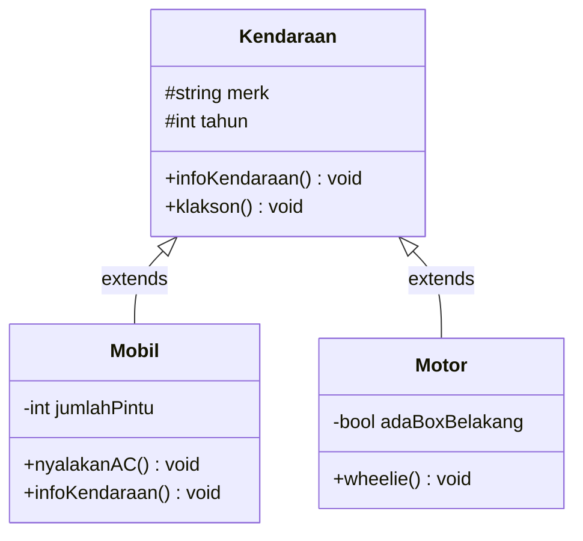
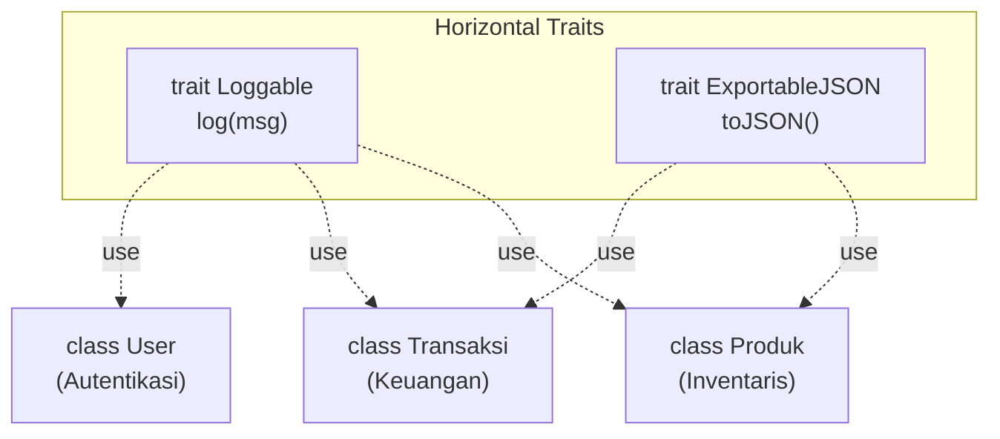

# Minggu 5: Inheritance (Pewarisan) & Trait di PHP 8+

## 🎯 Capaian Pembelajaran (Sub-CPMK 3)
Setelah menyelesaikan materi ini, mahasiswa mampu:
1. Memahami konsep **Inheritance (Pewarisan Sifat)** dan relasi *Is-A* antar Class.
2. Menggunakan kata kunci **`extends`** untuk menurunkan properti dan method ke Subclass.
3. Memanggil constructor dan method milik parent menggunakan **`parent::__construct()`** dan **`parent::method()`**.
4. Memahami fungsi modifier **`protected`** dan kata kunci **`final`** (mencegah pewarisan/overriding).
5. Mengatasi batasan *Single Inheritance* di PHP menggunakan **Trait** (*Horizontal Code Reuse*).

> [!TIP]
> 📽️ **Slide Presentasi Perkuliahan:** Anda dapat melihat dan memutar [Slide Interaktif Pertemuan 5 PHP](/presentasi/pertemuan-5-php) atau [Buka Layar Penuh (Tab Baru)](/Perkuliahan/presentasi/pertemuan-5-inheritance-trait-php.html){target="_blank"}.

---

## 1. Konsep Inheritance: Relasi "Is-A"



- **Superclass (Parent):** Class induk yang mendefinisikan atribut & method umum.
- **Subclass (Child):** Class turunan yang mewarisi sifat induk dan menambahkan fungsionalitas spesifik tanpa menduplikasi kode (*DRY - Don't Repeat Yourself*).

---

## 2. Sintaks Pewarisan dengan `extends` dan `parent::`

```php
<?php
declare(strict_types=1);

// Parent Class (Superclass)
class Kendaraan
{
    public function __construct(
        protected string $merk,
        protected int $tahunProduksi
    ) {}

    public function infoKendaraan(): void
    {
        echo "Merk: {$this->merk} | Tahun: {$this->tahunProduksi}\n";
    }

    public function klakson(): void
    {
        echo "Tin tin!\n";
    }
}

// Child Class (Subclass)
class Mobil extends Kendaraan
{
    public function __construct(
        string $merk,
        int $tahunProduksi,
        private int $jumlahPintu = 4
    ) {
        // Panggil constructor milik parent class
        parent::__construct($merk, $tahunProduksi);
    }

    // Method Overriding: Menimpa method parent dengan informasi tambahan
    public function infoKendaraan(): void
    {
        parent::infoKendaraan(); // Jalankan info dari parent
        echo "Jumlah Pintu: {$this->jumlahPintu} pintu\n";
    }

    public function nyalakanAC(): void
    {
        echo "❄️ AC Mobil {$this->merk} dinyalakan dingin.\n";
    }
}
```

---

## 3. Keyword `final`: Mengunci Pewarisan

Kata kunci `final` dapat diletakkan di depan `class` (agar tidak bisa di-`extends`) atau di depan `method` (agar tidak bisa di-override oleh child):

```php
<?php

// Class ini final: tidak ada class lain yang boleh mewarisinya
final class DatabaseConfig
{
    public const DB_HOST = "localhost";
}

class Rekening
{
    // Method ini final: anak class dilarang menimpa aturan perhitungan bunga
    final public function hitungBungaDasar(float $saldo): float
    {
        return $saldo * 0.02;
    }
}
```

---

## 4. Trait: Horizontal Code Reuse di PHP

PHP menganut sistem **Single Inheritance** (1 class hanya boleh punya 1 parent langsung). Untuk berbagi kode ke banyak class yang tidak berada dalam satu pohon hierarki, PHP menyediakan **Trait**:



### Contoh Penerapan Trait:
```php
<?php

trait Loggable
{
    public function log(string $pesan): void
    {
        $waktu = date('Y-m-d H:i:s');
        echo "[LOG {$waktu}] [" . static::class . "] {$pesan}\n";
    }
}

trait ExportableJSON
{
    public function toJSON(): string
    {
        return json_encode(get_object_vars($this), JSON_PRETTY_PRINT);
    }
}

class Produk
{
    use Loggable, ExportableJSON; // Memasang 2 trait sekaligus

    public function __construct(
        public string $nama,
        public float $harga
    ) {
        $this->log("Produk '{$nama}' berhasil dibuat.");
    }
}

$p = new Produk("MacBook Pro M3", 28_000_000);
echo $p->toJSON();
```

---

## 💻 Praktikum Terbimbing: Hirarki Karyawan Perusahaan

```php
<?php
declare(strict_types=1);

// Parent Class
class Karyawan
{
    public function __construct(
        protected readonly string $nip,
        protected string $nama,
        protected float $gajiPokok
    ) {}

    public function hitungTotalGaji(): float
    {
        return $this->gajiPokok;
    }

    public function cetakSlip(): void
    {
        echo "=====================================\n";
        echo "NIP   : {$this->nip}\n";
        echo "Nama  : {$this->nama}\n";
        echo "Jabatan: " . static::class . "\n";
        echo "Total : Rp " . number_format($this->hitungTotalGaji(), 0, ',', '.') . "\n";
        echo "=====================================\n";
    }
}

// Subclass 1: Manager (Mendapat Tunjangan)
class Manager extends Karyawan
{
    public function __construct(
        string $nip,
        string $nama,
        float $gajiPokok,
        private float $tunjanganJabatan
    ) {
        parent::__construct($nip, $nama, $gajiPokok);
    }

    public function hitungTotalGaji(): float
    {
        return $this->gajiPokok + $this->tunjanganJabatan;
    }
}

// Subclass 2: Programmer (Mendapat Bonus Proyek)
class Programmer extends Karyawan
{
    public function __construct(
        string $nip,
        string $nama,
        float $gajiPokok,
        private float $bonusProyek = 0.0
    ) {
        parent::__construct($nip, $nama, $gajiPokok);
    }

    public function tambahBonus(float $bonus): void
    {
        $this->bonusProyek += $bonus;
    }

    public function hitungTotalGaji(): float
    {
        return $this->gajiPokok + $this->bonusProyek;
    }
}

// Eksekusi
$mgr = new Manager("MGR-01", "Budi Santoso", 9_000_000, 3_500_000);
$prog = new Programmer("PRG-01", "Rina Melati", 6_000_000);
$prog->tambahBonus(2_000_000);

$mgr->cetakSlip();
$prog->cetakSlip();
```

---

## 📝 Tugas Praktikum Mandiri

1. Buat class parent `Bentuk` dengan properti protected `$warna` dan method `hitungLuas()` serta `hitungKeliling()` yang mengembalikan `0.0`.
2. Buat subclass `Persegi` (properti `$sisi`) dan `Lingkaran` (properti `$jariJari`) yang mewarisi `Bentuk` dan meng-override perhitungan luas serta kelilingnya.
3. Buat trait `IdentitasObjek` dengan method `getNamaClass()` dan `cetakInfo()` yang mencetak nama class dan warna bentuk.
4. Pasang trait tersebut di `Persegi` dan `Lingkaran`, lalu uji di `main.php`!
