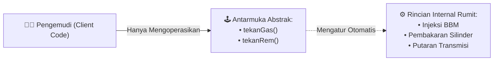

# Minggu 7: Abstraction (Interface & Abstract Class) di PHP 8+

## 🎯 Capaian Pembelajaran (Sub-CPMK 3)
Setelah menyelesaikan materi ini, mahasiswa mampu:
1. Memahami konsep **Abstraction** sebagai pilar ke-4 OOP (Menyembunyikan detail teknis yang rumit).
2. Mendeklarasikan dan menerapkan **Abstract Class** dan **Abstract Method** menggunakan kata kunci `abstract`.
3. Merancang kontrak sistem murni menggunakan **Interface** dan kata kunci `implements`.
4. Mengimplementasikan **Multiple Interfaces** pada sebuah Class di PHP.
5. Membedakan secara tajam kapan harus menggunakan *Abstract Class* (IS-A) vs *Interface* (CAN-DO).
6. Menggunakan fitur modern **Backed Enum (PHP 8.1+)** untuk tipe data status yang *type-safe*.

> [!TIP]
> 📽️ **Slide Presentasi Perkuliahan:** Anda dapat melihat dan memutar [Slide Interaktif Pertemuan 7 PHP](/presentasi/pertemuan-7-php) atau [Buka Layar Penuh (Tab Baru)](/Perkuliahan/presentasi/pertemuan-7-interface-abstract-php.html){target="_blank"}.

---

## 1. Filosofi Abstraction: Menyembunyikan Kompleksitas



**Abstraction (Abstraksi)** adalah teknik menyembunyikan detail implementasi internal yang rumit dan hanya menyajikan fitur atau antarmuka penting kepada pengguna kode (*Client Code*).

---

## 2. Abstract Class & Abstract Method

**Abstract Class** adalah class induk setengah jadi yang **tidak dapat diinstansiasi langsung** (`new`). Class ini bertindak sebagai kerangka wajib yang harus disempurnakan oleh subclass-nya.

```php
<?php
declare(strict_types=1);

abstract class BangunDatar
{
    public function __construct(protected string $nama) {}

    // Concrete Method (Sudah ada kode fungsinya)
    public function getNama(): string
    {
        return $this->nama;
    }

    // Abstract Method: Subclass WAJIB membuat rumus perhitungannya
    abstract public function hitungLuas(): float;
    abstract public function hitungKeliling(): float;
}

class Lingkaran extends BangunDatar
{
    public function __construct(private float $jariJari)
    {
        parent::__construct("Lingkaran");
    }

    public function hitungLuas(): float
    {
        return M_PI * ($this->jariJari ** 2);
    }

    public function hitungKeliling(): float
    {
        return 2 * M_PI * $this->jariJari;
    }
}
```

---

## 3. Interface: Kontrak Murni Perilaku

**Interface** adalah kontrak antarmuka murni tanpa properti data dan tanpa implementasi method (semua method otomatis bersifat *public abstract*):

```php
<?php

interface NotifikasiInterface
{
    public function kirim(string $tujuan, string $pesan): bool;
}

interface LoggableInterface
{
    public function catatLog(string $aktivitas): void;
}

// Implementasi Multiple Interface
class WhatsAppNotifikasi implements NotifikasiInterface, LoggableInterface
{
    public function kirim(string $tujuan, string $pesan): bool
    {
        echo "📲 Mengirim WhatsApp ke {$tujuan}: '{$pesan}'\n";
        $this->catatLog("Pesan WA terkirim ke {$tujuan}");
        return true;
    }

    public function catatLog(string $aktivitas): void
    {
        echo "📝 [LOG] {$aktivitas}\n";
    }
}
```

---

## 4. Matriks Perbandingan: Abstract Class vs Interface

| Kriteria Analisis | Abstract Class | Interface |
| :--- | :--- | :--- |
| **Kata Kunci** | `abstract class` + `extends` | `interface` + `implements` |
| **Pewarisan Ganda** | ❌ Hanya bisa mewarisi 1 parent | ✅ Bisa mengimplementasikan banyak interface |
| **Properti & State** | ✅ Bisa punya properti (`public/protected/private`) | ❌ Hanya konstanta (`const`) |
| **Isi Method** | Campuran (Ada yang konkrit & abstract) | Murni deklarasi signature method |
| **Constructor** | ✅ Bisa memiliki `__construct()` | ❌ Tidak boleh memiliki constructor |
| **Hubungan Konseptual** | **IS-A** (Hubungan kekeluargaan erat) | **CAN-DO** (Kontrak kemampuan/perilaku) |

---

## 5. Backed Enum di PHP 8.1+

PHP 8.1 menghadirkan **Backed Enum** yang sangat cocok dikombinasikan dengan arsitektur interface untuk menjamin integritas status:

```php
<?php

enum StatusPengiriman: string
{
    case PENDING = 'Menunggu Pembayaran';
    case PROCESSED = 'Sedang Dikemas';
    case SHIPPED = 'Dalam Pengiriman Kurir';
    case DELIVERED = 'Paket Diterima';

    public function icon(): string
    {
        return match($this) {
            self::PENDING => '⏳',
            self::PROCESSED => '📦',
            self::SHIPPED => '🚚',
            self::DELIVERED => '✅',
        };
    }
}

$status = StatusPengiriman::SHIPPED;
echo $status->icon() . " Status: " . $status->value; // 🚚 Status: Dalam Pengiriman Kurir
```

---

## 📝 Tugas Praktikum Mandiri (Persiapan UTS)

1. Buat interface `BisaTerbang` (method `terbang(): string`) dan `BisaBerenang` (method `berenang(): string`).
2. Buat abstract class `Hewan` dengan properti protected `$nama` dan abstract method `bersuara(): string`.
3. Buat class `Bebek` yang mewarisi `Hewan` dan mengimplementasikan `BisaTerbang` serta `BisaBerenang`.
4. Buat class `Penguin` yang mewarisi `Hewan` dan hanya mengimplementasikan `BisaBerenang`.
5. Uji seluruh class dalam skrip `main.php` untuk memvalidasi kontrak interface polimorfik!
